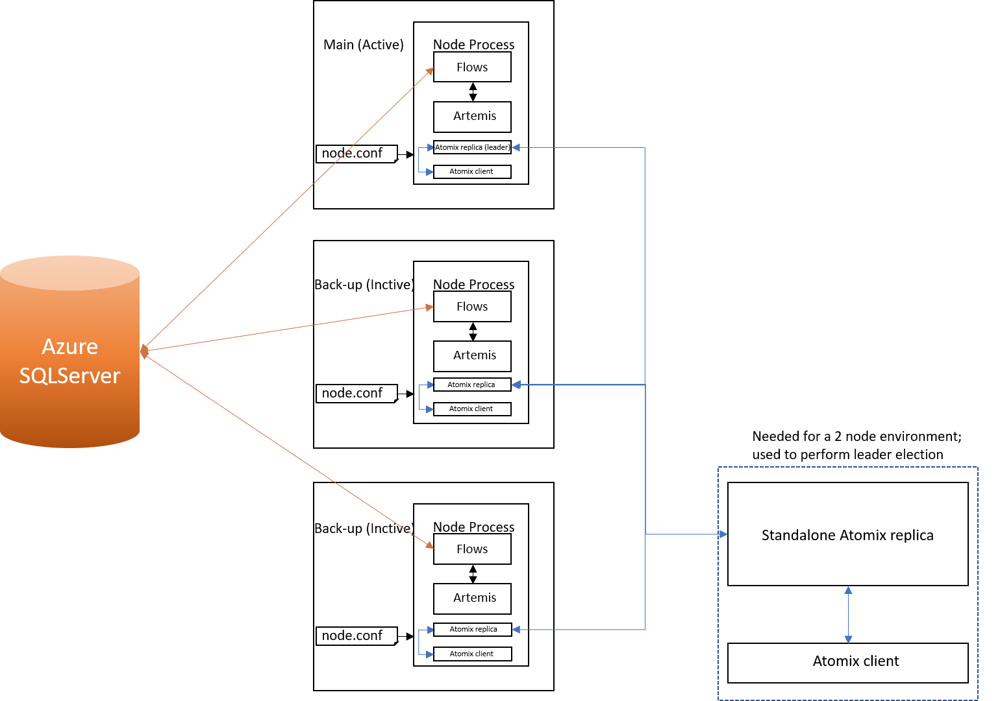

# Failure detection and master election

.. important:: This design document describes a feature of Corda Enterprise.

## Background

Two key issues need to be resolved before Hot-Warm can be implemented:

* Automatic failure detection (currently our Hot-Cold set-up requires a human observer to detect a failed node)
* Master election and node activation (currently done manually)

This document proposes two solutions to the above mentioned issues. The strengths and drawbacks of each solution are explored.

## Constraints/Requirements

Typical modern HA environments rely on a majority quorum of the cluster to be alive and operating normally in order to
service requests. This means:

* A cluster of 1 replica can tolerate 0 failures
* A cluster of 2 replicas can tolerate 0 failures
* A cluster of 3 replicas can tolerate 1 failure
* A cluster of 4 replicas can tolerate 1 failure
* A cluster of 5 replicas can tolerate 2 failures

This already poses a challenge to us as clients will most likely want to deploy the minimum possible number of R3 Corda
nodes. Ideally that minimum would be 3 but a solution for only 2 nodes should be available (even if it provides a lesser
degree of HA than 3, 5 or more nodes). The problem with having only two nodes in the cluster is there is no distinction
between failure and network partition.

Users should be allowed to set a preference for which node to be active in a hot-warm environment. This would probably
be done with the help of a property(persisted in the DB in order to be changed on the fly). This is an important
functionality as users might want to have the active node on better hardware and switch to the back-ups and back as soon
as possible.

It would also be helpful for the chosen solution to not add deployment complexity.

## Design decisions

.. toctree::
   :maxdepth: 2
   
   drb-meeting-20180131.md

## Proposed solutions

Based on what is needed for Hot-Warm, 1 active node and at least one passive node (started but in stand-by mode), and
the constraints identified above (automatic failover with at least 2 nodes and master preference), two frameworks have
been explored: Zookeeper and Atomix. Neither apply to our use cases perfectly and require some tinkering to solve our
issues, especially the preferred master election.

### Zookeeper

Preferred leader election - while the default algorithm does not take into account a leader preference, a custom
algorithm can be implemented to suit our needs.

Environment with 2 nodes -  while this type of set-up can't distinguish between a node failure and network partition, a
workaround can be implemented by having 2 nodes and 3 zookeeper instances(3rd would be needed to form a majority).

Pros:
- Very well documented
- Widely used, hence a lot of cookbooks, recipes and solutions to all sorts of problems
- Supports custom leader election

Cons:
- Added deployment complexity
- Bootstrapping a cluster is not very straightforward
- Too complex for our needs?

### Atomix

Preferred leader election - cannot be implemented easily; a creative solution would be required.

Environment with 2 nodes - using only embedded replicas, there's no solution; Atomix comes also as a standalone server
which could be run outside the node as a 3rd entity to allow a quorum(see image above).

Pros:
- Easy to get started with
- Embedded, no added deployment complexity
- Already used partially (Atomix Catalyst) in the notary cluster

Cons:
- Not as popular as Zookeeper, less used
- Documentation is underwhelming; no proper usage examples
- No easy way of influencing leader election; will require some creative use of Atomix functionality either via distributed groups or other resources

## Recommendations

If Zookeeper is chosen, we would need to look into a solution for easy configuration and deployment (maybe docker
images). Custom leader election can be implemented by following one of the
[examples](https://github.com/SainTechnologySolutions/allprogrammingtutorials/tree/master/apache-zookeeper/leader-election)
available online.

If Atomix is chosen, a solution to enforce some sort of preferred leader needs to found. One way to do it would be to
have the Corda cluster leader be a separate entity from the Atomix cluster leader. Implementing the election would then
be done using the distributed resources made available by the framework.

## Conclusions

Whichever solution is chosen, using 2 nodes in a Hot-Warm environment is not ideal. A minimum of 3 is required to ensure proper failover.

Almost every configuration option that these frameworks offer should be exposed through node.conf.

We've looked into using Galera which is currently used for the notary cluster for storing the committed state hashes. It
offers multi-master read/write and certification-based replication which is not leader based. It could be used to
implement automatic failure detection and master election(similar to our current mutual exclusion).However, we found
that it doesn't suit our needs because:

- it adds to deployment complexity
- usable only with MySQL and InnoDB storage engine
- we'd have to implement node failure detection and master election from scratch; in this regard both Atomix and Zookeeper are better suited

Our preference would be Zookeeper despite not being as lightweight and deployment-friendly as Atomix. The wide spread
use, proper documentation and flexibility to use it not only for automatic failover and master election but also
configuration management(something we might consider moving forward) makes it a better fit for our needs.