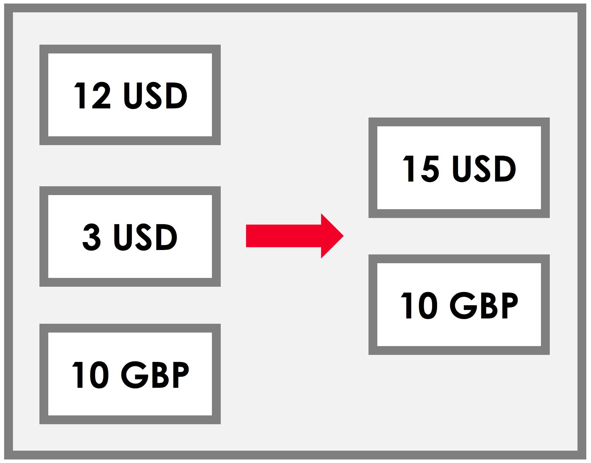
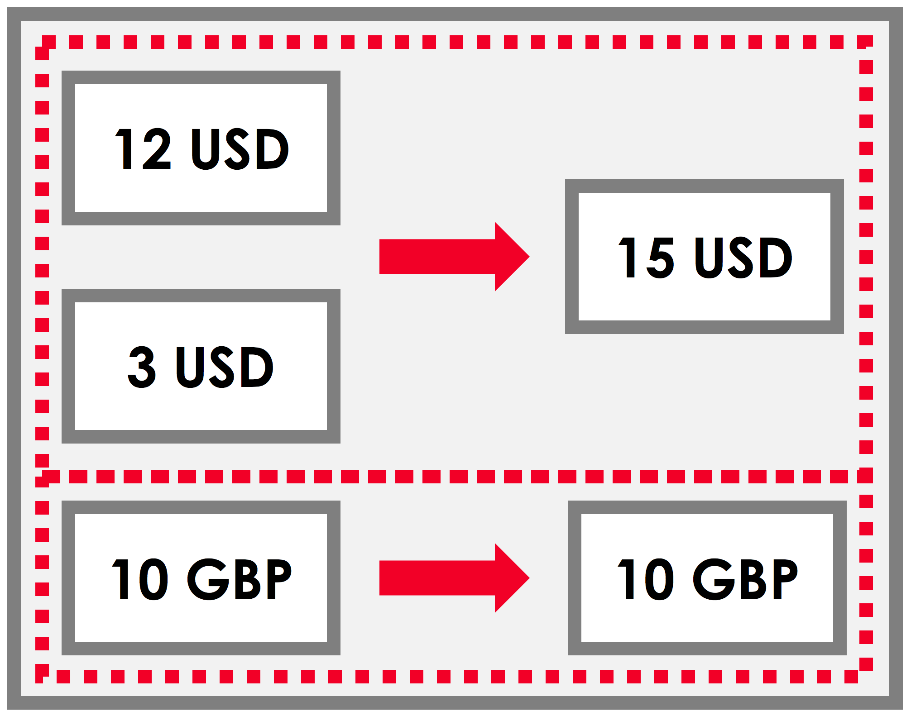
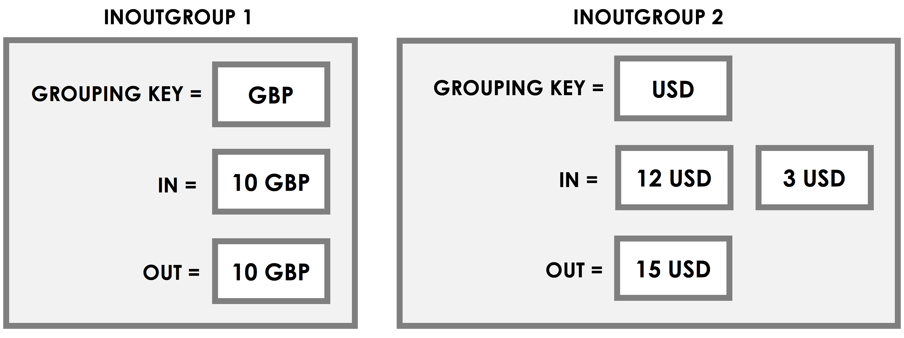

.. highlight:: kotlin
.. raw:: html

   
   

API: Contracts
==============

.. note:: Before reading this page, you should be familiar with the key concepts of :doc:`key-concepts-contracts`.

.. contents::

All Corda contracts are JVM classes that implement ``net.corda.core.contracts.Contract``.

The ``Contract`` interface is defined as follows:

.. container:: codeset

    .. literalinclude:: ../../core/src/main/kotlin/net/corda/core/contracts/Structures.kt
        :language: kotlin
        :start-after: DOCSTART 5
        :end-before: DOCEND 5

Where:

* ``verify(tx: LedgerTransaction)`` determines whether transactions involving states which reference this contract type are valid

verify()
--------

``verify()`` is a method that doesn't return anything and takes a ``LedgerTransaction`` as a parameter. It
either throws an exception if the transaction is considered invalid, or returns normally if the transaction is
considered valid.

``verify()`` is executed in a sandbox. It does not have access to the enclosing scope, and is not able to access
the network or perform any other I/O. It only has access to the properties defined on ``LedgerTransaction`` when
establishing whether a transaction is valid.

The two simplest ``verify`` functions are the one that accepts all transactions, and the one that rejects all
transactions.

Here is the ``verify`` that accepts all transactions:

.. container:: codeset

   .. sourcecode:: kotlin

        override fun verify(tx: LedgerTransaction) {
            // Always accepts!
        }

   .. sourcecode:: java

        @Override
        public void verify(LedgerTransaction tx) {
            // Always accepts!
        }

And here is the ``verify`` that rejects all transactions:

.. container:: codeset

   .. sourcecode:: kotlin

        override fun verify(tx: LedgerTransaction) {
            throw IllegalArgumentException("Always rejects!")
        }

   .. sourcecode:: java

        @Override
        public void verify(LedgerTransaction tx) {
            throw new IllegalArgumentException("Always rejects!");
        }

LedgerTransaction
^^^^^^^^^^^^^^^^^

The ``LedgerTransaction`` object passed into ``verify()`` represents the full set of information available to
``verify()`` when deciding whether to accept or reject the transaction. It has the following properties:

.. container:: codeset

    .. literalinclude:: ../../core/src/main/kotlin/net/corda/core/transactions/LedgerTransaction.kt
        :language: kotlin
        :start-after: DOCSTART 1
        :end-before: DOCEND 1

Where:

* ``inputs`` is a list of the transaction's inputs
* ``outputs`` is a list of the transaction's outputs
* ``attachments`` is a list of the transaction's attachments
* ``commands`` is a list of the transaction's commands, and their associated signatures
* ``id`` is the transaction's Merkle root hash
* ``notary`` is the transaction's notary. If there are inputs these must have the same notary on their source
  transactions
* ``timeWindow`` is the transaction's timestamp and defines the acceptable delay for notarisation

requireThat()
^^^^^^^^^^^^^

Instead of throwing exceptions manually to reject a transaction, we can use the ``requireThat`` DSL:

.. container:: codeset

   .. sourcecode:: kotlin

        requireThat {
            "No inputs should be consumed when issuing an X." using (tx.inputs.isEmpty())
            "Only one output state should be created." using (tx.outputs.size == 1)
            val out = tx.outputs.single() as XState
            "The sender and the recipient cannot be the same entity." using (out.sender != out.recipient)
            "All of the participants must be signers." using (command.signers.containsAll(out.participants))
            "The X's value must be non-negative." using (out.x.value > 0)
        }

   .. sourcecode:: java

        requireThat(require -> {
            require.using("No inputs should be consumed when issuing an X.",  tx.getInputs().isEmpty());
            require.using("Only one output state should be created.", tx.getOutputs().size() == 1);
            final XState out = (XState) tx.getOutputs().get(0);
            require.using("The sender and the recipient cannot be the same entity.", out.getSender() != out.getRecipient());
            require.using("All of the participants must be signers.", command.getSigners().containsAll(out.getParticipants()));
            require.using("The X's value must be non-negative.", out.getX().getValue() > 0);
            return null;
        });

For each <``String``, ``Boolean``> pair within ``requireThat``, if the boolean condition is false, an
``IllegalArgumentException`` is thrown with the corresponding string as the exception message. In turn, this
exception will cause the transaction to be rejected.

Commands
^^^^^^^^

``LedgerTransaction`` contains the commands as a list of ``CommandWithParties`` instances.
``CommandWithParties`` pairs a command with a list of the entities that are required to sign a transaction
where this command is present:

.. container:: codeset

    .. literalinclude:: ../../core/src/main/kotlin/net/corda/core/contracts/Structures.kt
        :language: kotlin
        :start-after: DOCSTART 6
        :end-before: DOCEND 6

Where:

* ``signers`` is the list of each signer's ``PublicKey``
* ``signingParties`` is the list of the signer's identities, if known
* ``value`` is the object being signed (a command, in this case)

Extracting commands
~~~~~~~~~~~~~~~~~~~
You can use the ``requireSingleCommand()`` helper method to extract commands.

``<C : CommandData> Collection<CommandWithParties<CommandData>>.requireSingleCommand(klass: Class<C>)`` asserts that
the transaction contains exactly one command of type ``T``, and returns it. If there is not exactly one command of this
type in the transaction, an exception is thrown, rejecting the transaction.

For ``requireSingleCommand`` to work, all the commands that we wish to match against must be grouped using the same
marker interface.

Here is an example of using ``requireSingleCommand`` to extract a transaction's command and using it to fork the
execution of ``verify()``:

.. container:: codeset

   .. sourcecode:: kotlin

        class XContract : Contract {
            interface Commands : CommandData {
                class Issue : TypeOnlyCommandData(), Commands
                class Transfer : TypeOnlyCommandData(), Commands
            }

            override fun verify(tx: LedgerTransaction) {
                val command = tx.commands.requireSingleCommand<Commands>()

                when (command.value) {
                    is Commands.Issue -> {
                        // Issuance verification logic.
                    }
                    is Commands.Transfer -> {
                        // Transfer verification logic.
                    }
                }
            }
        }

   .. sourcecode:: java

        public class XContract implements Contract {
            public interface Commands extends CommandData {
                class Issue extends TypeOnlyCommandData implements Commands {}
                class Transfer extends TypeOnlyCommandData implements Commands {}
            }

            @Override
            public void verify(LedgerTransaction tx) {
                final CommandWithParties<Commands> command = requireSingleCommand(tx.getCommands(), Commands.class);

                if (command.getValue() instanceof Commands.Issue) {
                    // Issuance verification logic.
                } else if (command.getValue() instanceof Commands.Transfer) {
                    // Transfer verification logic.
                }
            }
        }

Grouping states
---------------
Suppose we have the following transaction, where 15 USD is being exchanged for 10 GBP:

We can imagine that we would like to verify the USD states and the GBP states separately:

``LedgerTransaction`` provides a ``groupStates`` method to allow you to group states in this way:

.. container:: codeset

    .. literalinclude:: ../../core/src/main/kotlin/net/corda/core/transactions/LedgerTransaction.kt
       :language: kotlin
       :start-after: DOCSTART 2
       :end-before: DOCEND 2

Where ``InOutGroup`` is defined as:

.. container:: codeset

    .. literalinclude:: ../../core/src/main/kotlin/net/corda/core/transactions/LedgerTransaction.kt
       :language: kotlin
       :start-after: DOCSTART 3
       :end-before: DOCEND 3

For example, we could group the states in the transaction above by currency (i.e. by ``amount.token``):

.. container:: codeset

   .. sourcecode:: kotlin

        val groups: List<InOutGroup<Cash.State, Issued<Currency>>> = tx.groupStates(Cash.State::class.java) {
	        it -> it.amount.token
	    }

   .. sourcecode:: java

        final List<InOutGroup<Cash.State, Issued<Currency>>> groups = tx.groupStates(
            Cash.State.class,
            it -> it.getAmount().getToken()
        );

This would produce the following instances of ``InOutGroup``:

We can now verify these groups individually:

.. container:: codeset

   .. sourcecode:: kotlin

          for ((in_, out, key) in groups) {
              when (key) {
                  is GBP -> {
                      // GBP verification logic.
                  }
                  is USD -> {
                      // USD verification logic.
                  }
              }
          }

   .. sourcecode:: java

        for (InOutGroup group : groups) {
            if (group.getGroupingKey() == USD) {
                // USD verification logic.
            } else if (group.getGroupingKey() == GBP) {
                // GBP verification logic.
            }
        }

Legal prose
-----------

Currently, a ``Contract`` subtype may refer to the legal prose it implements via a ``LegalProseReference`` annotation.
In the future, a contract's legal prose will be included as an attachment.
