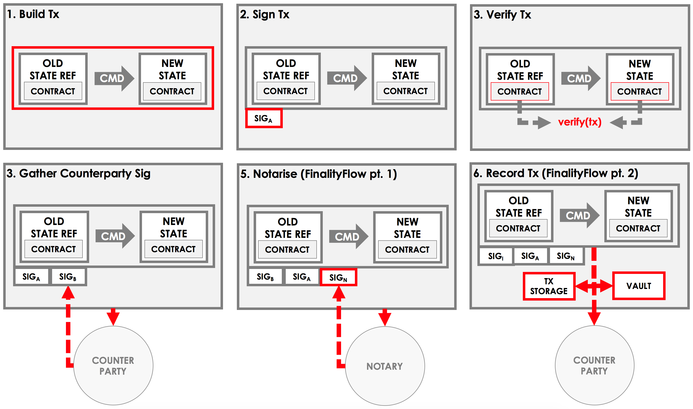

.. highlight:: kotlin
.. raw:: html

   
   

API: Flows
==========

.. note:: Before reading this page, you should be familiar with the key concepts of :doc:`key-concepts-flows`.

.. contents::

An example flow
---------------
Before we discuss the API offered by the flow, let's consider what a standard flow may look like.

Imagine a flow for agreeing a basic ledger update between Alice and Bob. This flow will have two sides:

* An ``Initiator`` side, that will initiate the request to update the ledger
* A ``Responder`` side, that will respond to the request to update the ledger

Initiator
^^^^^^^^^
In our flow, the Initiator flow class will be doing the majority of the work:

*Part 1 - Build the transaction*

1. Choose a notary for the transaction
2. Create a transaction builder
3. Extract any input states from the vault and add them to the builder
4. Create any output states and add them to the builder
5. Add any commands, attachments and timestamps to the builder

*Part 2 - Sign the transaction*

6. Sign the transaction builder
7. Convert the builder to a signed transaction

*Part 3 - Verify the transaction*

8. Verify the transaction by running its contracts

*Part 4 - Gather the counterparty's signature*

9. Send the transaction to the counterparty
10. Wait to receive back the counterparty's signature
11. Add the counterparty's signature to the transaction
12. Verify the transaction's signatures

*Part 5 - Finalize the transaction*

13. Send the transaction to the notary
14. Wait to receive back the notarised transaction
15. Record the transaction locally
16. Store any relevant states in the vault
17. Send the transaction to the counterparty for recording

We can visualize the work performed by initiator as follows:

Responder
^^^^^^^^^
To respond to these actions, the responder takes the following steps:

*Part 1 - Sign the transaction*

1. Receive the transaction from the counterparty
2. Verify the transaction's existing signatures
3. Verify the transaction by running its contracts
4. Generate a signature over the transaction
5. Send the signature back to the counterparty

*Part 2 - Record the transaction*

6. Receive the notarised transaction from the counterparty
7. Record the transaction locally
8. Store any relevant states in the vault

FlowLogic
---------
In practice, a flow is implemented as one or more communicating ``FlowLogic`` subclasses. The ``FlowLogic``
subclass's constructor can take any number of arguments of any type. The generic of ``FlowLogic`` (e.g.
``FlowLogic<SignedTransaction>``) indicates the flow's return type.

.. container:: codeset

   .. sourcecode:: kotlin

        class Initiator(val arg1: Boolean,
                        val arg2: Int,
                        val counterparty: Party): FlowLogic<SignedTransaction>() { }

        class Responder(val otherParty: Party) : FlowLogic<Unit>() { }

   .. sourcecode:: java

        public static class Initiator extends FlowLogic<SignedTransaction> {
            private final boolean arg1;
            private final int arg2;
            private final Party counterparty;

            public Initiator(boolean arg1, int arg2, Party counterparty) {
                this.arg1 = arg1;
                this.arg2 = arg2;
                this.counterparty = counterparty;
            }

        }

        public static class Responder extends FlowLogic<Void> { }

FlowLogic annotations
---------------------
Any flow from which you want to initiate other flows must be annotated with the ``@InitiatingFlow`` annotation.
Additionally, if you wish to start the flow via RPC, you must annotate it with the ``@StartableByRPC`` annotation:

.. container:: codeset

   .. sourcecode:: kotlin

        @InitiatingFlow
        @StartableByRPC
        class Initiator(): FlowLogic<Unit>() { }

   .. sourcecode:: java

        @InitiatingFlow
        @StartableByRPC
        public static class Initiator extends FlowLogic<Unit> { }

Meanwhile, any flow that responds to a message from another flow must be annotated with the ``@InitiatedBy`` annotation.
``@InitiatedBy`` takes the class of the flow it is responding to as its single parameter:

.. container:: codeset

   .. sourcecode:: kotlin

        @InitiatedBy(Initiator::class)
        class Responder(val otherSideSession: FlowSession) : FlowLogic<Unit>() { }

   .. sourcecode:: java

        @InitiatedBy(Initiator.class)
        public static class Responder extends FlowLogic<Void> { }

Additionally, any flow that is started by a ``SchedulableState`` must be annotated with the ``@SchedulableFlow``
annotation.

Call
----
Each ``FlowLogic`` subclass must override ``FlowLogic.call()``, which describes the actions it will take as part of
the flow. For example, the actions of the initiator's side of the flow would be defined in ``Initiator.call``, and the
actions of the responder's side of the flow would be defined in ``Responder.call``.

In order for nodes to be able to run multiple flows concurrently, and to allow flows to survive node upgrades and
restarts, flows need to be checkpointable and serializable to disk. This is achieved by marking ``FlowLogic.call()``,
as well as any function invoked from within ``FlowLogic.call()``, with an ``@Suspendable`` annotation.

.. container:: codeset

   .. sourcecode:: kotlin

        class Initiator(val counterparty: Party): FlowLogic<Unit>() {
            @Suspendable
            override fun call() { }
        }

   .. sourcecode:: java

        public static class InitiatorFlow extends FlowLogic<Void> {
            private final Party counterparty;

            public Initiator(Party counterparty) {
                this.counterparty = counterparty;
            }

            @Suspendable
            @Override
            public Void call() throws FlowException { }

        }

ServiceHub
----------
Within ``FlowLogic.call``, the flow developer has access to the node's ``ServiceHub``, which provides access to the
various services the node provides. We will use the ``ServiceHub`` extensively in the examples that follow. You can
also see :doc:`api-service-hub` for information about the services the ``ServiceHub`` offers.

Common flow tasks
-----------------
There are a number of common tasks that you will need to perform within ``FlowLogic.call`` in order to agree ledger
updates. This section details the API for common tasks.

Transaction building
^^^^^^^^^^^^^^^^^^^^
The majority of the work performed during a flow will be to build, verify and sign a transaction. This is covered 
in :doc:`api-transactions`.

Extracting states from the vault
^^^^^^^^^^^^^^^^^^^^^^^^^^^^^^^^
When building a transaction, you'll often need to extract the states you wish to consume from the vault. This is 
covered in :doc:`api-vault-query`.

Retrieving information about other nodes
^^^^^^^^^^^^^^^^^^^^^^^^^^^^^^^^^^^^^^^^
We can retrieve information about other nodes on the network and the services they offer using
``ServiceHub.networkMapCache``.

Notaries
~~~~~~~~
Remember that a transaction generally needs a notary to:

* Prevent double-spends if the transaction has inputs
* Serve as a timestamping authority if the transaction has a time-window

There are several ways to retrieve a notary from the network map:

.. container:: codeset

    .. literalinclude:: ../../docs/source/example-code/src/main/kotlin/net/corda/docs/FlowCookbook.kt
        :language: kotlin
        :start-after: DOCSTART 01
        :end-before: DOCEND 01
        :dedent: 8

    .. literalinclude:: ../../docs/source/example-code/src/main/java/net/corda/docs/FlowCookbookJava.java
        :language: java
        :start-after: DOCSTART 01
        :end-before: DOCEND 01
        :dedent: 12

Specific counterparties
~~~~~~~~~~~~~~~~~~~~~~~
We can also use the network map to retrieve a specific counterparty:

.. container:: codeset

    .. literalinclude:: ../../docs/source/example-code/src/main/kotlin/net/corda/docs/FlowCookbook.kt
        :language: kotlin
        :start-after: DOCSTART 02
        :end-before: DOCEND 02
        :dedent: 8

    .. literalinclude:: ../../docs/source/example-code/src/main/java/net/corda/docs/FlowCookbookJava.java
        :language: java
        :start-after: DOCSTART 02
        :end-before: DOCEND 02
        :dedent: 12

Communication between parties
^^^^^^^^^^^^^^^^^^^^^^^^^^^^^

In order to create a communication session between your initiator flow and the receiver flow you must call
``initiateFlow(party: Party): FlowSession``

``FlowSession`` instances in turn provide three functions:

* ``send(payload: Any)``
    * Sends the ``payload`` object
* ``receive(receiveType: Class<R>): R``
    * Receives an object of type ``receiveType``
* ``sendAndReceive(receiveType: Class<R>, payload: Any): R``
    * Sends the ``payload`` object and receives an object of type ``receiveType`` back

In addition ``FlowLogic`` provides functions that batch receives:
* ``receiveAllMap(sessions: Map<FlowSession, Class<out Any>>): Map<FlowSession, UntrustworthyData<Any>>``
    * Receives from all ``FlowSession``s specified in the passed in map. The received types may differ.
* ``receiveAll(receiveType: Class<R>, sessions: List<FlowSession>): List<UntrustworthyData<R>>``
    * Receives from all ``FlowSession``s specified in the passed in list. The received types must be the same.

The batched functions are implemented more efficiently by the flow framework.

InitiateFlow
~~~~~~~~~~~~

``initiateFlow`` creates a communication session with the passed in ``Party``.

.. container:: codeset

    .. literalinclude:: ../../docs/source/example-code/src/main/kotlin/net/corda/docs/FlowCookbook.kt
        :language: kotlin
        :start-after: DOCSTART initiateFlow
        :end-before: DOCEND initiateFlow
        :dedent: 8

    .. literalinclude:: ../../docs/source/example-code/src/main/java/net/corda/docs/FlowCookbookJava.java
        :language: java
        :start-after: DOCSTART initiateFlow
        :end-before: DOCEND initiateFlow
        :dedent: 12

Note that at the time of call to this function no actual communication is done, this is deferred to the first
send/receive, at which point the counterparty will either:

1. Ignore the message if they are not registered to respond to messages from this flow.
2. Start the flow they have registered to respond to this flow.

Send
~~~~

Once we have a ``FlowSession`` object we can send arbitrary data to a counterparty:

.. container:: codeset

    .. literalinclude:: ../../docs/source/example-code/src/main/kotlin/net/corda/docs/FlowCookbook.kt
        :language: kotlin
        :start-after: DOCSTART 04
        :end-before: DOCEND 04
        :dedent: 8

    .. literalinclude:: ../../docs/source/example-code/src/main/java/net/corda/docs/FlowCookbookJava.java
        :language: java
        :start-after: DOCSTART 04
        :end-before: DOCEND 04
        :dedent: 12

The flow on the other side must eventually reach a corresponding ``receive`` call to get this message.

Receive
~~~~~~~
We can also wait to receive arbitrary data of a specific type from a counterparty. Again, this implies a corresponding
``send`` call in the counterparty's flow. A few scenarios:

* We never receive a message back. In the current design, the flow is paused until the node's owner kills the flow.
* Instead of sending a message back, the counterparty throws a ``FlowException``. This exception is propagated back
  to us, and we can use the error message to establish what happened.
* We receive a message back, but it's of the wrong type. In this case, a ``FlowException`` is thrown.
* We receive back a message of the correct type. All is good.

Upon calling ``receive`` (or ``sendAndReceive``), the ``FlowLogic`` is suspended until it receives a response.

We receive the data wrapped in an ``UntrustworthyData`` instance. This is a reminder that the data we receive may not
be what it appears to be! We must unwrap the ``UntrustworthyData`` using a lambda:

.. container:: codeset

    .. literalinclude:: ../../docs/source/example-code/src/main/kotlin/net/corda/docs/FlowCookbook.kt
        :language: kotlin
        :start-after: DOCSTART 05
        :end-before: DOCEND 05
        :dedent: 8

    .. literalinclude:: ../../docs/source/example-code/src/main/java/net/corda/docs/FlowCookbookJava.java
        :language: java
        :start-after: DOCSTART 05
        :end-before: DOCEND 05
        :dedent: 12

We're not limited to sending to and receiving from a single counterparty. A flow can send messages to as many parties
as it likes, and each party can invoke a different response flow:

.. container:: codeset

    .. literalinclude:: ../../docs/source/example-code/src/main/kotlin/net/corda/docs/FlowCookbook.kt
        :language: kotlin
        :start-after: DOCSTART 06
        :end-before: DOCEND 06
        :dedent: 8

    .. literalinclude:: ../../docs/source/example-code/src/main/java/net/corda/docs/FlowCookbookJava.java
        :language: java
        :start-after: DOCSTART 06
        :end-before: DOCEND 06
        :dedent: 12

.. warning:: If you initiate several flows from the same ``@InitiatingFlow`` flow then on the receiving side you must be
   prepared to be initiated by any of the corresponding ``initiateFlow()`` calls! A good way of handling this ambiguity
   is to send as a first message a "role" message to the initiated flow, indicating which part of the initiating flow
   the rest of the counter-flow should conform to. For example send an enum, and on the other side start with a switch
   statement.

SendAndReceive
~~~~~~~~~~~~~~
We can also use a single call to send data to a counterparty and wait to receive data of a specific type back. The
type of data sent doesn't need to match the type of the data received back:

.. container:: codeset

    .. literalinclude:: ../../docs/source/example-code/src/main/kotlin/net/corda/docs/FlowCookbook.kt
        :language: kotlin
        :start-after: DOCSTART 07
        :end-before: DOCEND 07
        :dedent: 8

    .. literalinclude:: ../../docs/source/example-code/src/main/java/net/corda/docs/FlowCookbookJava.java
        :language: java
        :start-after: DOCSTART 07
        :end-before: DOCEND 07
        :dedent: 12

Counterparty response
~~~~~~~~~~~~~~~~~~~~~
Suppose we're now on the ``Responder`` side of the flow. We just received the following series of messages from the
``Initiator``:

1. They sent us an ``Any`` instance
2. They waited to receive an ``Integer`` instance back
3. They sent a ``String`` instance and waited to receive a ``Boolean`` instance back

Our side of the flow must mirror these calls. We could do this as follows:

.. container:: codeset

    .. literalinclude:: ../../docs/source/example-code/src/main/kotlin/net/corda/docs/FlowCookbook.kt
        :language: kotlin
        :start-after: DOCSTART 08
        :end-before: DOCEND 08
        :dedent: 8

    .. literalinclude:: ../../docs/source/example-code/src/main/java/net/corda/docs/FlowCookbookJava.java
        :language: java
        :start-after: DOCSTART 08
        :end-before: DOCEND 08
        :dedent: 12

Subflows
--------
Subflows are pieces of reusable flows that may be run by calling ``FlowLogic.subFlow``. There are two broad categories
of subflows, inlined and initiating ones. The main difference lies in the counter-flow's starting method, initiating
ones initiate counter-flows automatically, while inlined ones expect some parent counter-flow to run the inlined
counterpart.

Inlined subflows
^^^^^^^^^^^^^^^^
Inlined subflows inherit their calling flow's type when initiating a new session with a counterparty. For example, say
we have flow A calling an inlined subflow B, which in turn initiates a session with a party. The FlowLogic type used to
determine which counter-flow should be kicked off will be A, not B. Note that this means that the other side of this
inlined flow must therefore be implemented explicitly in the kicked off flow as well. This may be done by calling a
matching inlined counter-flow, or by implementing the other side explicitly in the kicked off parent flow.

An example of such a flow is ``CollectSignaturesFlow``. It has a counter-flow ``SignTransactionFlow`` that isn't
annotated with ``InitiatedBy``. This is because both of these flows are inlined; the kick-off relationship will be
defined by the parent flows calling ``CollectSignaturesFlow`` and ``SignTransactionFlow``.

In the code inlined subflows appear as regular ``FlowLogic`` instances, `without` either of the ``@InitiatingFlow`` or
``@InitiatedBy`` annotation.

.. note:: Inlined flows aren't versioned; they inherit their parent flow's version.

Initiating subflows
^^^^^^^^^^^^^^^^^^^
Initiating subflows are ones annotated with the ``@InitiatingFlow`` annotation. When such a flow initiates a session its
type will be used to determine which ``@InitiatedBy`` flow to kick off on the counterparty.

An example is the ``@InitiatingFlow InitiatorFlow``/``@InitiatedBy ResponderFlow`` flow pair in the ``FlowCookbook``.

.. note:: Initiating flows are versioned separately from their parents.

Core initiating subflows
~~~~~~~~~~~~~~~~~~~~~~~~
Corda-provided initiating subflows are a little different to standard ones as they are versioned together with the
platform, and their initiated counter-flows are registered explicitly, so there is no need for the ``InitiatedBy``
annotation.

Library flows
^^^^^^^^^^^^^
Corda installs four initiating subflow pairs on each node by default:

* ``FinalityFlow``/``FinalityHandler``, which should be used to notarise and record a transaction and broadcast it to
  all relevant parties
* ``NotaryChangeFlow``/``NotaryChangeHandler``, which should be used to change a state's notary
* ``ContractUpgradeFlow.Initiate``/``ContractUpgradeHandler``, which should be used to change a state's contract
* ``SwapIdentitiesFlow``/``SwapIdentitiesHandler``, which is used to exchange confidential identities with a
  counterparty

.. warning:: ``SwapIdentitiesFlow``/``SwapIdentitiesHandler`` are only installed if the ``confidential-identities`` module 
   is included. The ``confidential-identities`` module  is still not stabilised, so the
   ``SwapIdentitiesFlow``/``SwapIdentitiesHandler`` API may change in future releases. See :doc:`corda-api`.

Corda also provides a number of built-in inlined subflows that should be used for handling common tasks. The most
important are:

* ``CollectSignaturesFlow`` (inlined), which should be used to collect a transaction's required signatures
* ``SendTransactionFlow`` (inlined), which should be used to send a signed transaction if it needed to be resolved on
  the other side.
* ``ReceiveTransactionFlow`` (inlined), which should be used receive a signed transaction

Let's look at some of these flows in more detail.

FinalityFlow
~~~~~~~~~~~~
``FinalityFlow`` allows us to notarise the transaction and get it recorded in the vault of the participants of all
the transaction's states:

.. container:: codeset

    .. literalinclude:: ../../docs/source/example-code/src/main/kotlin/net/corda/docs/FlowCookbook.kt
        :language: kotlin
        :start-after: DOCSTART 09
        :end-before: DOCEND 09
        :dedent: 8

    .. literalinclude:: ../../docs/source/example-code/src/main/java/net/corda/docs/FlowCookbookJava.java
        :language: java
        :start-after: DOCSTART 09
        :end-before: DOCEND 09
        :dedent: 12

We can also choose to send the transaction to additional parties who aren't one of the state's participants:

.. container:: codeset

    .. literalinclude:: ../../docs/source/example-code/src/main/kotlin/net/corda/docs/FlowCookbook.kt
        :language: kotlin
        :start-after: DOCSTART 10
        :end-before: DOCEND 10
        :dedent: 8

    .. literalinclude:: ../../docs/source/example-code/src/main/java/net/corda/docs/FlowCookbookJava.java
        :language: java
        :start-after: DOCSTART 10
        :end-before: DOCEND 10
        :dedent: 12

Only one party has to call ``FinalityFlow`` for a given transaction to be recorded by all participants. It does
**not** need to be called by each participant individually.

CollectSignaturesFlow/SignTransactionFlow
~~~~~~~~~~~~~~~~~~~~~~~~~~~~~~~~~~~~~~~~~
The list of parties who need to sign a transaction is dictated by the transaction's commands. Once we've signed a
transaction ourselves, we can automatically gather the signatures of the other required signers using
``CollectSignaturesFlow``:

.. container:: codeset

    .. literalinclude:: ../../docs/source/example-code/src/main/kotlin/net/corda/docs/FlowCookbook.kt
        :language: kotlin
        :start-after: DOCSTART 15
        :end-before: DOCEND 15
        :dedent: 8

    .. literalinclude:: ../../docs/source/example-code/src/main/java/net/corda/docs/FlowCookbookJava.java
        :language: java
        :start-after: DOCSTART 15
        :end-before: DOCEND 15
        :dedent: 12

Each required signer will need to respond by invoking its own ``SignTransactionFlow`` subclass to check the
transaction and provide their signature if they are satisfied:

.. container:: codeset

    .. literalinclude:: ../../docs/source/example-code/src/main/kotlin/net/corda/docs/FlowCookbook.kt
        :language: kotlin
        :start-after: DOCSTART 16
        :end-before: DOCEND 16
        :dedent: 8

    .. literalinclude:: ../../docs/source/example-code/src/main/java/net/corda/docs/FlowCookbookJava.java
        :language: java
        :start-after: DOCSTART 16
        :end-before: DOCEND 16
        :dedent: 12

SendTransactionFlow/ReceiveTransactionFlow
~~~~~~~~~~~~~~~~~~~~~~~~~~~~~~~~~~~~~~~~~~
Verifying a transaction received from a counterparty also requires verification of every transaction in its
dependency chain. This means the receiving party needs to be able to ask the sender all the details of the chain.
The sender will use ``SendTransactionFlow`` for sending the transaction and then for processing all subsequent
transaction data vending requests as the receiver walks the dependency chain using ``ReceiveTransactionFlow``:

.. container:: codeset

    .. literalinclude:: ../../docs/source/example-code/src/main/kotlin/net/corda/docs/FlowCookbook.kt
        :language: kotlin
        :start-after: DOCSTART 12
        :end-before: DOCEND 12
        :dedent: 8

    .. literalinclude:: ../../docs/source/example-code/src/main/java/net/corda/docs/FlowCookbookJava.java
        :language: java
        :start-after: DOCSTART 12
        :end-before: DOCEND 12
        :dedent: 12

We can receive the transaction using ``ReceiveTransactionFlow``, which will automatically download all the
dependencies and verify the transaction:

.. container:: codeset

    .. literalinclude:: ../../docs/source/example-code/src/main/kotlin/net/corda/docs/FlowCookbook.kt
        :language: kotlin
        :start-after: DOCSTART 13
        :end-before: DOCEND 13
        :dedent: 8

    .. literalinclude:: ../../docs/source/example-code/src/main/java/net/corda/docs/FlowCookbookJava.java
        :language: java
        :start-after: DOCSTART 13
        :end-before: DOCEND 13
        :dedent: 12

We can also send and receive a ``StateAndRef`` dependency chain and automatically resolve its dependencies:

.. container:: codeset

    .. literalinclude:: ../../docs/source/example-code/src/main/kotlin/net/corda/docs/FlowCookbook.kt
        :language: kotlin
        :start-after: DOCSTART 14
        :end-before: DOCEND 14
        :dedent: 8

    .. literalinclude:: ../../docs/source/example-code/src/main/java/net/corda/docs/FlowCookbookJava.java
        :language: java
        :start-after: DOCSTART 14
        :end-before: DOCEND 14
        :dedent: 12

Why inlined subflows?
^^^^^^^^^^^^^^^^^^^^^
Inlined subflows provide a way to share commonly used flow code `while forcing users to create a parent flow`. Take for
example ``CollectSignaturesFlow``. Say we made it an initiating flow that automatically kicks off
``SignTransactionFlow`` that signs the transaction. This would mean malicious nodes can just send any old transaction to
us using ``CollectSignaturesFlow`` and we would automatically sign it!

By making this pair of flows inlined we provide control to the user over whether to sign the transaction or not by
forcing them to nest it in their own parent flows.

In general if you're writing a subflow the decision of whether you should make it initiating should depend on whether
the counter-flow needs broader context to achieve its goal.

FlowException
-------------
Suppose a node throws an exception while running a flow. Any counterparty flows waiting for a message from the node
(i.e. as part of a call to ``receive`` or ``sendAndReceive``) will be notified that the flow has unexpectedly
ended and will themselves end. However, the exception thrown will not be propagated back to the counterparties.

If you wish to notify any waiting counterparties of the cause of the exception, you can do so by throwing a
``FlowException``:

.. container:: codeset

    .. literalinclude:: ../../core/src/main/kotlin/net/corda/core/flows/FlowException.kt
        :language: kotlin
        :start-after: DOCSTART 1
        :end-before: DOCEND 1

The flow framework will automatically propagate the ``FlowException`` back to the waiting counterparties.

There are many scenarios in which throwing a ``FlowException`` would be appropriate:

* A transaction doesn't ``verify()``
* A transaction's signatures are invalid
* The transaction does not match the parameters of the deal as discussed
* You are reneging on a deal

ProgressTracker
---------------
We can give our flow a progress tracker. This allows us to see the flow's progress visually in our node's CRaSH shell.

To provide a progress tracker, we have to override ``FlowLogic.progressTracker`` in our flow:

.. container:: codeset

    .. literalinclude:: ../../docs/source/example-code/src/main/kotlin/net/corda/docs/FlowCookbook.kt
        :language: kotlin
        :start-after: DOCSTART 17
        :end-before: DOCEND 17
        :dedent: 4

    .. literalinclude:: ../../docs/source/example-code/src/main/java/net/corda/docs/FlowCookbookJava.java
        :language: java
        :start-after: DOCSTART 17
        :end-before: DOCEND 17
        :dedent: 8

We then update the progress tracker's current step as we progress through the flow as follows:

.. container:: codeset

    .. literalinclude:: ../../docs/source/example-code/src/main/kotlin/net/corda/docs/FlowCookbook.kt
        :language: kotlin
        :start-after: DOCSTART 18
        :end-before: DOCEND 18
        :dedent: 8

    .. literalinclude:: ../../docs/source/example-code/src/main/java/net/corda/docs/FlowCookbookJava.java
        :language: java
        :start-after: DOCSTART 18
        :end-before: DOCEND 18
        :dedent: 12

HTTP and database calls
-----------------------
HTTP, database and other calls to external resources are allowed in flows. However, their support is currently limited:

* The call must be executed in a BLOCKING way. Flows don't currently support suspending to await the response to a call to an external resource

  * For this reason, the call should be provided with a timeout to prevent the flow from suspending forever. If the timeout elapses, this should be treated as a soft failure and handled by the flow's business logic
  
* The call must be idempotent. If the flow fails and has to restart from a checkpoint, the call will also be replayed

Concurrency, Locking and Waiting
--------------------------------
This is an advanced topic.  Because Corda is designed to:

* run many flows in parallel,
* may persist flows to storage and resurrect those flows much later,
* (in the future) migrate flows between JVMs,

flows should avoid use of locks and typically not even attempt to interact with objects shared between flows (except
``ServiceHub`` and other carefully crafted services such as Oracles.  See :doc:`oracles`).
Locks will significantly reduce the scalability of the node, in the best case, and can cause the node to deadlock if they
remain locked across flow context switch boundaries (such as sending and receiving
from peers discussed above, and the sleep discussed below).

If you need activities that are scheduled, you should investigate the use of ``SchedulableState``.
However, we appreciate that Corda support for some more advanced patterns is still in the future, and if there is a need
for brief pauses in flows then you should use ``FlowLogic.sleep`` in place of where you might have used ``Thread.sleep``.
Flows should expressly not use ``Thread.sleep``, since this will prevent the node from processing other flows
in the meantime, significantly impairing the performance of the node.
Even ``FlowLogic.sleep`` is not to be used to create long running flows, since the Corda ethos is for short lived flows
(otherwise upgrading nodes or CorDapps is much more complicated), or as a substitute to using the ``SchedulableState`` scheduler.

Currently the ``finance`` package uses ``FlowLogic.sleep`` to make several attempts at coin selection, where necessary,
when many states are soft locked and we wish to wait for those, or other new states in their place, to become unlocked.

    .. literalinclude:: ../../finance/src/main/kotlin/net/corda/finance/contracts/asset/cash/selection/AbstractCashSelection.kt
        :language: kotlin
        :start-after: DOCSTART CASHSELECT 1
        :end-before: DOCEND CASHSELECT 1
        :dedent: 8
