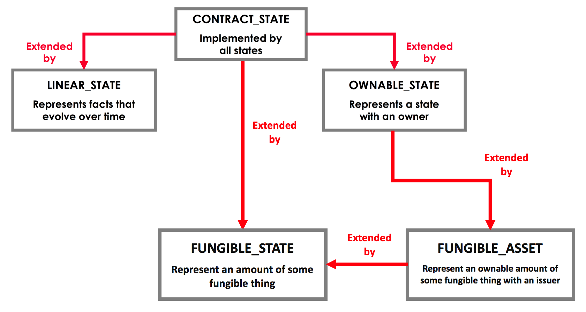

API: States
===========

.. note:: Before reading this page, you should be familiar with the key concepts of :doc:`key-concepts-states`.

.. contents::

ContractState
-------------
In Corda, states are instances of classes that implement ``ContractState``. The ``ContractState`` interface is defined
as follows:

.. container:: codeset

    .. literalinclude:: ../../core/src/main/kotlin/net/corda/core/contracts/ContractState.kt
        :language: kotlin
        :start-after: DOCSTART 1
        :end-before: DOCEND 1

``ContractState`` has a single field, ``participants``. ``participants`` is a ``List`` of the ``AbstractParty`` that
are considered to have a stake in the state. Among other things, the ``participants`` will:

* Usually store the state in their vault (see below)

* Need to sign any notary-change and contract-upgrade transactions involving this state

* Receive any finalised transactions involving this state as part of ``FinalityFlow`` / ``ReceiveFinalityFlow``

ContractState sub-interfaces
----------------------------
The behaviour of the state can be further customised by implementing sub-interfaces of ``ContractState``. The two most
common sub-interfaces are:

* ``LinearState``

* ``OwnableState``

``LinearState`` models shared facts for which there is only one current version at any point in time. ``LinearState``
states evolve in a straight line by superseding themselves. On the other hand, ``OwnableState`` is meant to represent
assets that can be freely split and merged over time. Cash is a good example of an ``OwnableState`` - two existing $5
cash states can be combined into a single $10 cash state, or split into five $1 cash states. With ``OwnableState``, its
the total amount held that is important, rather than the actual units held.

We can picture the hierarchy as follows:

LinearState
^^^^^^^^^^^
The ``LinearState`` interface is defined as follows:

.. container:: codeset

    .. literalinclude:: ../../core/src/main/kotlin/net/corda/core/contracts/Structures.kt
        :language: kotlin
        :start-after: DOCSTART 2
        :end-before: DOCEND 2

Remember that in Corda, states are immutable and can't be updated directly. Instead, we represent an evolving fact as a
sequence of ``LinearState`` states that share the same ``linearId`` and represent an audit trail for the lifecycle of
the fact over time.

When we want to extend a ``LinearState`` chain (i.e. a sequence of states sharing a ``linearId``), we:

* Use the ``linearId`` to extract the latest state in the chain from the vault

* Create a new state that has the same ``linearId``

* Create a transaction with:

  * The current latest state in the chain as an input

  * The newly-created state as an output

The new state will now become the latest state in the chain, representing the new current state of the agreement.

``linearId`` is of type ``UniqueIdentifier``, which is a combination of:

* A Java ``UUID`` representing a globally unique 128 bit random number
* An optional external-reference string for referencing the state in external systems

OwnableState
^^^^^^^^^^^^
The ``OwnableState`` interface is defined as follows:

.. container:: codeset

    .. literalinclude:: ../../core/src/main/kotlin/net/corda/core/contracts/Structures.kt
        :language: kotlin
        :start-after: DOCSTART 3
        :end-before: DOCEND 3

Where:

* ``owner`` is the ``PublicKey`` of the asset's owner

* ``withNewOwner(newOwner: AbstractParty)`` creates an copy of the state with a new owner

Because ``OwnableState`` models fungible assets that can be merged and split over time, ``OwnableState`` instances do
not have a ``linearId``. $5 of cash created by one transaction is considered to be identical to $5 of cash produced by
another transaction.

FungibleState
~~~~~~~~~~~~~

`FungibleState<T>` is an interface to represent things which are fungible, this means that there is an expectation that
these things can be split and merged. That's the only assumption made by this interface. This interface should be
implemented if you want to represent fractional ownership in a thing, or if you have many things. Examples:

* There is only one Mona Lisa which you wish to issue 100 tokens, each representing a 1% interest in the Mona Lisa
* A company issues 1000 shares with a nominal value of 1, in one batch of 1000. This means the single batch of 1000
  shares could be split up into 1000 units of 1 share.

The interface is defined as follows:

.. container:: codeset

    .. literalinclude:: ../../core/src/main/kotlin/net/corda/core/contracts/FungibleState.kt
        :language: kotlin
        :start-after: DOCSTART 1
        :end-before: DOCEND 1

As seen, the interface takes a type parameter `T` that represents the fungible thing in question. This should describe
the basic type of the asset e.g. GBP, USD, oil, shares in company <X>, etc. and any additional metadata (issuer, grade,
class, etc.). An upper-bound is not specified for `T` to ensure flexibility. Typically, a class would be provided that
implements `TokenizableAssetInfo` so the thing can be easily added and subtracted using the `Amount` class.

This interface has been added in addition to `FungibleAsset` to provide some additional flexibility which
`FungibleAsset` lacks, in particular:
* `FungibleAsset` defines an amount property of type Amount<Issued<T>>, therefore there is an assumption that all
  fungible things are issued by a single well known party but this is not always the case.
* `FungibleAsset` implements `OwnableState`, as such there is an assumption that all fungible things are ownable.

Other interfaces
^^^^^^^^^^^^^^^^
You can also customize your state by implementing the following interfaces:

* ``QueryableState``, which allows the state to be queried in the node's database using custom attributes (see
  :doc:`api-persistence`)

* ``SchedulableState``, which allows us to schedule future actions for the state (e.g. a coupon payment on a bond) (see
  :doc:`event-scheduling`)

User-defined fields
-------------------
Beyond implementing ``ContractState`` or a sub-interface, a state is allowed to have any number of additional fields
and methods. For example, here is the relatively complex definition for a state representing cash:

.. container:: codeset

    .. literalinclude:: ../../finance/src/main/kotlin/net/corda/finance/contracts/asset/Cash.kt
        :language: kotlin
        :start-after: DOCSTART 1
        :end-before: DOCEND 1

The vault
---------
Whenever a node records a new transaction, it also decides whether it should store each of the transaction's output
states in its vault. The default vault implementation makes the decision based on the following rules:

  * If the state is an ``OwnableState``, the vault will store the state if the node is the state's ``owner``
  * Otherwise, the vault will store the state if it is one of the ``participants``

States that are not considered relevant are not stored in the node's vault. However, the node will still store the
transactions that created the states in its transaction storage.

TransactionState
----------------
When a ``ContractState`` is added to a ``TransactionBuilder``, it is wrapped in a ``TransactionState``:

.. container:: codeset

    .. literalinclude:: ../../core/src/main/kotlin/net/corda/core/contracts/TransactionState.kt
        :language: kotlin
        :start-after: DOCSTART 1
        :end-before: DOCEND 1

Where:

* ``data`` is the state to be stored on-ledger
* ``contract`` is the contract governing evolutions of this state
* ``notary`` is the notary service for this state
* ``encumbrance`` points to another state that must also appear as an input to any transaction consuming this
  state
* ``constraint`` is a constraint on which contract-code attachments can be used with this state

Reference States
----------------

A reference input state is a ``ContractState`` which can be referred to in a transaction by the contracts of input and
output states but whose contract is not executed as part of the transaction verification process. Furthermore,
reference states are not consumed when the transaction is committed to the ledger but they are checked for
"current-ness". In other words, the contract logic isn't run for the referencing transaction only. It's still a normal
state when it occurs in an input or output position.

Reference data states enable many parties to reuse the same state in their transactions as reference data whilst
still allowing the reference data state owner the capability to update the state. A standard example would be the
creation of financial instrument reference data and the use of such reference data by parties holding the related
financial instruments.

Just like regular input states, the chain of provenance for reference states is resolved and all dependency transactions
verified. This is because users of reference data must be satisfied that the data they are referring to is valid as per
the rules of the contract which governs it and that all previous participants of teh state assented to updates of it.

**Known limitations:**

*Notary change:* It is likely the case that users of reference states do not have permission to change the notary
assigned to a reference state. Even if users *did* have this permission the result would likely be a bunch of
notary change races. As such, if a reference state is added to a transaction which is assigned to a
different notary to the input and output states then all those inputs and outputs must be moved to the
notary which the reference state uses.

If two or more reference states assigned to different notaries are added to a transaction then it follows that this
transaction cannot be committed to the ledger. This would also be the case for transactions not containing reference
states. There is an additional complication for transaction including reference states, however. It is unlikely that the
party using the reference states has the authority to change the notary for the state (in other words, the party using the
reference state would not be listed as a participant on it). Therefore, it is likely that a transaction containing
reference states with two different notaries cannot be committed to the ledger.

As such, if reference states assigned to multiple different notaries are added to a transaction builder
then the check below will fail.

        .. warning:: Currently, encumbrances should not be used with reference states. In the case where a state is
                     encumbered by an encumbrance state, the encumbrance state should also be referenced in the same
                     transaction that references the encumbered state. This is because the data contained within the
                     encumbered state may take on a different meaning, and likely would do, once the encumbrance state
                     is taken into account.

State Pointers
--------------

A ``StatePointer`` contains a pointer to a ``ContractState``. The ``StatePointer`` can be included in a ``ContractState`` as a
property, or included in an off-ledger data structure. ``StatePointer`` s can be resolved to a ``StateAndRef`` by performing
a look-up. There are two types of pointers; linear and static.

1. ``StaticPointer`` s are for use with any type of ``ContractState``. The ``StaticPointer`` does as it suggests, it always
   points to the same ``ContractState``.
2. The ``LinearPointer`` is for use with ``LinearState`` s. They are particularly useful because due to the way ``LinearState`` s
   work, the pointer will automatically point you to the latest version of a ``LinearState`` that the node performing ``resolve``
   is aware of. In effect, the pointer "moves" as the ``LinearState`` is updated.

 ``StatePointer`` s do not enable a feature in Corda which was unavailable before. Rather, they help to formalise a pattern
 which was already possible. In that light it is worth nothing some issues which you may encounter with `StatePointer` s:

* If the node calling ``resolve`` has not seen any transactions containing a ``ContractState`` which the ``StatePointer``
  points to, then ``resolve`` will throw an exception. Here, the node calling ``resolve`` might be missing some crucial data.
* The node calling ``resolve`` for a ``LinearPointer`` may have seen and stored transactions containing a ``LinearState`` with
  the specified ``linearId``. However, there is no guarantee the ``StateAndRef<T>`` returned by ``resolve`` is the most recent
  version of the ``LinearState``. The node only returns the most recent version that _it_ is aware of.

**Resolving state pointers in `TransactionBuilder`**

When building transactions, any ``StatePointer`` s contained within inputs or outputs added to a ``TransactionBuilder`` can
be optionally resolved to reference states using the ``resolveStatePointers`` method. The effect is that the pointed to
data is carried along with the transaction. This may or may not be appropriate in all circumstances, which is why
calling the method is optional.