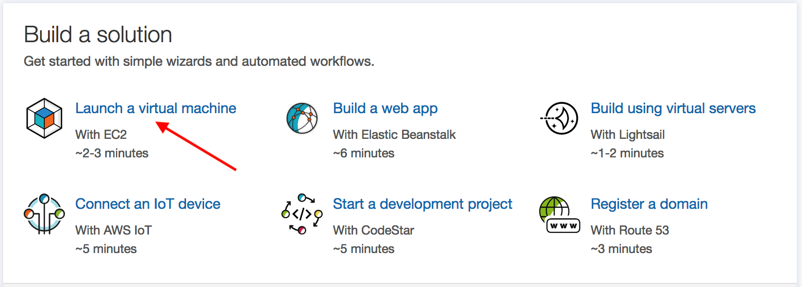
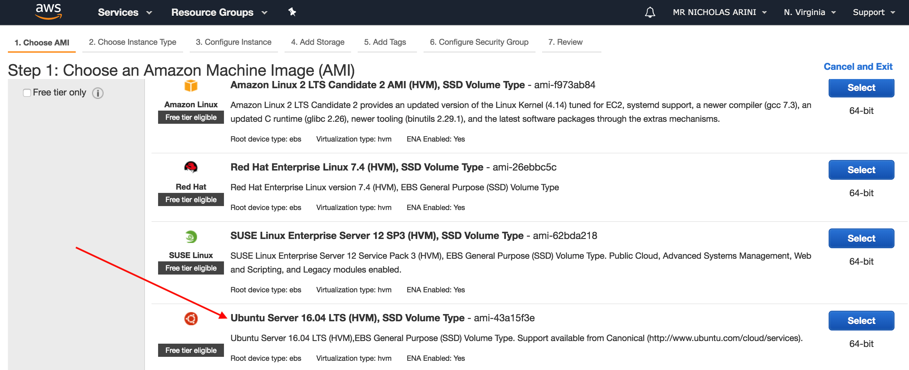
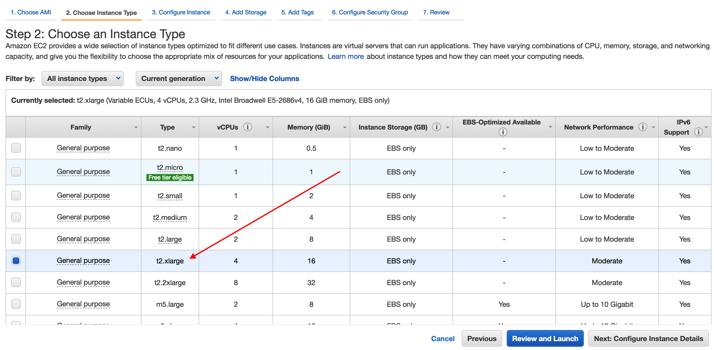
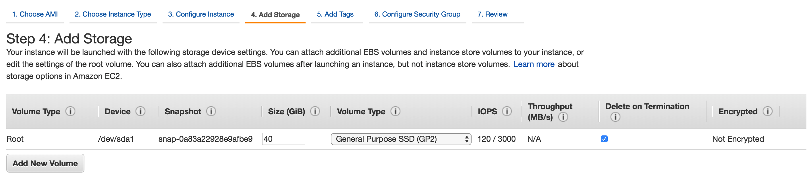
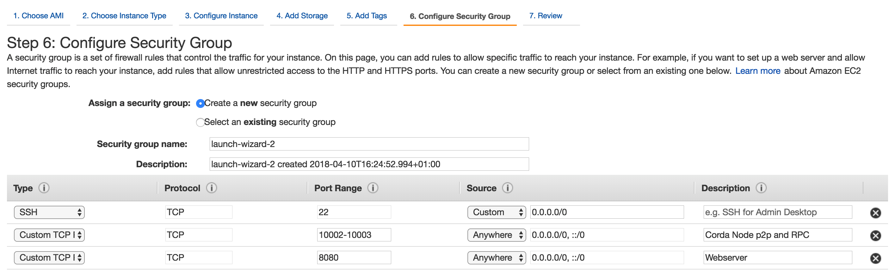
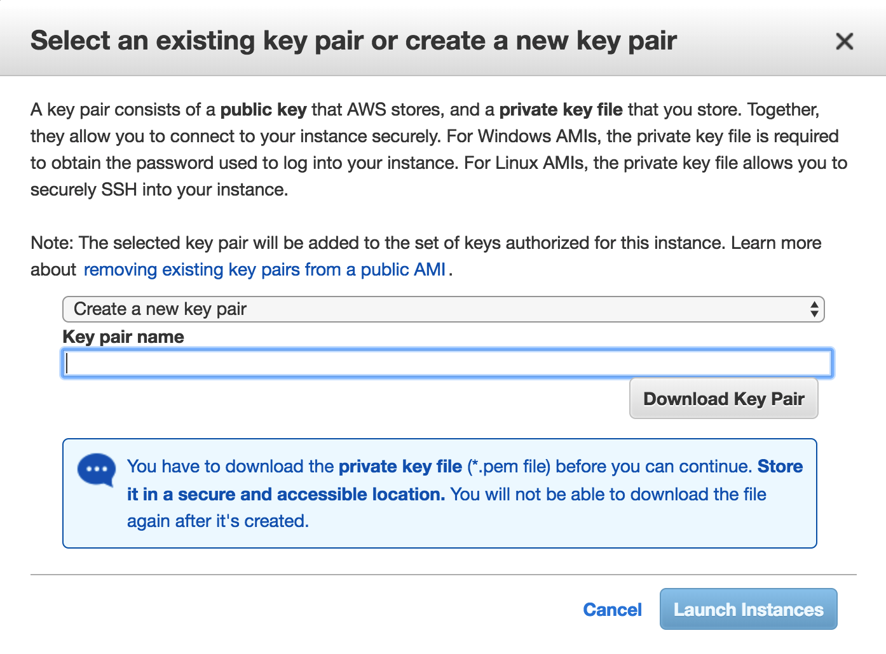
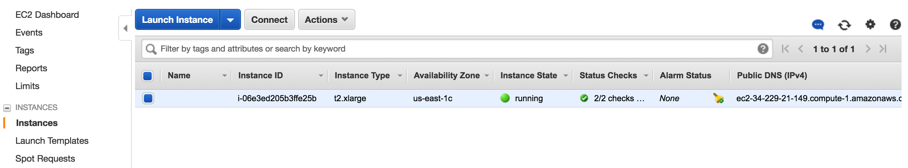
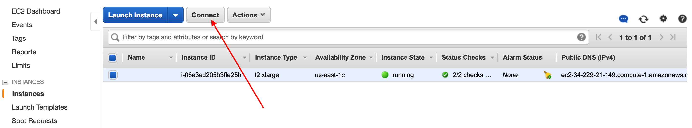

Deploying a Corda Node to an AWS Cloud Platform VM
====================================================

.. contents::

Corda Connect Explore will allow you to create a self service download
link with a node preconfigured to join the Explore environment. This
document will describe how to set up a virtual machine on the AWS
Cloud Platform to deploy your pre-generated Corda node on.

Pre-requisites
--------------
* Ensure you have a registered Amazon AWS account which can create virtual machines and you are logged on to the AWS console: `https://console.aws.amazon.com`.

Deploy Corda node
-----------------

Browse to `https://console.aws.amazon.com` and log in with your AWS account.

**STEP 1: Launch a new virtual machine**

Click on Launch a virtual machine with EC2.

In the quick start wizard scroll down and select "Ubuntu Server 16.04 LTS" as the Amazon Machine Image (AMI).

Select the instance type (for example t2.xlarge). 

Lets configure a couple of other settings before we review and launch

Under the storage tab (Step 4) increase the storage to 40GB:

Next we consifure the security group (Step 6) to open the firewall ports which Corda uses.

Add a firewall rule for port range 10002-10003 and allow connection from Anywhere. Add another rule for the webserver on port 8080. 

Click on the Review and Launch button then if everything looks ok click Launch.

You will be prompted to set up keys to securely access the VM remotely over ssh. Select "Create a new key pair" from the drop down and enter a name for the key file. Click download to get the keys and keep them safe on your local machine. 

Click "Launch Instances".

Click on the link to go to the Instances pages in the AWS console where after a few minutes you will be able to see your instance running.

**STEP 2: Set up static IP address**

**STEP 3: Connect to your VM and set up the environment**

In the instances console click on "Connect" and follow the instructions to connect to your instance using ssh.

Once you are logged in to a shell on the instance we need a few utilities so go ahead and install the following with apt-get:

.. code:: bash

    sudo apt-get update
    sudo apt-get install -y unzip  screen wget openjdk-8-jdk

**STEP 4: Download and set up your Corda node**

Now your environment is configured you can switch to the Explore
application and click on the copy to clipboard button to get your
dedicated download bundle.

In your terminal run the following command to download the
bundle to your instance:

.. code:: bash

    curl [your-specific-download-link]

Make a directory and unzip the file in this directory:

.. code:: bash

    mkdir corda
    mv node.zip corda
    cd corda
    unzip node.zip

Make sure the run-corda.sh script is executable

.. code:: bash

    chmod +x run-corda.sh

and then run the script to start Corda:

.. code:: bash

    ./run-corda.sh

You can now navigate to the external web address of the instance and
see the cordapps running on port 8080.
