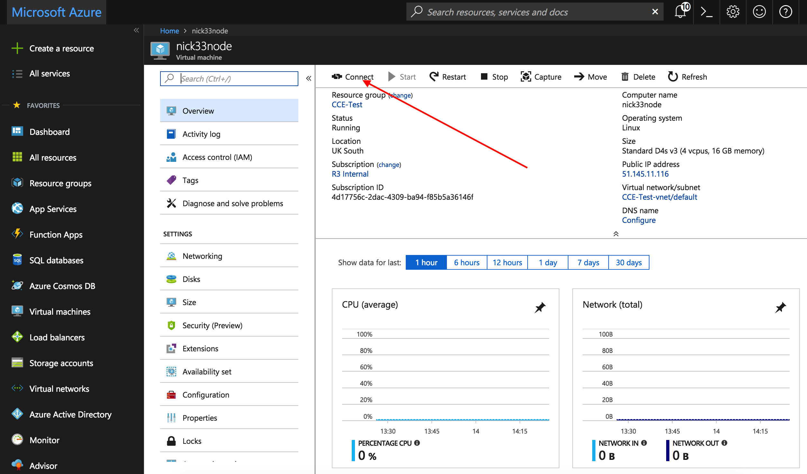
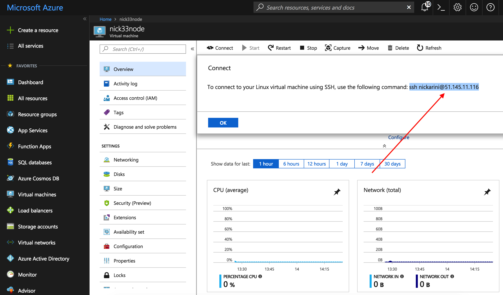
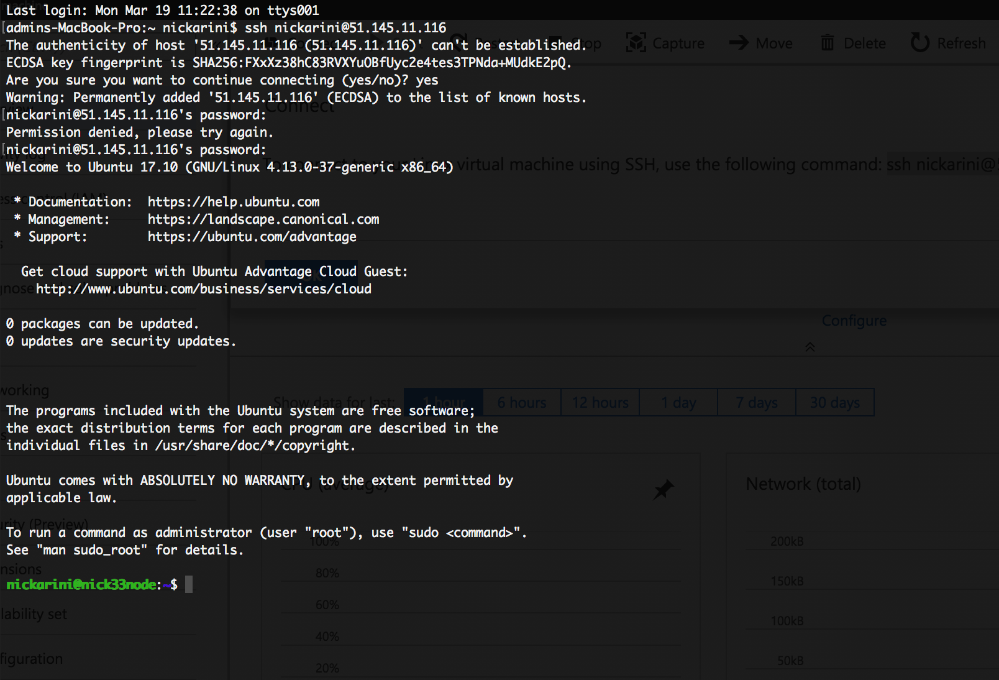
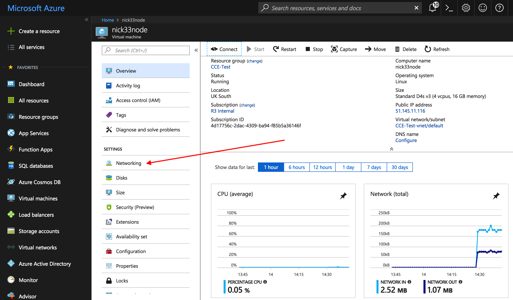
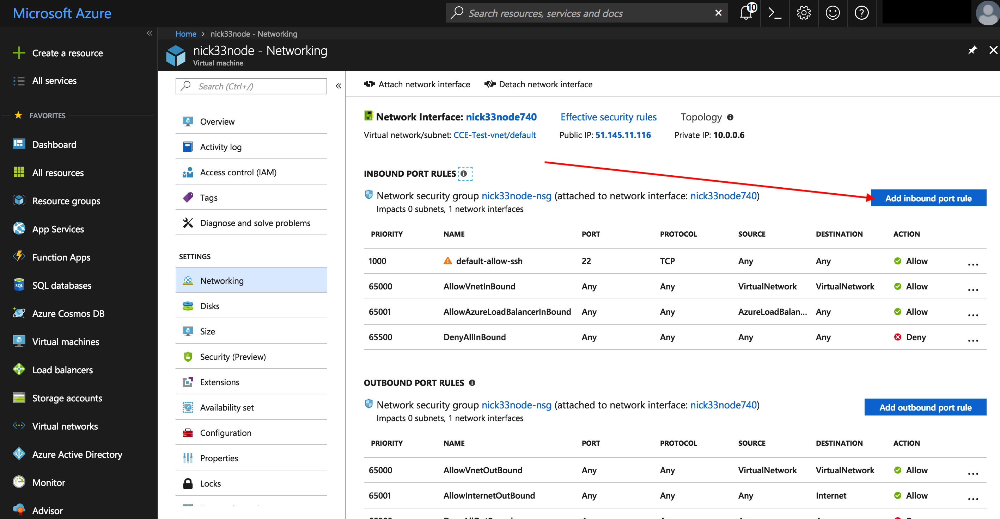

Deploying a Corda Node to an Azure Cloud Platform VM
====================================================

.. contents::

Corda Connect Explore will allow you to create a self service download
link with a node preconfigured to join the Explore environment. This
document will describe how to set up a virtual machine on the Azure
Cloud Platform to deploy your pre-generated Corda node on.

Pre-requisites
--------------
* Ensure you have a registered Microsoft Azure account which can create virtual machines and you are logged on to the Azure portal: `<https://portal.azure.com>`.

Deploy Corda node
-----------------

Browse to `<https://portal.azure.com>` and log in with your Microsoft account.

**STEP 1: Create a Resource Group**

Create a resource group. 

**STEP 2: Launch the VM**

At the top of the left sidenav click on the button with the green cross "Create a resource".

In this example we are going to use an Ubuntu server so select the "Ubuntu Server 17.10 VM" option.

.. image:: resources/azure-select-ubuntu.png
   :scale: 50 %

Fill in the form:

.. image:: resources/azure-vm-form.png
   :scale: 50 %

Add a username (to log into the VM) and choose and enter a password.

Choose the resource group we created earlier from the "Use existing" dropdown.

Select a cloud region geographically near to your location to host your VM.

Click on OK.

Choose the "D4S_V3 Standard" option and click "Select":

.. image:: resources/azure-vm-spec.png
   :scale: 50 %

Click on "Public IP address" to open the settings panel

.. image:: resources/azure-vm-settings.png
   :scale: 50 %

Set the IP address to "Static" under Assignment. (Note this is so the IP address for your node does not change rapidly and need to update the network map.)

.. image:: resources/azure-set-static-ip.png
   :scale: 50 %

Click OK and OK again on the Settings panel.

.. image:: resources/azure-settings-ok.png
   :scale: 50 %

Click Create and wait a few minutes for your instance to provision
and start running.

.. image:: resources/azure-create-vm.png
   :scale: 50 %

**STEP 3: Connect to your VM and set up the environment**

Once your instance is running click on the "Connect" button and copy the ssh command:

Enter the ssh command into your terminal. At the prompt to continue connecting type yes and then enter the password you configured earlier to log into the remote VM:

We need a few utilities so go ahead and install the following with apt-get:

.. code:: bash

    sudo apt-get update
    sudo apt-get install -y unzip  screen wget openjdk-8-jdk

We need to configure the firewall to allow Corda traffic.

Back in the portal click on networking:

Click on add inbound port rule

Add 3 rules with the following port, name and priorities:

.. code:: bash

    Port range: 10002, Priority: 1041  Name: Port_10002
    Port range: 10003, Priority: 1042  Name: Port_10003
    Port range: 8080, Priority: 1043  Name: Port_8080

.. note:: The priority has to be unique number in the range 900 (highest) and 4096 (lowest) priority.

**STEP 4: Download and set up your Corda node**

Now your environment is configured you can switch to the Explore
application and click on the copy to clipboard button to get your
dedicated download bundle.

In your terminal run the following command to download the
bundle to your instance:

.. code:: bash

    curl [your-specific-download-link]

Make a directory and unzip the file in this directory:

.. code:: bash

    mkdir corda
    mv node.zip corda
    cd corda
    unzip node.zip

Make sure the run-corda.sh script is executable

.. code:: bash

    chmod +x run-corda.sh

and then run the script to start Corda:

.. code:: bash

    ./run-corda.sh

You can now navigate to the external web address of the instance and
see the cordapps running on port 8080.
