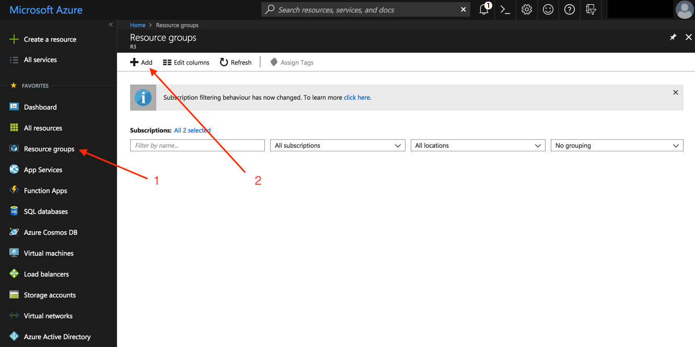
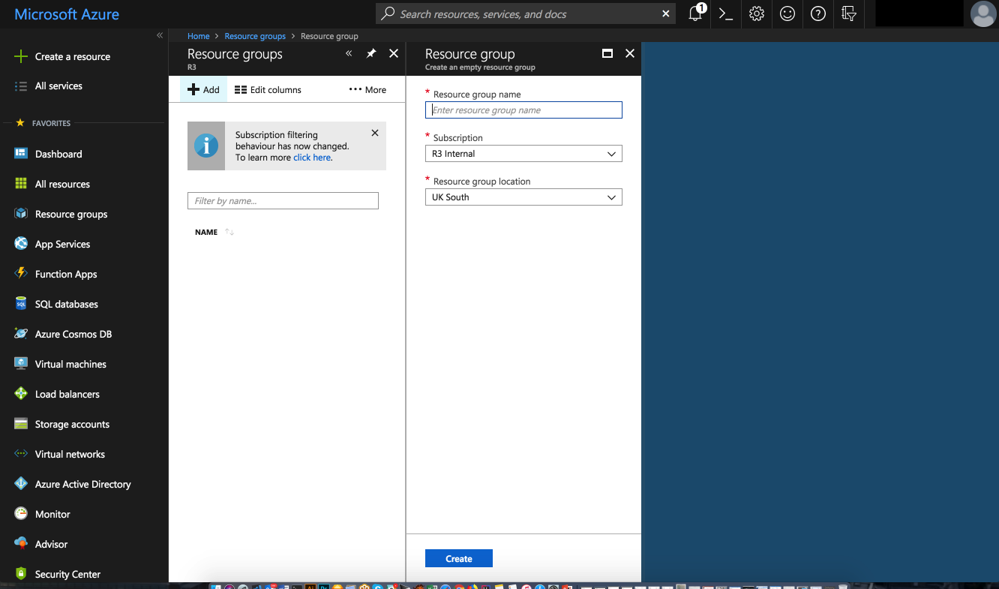
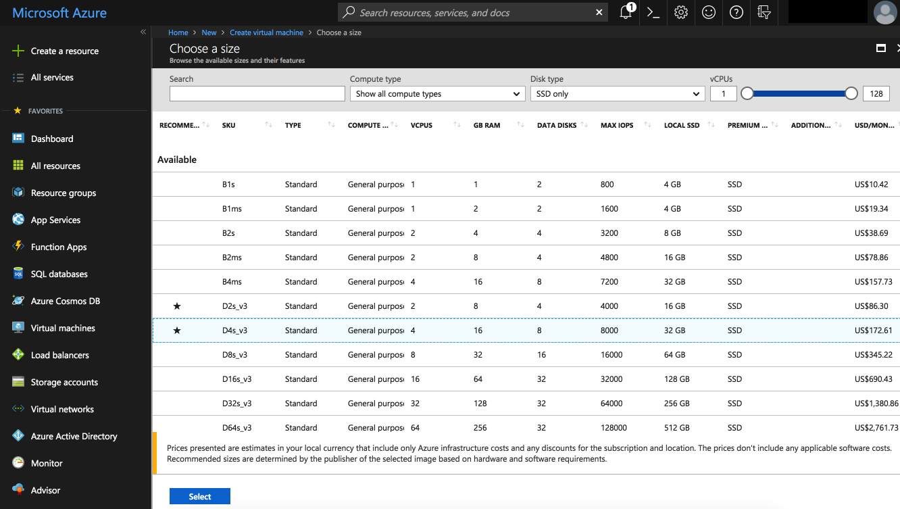
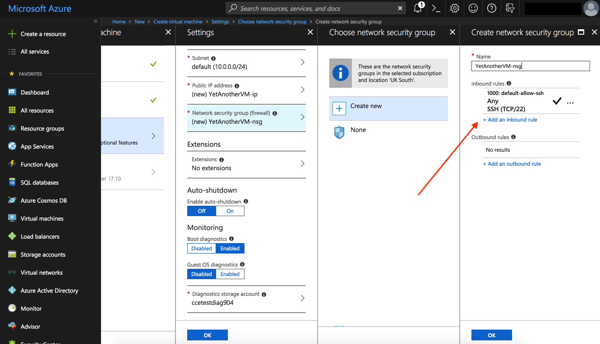
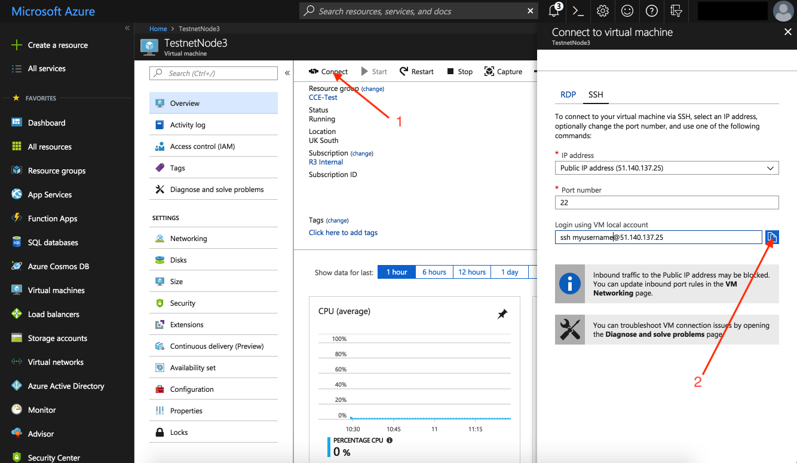
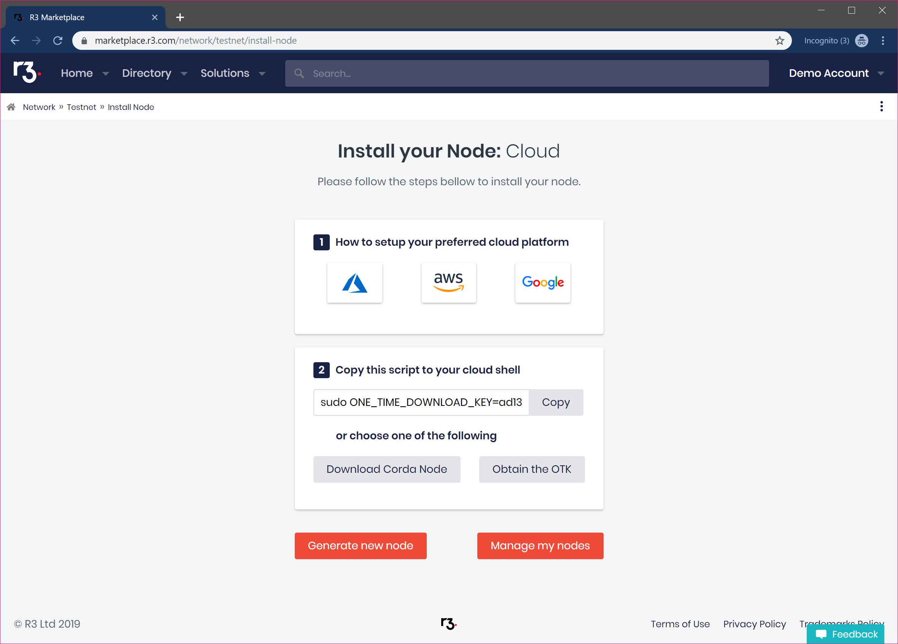
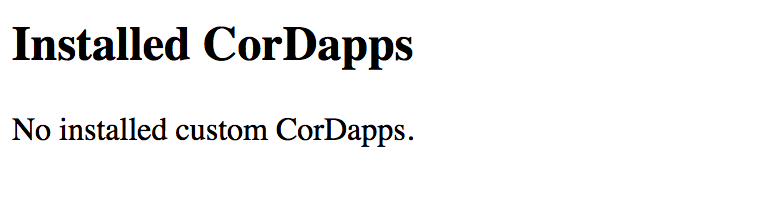

Deploying Corda to Corda Testnet from an Azure Cloud Platform VM
================================================================

.. contents::

This document will describe how to set up a virtual machine on the Azure Cloud Platform to deploy your pre-configured
Corda node and automatically connnect to Testnet. A self-service download link can be obtained from
https://testnet.corda.network.

Pre-requisites
--------------
* Ensure you have a registered Microsoft Azure account which can create virtual machines.

Deploy Corda node
-----------------

Browse to https://portal.azure.com and log in with your Microsoft account.

**STEP 1: Create a Resource Group**

Click on the "Resource groups" link in the side nav in the Azure Portal and then click "Add":

Fill in the form and click "Create":

**STEP 2: Launch the VM**

At the top of the left sidenav click on the button with the green cross "Create a resource".

In this example we are going to use an Ubuntu server so select the latest Ubuntu Server option:

.. image:: resources/azure-select-ubuntu.png

Fill in the form:

* Add a username (to log into the VM) and choose and enter a password
* Choose the resource group we created earlier from the "Use existing" dropdown
* Select a cloud region geographically near to your location to host your VM

Click on "OK":

.. image:: resources/azure-vm-form.png

Choose the "D4S_V3 Standard" option and click "Select":

Click on "Public IP address" to open the "Settings" panel

.. image:: resources/azure-vm-settings.png

Set the IP address to "Static" under "Assignment".

.. note:: This is so the IP address for your node does not change frequently in the global network map.

.. image:: resources/azure-set-static-ip.png

Click "OK".

Next click on "Network security group (firewall)":

.. image:: resources/azure-nsg.png

Add the following inbound rules for ports 8080 (webserver), and 10002-10003 for the P2P and RPC ports used by the Corda
node respectively:

.. code:: bash

    Port range: 10002, Priority: 1041  Name: Port_10002
    Port range: 10003, Priority: 1042  Name: Port_10003
    Port range: 8080, Priority: 1043  Name: Port_8080

.. note:: The priority has to be unique number in the range 900 (highest) and 4096 (lowest) priority. Make sure each
    rule has a unique priority or there will be a validation failure and error message.

	   
Click "OK" and "OK" again on the "Settings" panel:

.. image:: resources/azure-settings-ok.png
	   
Click "Create" and wait a few minutes for your instance to be provisioned and start running:

.. image:: resources/azure-create-vm.png

**STEP 3: Connect to your VM and set up the environment**

Once your instance is running click on the "Connect" button and copy the ssh command:

Enter the ssh command into your terminal. At the prompt, type "yes" to continue connecting and then enter the password
you configured earlier to log into the remote VM:

.. image:: resources/azure-shell.png

**STEP 4: Download and set up your Corda node**

Now that your Azure environment is configured you can switch to the Testnet web application and click on the
copy-to-clipboard button to get a one-time installation script.

.. note:: If you have not already set up your account on Testnet, please visit https://testnet.corda.network and sign
    up.

You can generate as many Testnet identites as you like by refreshing this page to generate a new one-time link.
	   
In the terminal of your cloud instance paste the command you just copied to install and run your unique Corda node:

.. code:: bash

    sudo ONE_TIME_DOWNLOAD_KEY=YOUR_UNIQUE_DOWNLOAD_KEY_HERE bash -c "$(curl -L https://testnet.corda.network/api/user/node/install.sh)"

.. warning:: This command will execute the install script as ROOT on your cloud instance. You may wish to examine the script prior to executing it on your machine. 

You can follow the progress of the installation by typing the following command in your terminal:

.. code:: bash

    tail -f /opt/corda/logs/node-<VM-NAME>.log

Once the node has booted up, you can navigate to the external web address of the instance on port 8080. If everything
is working, you should see the following:

Testing your deployment
-----------------------

To test your deployment is working correctly, follow the instructions in :doc:`testnet-explorer-corda` to set up the
Finance CorDapp and issue cash to a counterparty.

This will also demonstrate how to install a custom CorDapp.