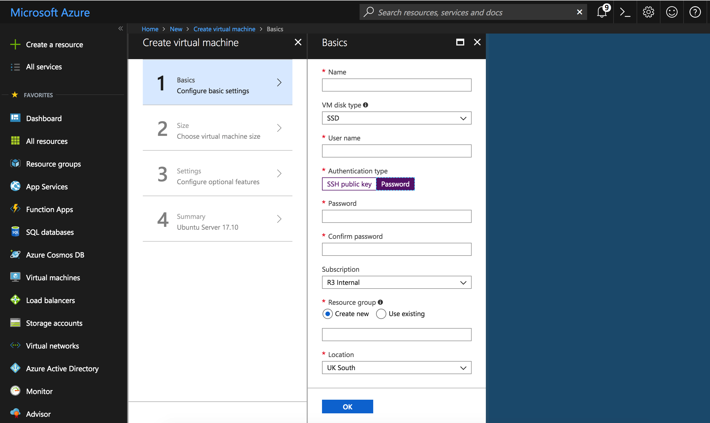
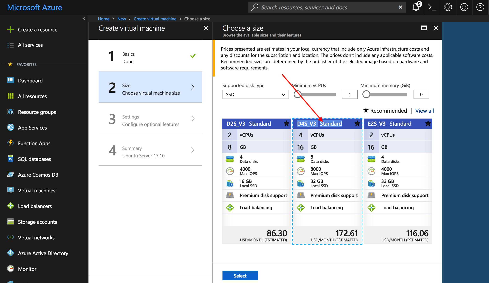
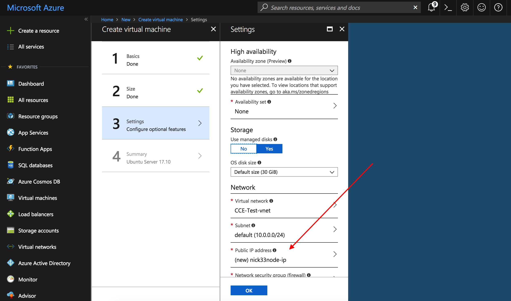
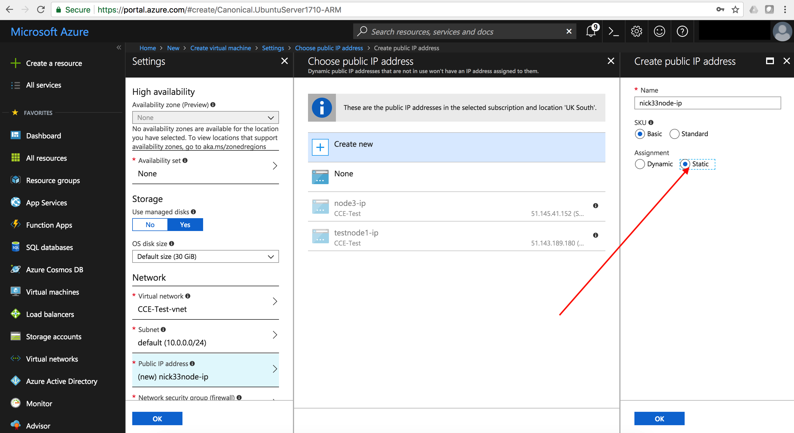
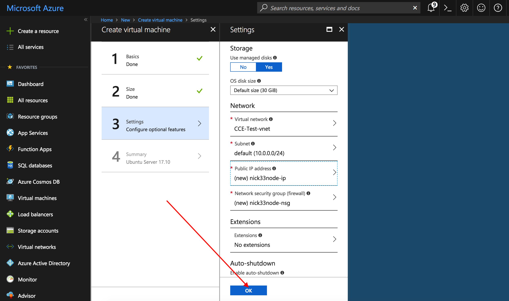
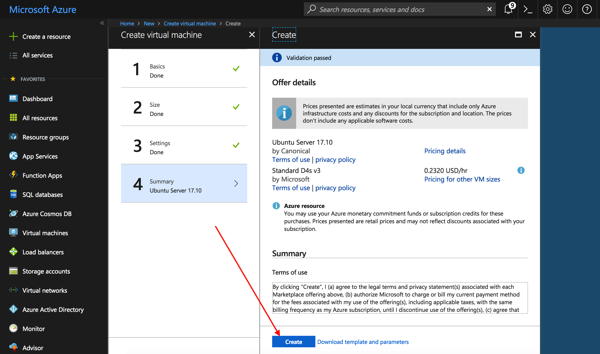
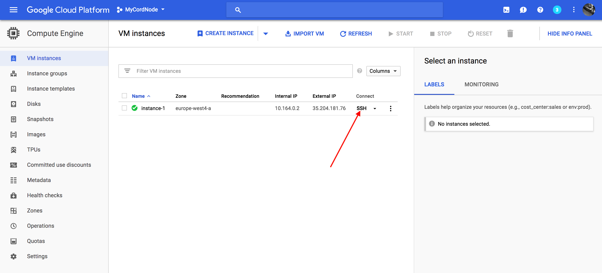
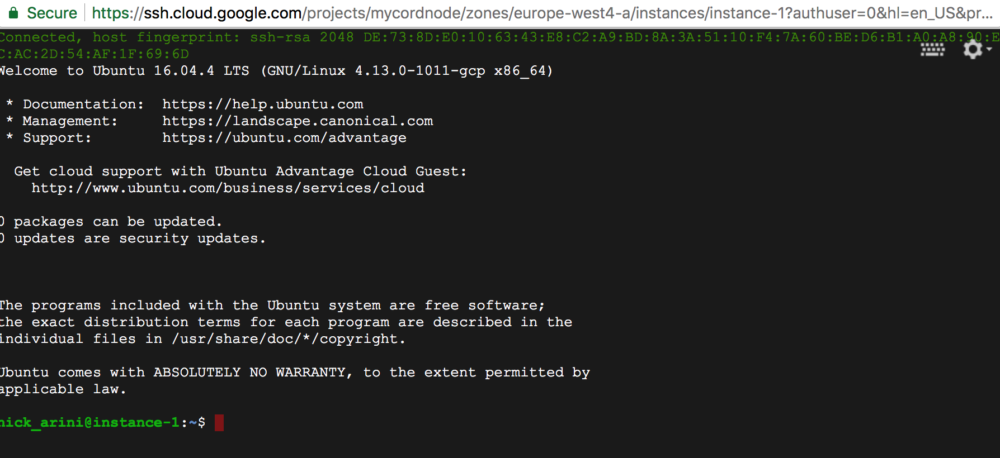

Deploying a Corda Node to an Azure Cloud Platform VM
====================================================

.. contents::

Corda Connect Explore will allow you to create a self service download
link with a node preconfigured to join the Explore environment. This
document will describe how to set up a virtual machine on the Azure
Cloud Platform to deploy your pre-generated Corda node on.

Pre-requisites
--------------
* Ensure you have a registered Microsoft Azure account with an R3 Member subscription which can create virtual machines and you are logged on to the Azure portal: `<https://portal.azure.com>`.

Deploy Corda node
-----------------

Browse to `<https://portal.azure.com>` and log in with your Microsoft account.

**STEP 1: Create a Resource Group**

**STEP 2: Launch the VM**

At the top of the left sidenav click on the button with the green cross "Create a resource".

.. image:: resources/azure-create-resource.png
   :scale: 50 %

In this example we are going to use an Ubuntu server so select the "Ubuntu Server 17.10 VM" option.

.. image:: resources/azure-select-ubuntu.png
:scale: 50 %

Fill in the form:

:scale: 50 %

Add a username (to log into the VM) and choose and enter a password.

Choose the resource group we created earlier from the "Use existing" dropdown.

Select a cloud region geographically near to your location to host your VM.

Click on OK.

Choose the "D4S_V3 Standard" option and click "Select":

Click on "Public IP address" to open the settings panel

:scale: 50 %

Set the IP address to "Static" under Assignment. (Note this is so the IP address for your node does not change rapidly and need to update the network map.)

:scale: 50 %

Click OK and OK again on the Settings panel.

:scale: 50 %

Click Create and wait a few minutes for your instance to provision
and start running.

:scale: 50 %

**STEP 3: Connect to your VM and set up the environment**

Once your instance is running click on the SSH button to launch a
cloud SSH terminal in a new window. 

   

We need a few utilities so go ahead and check the following are
installed and if not install with apt-get:

.. code:: bash

    sudo apt-get update
    sudo apt-get install -y unzip  screen wget openjdk-8-jdk

Now run the following to configure the firewall to allow Corda traffic

.. code:: bash

    gcloud compute firewall-rules create nodetonode --allow tcp:10002
    gcloud compute firewall-rules create nodetorpc --allow tcp:10003
    gcloud compute firewall-rules create webserver --allow tcp:8080

Next we promote the ephemeral IP address associated with this
instance to a static IP address.

First check the region and select the one you are using from the list:

.. code:: bash

    gcloud compute regions list

Find your external IP:

.. code:: bash

    gcloud compute addresses list

Then run this command with the ephemeral IP address as the argument to
the --addresses flag and the region:

.. code:: bash

    gcloud compute addresses create corda-node --addresses 35.204.53.61 --region europe-west4

**STEP 4: Download and set up your Corda node**

Now your environment is configured you can switch to the Explore
application and click on the copy to clipboard button to get your
dedicated download bundle.

In your cloud VM terminal run the following command to download the
bundle to your instance:

.. code:: bash

    wget [your-specific-download-link]

Make a directory and unzip the file in this directory:

.. code:: bash

    mkdir corda
    mv node.zip corda
    cd corda
    unzip node.zip

now you need to make some edits to the node.conf file:

EDITS

Now run screen so the node keeps running if your session disconnects:

.. code:: bash

    screen

then run the corda node and webserver:

.. code:: bash

    java -jar corda.jar
    CTL-A c 
    java -jar corda-webserver.jar

You can now navigate to the external web address of the instance and
see the cordapps running on port 8080.

 
Next Steps
----------
