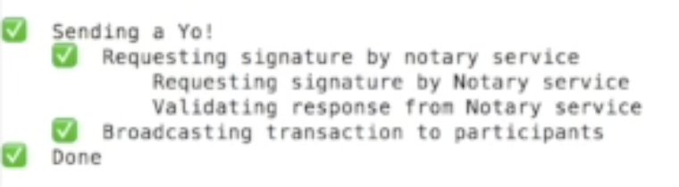

Building a Corda Network on Azure Marketplace
=============================================

To help you design, build and test applications on Corda, called CorDapps, a Corda network can be deployed on the `Microsoft Azure Marketplace <https://azure.microsoft.com/en-gb/overview/what-is-azure>`_

This Corda network offering builds a pre-configured network of Corda nodes as Ubuntu virtual machines (VM). The network comprises of a Network Map Service node, a Notary node and up to nine Corda nodes using a version of Corda of your choosing. The simple Yo! CorDapp is pre-installed and demonstrates the basic principles of Corda. When you are ready to go further with developing on Corda and start making contributions to the project head over to the `GitHub Repos <https://github.com/corda/>`_.

Pre-requisites
--------------
* Ensure you have a registered Microsoft Azure account and are logged on to the Azure portal
* It is recommended you generate a private-public SSH key pair (see `here <https://www.digitalocean.com/community/tutorials/how-to-set-up-ssh-keys--2/>`_)

Deploying the Corda Network
---------------------------

Search the Azure Marketplace for Corda and select 'Corda Single Ledger Network'.

Click the 'Create' button.

STEP 1: Basics

Define the basic parameters which will be used to pre-configure your Corda nodes.

* **Resource prefix**: Choose an appropriate descriptive name for your Corda nodes. This name will prefix the node hostnames
* **VM user name**: This is the user login name on the Ubuntu VMs. Leave it as azureuser or define your own
* **Authentication type**: Select 'SSH public key', then paste the contents of your SSH public key file (see pre-requisites, above) into the box. Alternatively select 'Password' to use a password of your choice to administer the VM
* **Restrict access by IP address**: Leave this as 'No'
* **Subscription**: Select which of your Azure subscriptions you want to use
* **Resource group**: Choose to 'Create new' and provide a useful name of your choice
* **Location**: Select the geographical location physically closest to you
 
.. image:: resources/azure_multi_node_step1.png
  :width: 300px

Click 'OK'

STEP 2: Network Size and Performance

Define the number of Corda nodes in your network and the size of VM.

* **Number of Network Map nodes**: There can only be one Network Map node in this network. Leave as '1'
* **Number of Notary nodes**: There can only be one Notary node in this network. Leave as '1'
* **Number of participant nodes**: This is the number of Corda nodes in your network. At least 2 is recommended (so you can send transactions between them) and there is an upper limit of 9
* **Storage performance**: Leave as 'Standard'
* **Virtual machine size**: It is recommended to use '4x Standard D1 v2' based on performance versus cost

.. image:: resources/azure_multi_node_step2.png
  :width: 300px
 
Click 'OK'

STEP 3: Corda Specific Options

Define the version of Corda you want on your nodes and the type of notary.

* **Corda version (as seen in Maven Central)**: Type the version of Corda you want your nodes to use. The version value must exactly match the directory name in `Maven Central <http://repo1.maven.org/maven2/net/corda/corda/>`_, for example 0.11.0
* **Notary type**: Select either 'Non Validating" (notary only checks whether a state has been previously used and marked as historic. Faster processing) or 'Validating' (notary performs transaction verification by seeing input and output states. Slower processing). More information on notaries can be found `here <https://vimeo.com/album/4555732/video/214138458>`_

.. image:: resources/azure_multi_node_step3.png
  :width: 300px
  
Click 'OK'

STEP 4: Summary

A summary of your selections is shown.

.. image:: resources/azure_multi_node_step4.png
  :width: 300px

Click 'OK'

STEP 5: Buy

Review the Azure Terms of Use and Privacy Policy and click 'Purchase'

The deployment process will start and typically takes 8-10 minutes to complete.

Once deployed click 'Overview' to see the virtual machine details. Note down the **Public IP address** for your Corda nodes. You will need these to connect to UI screens via your web browser:

.. image:: resources/azure_ip.png
  :width: 300px

Using the Yo! CorDapp
---------------------
The pre-loaded Yo! CordDapp on your Corda nodes lets you send simple Yo! messages to other Corda nodes on the network. A Yo! message is a very simple transaction. The Yo! CorDapp is running by default when your Corda nodes start. The Yo! CorDapp demonstrates how transactions are only sent between Corda nodes which they are intended for and are not shared across the entire network. The Yo! CorDapp also makes use of the network map cache on each Corda node to find the intended target for the message.

Open a browser tab and browse to the following URL:

.. sourcecode:: shell

	http://(public IP address):(port)/web/yo

where (public IP address) is the public IP address of one of your Corda nodes on the Azure Corda network and (port) is the web server port number for your Corda node, 10004 by default

You will now see the Yo! CordDapp web interface:

.. image:: resources/Yo_web_ui.png
  :width: 300px

* **Sending a Yo message via the web interface**

In the browser window type the following URL to send a Yo message to a target node on your Corda network:

.. sourcecode:: shell

	http://(public IP address):(port)/api/yo/yo?target=(legalname of target node)
	
where (public IP address) is the public IP address of one of your Corda nodes on the Azure Corda network and (port) is the web server port number for your Corda node, 10004 by default and (legalname of target node) is the Legal Name for the target node as defined in the node.conf file. An easy way to see the Legal Names of Corda nodes on the network is to use the peers screen:

.. sourcecode:: shell

	http://(public IP address):(port)/api/yo/peers

* **Sending a Yo message via the shell**

You can run commands on your Corda node using the `shell framework <https://docs.corda.net/shell.html>`_.

Connect to one of your Corda nodes using an SSH client of your choice (e.g. Putty) and log into the virtual machine using the public IP address and your SSH key or username / password combination you defined in Step 1 of the Azure build process. Type the following command:

.. sourcecode:: shell

	flow start net.corda.yo.YoFlow target: (legalname of target node)

where (legalname of target node) is the Legal Name for the target node as defined in the node.conf file. An easy way to see the Legal Names of Corda nodes on the network is to use the peers screen:

.. sourcecode:: shell

	http://(public IP address):(port)/api/yo/peers

A short list of tasks show on-screen to indicate the progress of the command.

This `video <https://vimeo.com/217809526#t=10m20s>`_ summarises these steps.

* **Viewing Yo messages**

To see Yo! messages sent to a particular node open a browser window and browse to the following URL:

.. sourcecode:: shell

	http://(public IP address):(port)/api/yo/yos

Viewing logs
------------
Users may wish to view the raw logs generated by each node, which contain more information about the operations performed by each node.

You can access these using an SSH client of your choice (e.g. Putty) and logging into the virtual machine using the public IP address.
Once logged in, navigate to 

.. sourcecode:: shell

	/opt/corda/logs

You can open log files with any text editor.

.. image:: resources/azure_vm_10_49.png
  :width: 300px
  
Next Steps
----------
Now you have built a Corda network and used a basic Corda CorDapp do go and visit the `dedicated Corda website <https://www.corda.net>`_

Or to join the growing Corda community and get straight into the Corda open source codebase, head over to the `Github Corda repo <https://www.github.com/corda>`_
