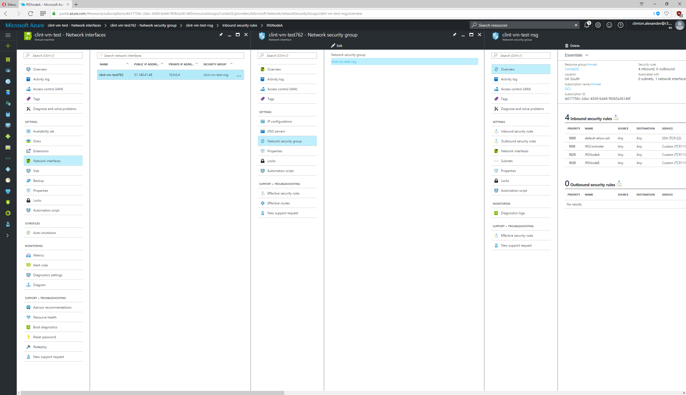
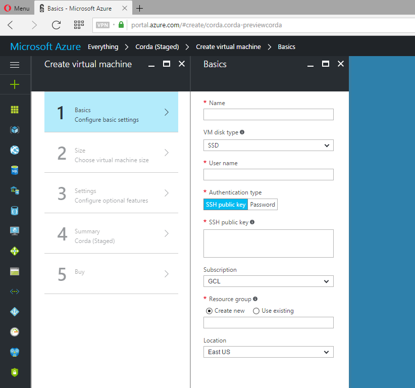
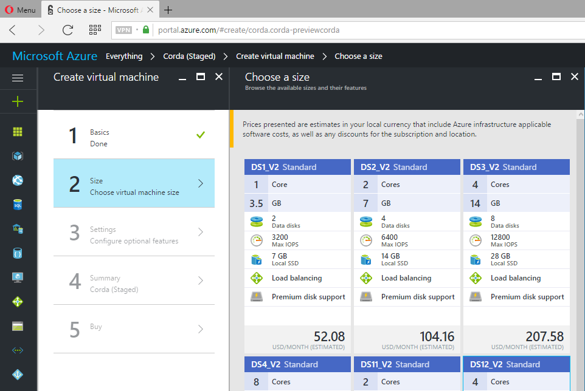

Working with the Azure VM
==========

Corda ships with a VM image which can be used to deploy a pre-configured virtual machine on `Microsoft's Azure platform<https://azure.microsoft.com/en-gb/overview/what-is-azure/>`_. 

Deploying on Azure provides a rapid way to :doc:`running-the-demos` without needing to manually setup the JDK etc. in advance. 

.. image:: resources/azure_vm_10_20.png
  :width: 300px
.. image:: resources/azure_vm_10_22.png
  :width: 300px
.. image:: resources/azure_vm_10_26.png
  :width: 300px

Pre-requisites
-------
* Ensure you have a registered Microsoft Azure account and are logged on to `portal.azure.com<https://portal.azure.com/>` before proceeding with the following steps.
* Generate a private-public SSH key pair (see `here<https://www.digitalocean.com/community/tutorials/how-to-set-up-ssh-keys--2/>` for )

Deploying the VM
------

Click the 'Create' button to start the process of creating a new VM, specifying the following basic settings:

* **Name**: Choose an appropriate descriptive name for the VM
* **VM Disk Type**: Select 'SSD'
* **Username**: Your preferred user name for the administrator account when accessing via SSH
* **Authentication type**: Select 'SSH public key', then paste the contents of your SSH public key file (see pre-requisites, above) into the box below
* **Subscription**: Select 'GCL'
* **Resource group**: Select 'Use existing'. From the drop-down menu, select 'CordaOS'
* **Location**: Select 'UK South'
 

Click 'OK' to progress to the 'Choose a Size' screen.

**'Choose a Size' screen**: A range of available hardware configurations will be presented, along with estimated costs. ***For the purposes of running the demos, configuration DS11_V2 (2 cores, 14 GB) is recommended.***

 
Select the required configuration and click 'Select'.

**Settings screen**: Adjust any configuration settings required (optional - ***For the purposes of running the demos, all settings may be left on their defaults.***)

.. image:: resources/azure_vm_10_16.png
  :width: 300px

**Summary screen**: The banner at the top of the dialog should read 'Validation passed'; otherwise, go back and adjust settings where needed.

.. image:: resources/azure_vm_10_19.png
  :width: 300px

Click OK to proceed.

**Buy screen**: Click to proceed with the purchase.

The VM will begin the deployment process, which typically takes 4-5 minutes to complete. To see progress, click on the "Deploying" icon displayed.

.. image:: resources/azure_vm_10_20.png
  :width: 300px

Once deployed, open the virtual machine details and identify the **Public IP address** on the Overview tab (see screenshot):

.. image:: resources/azure_vm_10_26.png
  :width: 300px

Once deployed, open the virtual machine details and identify the **Public IP address** (see screenshot):

.. image:: resources/azure_vm_10_26.png
  :width: 300px

Navigate to the Network Interfaces settings tab. Select the network interface and the network security group associated with it (see screenshot):

Go to the "Inbound security rules" tab for the group and add new rules as needed (see above screenshot).

Viewing the SIMM Valuation demo
------
The SIMM Valuation spawns three nodes, representing three parties in the example workflow (Bank A, Bank B, Bank C). Each node listens on a different port - those used by the demo are:

**SIMM Valuation Demo ports:** **12005**, **12007**, **12009**

Open three browser windows/tabs and direct each one to http://*(public IP address)*:*(port)*/web/simmvaluationdemo, specifying each of the three ports above in different windows. You should be able to view the basic web interface identifying the different banks (see screenshot below).

.. image:: resources/azure_vm_10_51.png
  :width: 300px

Note that in the example, the transaction takes place between Bank A and B; this transaction is not visible on Node C, illustrating the restricted data sharing feature of Corda.

You can now navigate the demo and use it to:

* Set up new (fictitious) interest rate swaps between any two of the three nodes: Click "Create New Trade", set the terms of the deal (e.g. EUR / 1Y fixed vs. 3m EURIBOR) and click submit. 
* Agree valuations on positions and run the valuation calculation
* View changes in the portfolio of each bank as new swaps are created

.. note:: There is a known issue whereby some users may see a 400 error when navigating the SIMM Valuation demo. If you encounter this error, simply navigate back to the root page (http://*(public IP address)*:*(port)*/web/simmvaluationdemo) in the browser before continuing.

Viewing the IRS demo
------
The IRS demo can be accessed in the same way as the SIMM Valuation demo above, substituting for the three ports on which the IRS demo is set to run: 

**SIMM Valuation Demo ports:** **11003**, **11005**, **11007**

Viewing logs (advanced users)
------
Users may wish to view the raw logs generated by each node, which contain more information about the operations performed by each node.

You can access these by logging into the virtual machine using the public IP address (no password required assuming your SSH key is correctly installed). Once logged in, navigate to */opt/irs-nodes/* . There are separate sub-directories for each of the three nodes (*nodea*, *nodeb*, *nodec*), each containing a */logs* sub-directory.

The name of the log file will follow the name given to the service it reflects, e.g. *node-clint-vm-test.log*.

.. image:: resources/azure_vm_10_47.png
  :width: 300px

You can open log files with any text editor.

.. image:: resources/azure_vm_10_49.png
  :width: 300px