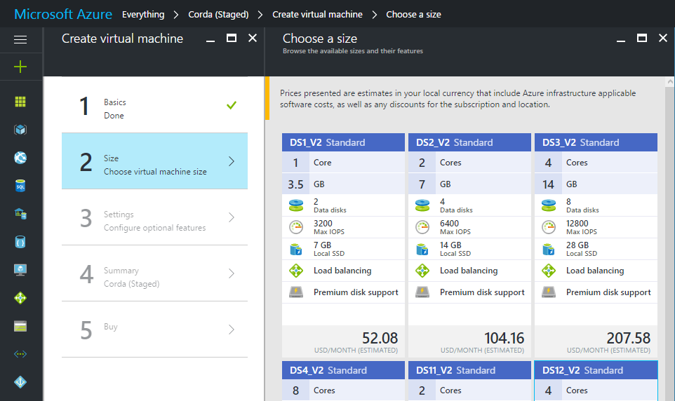
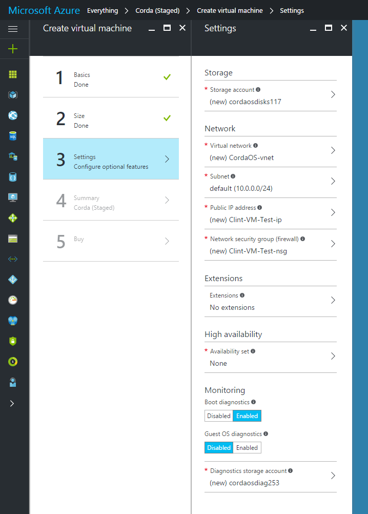
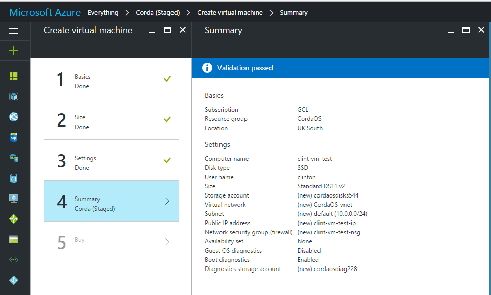
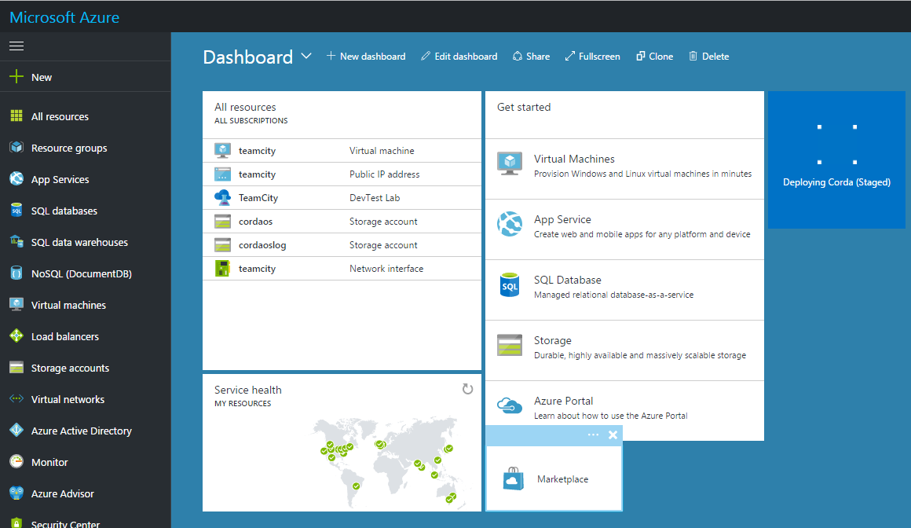
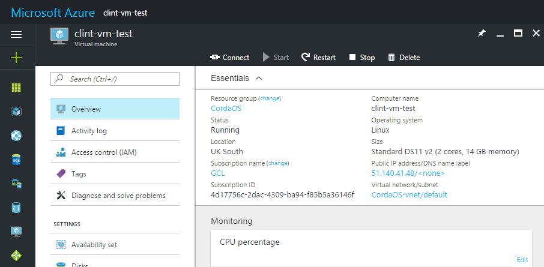

Building a Corda Network on Azure Marketplace
=============================================

To help you design, build and test CorDapps running on Corda a Corda network can be deployed on the `Microsoft Azure Marketplace <https://azure.microsoft.com/en-gb/overview/what-is-azure>`_

This Corda network offering builds a pre-configured network of Corda nodes comprising a Network Map Service node, Notary node and up to nine Corda nodes using a version of Corda that you choose. The simple Yo! CorDapp is pre-installed and helps you learn the basic principles of Corda. When you are ready to go further developing on Corda and start making contributions to the project head over to the `GitHub Repos <https://github.com/corda/>`_.

Pre-requisites
--------------
* Ensure you have a registered Microsoft Azure account and are logged on to the Azure portal.
* It is recommended you generate a private-public SSH key pair (see `here <https://www.digitalocean.com/community/tutorials/how-to-set-up-ssh-keys--2/>`_)

Deploying the VM
----------------

Search the Azure Marketplace for Corda.
Click the 'Create' button.

STEP 1: Basics

* **Name**: Choose an appropriate descriptive name for the VM
* **VM Disk Type**: Select 'SSD'
* **Username**: Your preferred user name for the administrator account when accessing via SSH
* **Authentication type**: Select 'SSH public key', then paste the contents of your SSH public key file (see pre-requisites, above) into the box below. Alternatively select 'Password' to use a password of your choice to administer the VM

* **Subscription**: Select your subscription name
* **Resource group**: Select 'Use existing'. From the drop-down menu, select your account group
* **Location**: Select the geographical location physically closest to you
 
.. image:: resources/azure_vm_10_00_1.png
  :width: 300px

Click 'OK'

STEP 2: Size

A range of available hardware configurations will be presented, along with estimated costs. For the purposes of running the demos, a configuration of 2 cores and at least 14GB is recommended

 
Choose the required configuration and click 'Select'.

STEP 3: Settings

Adjust any configuration settings required. For the purposes of running the Corda demos, all settings may be left as default.

STEP 4: Summary

The banner at the top of the dialog should read 'Validation passed' otherwise go back and adjust settings where needed.

Click 'OK' to proceed.

STEP 5: Buy

Click 'Purchase' to complete the configuration and start the VM deployment.

The VM will begin the deployment process, which typically takes 4-5 minutes to complete. To see progress, click on the "Deploying" icon displayed.

Once deployed, click 'Overview' to see the virtual machine details. Note down the **Public IP address**. You will need this to connect to the demo screens via your web browser:

Using the Yo! CorDapp
---------------------
The pre-loaded Yo! CordDapp on your Corda nodes lets you send simple Yo messages to other Corda nodes on the network. The Yo! CorDapp is running by default when your Corda nodes start.

Open a browser tabs and browse to the following URL:

.. sourcecode:: shell

	http://(public IP address):(port)/web/simmvaluationdemo

where public IP address is the public IP address of one of your Corda nodes on the Azure Corda network. This can be found using the Overview screen in your Azure portal:

.. image:: resources/azure_ip.png
  :width: 300px

specifying each of the three ports above in different windows, e.g. 

.. sourcecode:: shell

	http://51.140.41.48/12005/web/simmvaluationdemo

You will be able to view the basic web interface identifying the different banks.

Now let's take a look at a transaction between Bank A and B which is not visible to Bank C. This illustrates the restricted data sharing feature of Corda, i.e. data is shared on a need-to-know basis. Nodes provide the dependency graph of a transaction they are sending to another node on demand, but there is no global broadcast of all transactions. 

1. In the browser tab for Bank A (the top right hand corner shows which bank you are administering) click 'Create New Trade' from the top navigation bar
2. Select to trade with Bank B
3. Select 'EUR Fixed 1y EURIBOR 3m' from the drop down
4. Click 'Submit' to create the trade
5. In the browser tab for Bank B click 'View Portfolio' from the top navigation bar to see this new trade
6. In the browser tab for Bank C click 'View Portfolio' from the top navigation bar and you will not be able to see the trade, as expected

.. image:: resources/azure_vm_10_51.png
  :width: 300px

.. note:: There is a known issue whereby some users may see a 400 error when navigating the SIMM Valuation demo. If you encounter this error, simply navigate back to the root page (http://*(public IP address)*:*(port)*/*web*/*simmvaluationdemo*) in the browser before continuing.

Viewing the IRS demo
--------------------
The IRS demo creates three nodes: Bank A, Bank B and a node that runs a notary, a network map and an interest rates oracle together. The two banks agree on an interest rate swap, and then do regular fixings of the deal as the time on a simulated clock passes. Each bank node listens on a different port - those used by the demo are:

**IRS demo ports:** **11005 (node A for Bank A)**, **11007 (node B for Bank B)**

Open two browser tabs and direct one to each of the following:

.. sourcecode:: shell

	http://localhost:11005/web/irsdemo
	http://localhost:11007/web/irsdemo
	
You will be able to see the nodes' view of the ledger.

.. image:: resources/azure_vm_10_52.png
  :width: 300px

Now let's take a look at how the interest rates oracle provides interest rates for a deal with a semi-annual payment frequency, and how the two counterparties to the trade see the same deal information on their own nodes, i.e. you see what I see.

1. In the browser tab for Bank A click 'Create Deal' from the top navigation bar
2. Modify the terms of the IRS deal, or leave as default
3. Click 'Submit' to create the deal
4. In the browser tab for Bank A click 'Recent Deals' from the top navigation bar to view the deal
5. In the browser tab for Bank B click 'Recent Deals' from the top navigation bar to view the deal. Compare the economic details to those shown in the Bank A tab

.. image:: resources/azure_vm_10_54.png
  :width: 300px

Viewing logs
------------
Users may wish to view the raw logs generated by each node, which contain more information about the operations performed by each node.

You can access these using an SSH client of your choice (e.g. Putty) and logging into the virtual machine using the public IP address.
Once logged in, navigate to 

.. sourcecode:: shell

	/opt/corda/logs

You can open log files with any text editor.

.. image:: resources/azure_vm_10_49.png
  :width: 300px
  
Next Steps
----------
Now you have taken a look at two Corda demos do go and visit the `dedicated Corda website <https://www.corda.net>`_

Or to get straight into the Corda open source codebase, head over to the `Github Corda repo <https://www.github.com/corda>`_
