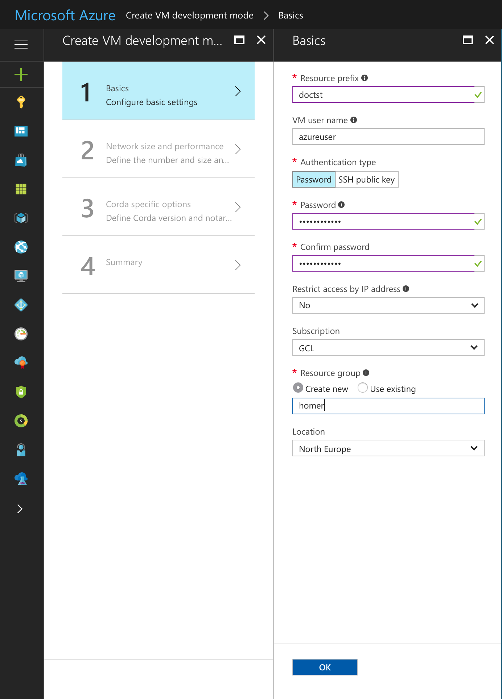
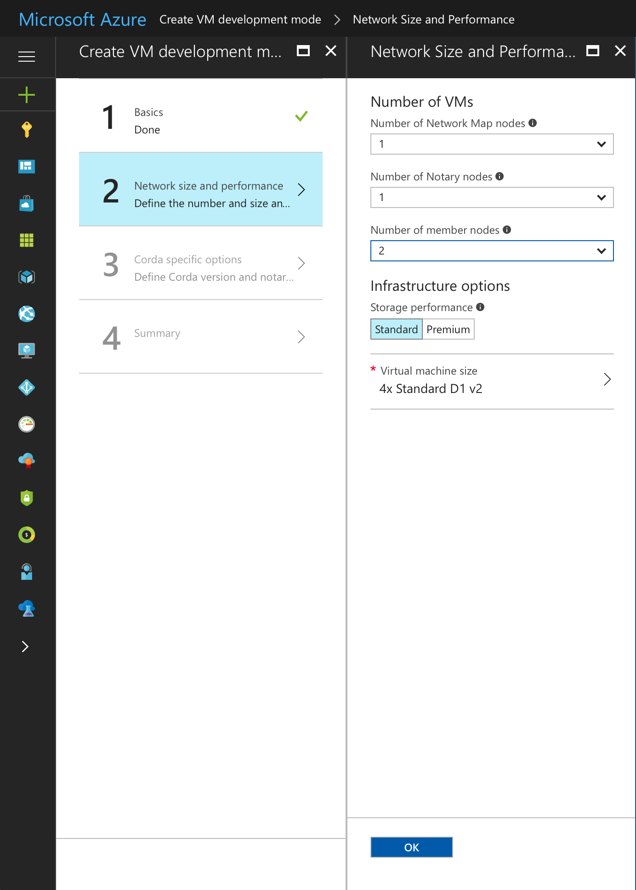
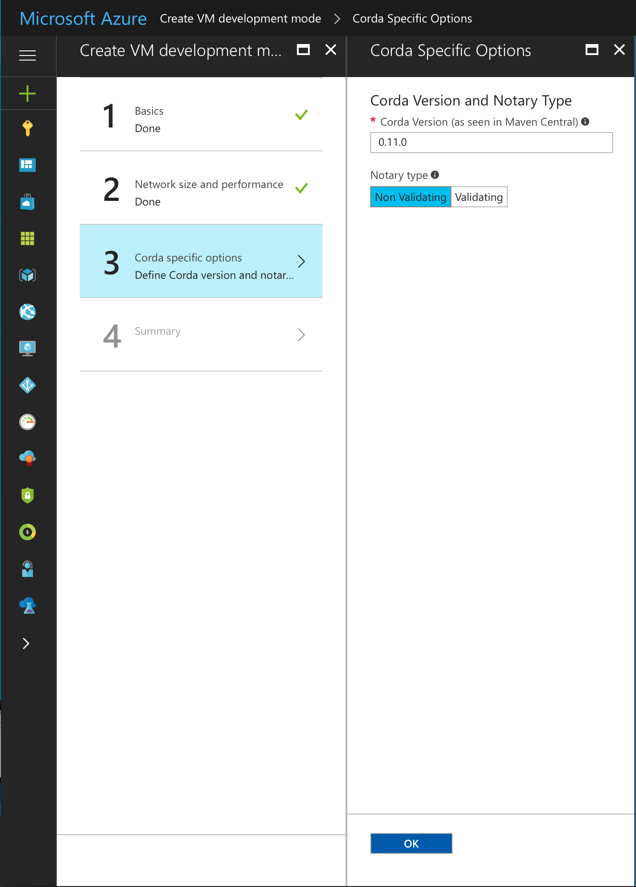
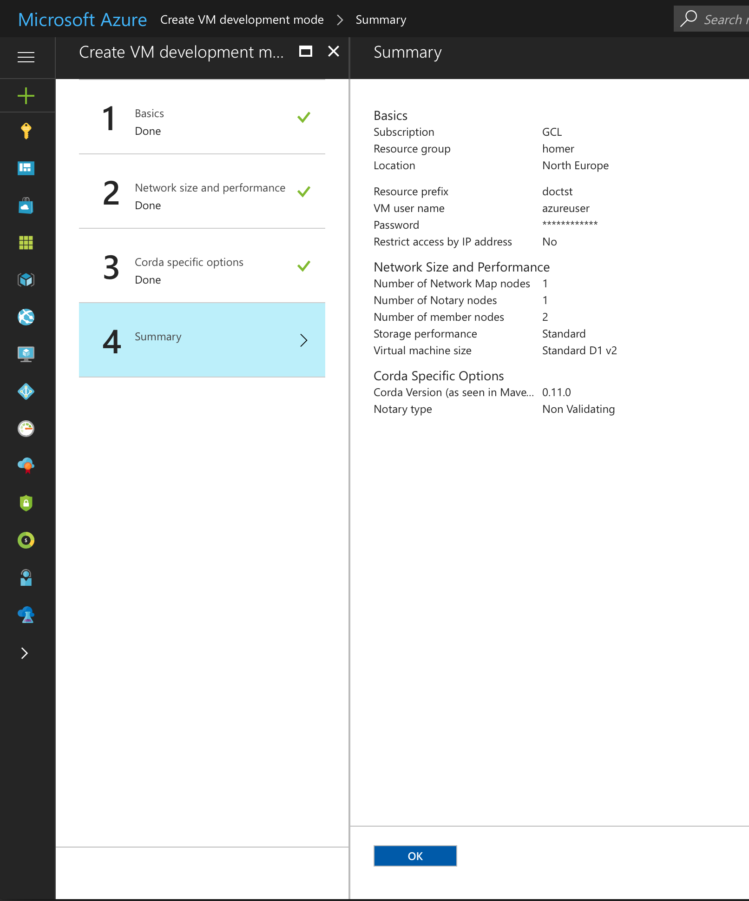
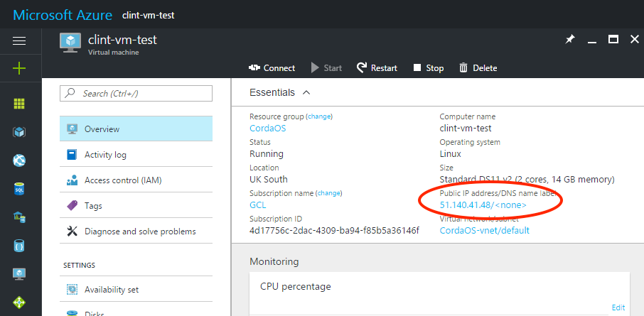
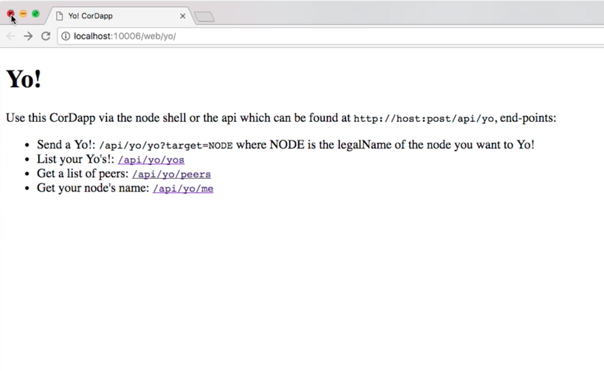
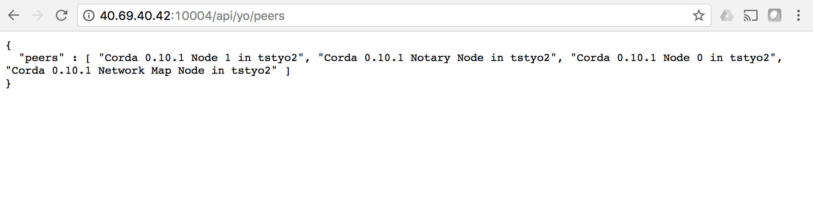
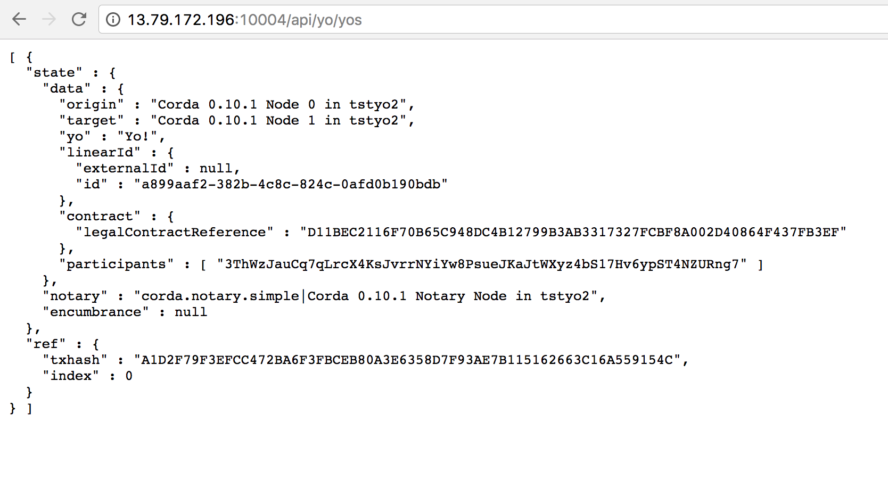
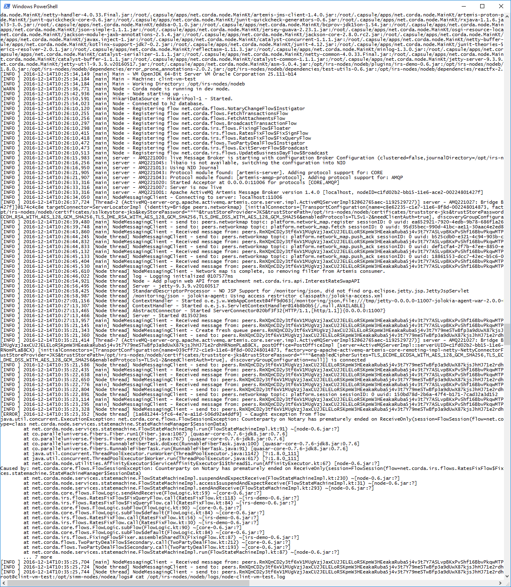
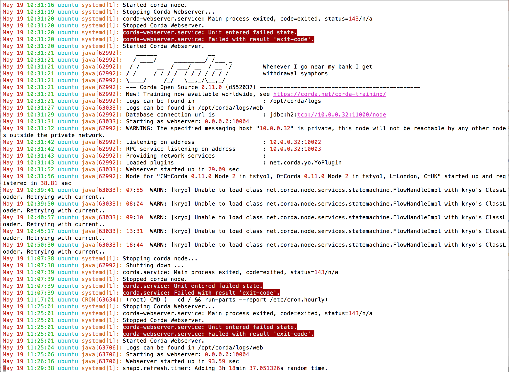

Building a Corda Network on Azure Marketplace
=============================================

To help you design, build and test applications on Corda, called CorDapps, a Corda network can be deployed on the `Microsoft Azure Marketplace <https://azure.microsoft.com/en-gb/overview/what-is-azure>`_

This Corda network offering builds a pre-configured network of Corda nodes as Ubuntu virtual machines (VM). The network comprises of a Notary node and up to nine Corda nodes using a version of Corda of your choosing. The following guide will also show you how to load a simple Yo! CorDapp which demonstrates the basic principles of Corda. When you are ready to go further with developing on Corda and start making contributions to the project head over to the `Corda.net <https://www.corda.net/>`_.

Pre-requisites
--------------
* Ensure you have a registered Microsoft Azure account which can create virtual machines under your subscription(s) and you are logged on to the Azure portal (portal.azure.com)
* It is recommended you generate a private-public SSH key pair (see `here <https://www.digitalocean.com/community/tutorials/how-to-set-up-ssh-keys--2/>`__)

Deploying the Corda Network
---------------------------

Browse to portal.azure.com, login and search the Azure Marketplace for Corda and select 'Corda Single Ledger Network'.

Click the 'Create' button.

STEP 1: Basics

Define the basic parameters which will be used to pre-configure your Corda nodes.

* **Resource prefix**: Choose an appropriate descriptive name for your Corda nodes. This name will prefix the node hostnames
* **VM user name**: This is the user login name on the Ubuntu VMs. Leave it as azureuser or define your own
* **Authentication type**: Select 'SSH public key', then paste the contents of your SSH public key file (see pre-requisites, above) into the box. Alternatively select 'Password' to use a password of your choice to administer the VM
* **Restrict access by IP address**: Leave this as 'No' to allow access from any internet host, or provide an IP address or a range of IP addresses to limit access
* **Subscription**: Select which of your Azure subscriptions you want to use
* **Resource group**: Choose to 'Create new' and provide a useful name of your choice
* **Location**: Select the geographical location physically closest to you
 

Click 'OK'

STEP 2: Network Size and Performance

Define the number of Corda nodes in your network and the size of VM.

* **Number of Network Map nodes**: There can only be one Network Map node in this network. Leave as '1'
* **Number of Notary nodes**: There can only be one Notary node in this network. Leave as '1'
* **Number of participant nodes**: This is the number of Corda nodes in your network. At least 2 nodes in your network is recommended (so you can send transactions between them). You can specific 1 participant node and use the Notary node as a second node. There is an upper limit of 9
* **Storage performance**: Leave as 'Standard'
* **Virtual machine size**: The size of the VM is automatically adjusted to suit the number of participant nodes selected. It is recommended to use the suggested values

 
Click 'OK'

STEP 3: Corda Specific Options

Define the version of Corda you want on your nodes and the type of notary.

* **Corda version (as seen in Maven Central)**: Select the version of Corda you want your nodes to use from the drop down list. The version numbers can be seen in `Maven Central <http://repo1.maven.org/maven2/net/corda/corda/>`_, for example 0.11.0
* **Notary type**: Select either 'Non Validating' (notary only checks whether a state has been previously used and marked as historic) or 'Validating' (notary performs transaction verification by seeing input and output states, attachments and other transaction information). More information on notaries can be found `here <https://vimeo.com/album/4555732/video/214138458>`_

Click 'OK'

STEP 4: Summary

A summary of your selections is shown.

Click 'OK' for your selection to be validated. If everything is ok you will see the message 'Validation passed'

Click 'OK'

STEP 5: Buy

Review the Azure Terms of Use and Privacy Policy and click 'Purchase' to buy the Azure VMs which will host your Corda nodes.

The deployment process will start and typically takes 8-10 minutes to complete.

Once deployed click 'Resources Groups', select the resource group you defined in Step 1 above and click 'Overview' to see the virtual machine details. The names of your VMs will be pre-fixed with the resource prefix value you defined in Step 1 above.

The Newtork Map Service node is suffixed nm0. The Notary node is suffixed not0. Your Corda participant nodes are suffixed node0, node1, node2 etc. Note down the **Public IP address** for your Corda nodes. You will need these to connect to UI screens via your web browser:

Using the Yo! CorDapp
---------------------
Loading the Yo! CordDapp on your Corda nodes lets you send simple Yo! messages to other Corda nodes on the network. A Yo! message is a very simple transaction. The Yo! CorDapp demonstrates:

- how transactions are only sent between Corda nodes which they are intended for and are not shared across the entire network by using the network map
- uses a pre-defined flow to orchestrate the ledger update automatically
- the contract imposes rules on the ledger updates

* **Loading the Yo! CorDapp onto your nodes**

The nodes you will use to send and receive Yo messages require the Yo! CorDapp jar file to be saved to their cordapps directory.

Connect to one of your Corda nodes (make sure this is not the Notary node) using an SSH client of your choice (e.g. Putty) and log into the virtual machine using the public IP address and your SSH key or username / password combination you defined in Step 1 of the Azure build process. Type the following command:

For Corda nodes running release M10

.. sourcecode:: shell

	cd /opt/corda/cordapps
	wget http://downloads.corda.net/cordapps/net/corda/yo/0.10.1/yo-0.10.1.jar

For Corda nodes running release M11

.. sourcecode:: shell

	cd /opt/corda/cordapps
	wget http://downloads.corda.net/cordapps/net/corda/yo/0.11.0/yo-0.11.0.jar

Now restart Corda and the Corda webserver using the following commands or restart your Corda VM from the Azure portal:

.. sourcecode:: shell

	sudo systemctl restart corda
	sudo systemctl restart corda-webserver

Repeat these steps on other Corda nodes on your network which you want to send or receive Yo messages.

* **Verify the Yo! CorDapp is running**

Open a browser tab and browse to the following URL:

.. sourcecode:: shell

	http://(public IP address):(port)/web/yo

where (public IP address) is the public IP address of one of your Corda nodes on the Azure Corda network and (port) is the web server port number for your Corda node, 10004 by default

You will now see the Yo! CordDapp web interface:

* **Sending a Yo message via the web interface**

In the browser window type the following URL to send a Yo message to a target node on your Corda network:

.. sourcecode:: shell

	http://(public IP address):(port)/api/yo/yo?target=(legalname of target node)

where (public IP address) is the public IP address of one of your Corda nodes on the Azure Corda network and (port) is the web server port number for your Corda node, 10004 by default and (legalname of target node) is the Legal Name for the target node as defined in the node.conf file, for example:

.. sourcecode:: shell

	http://40.69.40.42:10004/api/yo/yo?target=Corda 0.10.1 Node 1 in tstyo2

An easy way to see the Legal Names of Corda nodes on the network is to use the peers screen:

.. sourcecode:: shell

	http://(public IP address):(port)/api/yo/peers

* **Viewing Yo messages**

To see Yo! messages sent to a particular node open a browser window and browse to the following URL:

.. sourcecode:: shell

	http://(public IP address):(port)/api/yo/yos
	

Viewing logs
------------
Users may wish to view the raw logs generated by each node, which contain more information about the operations performed by each node.

You can access these using an SSH client of your choice (e.g. Putty) and logging into the virtual machine using the public IP address.
Once logged in, navigate to the following directory for Corda logs (node-xxxxxx):

.. sourcecode:: shell

	/opt/corda/logs

And navigate to the following directory for system logs (syslog):

.. sourcecode:: shell

	/var/log

You can open log files with any text editor.

Next Steps
----------
Now you have built a Corda network and used a basic Corda CorDapp do go and visit the `dedicated Corda website <https://www.corda.net>`_

Or to join the growing Corda community and get straight into the Corda open source codebase, head over to the `Github Corda repo <https://www.github.com/corda>`_
