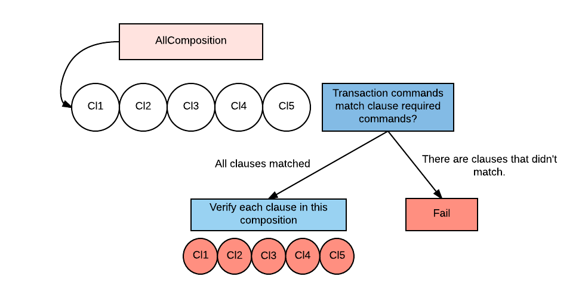
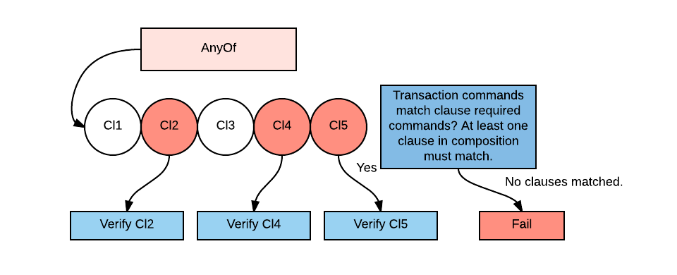
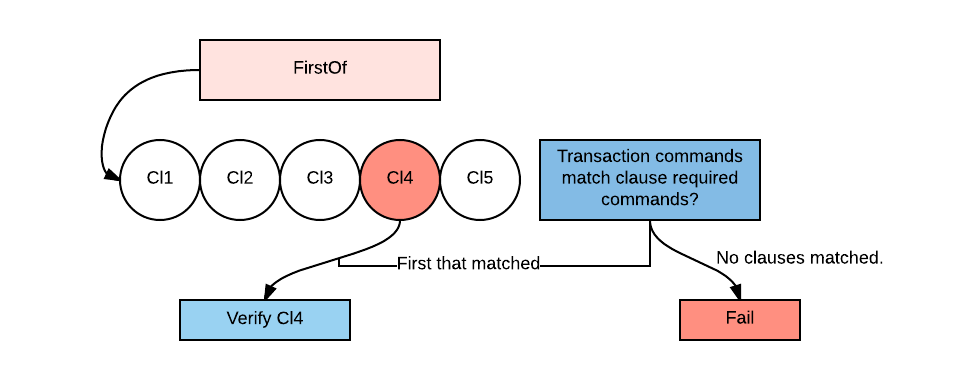

Clauses
=======

Basic clause structure
----------------------

A clause is a small building block for assembling contract verification logic, reusable and ready to test in separation.
To see clauses in action go to: :doc:`tutorial-contract-clauses`.
Let's take a look at a simplified structure of the ``Clause`` class:

.. container:: codeset

   .. sourcecode:: kotlin

        abstract class Clause<in S : ContractState, C : CommandData, in K : Any> {

            /** Determine whether this clause runs or not */
            open val requiredCommands: Set<Class<out CommandData>> = emptySet()

            @Throws(IllegalStateException::class)
            abstract fun verify(tx: LedgerTransaction,
                        inputs: List<S>,
                        outputs: List<S>,
                        commands: List<CommandWithParties<C>>,
                        groupingKey: K?): Set<C>
            ...
        }

Basic clause structure contains two important components: ``requiredCommands`` and ``verify`` function.
A clause is triggered when all ``requiredCommands`` are present in transaction's command set (opposite inclusion doesn't have to hold).
Then the ``verify`` function is run, which checks if transaction meets conditions specified by this clause. Verification
is no different than normal contract verification but using clauses it's split into smaller generic code blocks with single verify method.

When writing a contract you need to override the contract's ``verify`` function which should call ``verifyClause``. See: :ref:`verify_ref`.

.. note:: A clause ``verify`` function returns the set of processed commands, at the end of ``verifyClause`` execution
    there is a check if all of transaction's commands were matched. If not, then an exception is raised. This is done to
    enforce that spurious commands cannot be included in a transaction, ensuring that the transaction is as clear as
    possible. As an example imagine a transaction with two commands: ``Move`` and ``Issue`` included, with verification written
    using ``FirstOf`` on clauses that require single command set. Thus only one of transaction's commands will match
    leaving the second unprocessed. It should raise an error - we want to ensure that commands set is minimal to simplify
    analysis of intent of a transaction.

An example ``verify`` from ``Obligation`` contract:

.. container:: codeset

   .. sourcecode:: kotlin

        override fun verify(tx: LedgerTransaction) = verifyClause<Commands>(tx, FirstOf<ContractState, Commands, Unit>(
            Clauses.Net<Commands, P>(),
            Clauses.Group
()
        ), tx.commands.select<Obligation.Commands>())

It takes transaction to be verified, and passes it along with a top-level clause and commands to the ``verifyClause``
function. As you can see above we have used ``FirstOf`` which is a special type of clause, which extends the
``CompositeClause`` abstract class (in that particular case, it ensures that either ``Net`` or ``Group`` will run - for explanation see `FirstOf`_).
It's a type of clause that adds support for encapsulating multiple clauses and defines common behaviour for that composition.
There is also a ``GroupClauseVerifier`` special clause, which specifies how to group transaction input/output states
together and passes them to adequate clause for further processing.

Composition clauses
-------------------

One of the most important concepts of clauses - composition clauses which extend ``CompositeClause`` abstract class,
providing a range of ways of assembling clauses together. They define a logic of verification execution specifying which clauses
will be run.

AllOf
~~~~~

**Description**

Composes a number of clauses, such that all of the clauses must run for verification to pass.

Short description:

- ``AllOf`` holds clauses *Cl1,..,Cl5*.
- Check if all clauses that compose ``AllOf`` have associated commands in a command set - if not, verification fails.
- After successful check runs verification logic specific for every clause *Cl1,..,Cl5* from that composition.

**Usage**

See code in `GroupClauseVerifier`_.

AnyOf
~~~~~

**Description**

Composes a number of clauses, such that 1 or more of the clauses can be run.

Short description:

- Checks if one or more clauses that compose AnyOf have associated commands in a command set.
- After success runs verification logic specific for every *matched* (in this case *Cl2, Cl4, Cl5*) clause from composition.

**Usage**

Example from ``CommercialPaper.kt``:

.. container:: codeset

    .. sourcecode:: kotlin

        class Group : GroupClauseVerifier<State, Commands, Issued<Terms>>(
            AnyOf(
                Redeem(),
                Move(),
                Issue())) {
            override fun groupStates(tx: LedgerTransaction): List<LedgerTransaction.InOutGroup<State, Issued<Terms>>>
                    = tx.groupStates<State, Issued<Terms>> { it.token }
        }

FirstOf
~~~~~~~

**Description**

Composes a number of clauses, such that the first match is run, and it errors if none is run.

Short description:

- Takes first clause that matches and if none found throws an exception.
- If successful runs verification on the clause that matched (in this case *Cl4*).

**Usage**

See code in `GroupClauseVerifier`_.

Other types of clauses
----------------------

There are certain types of clauses that are specialized in particular types of contracts (like ``AbstractIssue``) or generally
should be used as helpers in building parts of logic (the most important one is ``GroupClauseVerifier``).

GroupClauseVerifier
~~~~~~~~~~~~~~~~~~~

**Description**

Groups input and output states according to ``groupStates`` function. Runs the top-level clause verification on each
group in turn.

.. image:: resources/groupClauseVerifyChart.png

Short description:

``GroupClauseVerifier`` wraps clause *Cl1*. After grouping relevant states together with ``groupStates`` into three groups
*Gr1, Gr2, Gr3* runs *Cl1.verify(Gr1), Cl1.verify(Gr2), Cl1.verify(Gr3)*.

For more detailed example head to :ref:`state_ref`.

**Usage**

You need to extend ``GroupClauseVerifier`` clause and define ``groupStates`` function which takes transaction and returns
grouped input and output states with a grouping key used for each group. Example from ``Obligation.kt`` contract:

.. container:: codeset

   .. sourcecode:: kotlin

        class Group
 : GroupClauseVerifier<State
, Commands, Issued<Terms
>>(
            AllOf(
                NoZeroSizedOutputs<State
, Commands, Terms
>(),
                FirstOf(
                    SetLifecycle
(),
                    AllOf(
                        VerifyLifecycle<State
, Commands, Issued<Terms
>, P>(),
                        FirstOf(
                            Settle
(),
                            Issue(),
                            ConserveAmount()
                        )
                    )
                )
            )
        ) {
            override fun groupStates(tx: LedgerTransaction): List<LedgerTransaction.InOutGroup<Obligation.State
, Issued<Terms
>>>
                    = tx.groupStates<Obligation.State
, Issued<Terms
>> { it.amount.token }
        }

Usually it's convenient to use ``groupStates`` function defined on ``LedgerTransaction`` class. Which given a type and a
selector function, that returns a grouping key, associates inputs and outputs together so that they can be processed as one.
The grouping key is any arbitrary object that can act as a map key (so must implement equals and hashCode).

AbstractConserveAmount
~~~~~~~~~~~~~~~~~~~~~~

**Description**

Standardised clause for checking input/output balances of fungible assets. Requires that a
Move command is provided, and errors if absent. Conserve amount clause can only be used on grouped states.

**Usage**

.. container:: codeset

    .. sourcecode:: kotlin

            /**
             * Generic move/exit clause for fungible assets
             */
            class ConserveAmount
 : AbstractConserveAmount<State
, Commands, Terms
>()

See code in `GroupClauseVerifier`_.

AbstractIssue
~~~~~~~~~~~~~

**Description**

Standard issue clause for contracts that issue fungible assets.

**Usage**

Example from ``CommercialPaper.kt``:

.. container:: codeset

    .. sourcecode:: kotlin

        class Issue : AbstractIssue<State, Commands, Terms>(
                { map { Amount(it.faceValue.quantity, it.token) }.sumOrThrow() },
                { token -> map { Amount(it.faceValue.quantity, it.token) }.sumOrZero(token) }) {
            override val requiredCommands: Set<Class<out CommandData>> = setOf(Commands.Issue::class.java)

            override fun verify(tx: LedgerTransaction,
                                inputs: List<State>,
                                outputs: List<State>,
                                commands: List<CommandWithParties<Commands>>,
                                groupingKey: Issued<Terms>?): Set<Commands> {
                val consumedCommands = super.verify(tx, inputs, outputs, commands, groupingKey)
                ...

First function in constructor converts a list of states into an amount of the token. Must error if there are no states in the list.
Second function converts a list of states into an amount of the token, and returns zero if there are no states in the list.
Takes in an instance of the token definition for constructing the zero amount if needed.

NoZeroSizedOutputs
~~~~~~~~~~~~~~~~~~

**Description**

Clause for fungible asset contracts, which enforces that no output state should have a balance of zero.

**Usage**

See code in `GroupClauseVerifier`_.

FilterOn
~~~~~~~~

**Description**

Filter the states that are passed through to the wrapped clause, to restrict them to a specific type.

``FilterOn`` narrows the scope of the states being verified.
Let's take a transaction with multiple cash states of different currencies, we want to run a clause that focuses
on only GBP cash states rather than all cash states.

**Usage**

.. container:: codeset

    .. sourcecode:: kotlin

                FilterOn(clause, { states -> states.filter { it.amount.token == GBP} })

Takes ``filterStates`` function that limits states passed to ``clause`` verification.
