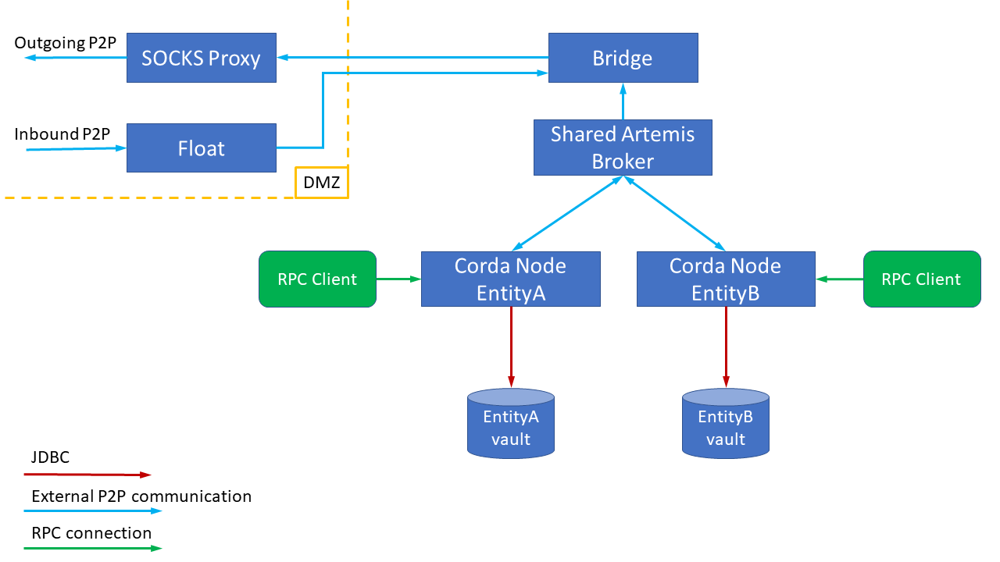
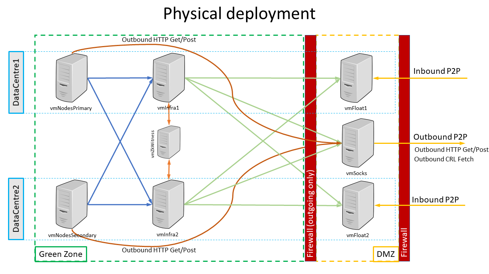
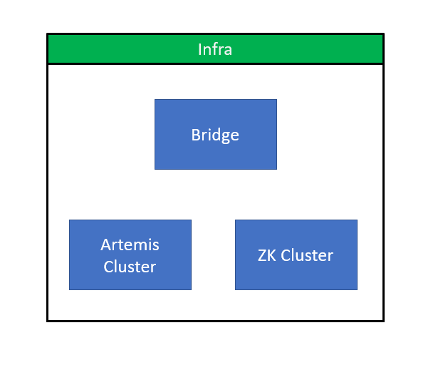

Firewall Configuration
**********************

.. contents::

File location
=============
When starting a standalone firewall (in bridge, or float mode), the ``corda-firewall.jar`` file defaults to reading the firewall's configuration from a ``firewall.conf`` file in
the directory from which the command to launch the process is executed. The syntax is:


.. code:: bash

    corda-firewall [-hvV] [--install-shell-extensions]
                   [--logging-level=<loggingLevel>] [-b=<baseDirectory>]
                   [-f=<_configFile>]

Where:

* ``--config-file``, ``-f``: Allows you to specify a configuration file with a different name, or at
  a different file location. Paths are relative to the current working directory
* ``--base-directory``, ``-b``: Allows you to specify the firewall's workspace location. A ``firewall.conf``
  configuration file is then expected in the root of this workspace
* ``--verbose``, ``--log-to-console``, ``-v``: If set, prints logging to the console as well as to a file.
* ``--logging-level=<loggingLevel>``: Enable logging at this level and higher. Possible values: ERROR, WARN, INFO, DEBUG, TRACE. Default: INFO.
* ``--install-shell-extensions``: Install ``corda-firewall`` alias and auto completion for bash and zsh. See :doc:`cli-application-shell-extensions` for more info.
* ``--help``, ``-h``: Show this help message and exit.
* ``--version``, ``-V``: Print version information and exit.

Format
======
The firewall configuration file uses the HOCON format which is superset of JSON. Please visit
`<https://github.com/typesafehub/config/blob/master/HOCON.md>`_ for further details.

.. warning::  Please do NOT use double quotes (``"``) in configuration keys.

              Bridge setup will log `Config files should not contain \" in property names. Please fix: [key]` as error
              when it founds double quotes around keys.
              This prevents configuration errors when mixing keys containing ``.`` wrapped with double quotes and without them

Defaults
========
A set of default configuration options are loaded from the built-in resource file. Any options you do not specify in
your own ``firewall.conf`` file will use these defaults:

.. literalinclude:: ../../bridge/src/main/resources/firewalldefault_latest.conf
    :language: javascript
   
Firewall operating modes
========================
.. note:: By default, the Corda node assumes that it will carry out the peer-to-peer functions of the ``bridge`` internally!
          Before running a dedicated firewall process, it is essential to turn off the dev mode component by setting the
          ``enterpriseConfiguration.externalBridge`` property of the ``node.conf`` file to ``true``.
          If the ``externalBridge`` flag is not ``true``, there will be unexpected behaviour as the node will try to send peer-to-peer messages directly!

Assuming that an external firewall is to be used, the ``corda-firewall.jar`` operates in one of three basic operating modes.
The particular mode is selected via the required ``firewallMode`` configuration property inside ``firewall.conf``:

:SenderReceiver: selects a single process firewall solution to isolate the node and Artemis broker from direct Internet contact.
  It is still assumed that the firewall process is behind a firewall, but both the message sending and receiving paths will pass via the ``bridge``.
  In this mode the ``outboundConfig`` and ``inboundConfig`` configuration sections of ``firewall.conf`` must be provided,
  the ``bridgeInnerConfig`` and ``floatOuterConfig`` sections should not be present.

:BridgeInner: mode runs this instance of the ``corda-firewall.jar`` as the trusted portion of the peer-to-peer firewall float.
  Specifically, this process runs the complete outbound message processing. For the inbound path it operates only the filtering and durable storing portions of the message processing.
  The process expects to connect through a firewall to a matched ``FloatOuter`` instance running in the DMZ as the actual ``TLS 1.2/AMQP 1.0`` termination point.

:FloatOuter: causes this instance of the ``corda-firewall.jar`` to run as a protocol break proxy for inbound message path. The process
  will initialise a ``TLS`` control port and await connection from the ``BridgeInner``. Once the control connection is successful the ``BridgeInner`` will securely provision
  the ``TLS`` socket server key and certificates into the ``FloatOuter``. The process will then start listening for inbound connection from peer nodes.

Fields
======
The available config fields are listed below. ``baseDirectory`` is available as a substitution value and contains the
absolute path to the firewall's base directory.

:certificatesDirectory: An optional parameter which specifies directory from which SSL keys and Trust store keys will be loaded from. If missing the value is defaulted to ``baseDirectory/certificates``.

:sslKeystore: An optional parameter which specifies the file from which SSL keys stores will be loaded from. If missing the value is defaulted to ``<certificatesDirectory>/sslkeystore.jks``.

:trustStoreFile: An optional parameter which specifies the file from which Trust store keys will be loaded from. If missing the value is defaulted to ``<certificatesDirectory>/truststore.jks``.

:firewallMode: Determines operating mode of the firewall. See above.

:keyStorePassword: The password to unlock the TLS KeyStore file (``<workspace>/<certificatesDirectory>/sslkeystore.jks``) containing the
    node certificate and private key. The private key password must be the same due to limitations in the Artemis libraries.

    .. note:: This is the non-secret value for the development certificates automatically generated during the first node run.
        Longer term these keys will be managed in secure hardware devices.

:trustStorePassword: The password to unlock the Trust store file (``<workspace>/<certificatesDirectory>/truststore.jks``) containing
    the Corda network root certificate. This is the non-secret value for the development certificates automatically
    generated during the first node run.

    .. note:: Longer term these keys will be managed in secure hardware devices.


:networkParametersPath: This a mandatory parameter that only makes sense in case of ``SenderReceiver`` and ``BridgeInner`` modes.
   This is the absolute file path to a copy of the ``network-parameters`` as copied from a node after it has fetched the latest version from the network-map via http.
   It is used to correctly configure the maximum allowed message size. The maximum message size limit is already enforced by the P2P Artemis inside the ``node``,
   but the ``bridge`` also enforces this before forwarding messages to remote peers.
   ``Float`` learns about maximum message size from ``bridge`` and enforces this on received packets. If the size limit is breached these messages will be consumed and discarded, so that they are not replayed forever.

:outboundConfig:  This section is used to configure the processing of outbound messages. It is required for ``SenderReceiver`` and ``BridgeInner`` modes and must be absent for ``FloatOuter`` mode:

   :artemisBrokerAddress: The primary host and port for peer-to-peer Artemis broker. This may be running inside to the node, in which case it will hosted on the port of the ``p2pAddress``,
        or the ``messagingServerAddress`` if that is defined and ``messagingServerExternal`` is ``false``. Otherwise, it could be an independently run Artemis broker.

   :alternateArtemisBrokerAddresses: Optionally if there are multiple Artemis broker address e.g. for hot-cold node deployment, then additional hosts and ports may be included in a list.

   :artemisSSLConfiguration:  The default behaviour is that the outgoing ``TLS 1.2/AMQP 1.0`` connections present certificate details from (``<workspace>/<certificatesDirectory>/sslkeystore.jks``)
        and validate against (``<workspace>/<certificatesDirectory>/truststore.jks``), using the passwords defined in the root config. However, distinct KeyStores may be configured in this section:

        :keyStorePassword: The password for the TLS KeyStore.

        :keyStorePrivateKeyPassword: Optional parameter to lock the private keys within the KeyStore. If it is missing, it will be assumed that the private keys password is the same as
            ``keyStorePassword`` above.

        :trustStorePassword: The password for TLS TrustStore.

        :sslKeystore: The path to the KeyStore file to use in outgoing ``TLS 1.2/AMQP 1.0`` connections.

        :trustStoreFile: The path to the TrustStore file to use in outgoing ``TLS 1.2/AMQP 1.0`` connections.

.. _proxyConfig :

   :proxyConfig:  This section is optionally present if outgoing peer connections should go via a SOCKS4, SOCKS5, or HTTP CONNECT tunnelling proxy:

        :version: Either SOCKS4, SOCKS5, or HTTP to define the protocol version used in connecting to the SOCKS proxy.

        :proxyAddress: Host and port of the proxy.

        :userName: Optionally a user name that will be presented to the proxy after connect.

        :password: Optionally, a password to present to the SOCKS5 or HTTP Proxy. It is not valid for SOCKS4 proxies and it should always be combined with [userName].

        :proxyTimeoutMS: optionally, specify a timeout in msec if the proxy is unusually slow to initate connections. The default value used is 10000 msec.

:inboundConfig:  This section is used to configure the properties of the listening port. It is required for ``SenderReceiver`` and ``FloatOuter`` modes and must be absent for ``BridgeInner`` mode:

        :listeningAddress: The host and port to bind to as ``TLS 1.2/AMQP 1.0`` listener. This may be a specific network interface on multi-homed machines.
            It may also differ from the externally exposed public ``p2pAddress`` of the port if the firewalls, or load balancers transparently reroute the traffic.

:bridgeInnerConfig:  This section is required for ``BridgeInner`` mode and configures the tunnel connection to the ``FloatOuter`` (s) in the DMZ. The section should be absent in ``SenderReceiver`` and ``FloatOuter`` modes:

        :floatAddresses: The list of host and ports to connect the available ``FloatOuter`` instances. At least one must be present.
            The active ``BridgeInner`` will round-robin over available ``FloatOuter`` addresses until it can connect and activate one.

        :expectedCertificateSubject: The X500 Subject name that will be presented in client certificates from the remote ``FloatOuter`` instances.
        
        :tunnelSSLConfiguration:   .. note:: For ease of use the TLS default control tunnel connections present certificate details from (``<workspace>/<certificatesDirectory>/sslkeystore.jks``)
                                             and validate against (``<workspace>/<certificatesDirectory>/truststore.jks``), using the passwords defined in the root config.
                                             However, it is strongly recommended that distinct KeyStores should be configured in this section to use locally valid certificates only, so that compromise of the DMZ machines does not give access to the node's primary TLS keys.

            :keyStorePassword: The password for the TLS KeyStore.

            :keyStorePrivateKeyPassword: Optional parameter to lock the private keys within the KeyStore. If it is missing, it will be assumed that the private keys password is the same as
                ``keyStorePassword`` above.

            :trustStorePassword: The password for TLS TrustStore.

            :sslKeystore: The path to the KeyStore file to use in control tunnel connections.

            :trustStoreFile: The path to the TrustStore file to use in control tunnel connections.

:floatOuterConfig:   This section is required for ``FloatOuter`` mode and configures the control tunnel listening socket. It should be absent for ``SenderReceiver`` and ``BridgeInner`` modes:

        :floatAddress: The host and port to bind the control tunnel listener socket to. This can be for a specific interface if used on a multi-homed machine.

        :expectedCertificateSubject: The X500 Subject name that will be presented in client certificates from the ``BridgeInner`` when it connects to this ``FloatOuter`` instance.

        :tunnelSSLConfiguration:   .. note:: For ease of use the TLS default control tunnel connection presents certificate details from (``<workspace>/<certificatesDirectory>/sslkeystore.jks``)
                                             and validate against (``<workspace>/<certificatesDirectory>/truststore.jks``), using the passwords defined in the root config.
                                             However, it is strongly recommended that distinct KeyStores should be configured in this section to use locally valid certificates only, so that compromise of the DMZ machines does not give access to the node's primary TLS keys.

            :keyStorePassword: The password for the TLS KeyStore.

            :keyStorePrivateKeyPassword: Optional parameter to lock the private keys within the KeyStore. If it is missing, it will be assumed that the private keys password is the same as
                ``keyStorePassword`` above.

            :trustStorePassword: The password for TLS TrustStore.

            :sslKeystore: The path to the KeyStore file to use in control tunnel connections.

            :trustStoreFile: The path to the TrustStore file to use in control tunnel connections.
            
:haConfig: Optionally the ``SenderReceiver`` and ``BridgeInner`` modes can be run in a hot-warm configuration, which determines the active instance using an external master election service.
    Currently, the leader election process can be delegated to Zookeeper, or the firewall can use the ``Bully Algorithm`` (see `here <https://en.wikipedia.org/wiki/Bully_algorithm>`_) via Publish/Subscribe messages on the artemis broker.
    For production it is recommended that a Zookeeper cluster be used as this will protect against network partitioning scenarios. However, the ``Bully Algorithm`` mode does not require any additional server processes.
    Eventually other electors may be supported e.g. ``etcd``. This configuration section controls these options:

    :haConnectionString:  A string containing the connection details of the master electors as a comma delimited list of individual connection strings.

        * To use an external Zookeeper cluster each connection item should be in the format ``zk://<host>:<port>``.
        
        * To use the ``Bully Algorithm`` running over artemis the single connection string should be set to ``bully://localhost``.

    :haPriority: The implementation uses a prioritise leader election algorithm, so that a preferred master instance can be set. The highest priority is 0 and larger integers have lower priority.
        At the same level of priority, it is random which instance wins the leader election. If a ``bridge`` instance dies another will have the opportunity to become master in instead.

    :haTopic: Sets the zookeeper/artemis topic that the nodes used in resolving the election and must be the same for all ``bridge``
        instances competing for master status. This is available to allow a single zookeeper/artemis cluster to be reused with multiple
        sets of ``bridges`` (e.g. in test environments).
        The default value is ``bridge/ha`` and would not normally need to be changed if the cluster is not shared.

:auditServiceConfiguration: Both ``FloatOuter`` and ``BridgeInner`` components have an audit service which is currently outputting into the process log some traffic statistics.

    :loggingIntervalSec: This is an integer value which controls how frequently, in seconds, statistics will be written into the logs.

:artemisReconnectionIntervalMin: If connection to the local Artemis server fails the initial reconnection attempt will be
    after [artemisReconnectionIntervalMin] ms. The default interval is 5000 ms.
    Subsequent retries will take be exponentially backed off until they reach [artemisReconnectionIntervalMax] ms.

:artemisReconnectionIntervalMax: The worst case Artemis retry period after repeated failure to connect is [artemisReconnectionIntervalMax] ms. The default interval is 60000 ms.

:p2pConfirmationWindowSize: This is a performance tuning detail within the Artemis connection setup, which controls the send acknowledgement behaviour.
    Its value should only be modified from the default if suggested by R3 to resolve issues.

:enableAMQPPacketTrace: Set this developer flag to true if very detailed logs are required for connectivity debugging. Note that the logging volume is substantial, so do not enable in production systems.

:healthCheckPhrase: An optional Health Check Phrase which if passed through the channel will cause AMQP Server to echo it back instead of doing normal pipeline processing.
    This parameter can be used to facilitate F5 "TCP Echo" health-check monitor. Only when TCP posting starting with ``healthCheckPhrase`` in UTF-8 encoding is sent to application port the server will echo the same pass phrase back.

:silencedIPs: An optional list of strings of that will be compared to the remote IPv4/IPv6 source address of inbound socket connections.
    If there is a match all logging for this connection will be reduced to TRACE level. The intention is to allow simple filtering of health check connections from load balancers and other monitoring components.

:custom.jvmArgs: Allows a list of jvm argument overrides to be sent to the Corda firewall process spawned by the capsule wrapper.
    For instance ```custom.jvmArgs = ["-Xmx2G"]`` in the configuration file will set 2GByte of memory for the firewall.
    This is equivalent to specifying ``-Dcapsule.jvm.args="-Xmx2G"`` on the command line, but is easier to track with other configuration and does not risk
    accidentally setting the properties onto the capsule parent process (e.g. wasting 2Gbyte of memory).
    See :ref:`setting_jvm_args` for examples and details on the precedence of the different approaches to settings arguments.

.. _revocationConfig :

:revocationConfig: Controls the way Certificate Revocation Lists (CRL) are handled for TLS connections.

    :mode: Either ``SOFT_FAIL`` or ``HARD_FAIL`` or ``OFF`` or ``EXTERNAL_SOURCE``

        ``SOFT_FAIL`` : Causes CRL checking to use soft fail mode. Soft fail mode allows the revocation check to succeed if the revocation status cannot be determined because of a network error.

        ``HARD_FAIL`` :  Rigorous CRL checking takes place. This involves each certificate in the certificate path being checked for a CRL distribution point extension, and that this extension points to a URL serving a valid CRL.
            This means that if any CRL URL in the certificate path is inaccessible, the connection with the other party will fail and be marked as bad.
            Additionally, if any certificate in the hierarchy, including the self-generated node SSL certificate, is missing a valid CRL URL, then the certificate path will be marked as invalid.

        ``OFF`` : do not perform CRL check.

        ``EXTERNAL_SOURCE`` : only makes sense for Float component i.e. with ``firewallMode = FloatOuter``. When ``mode = EXTERNAL_SOURCE`` is specified, Float component will fetch CRLs using tunnel connection it maintains with Bridge. This allows Float to correctly obtain CRLs without
            initiating direct outgoing connections to the Delivery Points specified in TLS certificates.

.. _p2pTlsSigningCryptoServiceConfig :

:p2pTlsSigningCryptoServiceConfig: This is an optional crypto service configuration which will be used for HSM TLS signing when incoming P2P connection by external party attempted into
    Float. Please see: :ref:`corda-firewall-component:Use of HSM in Corda Firewall` for the overview.
    Since Float is by design a lightweight component which does not store any sensitive information locally, when it comes to TLS signing, Float will talk to the Bridge for TLS signing to take place.
    Therefore, this option only makes sense for ``BridgeInner`` and ``SenderReceiver`` modes.

    :name: The name of HSM provider to be used. E.g.: ``UTIMACO``, ``GEMALTO_LUNA``, etc. Please see: :doc:`Crypto service configuration <cryptoservice-configuration>`.

    :conf: Absolute path to HSM provider specific configuration which will contain everything necessary to establish connection with HSM.

:artemisCryptoServiceConfig: This is an optional crypto service configuration which will be used for HSM TLS signing when interacting with Artemis message bus.
    This option only makes sense for ``SenderReceiver`` and ``BridgeInner`` modes. In terms of structure it is very similar to `p2pTlsSigningCryptoServiceConfig`_ above.
    If this option is missing, local file system will be used to store private keys inside ``JKS`` key stores.

:tunnelingCryptoServiceConfig: This is an optional crypto service configuration which will be used for HSM TLS signing during communication between Bridge and Float.
    This option only makes sense for ``BridgeInner`` and ``FloatOuter``. In terms of structure it is very similar to `p2pTlsSigningCryptoServiceConfig`_ above.
    If this option is missing, local file system will be used to store private keys inside ``JKS`` key stores.

Complete example
================
As an example to show all features, the following is a walk-through of the configuration steps to set-up a pair of HA hot-cold nodes for two separate legal identities,
connected to by a HA hot-warm set of ``BridgeInner`` and ``FloatOuter`` that use some simple certificates to secure the
control tunnel and a SOCKS5 proxy for outgoing connectivity (see diagram).
This is also the recommended full enterprise deployment pattern, although there are plenty of alternative deployment options.

Conceptually deployment will be done as follows:



In this example it is assumed that a large organisation is running two nodes that represent two distinct legal entities. Each node/entity has its own set of CorDapps installed
and its own transaction storage (vault). These two nodes are running within a Green/Trusted Zone and can be interacted with via RPC calls from clients (either standalone or embedded in other applications).
In order to be able to communicate outside of the organisation, special provisions are made in the form of Bridge, Float and SOCKS Proxy.

The following diagram illustrates physical deployment of the example setup discussed above:



.. note:: The arrows on the diagram show in which direction connection is initiated. The actual data exchange may then be happening in both directions.


In this example it is assumed that the Corda nodes are deployed on ``vmNodesPrimary`` and ``vmNodesSecondary`` using Azure SQL Server as clustered storage.

The Float instances run on ``vmFloat1`` and ``vmFloat2`` which are located in the DMZ.

The SOCKS5 proxy is running on ``vmSocks`` which also resides in the DMZ.

Each of the ``vmInfra1`` and ``vmInfra2`` computers host: ZooKeeper cluster participant, Bridge instance and Artemis cluster participant:



To facilitate High Availability requirement deployment is split onto two data centers.

.. note:: This document does not describe how to perform SOCKS5 setup. It is assumed that this type of proxy is correctly configured as part
    of organisation's IT infrastructure according to best practices/policies for outbound Internet connectivity. Other types of proxies are also supported
    as well as no proxy at all. For more information please see `proxyConfig`_ parameter above.


.. _firewall_keystore_generation_ref:

Keystores generation
--------------------

A special tool was created to simplify generation of the keystores. For more information please see :doc:`HA Utilities <ha-utilities>`.
This section explains how to generate a number of internally used keystores. Commands below can be executed on any machine as long as it will
be easy enough to copy results to the other machines including DMZ hosts.

It is also advisable to create an application user account (say ``corda``) and use it instead of using own personal user.

.. _Capsule Cache Directory:

.. note:: All the ``java -jar ...`` commands below run so-called Fat Capsule Jar. This process involves up-packing content of the Fat Jar into temporary location.
    By default it is set to ``~/.capsule/apps/<APPLICATION_NAME>``. Application user setup may prevent creating directories and files at this location. To provide an
    alternative, environment variable ``CAPSULE_CACHE_DIR`` can be used.

    Capsule unpacks content of the Fat Jar only once and subsequent runs perform faster than initial one. However, in order to perform a clean run, it is advised to delete Capsule cache directory.

Tunnel keystore generation
^^^^^^^^^^^^^^^^^^^^^^^^^^

For Float and Bridge to communicate a tunnel keystore has to be created as follows:

.. |ha_util_jar_name| replace:: corda-tools-ha-utilities-|version|.jar

.. parsed-literal::

    java -jar |ha_util_jar_name| generate-internal-tunnel-ssl-keystores -p tunnelStorePass -e tunnelPrivateKeyPassword -t tunnelTrustpass

This should produce files: ``tunnel/float.jks``, ``tunnel/tunnel-truststore.jks`` and ``tunnel/bridge.jks`` which will be used later on.

Artemis keystore generation
^^^^^^^^^^^^^^^^^^^^^^^^^^^

Bridge communicates to Artemis which requires a separate keystore.

Due to Artemis limitations the password for the keystore should be the same as the password for the private keys in the store. The tool below caters for these
arrangements. Artemis trust password can and should be different.

The tool should be used as follows:

.. parsed-literal::

    java -jar |ha_util_jar_name| generate-internal-artemis-ssl-keystores -p artemisStorePass -t artemisTrustpass

This should produce files: ``artemis/artemis-truststore.jks``, ``artemis/artemis.jks`` which will be used later on.

Node VMs setup
--------------

As shown on the Physical deployment diagram above there will be two separate machines in two distinct data centres hosting Corda Nodes for Legal Entity A and Legal Entity B.
For this setup, each machine is powerful enough to host nodes for both entities with all the CorDapps and two datacentres are used for High Availability purposes.

Prerequisites
^^^^^^^^^^^^^

Corda Network connectivity
""""""""""""""""""""""""""

Before nodes can be configured, Corda Network administrator will need to provide:

1. Network root trust store file: ``network-root-truststore.jks`` and password for it in this example assumed to be ``trustpass``;
2. Corda Network URL for Doorman e.g.: ``http://r3-doorman:10001``;
3. Corda Network URL for NetworkMap e.g.: ``http://r3-netman:10001``

Nodes inbound connectivity provisions
"""""""""""""""""""""""""""""""""""""

In order for the nodes for both legal entities ``Entity A`` and ``Entity B`` to be reached from the outside of the organisation by other nodes, a **single** TCP endpoint
address is being exposed.

.. note::

    This is not a HTTP address! This endpoint address is what is known to be peer-to-peer (P2P) connectivity address for binary, non-human readable inbound data communication.
    Therefore, there is little point pasting this address into any web-browser.

In this example this address will be ``banka.com:10005``.

From infrastructure point of view this can be address of a load balancer which will be routing network traffic to ``vmFloat1`` and ``vmFloat2`` hosts in the DMZ.

Out of ``vmFloat1`` and ``vmFloat2`` there will be at most one active host which will be accepting incoming communication. Therefore, load balancer will route inbound traffic to ``vmFloat1`` or ``vmFloat2``.

Databases setup
"""""""""""""""

Each legal entity is supposed to have it is own database(DB) schema in order to store Corda transaction data. Therefore ``Entity A`` and ``Entity B``
should have different DB connectivity URLs.

For nodes' High Availability(HA) functionality to work properly, databases the nodes connect to should be remote databases with transactional guarantees.
Please see :doc:`Hot-cold high availability deployment <hot-cold-deployment>`. I.e. HA nodes cannot be using local H2 database.

In the example below we will be using Azure SQL DB, however it can be any database Corda Enterprise supports.

Two empty schemas should be created for ``Entity A`` and ``Entity B`` and upon first startup of the node the necessary tables will be created automatically.

Base directory setup
""""""""""""""""""""

Initially, the nodes configuration is performed on ``vmNodesPrimary`` host and then there is a special paragraph that details ``vmNodesSecondary`` setup.

Files ``artemis/artemis.jks`` and ``artemis/artemis-truststore.jks`` should be copied from `Artemis keystore generation`_ stage.

Corda FAT Jar ``corda.jar`` from Corda Enterprise distribution should also be copied into base directory.

Any CorDapps the node is meant to be working with should be installed into ``cordapps`` directory.

Creating node configuration files
^^^^^^^^^^^^^^^^^^^^^^^^^^^^^^^^^

Since there will be two distinct nodes serving two different legal entities they are meant to have two difference X.500 names, please see
``myLegalName`` field in the config files below.

Also these two separate node may have different passwords to protected their keystore (``keyStorePassword``) and their trust store (``trustStorePassword``).

Suggested configuration for node serving ``Entity A`` on ``vmNodesPrimary`` would be a ``entityA/node.conf`` files containing:

..  code-block:: javascript

    myLegalName = "O=Entity A,L=London,C=GB"
    p2pAddress = "banka.com:10005" // Host and port exposed by Internet facing firewall/load balancer in front of float servers in DMZ.
    messagingServerAddress = "vmInfra1:11005" // Specifying endpoints of remote Artemis instances, Note: SWAP1
    messagingServerExternal = true // Specifying that it is an external instance
    // Public keystore settings
    keyStorePassword = "entityAStorePass"
    trustStorePassword = "entityATrustPass"
    // RPC settings
    rpcSettings {
        address = "0.0.0.0:10006"
        adminAddress = "0.0.0.0:10026"
    }
    dataSourceProperties { // Point at clustered Azure SQL Server
        dataSourceClassName = "com.microsoft.sqlserver.jdbc.SQLServerDataSource"
        dataSource.url = "jdbc:sqlserver://entityAdb.database.windows.net:1433;databaseName=corda;encrypt=true;trustServerCertificate=false;hostNameInCertificate=*.database.windows.net;loginTimeout=30"
        dataSource.user = Corda
        dataSource.password = password
    }
    database {
        transactionIsolationLevel = READ_COMMITTED
        runMigration = false
        schema = dbo
    }
    security {
        authService {
            dataSource {
                type = INMEMORY
                users = [
                    {
                        password = password
                        permissions = [
                            ALL
                        ]
                        username=user
                    }
                ]
            }
        }
    }
    useTestClock = false
    enterpriseConfiguration = {
        externalBridge = true // Ensure node doesn't run P2P AMQP bridge, instead delegate to the BridgeInner.
        messagingServerConnectionConfiguration = "CONTINUOUS_RETRY"
        messagingServerBackupAddresses = ["vmInfra2:11005"] // See "messagingServerAddress" above, Note: SWAP1
        mutualExclusionConfiguration = { // Enable the protective heartbeat logic so that only one node instance is ever running.
            on = true
            updateInterval = 20000
            waitInterval = 40000
        }
        messagingServerSslConfiguration = {
		    sslKeystore = artemis/artemis.jks
		    keyStorePassword = artemisStorePass
		    trustStoreFile = artemis/artemis-truststore.jks
		    trustStorePassword = artemisTrustpass
        }
    }
    networkServices {
        doormanURL = "http://r3-doorman:10001"
        networkMapURL = "http://r3-netman:10001"
    }
    devMode = false // Turn off things like key autogeneration and require proper doorman registration.
    detectPublicIp = false // Do not perform any public IP lookup on the host.
    sshd {
        port = 2222
    }

For "sibling" node serving ``Entity B`` on ``vmNodesPrimary`` would be a ``entityB/node.conf`` file containing:

..  code-block:: javascript

    myLegalName = "O=Entity B,L=London,C=GB"
    p2pAddress = "banka.com:10005" // Host and port exposed by Internet facing firewall/load balancer in front of float servers in DMZ.
    messagingServerAddress = "vmInfra1:11005" // Specifying endpoints of remote Artemis instances, Note: SWAP1
    messagingServerExternal = true // Specifying that it is an external instance
    // Public keystore settings
    keyStorePassword = "entityBStorePass"
    trustStorePassword = "entityBTrustPass"
    // RPC settings
    rpcSettings {
        address = "0.0.0.0:10106"
        adminAddress = "0.0.0.0:10126"
    }
    dataSourceProperties { // Point at clustered Azure SQL Server
        dataSourceClassName = "com.microsoft.sqlserver.jdbc.SQLServerDataSource"
        dataSource.url = "jdbc:sqlserver://entityAdb.database.windows.net:1433;databaseName=corda;encrypt=true;trustServerCertificate=false;hostNameInCertificate=*.database.windows.net;loginTimeout=30"
        dataSource.user = Corda
        dataSource.password = password
    }
    database {
        transactionIsolationLevel = READ_COMMITTED
        runMigration = false
        schema = dbo
    }
    security {
        authService {
            dataSource {
                type = INMEMORY
                users = [
                    {
                        password = password
                        permissions = [
                            ALL
                        ]
                        username=user
                    }
                ]
            }
        }
    }
    useTestClock = false
    enterpriseConfiguration = {
        externalBridge = true // Ensure node doesn't run P2P AMQP bridge, instead delegate to the BridgeInner.
        messagingServerConnectionConfiguration = "CONTINUOUS_RETRY"
        messagingServerBackupAddresses = ["vmInfra2:11005"] // See "messagingServerAddress" above, Note: SWAP1
        mutualExclusionConfiguration = { // Enable the protective heartbeat logic so that only one node instance is ever running.
            on = true
            updateInterval = 20000
            waitInterval = 40000
        }
        messagingServerSslConfiguration = {
		    sslKeystore = artemis/artemis.jks
		    keyStorePassword = artemisStorePass
		    trustStoreFile = artemis/artemis-truststore.jks
		    trustStorePassword = artemisTrustpass
        }
    }
    networkServices {
        doormanURL = "http://r3-doorman:10001"
        networkMapURL = "http://r3-netman:10001"
    }
    devMode = false // Turn off things like key autogeneration and require proper doorman registration.
    detectPublicIp = false // Do not perform any public IP lookup on the host.
    sshd {
        port = 2223
    }

Nodes keystores generation
^^^^^^^^^^^^^^^^^^^^^^^^^^

Given two configuration files above, in order to produce node keystores the following command should be used:

.. parsed-literal::

    java -jar |ha_util_jar_name| node-registration --config-files=./entityA/node.conf --config-files=./entityB/node.conf --network-root-truststore=network-root-truststore.jks --network-root-truststore-password=trustpass

This call will process ``node.conf`` files and for each legal name performs Doorman registration. Depending on Corda Network configuration this process may require manual approval
and the program will poll for for Certification Signing Request(CSR) completion. For more information see :doc:`joining-a-compatibility-zone`.

After successful execution this will produce two directories ``entityA/certificates`` and ``entityB/certificates`` containing the following files:

1. ``truststore.jks``, the network/zone operator's root certificate in keystore with a locally configurable password as protection against certain attacks;

2. ``nodekeystore.jks``, which stores the node’s identity key pairs and certificates;

3. ``sslkeystore.jks``, which stores the node’s TLS key pair and its certificate.

These are the keystores that will be used by each of the nodes.

Also, file called ``network-parameters`` will be produced which represents global parameters for this Corda Network.

.. _Http Proxy Setup:

.. note:: Whenever communication needs to happen to NetworkMap or Doorman the process established *direct* HTTP (or HTTPS) connection with ``doormanURL`` or  ``networkMapURL``.
    Due to network firewall policy in place it might be necessary to specify proxy's host and port for this connection to be successful.
    Therefore when running Java command to start Capsule Jar it is necessary to add the following ``-D`` parameters.

    .. parsed-literal::

        -Dcapsule.jvm.args="-Dhttp.proxyHost=10.0.0.100 -Dhttp.proxyPort=8800 -Dhttps.proxyHost=10.0.0.100 -Dhttps.proxyPort=8800"

Copy the ``network-parameters`` file and the artemis certificates into the ``entityA`` and ``entityB`` sub-directories which will then look as follows:

.. parsed-literal::

    .
    ├── artemis
    │   ├── artemis.jks
    │   └── artemis-truststore.jks
    ├── certificates
    │   ├── nodekeystore.jks
    │   ├── sslkeystore.jks
    │   └── truststore.jks
    ├── corda.jar
    ├── network-parameters
    └── node.conf

CorDapps installation
^^^^^^^^^^^^^^^^^^^^^

In the node's base directory create ``cordapps`` sub-directory and install all the required CorDapps you intend to work with.
In this example we are going to use Finance CorDapp which is supplied as part of Corda Enterprise distribution.

DB drivers installation
^^^^^^^^^^^^^^^^^^^^^^^

As discussed above each of the nodes will be using database to store node's data. Corda Enterprise supports a number of databases, however in order
for a Corda Node to store its data in the DB, a JDBC driver needs to be installed into ``drivers`` sub-directory.

In this example we are using MSSql Server DB, therefore ``mssql-jdbc-6.2.1.jre8.jar`` will be installed.

Keystore aggregation for the Bridge
^^^^^^^^^^^^^^^^^^^^^^^^^^^^^^^^^^^

Since there is a single Bridge instance representing multiple nodes, it will need to have an aggregated SSL keystore representing all the nodes.
In order to produce such aggregated keystore, the following command should be used:

.. parsed-literal::

    java -jar |ha_util_jar_name| import-ssl-key --bridge-keystore-password=bridgeKeyStorePassword --bridge-keystore=./nodesCertificates/nodesUnitedSslKeystore.jks --node-keystores=./entityA/certificates/sslkeystore.jks --node-keystore-passwords=entityAStorePass --node-keystores=./entityB/certificates/sslkeystore.jks --node-keystore-passwords=entityBStorePass

As a result ``./nodesCertificates/nodesUnitedSslKeystore.jks`` file will be produced containing 2 entries.

``vmNodeSecondary`` setup
^^^^^^^^^^^^^^^^^^^^^^^^^

``vmNodeSecondary`` is supposed to be an almost exact replica of ``vmNodesPrimary`` host. The only difference between those two machines that they are
residing in two different data centres for BCP purposes.

Since all the keystores been already created on ``vmNodesPrimary`` and nodes X.500 names been registered with Doorman, all it takes to clone ``vmNodesPrimary`` setup
onto ``vmNodesSecondary`` is to copy base directories with all the files recursively for ``Entity A`` and ``Entity B``.

The only thing in node configuration files that ought to be changed is configuration of Artemis connectivity. This is needed to ensure DataCentre locality whenever possible.

See ``SWAP1`` note in the ``node.conf`` files.
For both nodes (``Entity A`` and ``Entity B``) configured on ``vmNodeSecondary``:

- ``messagingServerAddress`` should be set to ``vmInfra2:11005`` ;
- ``enterpriseConfiguration.messagingServerBackupAddresses`` should be set to ``["vmInfra1:11005"]``.

Float VMs setup
---------------

It is advisable for each of the hosts ``vmFloat1`` and ``vmFloat2`` to be dual homed machines with two network interfaces. However, this is not mandated.
Addresses ``vmFloat1-int`` and ``vmFloat2-int`` are exposed to the internal trusted zone only.
The externally accessible addresses of the DMZ servers are ``vmFloat1-ext`` and ``vmFloat2-ext``, which the Internet facing firewall/load balancer maps to ``banka.com``.

Each of the ``vmFloat1`` and ``vmFloat2`` should have a base directory where Corda Firewall will be installed.

Configuration file: ``firewall.conf`` for ``vmFloat1`` should look as follows:

..  code-block:: javascript

    firewallMode = FloatOuter
    inboundConfig {
        listeningAddress = "vmFloat1-ext:10005" // NB: Replace with "vmFloat2-ext:10005" on vmFloat2 host
    }
    floatOuterConfig {
        floatAddress = "vmFloat1-int:12005" // NB: Replace with "vmFloat2-int:12005" on vmFloat2 host
        expectedCertificateSubject = "CN=bridge, O=Corda, L=London, C=GB" // This X.500 name must align with name that Bridge received at the time of internal certificates generation.
        tunnelSSLConfiguration {
            keyStorePassword = "tunnelStorePass"
            keyStorePrivateKeyPassword = "tunnelPrivateKeyPassword"
            trustStorePassword = "tunnelTrustpass"
            sslKeystore = "./tunnel/float.jks"
            trustStoreFile = "./tunnel/tunnel-truststore.jks"
        }
    }
    healthCheckPhrase = "HelloCorda"

Files ``tunnel/float.jks`` and ``tunnel/tunnel-truststore.jks`` should be copied from `Tunnel keystore generation`_ stage.
``network-parameters`` file should be copied from one of the node hosts, which has already been produced from `Nodes keystores generation`_ stage.

``corda-firewall.jar`` is included into Corda Enterprise distribution and should be copied into base directory on ``vmFloat1`` and ``vmFloat2`` hosts.

For reference, base directory for ``vmFloat1`` and ``vmFloat2`` should look as follows:

.. parsed-literal::

    .
    ├── corda-firewall.jar
    ├── firewall.conf
    ├── network-parameters
    └── tunnel
        ├── float.jks
        └── tunnel-truststore.jks

Infra VMs setup
---------------

``vmInfra1`` and ``vmInfra2`` are hosting infrastructural processes which enable nodes to perform in/out communication with the rest of Corda Network.

The following process will be hosted by each of the VMs:

1. Apache ZooKeeper cluster participant;

2. Bridge instance;

3. Artemis cluster participant.

Apache ZooKeeper setup
^^^^^^^^^^^^^^^^^^^^^^

Apache ZooKeeper(ZK) is needed to facilitate leader election among two hot-warm Bridge Instances.
We require using version `3.5.4-beta <https://apache.org/dist/zookeeper/zookeeper-3.5.4-beta/zookeeper-3.5.4-beta.tar.gz>`_ and have 3 cluster participants which will be hosted on ``vmInfra1``, ``vmInfra2`` and ``vmZkWitness``.

Assuming ``/opt/corda`` is the base directory for ZK instance on ``vmInfra1`` the following files needs to be created:

1. ``config/zoo1/zoo.cfg`` containing:

..  code-block:: javascript

    dataDir=/opt/corda/config/zoo1/
    syncLimit=2
    initLimit=5
    tickTime=2000
    dynamicConfigFile=/opt/corda/config/zoo1/zoo.cfg.dynamic

On ``vmInfra2`` ``zoo1`` should be replaced with ``zoo2``.
On ``vmZkWitness`` ``zoo1`` should be replaced with ``zoo3``

2. ``config/zoo1/zoo.cfg.dynamic`` containing:

..  code-block:: javascript

    server.1=vmInfra1:4000:4001:participant;10.155.0.5:11105
    server.2=vmInfra2:4000:4001:participant;10.155.0.6:11105
    server.3=vmZkWitness:4000:4001:participant;10.155.0.7:11105

``10.155.0.x`` are assumed to be trusted zone corresponding IP addresses of each of the VMs.
The content of this file is identical across all 3 hosts: ``vmInfra1``, ``vmInfra2`` and ``vmZkWitness``.


3. ``config/zoo1/myid`` containing:

..  code-block:: javascript

    1

On ``vmInfra2`` it should contain ``2``.

On ``vmZkWitness`` it should contain ``3``.

Bridge instances setup
^^^^^^^^^^^^^^^^^^^^^^

Base directory for Bridge instance should be created on each of the ``vmInfra1`` and ``vmInfra2`` hosts.

File copy from previous stages:

- Files ``tunnel/bridge.jks`` and ``tunnel/tunnel-truststore.jks`` should be copied from `Tunnel keystore generation`_ stage.

- Files ``artemis/artemis.jks`` and ``artemis/artemis-truststore.jks`` should be copied from `Artemis keystore generation`_ stage.

- File ``nodesCertificates/nodesUnitedSslKeystore.jks`` should be copied from `Keystore aggregation for the Bridge`_ stage.

- File ``network-root-truststore.jks``  along with the password to read this keystore provided by the CN owner.

- File ``network-parameters`` should be copied from `Nodes keystores generation`_ stage.

``corda-firewall.jar`` is included into Corda Enterprise distribution and should be copied into Bridge base directory on ``vmInfra1`` and ``vmInfra2`` hosts.

Configuration file: ``firewall.conf`` for ``vmInfra1`` should look as follows:

..  code-block:: javascript

    firewallMode = BridgeInner

    // Public SSL settings
    keyStorePassword = "bridgeKeyStorePassword"
    sslKeystore = "nodesCertificates/nodesUnitedSslKeystore.jks"
    trustStorePassword = "trustpass"
    trustStoreFile = "nodesCertificates/network-root-truststore.jks"

    outboundConfig {
        artemisBrokerAddress = "vmInfra1:11005" // NB: for vmInfra2 swap artemisBrokerAddress and alternateArtemisBrokerAddresses. Note: SWAP2
        alternateArtemisBrokerAddresses = ["vmInfra2:11005"] // Note: SWAP2
        proxyConfig {
           version = SOCKS5
           proxyAddress = "vmSocks:1080"
           userName = "proxyuser"
           password = "password"
        }

        artemisSSLConfiguration {
            keyStorePassword = "artemisStorePass"
            trustStorePassword = "artemisTrustpass"
            sslKeystore = "artemis/artemis.jks"
            trustStoreFile = "artemis/artemis-truststore.jks"
        }
    }
    bridgeInnerConfig {
        floatAddresses = ["vmFloat1:12005", "vmFloat2:12005"] // NB: for vmInfra2 change the ordering. Note: SWAP3
        expectedCertificateSubject = "CN=float, O=Corda, L=London, C=GB" // This X.500 name should match to the name of the Float component which was used during Tunnel keystore generation above.
        tunnelSSLConfiguration {
            keyStorePassword = "tunnelStorePass"
            keyStorePrivateKeyPassword = "tunnelPrivateKeyPassword"
            trustStorePassword = "tunnelTrustpass"
            sslKeystore = "./tunnel/bridge.jks"
            trustStoreFile = "./tunnel/tunnel-truststore.jks"
        }
    }
    haConfig {
        haConnectionString = "zk://vmInfra1:11105,zk://vmInfra2:11105,zk://vmZkWitness:11105" // NB: for vmInfra2 change the ordering. Note: SWAP4
    }
    networkParametersPath = network-parameters // The network-parameters file is expected to be copied from the node registration phase and here is expected in the workspace folder.

For reference, base directory for the Bridge instance should look as follows:

.. parsed-literal::

    .
    ├── artemis
    │   ├── artemis.jks
    │   └── artemis-truststore.jks
    ├── corda-firewall.jar
    ├── firewall.conf
    ├── network-parameters
    ├── nodesCertificates
    │   ├── nodesUnitedSslKeystore.jks
    │   └── network-root-truststore.jks
    └── tunnel
        ├── bridge.jks
        └── tunnel-truststore.jks

Artemis cluster participant
^^^^^^^^^^^^^^^^^^^^^^^^^^^

Artemis will be deployed as a standalone process cluster and will be used as a communication bus for multiple applications(nodes and bridges). The required configuration files can be easily generated using
the ``ha-utilities`` command line tool. The tool can also install a configured Artemis instance provided that a distribution already exists. For the purpose of this example, commands are provided
to use the ``ha-utilities`` to install and configure 2 Artemis instances in HA mode.

``ha-utilities`` with ``configure-artemis`` option will create two configurations for two processes known as ``master`` and ``slave``. For more information please see:
`Artemis HA Documentation <https://activemq.apache.org/artemis/docs/latest/ha.html>`_

Apache Artemis distribution can be downloaded from `here <https://activemq.apache.org/artemis/download.html>`_.

File copy from previous stages:

- Files ``artemis/artemis.jks`` and ``artemis/artemis-truststore.jks`` should be copied from `Artemis keystore generation`_ stage.

``vmInfra1`` box will host Artemis ``master`` instance. To generate application distribution with the config files, please run:

.. parsed-literal::

    java -jar |ha_util_jar_name| configure-artemis --install --distribution ${ARTEMIS_DISTRIBUTION_DIR} --path ${WORKING_DIR}/artemis-master --user "CN=artemis, O=Corda, L=London, C=GB" --ha MASTER --acceptor-address vmInfra1:11005 --keystore ./artemis/artemis.jks --keystore-password artemisStorePass --truststore ./artemis/artemis-truststore.jks --truststore-password artemisTrustpass --connectors vmInfra1:11005,vmInfra2:11005

Where ``ARTEMIS_DISTRIBUTION_DIR`` - is the path to the directory where Artemis was downloaded and extracted. Example: ``/home/apache-artemis-2.6.3``

Files ``artemis/artemis.jks`` and ``artemis/artemis-truststore.jks`` from `Artemis keystore generation`_ stage need to be copied into ``${WORKING_DIR}/artemis-master/etc/artemis``.

.. note:: Due to the way Artemis handles connections in HA mode, the ``.jks`` files are configured with relative paths. This means that they will have to be installed in the same path relative to the bridge's and node's working directory.

``vmInfra2`` setup
^^^^^^^^^^^^^^^^^^

``vmInfra2`` Artemis cluster participant setup
""""""""""""""""""""""""""""""""""""""""""""""

Repeat steps from `Artemis cluster participant`_ section for ``WORKING_DIR`` creation as well as keystores copy and Apache Artemis distribution download.

``vmInfra2`` box will host Artemis ``slave`` instance. To generate application distribution with the config files, please run:

.. parsed-literal::

    java -jar |ha_util_jar_name| configure-artemis --install --distribution ${ARTEMIS_DISTRIBUTION_DIR} --path ${WORKING_DIR}/artemis-slave --user "CN=artemis, O=Corda, L=London, C=GB" --ha SLAVE --acceptor-address vmInfra2:11005 --keystore ./artemis/artemis.jks --keystore-password artemisStorePass --truststore ./artemis/artemis-truststore.jks --truststore-password artemisTrustpass --connectors vmInfra2:11005,vmInfra1:11005

Where ``ARTEMIS_DISTRIBUTION_DIR`` - is the path to the directory where Artemis was downloaded and extracted. Example: ``/home/apache-artemis-2.6.3``

Files ``artemis/artemis.jks`` and ``artemis/artemis-truststore.jks`` from `Artemis keystore generation`_ stage need to be copied into ``${WORKING_DIR}/artemis-slave/etc/artemis``.

``vmInfra2`` Bridge instance setup
""""""""""""""""""""""""""""""""""

``vmInfra1`` setup been done in the section above `Bridge instances setup`_.

For ``vmInfra2`` the whole of base directory can be copied across to ``vmInfra2`` and then ``firewall.conf`` ought to be modified.

Please see ``SWAP2``, ``SWAP3`` and ``SWAP4`` comments in the configuration file. The key principle here is to ensure DataCentre locality whenever possible,
making same DataCentre connection a priority. This applies to Artemis connection, Float connection and Zookeeper connection.

Starting all up
---------------

Please see `Http Proxy Setup`_ note above on connectivity through the proxy.

Please see `Capsule Cache Directory`_ note above explaining details of running Capsule Fat Jars.

Starting Float processes
^^^^^^^^^^^^^^^^^^^^^^^^

In order to run each of the Float processes on ``vmFloat1`` and ``vmFloat2``, in the base directory chosen during `Float VMs setup`_, the following command should be executed:

..  code-block:: bash

    nohup java –jar corda-firewall.jar &

.. note:: When Float is started, since there is no Bridge connected to it yet, the Java process will be running but the Float will not be active yet and therefore
          will not be accepting inbound connections.

When Float instance is successfully started for the first time, the ``logs`` directory will be created in the base directory and the following line will show up in the log file:

.. parsed-literal::

    [main] internal.FirewallStartup.startFirewall - Firewall started up and registered in 2.86 sec

In addition, traffic stats are logged every minute, like so:

.. parsed-literal::

    Load average: 5%
    Memory:
            Free: 75 MB
            Total: 200 MB
            Max: 200 MB
    Traffic totals:
            Successful connection count: 1(inbound), 0(outgoing)
            Failed connection count: 1(inbound), 0(outgoing)
            Packets accepted count: 0(inbound), 0(outgoing)
            Bytes transmitted: 0(inbound), 0(outgoing)
            Packets dropped count: 0(inbound), 0(outgoing)
    Traffic breakdown:
            Successful connections in:
                    /13.80.124.64:57196 -> 1
            Failed connections in:
                    /81.148.212.130:6546 -> 1

Starting Apache ZooKeeper processes
^^^^^^^^^^^^^^^^^^^^^^^^^^^^^^^^^^^

With configuration completed during `Apache ZooKeeper setup`_ stage, start ZK instance using the following command in the base directory:

On ``vmInfra1`` host:

.. code-block:: bash

    ./zookeeper/bin/zkServer.sh --config /opt/corda/config/zoo1 start

On ``vmInfra2`` host:

.. code-block:: bash

    ./zookeeper/bin/zkServer.sh --config /opt/corda/config/zoo2 start

On ``vmZkWitness`` host:

.. code-block:: bash

    ./zookeeper/bin/zkServer.sh --config /opt/corda/config/zoo3 start

Every ``zkServer.sh`` start should report back to console with:

.. parsed-literal::

    Starting zookeeper ... STARTED

After all ZooKeeper clusters have been successfully started on every host, execute:

.. parsed-literal::

    ./zookeeper/bin/zkServer.sh --config /opt/corda/config/zooX status

Where ``zooX`` is ``zoo1`` on ``vmInfra1``, ``zoo2`` on ``vmInfra2`` and ``zoo3`` on ``vmZkWitness``

Messages similar to the ones below should appear on two of the hosts indicating the ``follower`` status:

.. parsed-literal::

    Using config: ./config/zoo3/zoo.cfg
    Client port not found in static config file. Looking in dynamic config file.
    Client port found: 11105. Client address: 10.155.0.8.
    Mode: follower

Whereas on the remaining host, the ``leader`` status is indicated by:

.. parsed-literal::

    Using config: ./config/zoo2/zoo.cfg
    Client port not found in static config file. Looking in dynamic config file.
    Client port found: 11105. Client address: 10.155.0.4.
    Mode: leader

Starting Artemis cluster
^^^^^^^^^^^^^^^^^^^^^^^^

In order to start Artemis, the following command should be issued for ``master`` on ``vmInfra1``:

.. parsed-literal::

    nohup ${WORKING_DIR}/artemis-master/bin/artemis run &

To confirm ``master`` has been successfully started, ``nohup.out`` file should contain:

.. parsed-literal::

    AMQ221007: Server is now live
    AMQ221001: Apache ActiveMQ Artemis Message Broker version 2.6.3 [0.0.0.0, nodeID=5df84d6f-0ea4-11e9-bdbf-000d3aba482b]

In order to start Artemis, the following command should be issued for ``slave`` on ``vmInfra2``:

.. parsed-literal::

    nohup ${WORKING_DIR}/artemis-slave/bin/artemis run &

To confirm ``slave`` has been successfully started, ``nohup.out`` file should contain:

.. parsed-literal::

    AMQ221024: Backup server ActiveMQServerImpl::serverUUID=5df84d6f-0ea4-11e9-bdbf-000d3aba482b is synchronized with live-server.
    AMQ221031: backup announced

In this example, ``5df84d6f-0ea4-11e9-bdbf-000d3aba482b`` is the cluster ID of the Artemis ``master`` instance.

Starting Bridge processes
^^^^^^^^^^^^^^^^^^^^^^^^^

There will be two Bridge instances running on ``vmInfra1`` and ``vmInfra2``. They will be running in Hot-Warm mode whereby one on the processes
is active(leader) and the other one is running, but it a passive mode(follower).

Should primary process goes down or otherwise becomes unavailable, the stand-by process will take over. Apache Zookeper cluster will be used to ensure this leader transition process happens smoothly.

In order to run each of the Bridge processes the following command should be executed on ``vmInfra1`` and ``vmInfra2``:

..  code-block:: bash

    nohup java –jar corda-firewall.jar &

Checking any file in the logs folder should ideally reveal no ``ERROR`` nor ``WARN`` messages.
If bridge start-up sequence has been successful the following ``INFO`` level log messages should be observed for both Bridge instances:

.. parsed-literal::

    artemis.BridgeArtemisConnectionServiceImpl.artemisReconnectionLoop - Session created

One of the Bridges will become a leader and should have the following in its log:

.. parsed-literal::

    setting leadership to true; old value was false
    ...
    Waiting for activation by at least one bridge control inbox registration

Domino effect
^^^^^^^^^^^^^

There is a concept of chained activation of the services which is often internally called the Domino effect.
When services are not activated they run as Java operating system processes, however they are dormant from data processing point of view.
E.g. Float service when not activated does not even have the port for inbound communication open. This makes perfect sense as underlying backend infrastructure
may not be running at all and if a message was received from the outside, it will not be able to route it correctly for processing.

Given ZK, Artemis, Bridge and Float running, but without any nodes started, the environment is largely in the dormant state.

When node starts the following happens:

1. Node creates queues on the Artemis side;
2. Using Artemis communication mechanism, the node sends a special activation message to the Bridge. In response to this message, the Bridge activates;
3. Bridge then sends a special activation message to a Float via the tunnel communication channel;
4. Float starts to listen for inbound communication (port 10005 in the example above) and this will make it available for processing traffic from the Internet facing loadbalancer.

Starting node processes
^^^^^^^^^^^^^^^^^^^^^^^

Each of the boxes ``vmNodesPrimary`` and ``vmNodesSecondary`` is capable of hosting both nodes for ``Entity A`` and ``Entity B`` at the same time.

``vmNodesPrimary`` and ``vmNodesSecondary`` are meant to be located in different datacentres and in case when one of the datacentres is unavailable, the whole application plant will be running
on the other datacentre's hardware.

In this setup Corda Nodes for each of the entities work in Hot-Cold mode. Which means that if the node is running on ``vmNodesPrimary``, the node for the same identity on ``vmNodesSecondary`` cannot even be started.
For more information, please see :doc:`Hot-cold high availability deployment <hot-cold-deployment>`.

This implies that when starting nodes they should be running in re-start loop.

In order to start Corda Node normally on any of the hosts (``vmNodesPrimary`` or ``vmNodesSecondary``) for either of the entities (``Entity A`` or ``Entity B``) the following command should
be used from the base directory:

..  code-block:: bash

    nohup bash -c 'while true; do java -jar corda.jar; done' &

Upon successful startup of primary nodes there should be no ``ERROR`` level lines in node logs. Once node's startup sequence completes, the following line will be
printed in the logs:

.. parsed-literal::

    Node for "Entity A" started up and registered in 35.58 sec

If the primary node is already running, secondary nodes will gracefully shutdown with the following lines in the logs:

.. parsed-literal::

    [ERROR] PID: 7256 failed to become the master node. Check if /opt/corda/entityA/vmNodesPrimary, PID: 7593 is still running. Try again in PT40S
    [INFO ] Will sleep for MutualExclusionConfiguration(on=true, machineName=vmNodesSecondary, updateInterval=20000, waitInterval=40000).waitInterval seconds till lease expires then shutting down this process.

Performing basic health checks
------------------------------

Checking Float port is open
^^^^^^^^^^^^^^^^^^^^^^^^^^^

If the Domino effect happened successfully and all the services activated, one of the the Floats should be listening on port ``10005``.
To check this is indeed the case, logon to ``vmFloat1`` or ``vmFloat2`` host and check that the port is bound:

.. parsed-literal::

    lsof | grep 10005

This should produce a non-empty list of processes that are listening to this port.


Checking Float is reachable from the outside
^^^^^^^^^^^^^^^^^^^^^^^^^^^^^^^^^^^^^^^^^^^^

Using a computer that is capable to perform external communication to the environment, run:

.. parsed-literal::

    telnet banka.com 10005

Type ``healthCheckPhrase`` which is in our example - ``HelloCorda``. Initially, no characters will be echoed back, however once you finish the phrase, it will be
echoed back in full to the terminal as well as any subsequent symbols that you type.

This will ensure that the Float can be contacted from the outside and is performing normally.

Running some flows
^^^^^^^^^^^^^^^^^^

The ultimate test is of course running some flows.
it would make sense to check that ``EntityA`` can successfully talk to ``Entity B``, as well as have some external node sending flows to ``EntityA`` and ``Entity B``.

Desired effect is dependent on the CorDapps installed, however the Bridge and the Float will log some stats every minute detailing the number of messages relayed in every direction.
