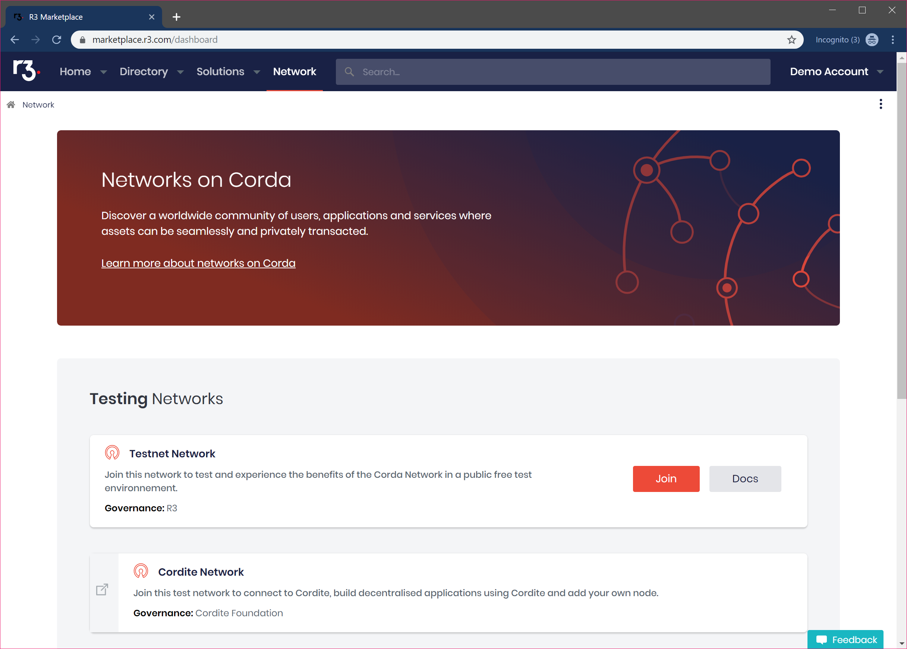
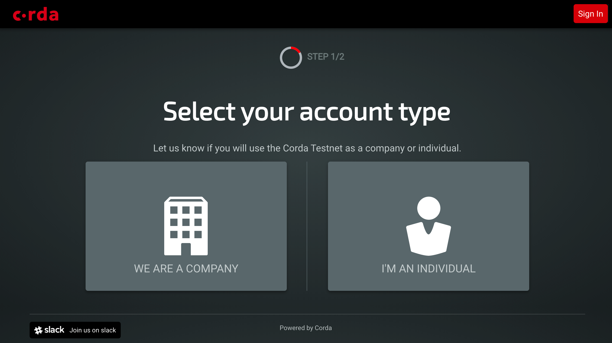
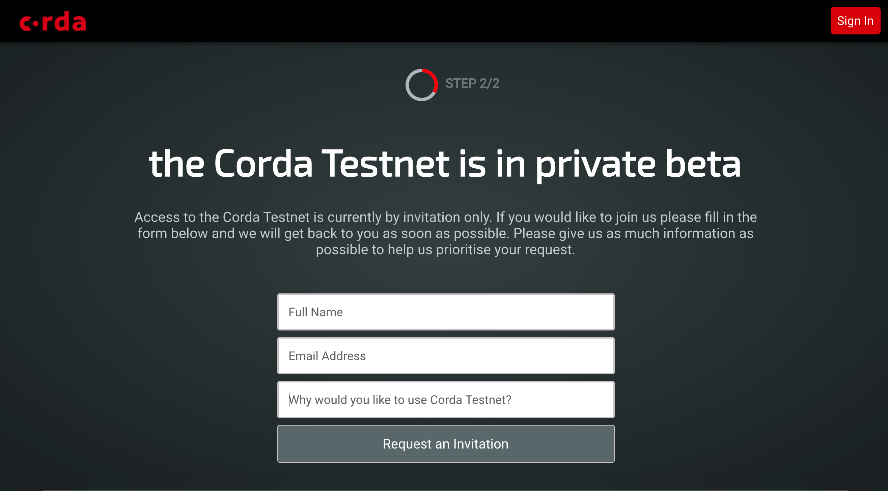

The Corda Testnet
================================================================

.. contents::

The Corda Testnet is an open public network of Corda nodes on the internet. It is designed to be a complement to *the* Corda Network where any entity can transact real world value with any other counterparty in the context of any application. The Corda Testnet is designed for "non-production" use in a genuine global context of Corda nodes, including but not limited to Cordapp development, multi-party testing, demonstration and showcasing of applications and services, learning, training and development of the Corda platform technology and specific applications of Corda.

The Corda Testnet is based on exactly the same technology as the main Corda Network, but can be joined on a self-service basis through the automated provisioning system described below.

The Corda Testnet is currently in private beta. Interested parties can request in invitation to join the Corda Testnet by completing a short request form (see below).
   

Deploying a Corda node to the Corda Testnet
----------------------------------

Access to the Corda Testnet is enabled by visiting https://testnet.corda.network.

Click on "Join the Corda Testnet".

Select whether you want to register a company or as an individual on the Testnet.

This will create you an account with the Testnet onboarding application which will enable you to provision and manage multiple Corda nodes on Testnet. You will log in to this account to view and manage you Corda Testnet identitiy certificates.

Fill in the form with your details. This helps prioritise requests to join the private beta.

