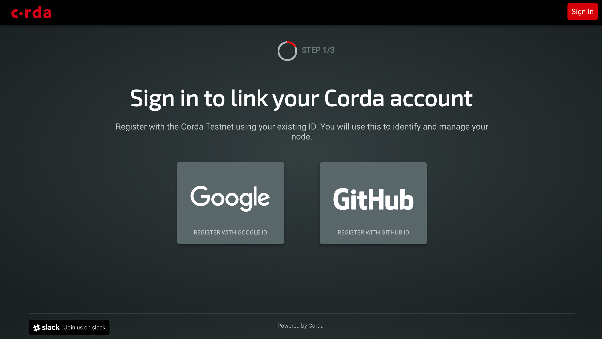
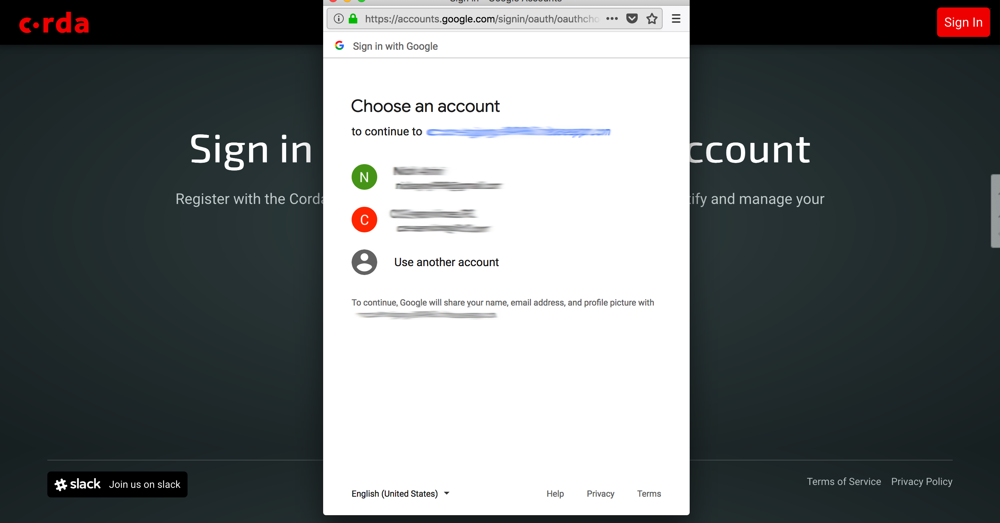
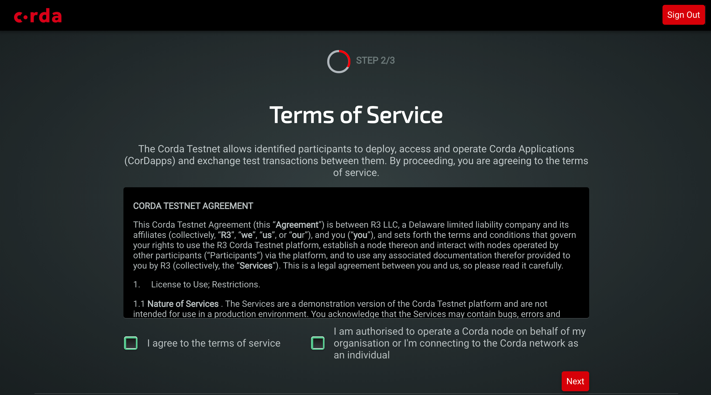
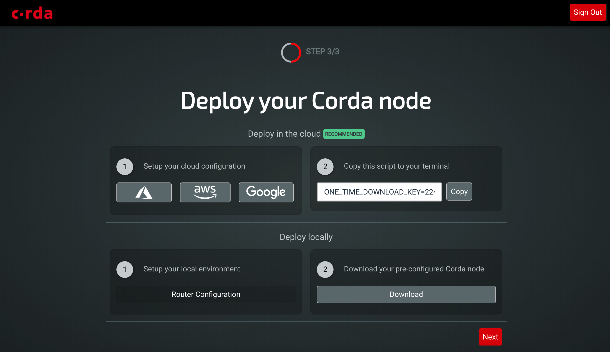

The Corda Testnet
=================

.. contents::

The Corda Testnet is an open public network of Corda nodes on the internet. It is designed to be a complement to *the* Corda Network where any entity can transact real world value with any other counterparty in the context of any application. The Corda Testnet is designed for "non-production" use in a genuine global context of Corda nodes, including but not limited to CorDapp development, multi-party testing, demonstration and showcasing of applications and services, learning, training and development of the Corda platform technology and specific applications of Corda.

The Corda Testnet is based on exactly the same technology as the main Corda Network, but can be joined on a self-service basis through the automated provisioning system described below.

The Corda Testnet is currently in private beta. Interested parties can request in invitation to join the Corda Testnet by completing a short request form (see below).
   

Deploying a Corda node to the Corda Testnet
-------------------------------------------

Access to the Corda Testnet is enabled by visiting https://testnet.corda.network.

.. image:: resources/testnet-landing.png
   :target: https://testnet.corda.network

Click on "Join the Corda Testnet".

Select whether you want to register a company or as an individual on the Testnet.

This will create you an account with the Testnet onboarding application which will enable you to provision and manage multiple Corda nodes on Testnet. You will log in to this account to view and manage you Corda Testnet identitiy certificates.

.. image:: resources/testnet-account-type.png 

Fill in the form with your details.

.. note::

   Testnet is currently invitation only. If your request is approved you will receive an email. Please fill in as many details as possible as it helps us proritise requests. The approval process will take place daily by a member of the r3 operations team reviewing all invite requests and making a decision based on current rate of onboarding of new customers.

.. image:: resources/testnet-form.png 

.. note::

   We currently only support federated login using Google email accounts. Please ensure the email you use to register is a Gmail account or is set up as a Google account and that you use this email to log in.

Gmail is recommended. If you want to use a non-Gmail account you can enable your email for Google: https://support.google.com/accounts/answer/176347?hl=en
	   
Once you have been approved, navigate to https://testnet.corda.network and click on "I have an invitation".

Sign in using the Google login service:

When prompted approve the Testnet application:

..  note::

    At this point you may need to verify your email address is valid (if you are not using a Gmail address). If prompted check your email and click on the link to validate then return to the sign in page and sign in again.

Next agree to the terms of service:

You can now choose how to deploy your Corda node to the Corda Testnet. We strongly recommend hosting your Corda node on a public cloud resource. 

Select the cloud provider you wish to use for documentation on how to specifically configure Corda for that environment. 

Once your cloud instance is set up you can install and run your Testnet pre-provisioned Corda node by clicking on "Copy" and pasting the one time link into your remote cloud terminal.
	   
The installation script will download the Corda binaries as well as your PKI certificates, private keys and suporting files and will install and run Corda on your fresh cloud VM. Your node will register itself with the Corda Testnet when it first runs and be added to the global network map and be visible to counterparties after approximately 5 minutes. 

Hosting a Corda node locally is possible but will require manually configuring firewall and port forwarding on your local router. If you want this option then click on the "Download" button to download a Zip file with a pre-configured Corda node.

.. note:: If you host your node on your own machine or a corporate server you must ensure it is reachable from the public internet at a specific IP address. Please follow the instructions here: :doc:`deploy-locally`.

A note on identities on Corda Testnet
-------------------------------------

Unlike the main Corda Network, which is designed for verified real world identities, The Corda Testnet automatically assigns a "distinguished name" as your identity on the network. This is to prevent name abuse such as the use of offensive language in the names or name squatting. This allows the provision of a node to be automatic and instantaneous. It also enables the same user to safely generate many nodes without accidental name conflicts. If you require a human readable name then please contact support and a partial organsation name can be approved. 

