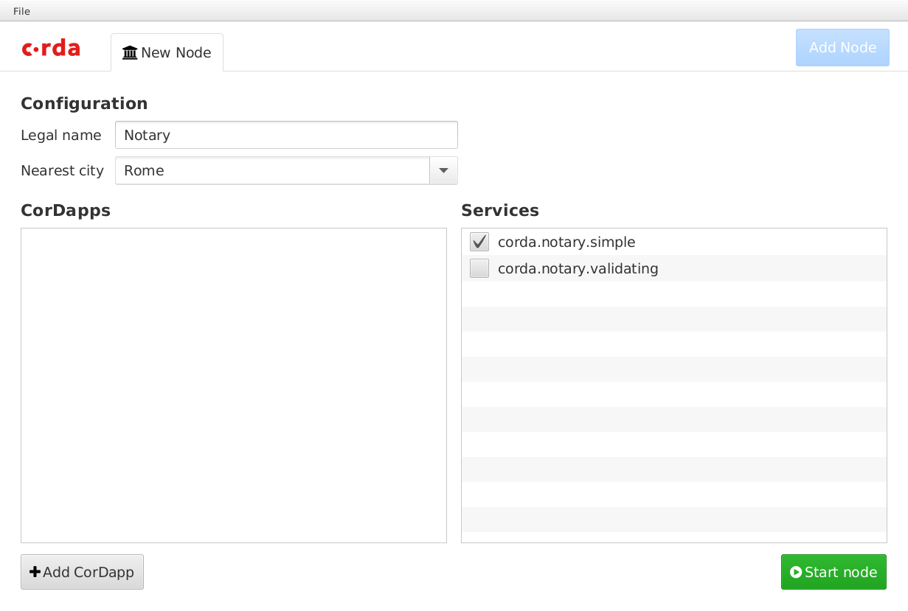

DemoBench
=========

DemoBench is a standalone desktop application that makes it easy to configure and launch local Corda nodes. It is useful for training sessions, demos or just experimentation.

Downloading
-----------

Operating System specific installers are provided as part of |release| distribution, e.g. for Windows this will be "|installer_name|".

.. |installer_name| replace:: Corda DemoBench-|version|.exe

Running DemoBench
-----------------

Run the installer and follow instructions on the screen.
Once installer completes it will start ``Corda DemoBench`` application:

Configuring a Node
  Each node must have a unique name to identify it to the network map service. DemoBench will suggest node names, nearest cities and local port numbers to use.

  The first node will be a notary. Hence only notary services will be available to be selected in the ``Services`` list. For subsequent nodes you may also select any of Corda's other built-in services.

  Press the ``Start node`` button to launch the Corda node with your configuration.

Running Nodes
  DemoBench launches each new node in a terminal emulator. The ``View Database``, ``Launch Explorer`` and ``Launch Web Server`` buttons will all be disabled until the node has finished booting. DemoBench will then display simple statistics about the node such as its cash balance.

..

It is currently impossible from DemoBench to restart a node that has terminated, e.g. because the user typed "bye" at the node's shell prompt. However, that node's data and logs still remain in its directory.

Exiting DemoBench
  When you terminate DemoBench, it will automatically shut down any nodes and explorers that it has launched and then exit.

Profiles
  You can save the configurations and CorDapps for all of DemoBench's currently running nodes into a profile, which is a ``ZIP`` file with the following layout, e.g.:

.. parsed-literal::

    notary/
        node.conf
        cordapps/
    banka/
        node.conf
        cordapps/
    bankb/
        node.conf
        cordapps/
            example-cordapp.jar
    ...

..

  When DemoBench reloads this profile it will close any nodes that it is currently running and then launch these new nodes instead. All nodes will be created with a brand new database. Note that the ``node.conf`` files within each profile are JSON/HOCON format, and so can be extracted and edited as required.

DemoBench writes a log file to the following location:

+--------------+-------------------------------------------+
| MacOSX/Linux | ``$HOME/demobench/demobench.log``         |
+--------------+-------------------------------------------+
| Windows      | ``%USERPROFILE%\demobench\demobench.log`` |
+--------------+-------------------------------------------+

Building the Installers
-----------------------

Gradle defines tasks that build DemoBench installers using JavaPackager. There are three scripts in the `tools/demobench <https://github.com/corda/corda/tree/master/tools/demobench>`_ directory of the `Corda repository <https://github.com/corda/corda>`_ to execute these tasks:

 #. ``package-demobench-exe.bat`` (Windows)
 #. ``package-demobench-dmg.sh`` (MacOS)
 #. ``package-demobench-rpm.sh`` (Fedora/Linux)

Each script can only be run on its target platform, and each expects the platform's installation tools already to be available.

 #. Windows: `Inno Setup 5+ <http://www.jrsoftware.org/isinfo.php>`_

 #. MacOS: The packaging tools should be available automatically. The DMG contents will also be signed if the packager finds a valid ``Developer ID Application`` certificate with a private key on the keyring. (By default, DemoBench's ``build.gradle`` expects the signing key's user name to be "R3CEV".) You can create such a certificate by generating a Certificate Signing Request and then asking your local "Apple team agent" to upload it to the Apple Developer portal. (See `here <https://developer.apple.com/library/content/documentation/IDEs/Conceptual/AppDistributionGuide/MaintainingCertificates/MaintainingCertificates.html>`_.) 

.. note::

  - Please ensure that the ``/usr/bin/codesign`` application always has access to your certificate's signing key. You may need to reboot your Mac after making any changes via the MacOS Keychain Access application.

  - You should use JDK >= 8u152 to build DemoBench on MacOS because this version resolves a warning message that is printed to the terminal when starting each Corda node.

  - Ideally, use the :ref:`jetbrains-jdk` to build the DMG.

..

 3. Fedora/Linux: ``rpm-build`` packages.

You will also need to define the environment variable ``JAVA_HOME`` to point to the same JDK that you use to run Gradle. The installer will be written to the ``tools/demobench/build/javapackage/bundles`` directory, and can be installed like any other application for your platform.

.. _jetbrains-jdk:

JetBrains JDK
-------------

Mac users should note that the best way to build a DemoBench DMG is with the `JetBrains JDK <https://github.com/JetBrains/jdk8u>`_
which has `binary downloads available from BinTray <https://bintray.com/jetbrains/intellij-jdk>`_.
This JDK has some useful GUI fixes, most notably, when built with this JDK the DemoBench terminal will support emoji
and as such, the nicer coloured ANSI progress renderer. It also resolves some issues with HiDPI rendering on
Windows.

This JDK does not include JavaPackager, which means that you will still need to copy ``$JAVA_HOME/lib/ant-javafx.jar`` from an Oracle JDK into the corresponding directory within your JetBrains JDK.

Developer Notes
---------------

Developers wishing to run DemoBench *without* building a new installer each time can install it locally using Gradle:

.. parsed-literal::

    $ gradlew tools:demobench:installDist
    $ cd tools/demobench/build/install/demobench
    $ bin/demobench

..

Unfortunately, DemoBench's ``$CLASSPATH`` may be too long for the Windows shell . In which case you can still run DemoBench as follows:

.. parsed-literal::

    > java -Djava.util.logging.config.class=net.corda.demobench.config.LoggingConfig -jar lib/demobench-$version.jar

..

While DemoBench *can* be executed within an IDE, it would be up to the Developer to install all of its runtime
dependencies beforehand into their correct locations relative to the value of the ``user.dir`` system property (i.e. the
current working directory of the JVM):

.. parsed-literal::

    corda/
        corda.jar
        corda-webserver.jar
    explorer/
        node-explorer.jar
    cordapps/
        bank-of-corda.jar

..

