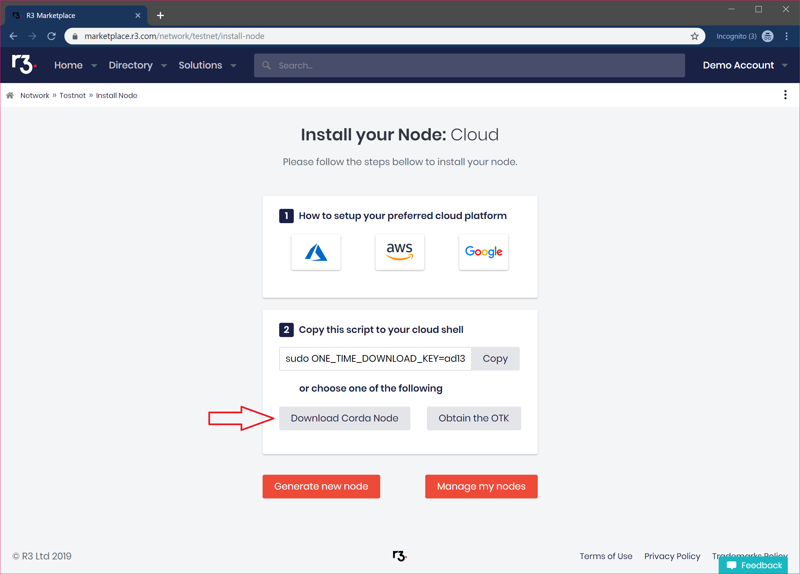

Setting up your local environment to allow the deployment of a Corda node
========================================================================

.. contents::

This document explains how to set up your local network to enable a
Corda node to connect to the Corda Testnet. This assumes you are
downloading a node ZIP from: https://testnet.corda.network.

Pre-requisites
--------------
* Register for an account on https://testnet.corda.network and download
  and install the Corda node from the ZIP file.

Set up your local network
-------------------------

For a Corda node to be able to connect to the Corda Testnet and be
reachable by counterparties on that network it needs to be reachable
on the open internet. Corda is a server which requires an externally
visible IP address and several ports in order to operate correctly.

We recommend running your Coda node on cloud infrastructure. If you
wish to run Corda on your local machine then you will need to
configure your network to enable the Corda node to be reachable from
the internet.

The following steps will explain some of the steps you may need to
perform to enable this.

.. note:: You will need access to your network router/gateway to the
	  internet. If you do not have direct access then contact your
	  administrator.

The following steps will describe how to use port forwarding on your
router to make sure packets intended for Corda are routed to the right
place on your local network.
	  
Set up static IP address local host machine
~~~~~~~~~~~~~~~~~~~~~~~~~~~~~~~~~~~~~~~~~~~~

The next steps will configure your router to forward
packets to the Corda node, but for this it is required to set the host
machine to have a static IP address. If this isn't done, and the
network is using DHCP dynamic address allocation then the next time
the host machine is rebooted it may be on a different IP and the port
forwarding will no longer work.

Please consult your operating system documentation for instructions on
setting a static IP on the host machine.

Set up port forwarding on your router
~~~~~~~~~~~~~~~~~~~~~~~~~~~~~~~~~~~~~~~~

Port forwarding is a method of making a computer on your network
accessible to computers on the Internet, even though it is behind a router.

.. note:: All routers are slightly different and you will need to  consult the
documentation for your specific make and model.

Log in to the admin page of your router (often ``192.168.0.1`` in your
browser bar.

.. note:: Router administration IP and log in credentials are usually
	  on the bottom or side of your router.

Navigate to the ``port forwarding`` section of the admin console.

Add rules for the following ports which Corda uses:

.. code:: bash

	  10002
	  10003
	  8080

.. note:: These ports are the defaults for Testnet which are specified
	  in the node.conf. If these conflict with existing services
	  on your host machine they can be changed in the
	  ``/opt/corda/node.conf`` file.

For each rule you will also typically have to specify the rule name,
the static IP address of the host machine we configured earlier (the
same in each case) and the protocol (which is TCP in all cases here).

Please consult your router documentation for specific details on
enabling  port forwarding.

Open firewall ports
~~~~~~~~~~~~~~~~~~~~

If you are operating a firewall on your host machine or local network
you will also need to open the above ports for incoming traffic.

Please consult your firewall documentation for details.

Optional: Configure a static external IP address
~~~~~~~~~~~~~~~~~~~~~~~~~~~~~~~~~~~~~~~~~~~~~~~~

Corda expects nodes to have stable addresses over long periods of
time. ISPs typically assign dynamic IP addresses to a router and so if
your router is rebooted it may not obtain the same external IP and
therefore your Corda node will change its address on the Testnet.

You can request a static IP address from your ISP however this may
incur a cost.

If the IP address does change then this doesnt cause issues but it
will result in an update to the network map which then needs to be
propagated to all peers in the network. There may be some delay in the
ability to transact while this happens.

.. warning:: Corda nodes are expected to be online all the time and
	     will send a heartbeat to the network map server to
	     indicate they are operational. If they go offline for a
	     period of time (~24 hours in the case of Testnet) then
	     the node will be removed from the network map. Any nodes
	     which have queued messages for your node will drop these messages,
	     they won't be delivered and unexpected behaviour may
	     occur.

	     
Test is the ports are open
~~~~~~~~~~~~~~~~~~~~~~~~~

You can use a port checking tool to make sure the ports are open
properly.

Download and install your node
~~~~~~~~~~~~~~~~~~~~~~~~~~~~~~~

Navigate to https://testnet.corda.network/platform.

Click on the ``Download`` button and wait a few seconds for the ZIP
file to download:

Unzip the file in your Corda root directory:

.. code:: bash

    mkdir corda
    cd corda
    cp <PATH_TO_DOWNLOAD>/node.zip .
    unzip node.zip

Run the ``run-corda.sh`` script to start your Corda node.

.. code:: bash

    ./run-corda.sh

Congratulations! You now have a running Corda node on Testnet.

