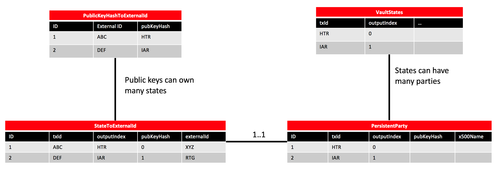

# Accounts Library Design

This document outlines the requirements and design for a Corda accounts library.

## Requirements

### High-level requirements

The accounts library is presented to CorDapp developers and node operators to meet the following high-level requirements:

1. Flows and vault queries on behalf of customer facing operations must only show data relevant to specific customers.
2. On-ledger activities must correlate with external systems and assure stakeholders that the transactions *are* happening. E.g. accounts which can be reconciled to an organisation's trial balance.
3. Individual customers must have individual balances, but the node operating organisation is responsible for netting these flows and providing supporting liquidity i.e. fractional reserve banking.
4. An organisation must support custody relationships with its customers, such that individual states need to be allocated to a particular customer.
5. To check node local metadata that affects whether customer actions should be authorised, or whether actions should be priced differently, or more generally, to determine how a flow should behave.
6. Customer data must be separately encrypted for compliance and isolation reasons in situations where the node data is not owned by the node operator.
7. All customers must hold their own keys and be able to portably spend/authorise the spending of individual states in the future, possibly even using a different provider.

This document addresses requirements 1 to 5. Requirement 3 can be addressed without giving account holders the ability to generate their own key pairs. Instead, the host node only must record "account totals", for each account, instead of allocating individual states on a per account basis. Requirements 6 and 7 will be addressed in future releases of Corda. The design described in this document is a prerequisite for delivering requirement 7.

### Definitions

- **Account** - An account is a collection of key pairs and state objects. The participation keys are all mapped to a common identifier—the "account ID"
- **Account ID** - A UUID which is used to identify an account
- **Node operator** - an organisation which operates a Corda node
- **Host node** - a Corda node which hosts one or more accounts
- **Regular node** - a Corda node which does not host accounts
- **Account holder** - a legal person that the account is created for. Note: not all accounts have account holders.

### Specific requirements

High-level requirements 1 to 5 can be met with the following specific requirements:

- Node operators must be able to create new accounts
- Each account must have a basic information associated with it, such as an account name, account host node and account ID
- Accounts must be discoverable by regular nodes and other accounts
- Accounts must be able to transact with regular nodes and other accounts
- Accounts must be transferrable to other host nodes
- Accounts must be migratable to regular nodes
- Accounts must support the creation of new key pairs to participate in states
- Node operators must be able to query states on a per account basis
- States shared with specific accounts should only be visible to those specific accounts and not other accounts on the same host node
- Interacting with accounts shouldn't require different coding patterns to interacting with regular nodes
- Host nodes must be able to assign arbitrary data to accounts which can be looked-up during flow execution

## Design

### Background

In the context of Corda, the accounts library allows a Corda node to partition the vault—a collection of state objects—into a number of subsets, where each subset represents an account. In other words, the accounts library allows a Corda node operator to split the vault into multiple "logical" sub-vaults. This is advantageous for a couple of reasons:

* Node operators can reduce costs by hosting multiple entities, as accounts, on one node
* Node operators can partition the vault on a per entity basis

Accounts are created by host nodes, which are just regular Corda nodes. Hosts can create accounts for a range of purposes such as customer accounts, balance sheets or P&L accounts, employee accounts, etc.

The accounts library takes the form of a JAR which can be dropped into the CorDapps folder. Use of it is optional. This means that some nodes will support accounts but others will not. This is intentional by design as not all nodes will need to support accounts and the optional nature of accounts reduces the learning curve for new CorDapp developers.

#### Vault isolation

As Corda nodes support only one vault service and one transaction store, it follows that host nodes cannot provide data isolation between accounts. As such, the accounts feature may not be appropriate for all organisations or projects. If vault isolation is required then the solution would be for the organisation in question to operate a dedicated Corda node. 

Despite there being no node level isolation, the accounts feature supports permissioning at the application level where by account holders will only be able to see the states they participate in and have observed. The onus is on CorDapp developers to ensure that this application level permissining is applied correctly. 

#### Creating accounts

Accounts can be created by node operators, via a flow, when a new account is required. When an account is created, a `LinearState` called `AccountInfo` is created on-ledger, with the host `Party` as a single participant. This state is only stored by the host node initially but it can be subsequently shared with other regular nodes or accounts, as observers, when neccessary. 

#### `AccountInfo`s

The `AccountInfo` state contains the account ID (the `linearId` of the `AccountInfo` state), account name, account description and the host `Party`. The account ID is used to refer to the account going forward, even if the account moves to another host. 

Account IDs can be assumed to be unique at the network level as UUIDs provide 128 bits of entropy, so it's unlikely there will be a clash with another account ID. Whilst, account IDs and node x500 names are unique at the network level, account names cannot be assumed to be unique at the network level. Care must be taken by CorDapp developers to ensure they are dealing with the correct account. A tuple of host node and account name _can_ be assumed to be unique, as the accounts library will not permit duplicate account names on a common host node.

As the `AccountInfo` is a `LinearState`, the latest version of `AccountInfo` will always specify the correct host node `Party`. `AccountInfo`s can be updated to change the account name, description. Also, the host node can be changed if the account is moved to another host.

#### Account discovery

Most of the time, it is expected that `AccountInfo`s will be discovered "out of band", for example, via an e-mail or a user interface. A tuple of host node and account name, or host node and account number can be used to request the `AccountInfo` object from a node host. These are useful for communicating account information:

* Informally, on the phone or in person, "You can find my account on O=NodeX,L=London,C=GB, it's called Roger's Account"
* Written down, "My account ID is 123e4567-e89b-12d3-a456-426655440000 @ O=NodeX,L=London,C=GB"

In most cases, `AccountInfo`s are needed to determine which node a flow session must be initiated with to interact with a specific account. An example where this might be the case would be when an account is transacted with for the first time.

However, in some cases, the host node for an account can be inferred from the public key associated with an account, and therefore, the `AccountInfo` is not required. This can only happen if the public key has already been mapped to the host node (see "transacting with accounts" for further information).

An example where a host node can be inferred from an account's public key may happen when node has been passed an existing `SignedTransaction` involving an account—in this case, assuming the mapping from the public key to the host has already been recorded, the participation keys for the account can be used to infer the host node.

The accounts feature does not ship with a directory service for discovering accounts—something which might be described as the "network map" for accounts—as it has been noted that on a per project basis, CorDapp developers have diverse / conflicting requirements regarding account discovery. If a directory service is required, then preferably it would be served by a business network operator.

#### Sharing and requesting `AccountInfo`s

Sharing of `AccountInfo`s to account holders or regular nodes, can be performed via flows. As the `AccountInfo` state contains some potentially sensitive information by way of account name and description, account holders should only share their `AccountInfo` state with other `Party`s and accounts they wish to transact with. 

If an account holder or node operator has been provided with a tuple of host node and account ID pertaining to a specific account, then, if requested, it is reasonable for the host node for that account to supply the `AccountInfo` state object to the requesting account holder or node operator. This can be done via a flow. The host node will either respond with the `AccountInfo` or, if the account does not exist, an exception noting that the specified account cannot be found.

#### Account identity

Accounts make no claims or assumptions about identity at the network level, as such, accounts do not come with a Doorman provisioned identity or an identity rooted via the network trust root.  As such, accounts should not be viewed as "node sub-identities". 

Whilst accounts have no identity at the network level, account holders _do_ have an identity, whether that's a legal entity or a natural person. Identity for account holders is out of scope for this document.

Account holders—legal entities or natural persons—can hold multiple accounts across multiple host nodes.

#### Transacting with accounts

When required, accounts have the capability to request the host node generate new key pairs on their behalf. When generated, these key pairs will be mapped to the account ID in an off-ledger database table, this allows states participated in by account holders to be mapped to the account holder's account ID. This is useful for querying the vault on a per account basis. See Appendix 1, for further information.

When accounts are created, they are _not_ supplied with a "default" key pair equivalent to a regular node's legal identity key. As such account holders should generate keys on a per transaction basis, although keys can be re-used if desired. It is not recommended to re-use keys in case an account is moved and states are transferred to a key pair no longer in use by the account holder. Flows will exist for:

* Requesting accounts to generate new key pairs and send the public key back to the requesting node. 
* Generating a new key pair and sharing the public key with a specified regular node or account.

When receiving a public key generated by a host node on behalf of an account, the receiving node must map the newly generated public key to the host node's identity—this is to aid with performing look-ups from account key to host node. These features form part of the updates "confidential identities" library. See Appendix 2.

In addition, a couple of features have been added to the core platform—which will be introduced in Corda 4.1—to support ease of transacting with accounts, so that the coding model doesn't substantially vary from what CorDapp developers are currently used to. See Appendix 3 for further information. As with regular nodes, accounts can participate in state objects. No changes in the programming model are required. Regular nodes can be participants in states with `Party` or `AnonymousParty` objects. Accounts can participate in states only with `AnonymousParty` objects. 

Even though host nodes can assign key pairs to accounts, the private keys remain under the control of the host node. This is not appropriate for all use-cases where the account owner must be responsible for signing a transaction. This refers to requirement 7, *"All customers must hold their own keys and be able to portably spend/authorise the spending of individual states in the future, possibly even using a different provider"*. Future versions of Corda will support the generation of key pairs by a client—on a desktop, mobile phone, or other device—and sharing of the public key with a host node. With this approach, the account holder remains in control of the private keys, so transaction signing is at their discretion.

#### Adding richer account information

Host nodes can add additional off-ledger database tables to supply additional information and metadata for accounts. This can be achieved using the restricted entity manager feature. This information can used during flow execution to guide what actions must be taken on a per account basis.

#### `AccountInfo` update distribution list

Host nodes will keep a local database table which records the information of other accounts or regular nodes that should be updated in the event that an `AccountInfo` state is updated.  This table can be populated by another node or account requesting that they be updated in the case that an `AccountInfo` changes. When an `AccountInfo` does change, then the host node, sends the updated `AccountInfo` state to all the nodes in the database table.

When the data distribution groups feature has been released, it will supersede this feature.

#### Moving hosts

The accounts library supports the situation where an account holder wishes to move to a new host node. Moving accounts requires spending states to new key pairs. Moving can be achieved with the following steps:

1. The current host node internally flags the account as in the process of being moved.
2. The `AccountInfo` state is updated to reflect the new host node— this updated state is shared with the new host as well as any regular nodes or accounts on the distribution list.
3. The current host node, requests a public key (or keys) from the new host node and transfers all the states to the new key(s). It is expected that states will be transferred individually. All the required states and transaction dependencies will move across to the new node.
4. If required, the current host node can now remove the following:
   1. States and transactions for the moved accounts, as well as any entries in custom schemas
   2. Key pairs for the moved account
   3. Any other off-ledger data

#### Transactions between accounts hosted on the same node

As public keys are used to delineate states in one account or another, a ledger transaction must be used to transfer states between accounts, even if those accounts are hosted on the same node. 

#### Migrating accounts to regular nodes

If an account is being migrated to a regular node which will not support accounts then this can be done in a similar way to moving host nodes but with the following differences:

* Instead of updating the `AccountInfo` with a new host node, the `AccountInfo` state will be exited from the ledger.
* Instead of asking a new host node to generate keys, the regular node which is being migrated to will generate new keys

If the regular node does support accounts, then the same process as described in "moving hosts" will be used.

Even if the regular node does not wish to support accounts, they must have the accounts CorDapp installed  which implements the `InitiatedBy` side of the account moving/migration flows.

### Technical detail

We will guarantee API backwards compatibility from the V1 release. So, as APIs cannot be removed, the surface area has deliberately been kept minimal. Additional APIs can be added in the future, if necessary.

#### AccountInfo

`AccountInfo`s are similar in purpose to `NodeInfo`s—they map a name to a host. Whilst `NodeInfo`s map a `CordaX500Name` to a physical host, `AccountInfo`s map an account name to a host `Party`. The purpose of the `AccountInfo` is:

* for an account holder to prove that their account is hosted by a particular host node, and;
* allow node operators to look-up which host node an account is hosted with

```kotlin
data class AccountInfo(
    val name: String, 
    val description: String,
    val host: Party,
    val linearId: Uniqueidentifier() = UniqueIdentifier()
) : LinearState {
	val participants: List<AbstractParty> get() = listOf(accountHost)
    val id: UUID get() = linearId.uuid
}
```

* `AccountInfo`s store the minimal amount of information required.
* They can be shared with other nodes with a set of flows (see below).
* The host node for the account is the only participant in this state. 

#### Creating new accounts

New accounts are created via a flow:

```kotlin
@StartableByRPC
class CreateAccount(val name: String, val description: String) : FlowLogic<AccountInfo>()
```

- Only an account name and description is required to create a new account.
- No key pairs are created for the account at this point.
- The flow does not communicate with any other nodes.
- The flow commits a transaction with one output to the ledger—the `AccountInfo`.
- The `AccountInfo` state is stored in the host node's vault.
- The `linearId` of the `AccountInfo` state is the account ID.
- The new `AccountInfo` is returned from the flow.

#### Requesting `AccountInfo`s

`AccountInfo`s can be requested to verify whether an account is hosted by a particular host node, or not. The `AccountInfo` can be stored locally so a remote look-up doesn't need to be continually performed. `RequestAccountInfoByName` and `RequestAccountInfoById` both call a flow called `RequestAccountInfo` which is an `InitiatingFlow`.

```kotlin
// Requester flows.
@StartableByRPC
class RequestAccountInfoByName(
    val name: String, 
    val host: Party
) : RequestAccountInfo<AccountInfo>()

@StartableByRPC
class RequestAccountInfoById(
    val id: UUID, 
    val host: Party
) : RequestAccountInfo<AccountInfo>()

// Request handling flow.
@InitiatedBy(RequestAccountInfo::class)
class RequestAccountInfoHandler(val otherSession: FlowSession) : FlowLogic<Unit>()
```

* Two flows are available to request `AccountInfo`s from other nodes. 
* These flows are `StartableByRPC`.
* To request an `AccountInfo`, The requesting node must know the account ID and host `Party` or the account name and the host `Party`.
* The host node uses the `AccountsService` to request the `AccountInfo` and sends it to the requesting node via `SendTransactionFlow`/`RecieveTransactionFlow`.
* The requesting node returns the `AccountInfo` so it can be used in subsequent flows.

#### Sharing `AccountInfo`s and other states

To share states (including `AccountInfo`s) with regular nodes, `SendTransactionFlow` / `ReceiveTransactionFlow` and `SendStateAndRefFlow` / `ReceiveStateAndRefFlow` can be used. To share states with accounts, a different set of flows must be used:

* `SendStateAndRefToAccountFlow`/`ReceiveStateAndRefToAccountFlow`
* `SendTransactionFlowToAccountFlow`/`ReceiveTransactionToAccountFlow`

Different flows are required for sharing states with accounts because if a state is to be stored by a specific account, then the state should be permissioned to that account only such that no other accounts on the same host node can see the state. To do this requires updating an off-ledger database table.

```kotlin
// StateRefs.
@InitiatingFlow
class SendStateAndRefFlowToAccountFlow<T : ContractState>(
	val accountInfo: AccountInfo,
    val stateAndRef: StateAndRef<T>
) : FlowLogic<Unit>()

@InitiatedBy(SendStateAndRefFlowToAccountFlow::class)
class ReceiveStateAndRefToAccountFlow<T : ContractState>(
    val otherSession: FlowSession
) : FlowLogic<StateAndRef<T>>()

// Transactions.
@InitiatingFlow
class SendTransactionFlowToAccountFlow(
	val accountInfo: AccountInfo,
    val stateAndRef: SignedTransaction
) : FlowLogic<Unit>()

@InitiatedBy(SendTransactionFlowToAccountFlow::class)
class ReceiveTransactionToAccountFlow(
    val otherSession: FlowSession
) : FlowLogic<SignedTransaction>()
```

The new flows wrap the existing flows and—as mentioned above—add some additional behaviour which is required for permissioning observed states or transactions to a specified account. View permissioning for observed states is recorded in the following entity:

```kotlin
@Entity
@Table(name = "account_to_state_refs", indexes = [
	Index(name = "external_id_idx", columnList = "external_id")
])
data class AllowedToSeeStateMapping(
	@Id
	@GeneratedValue(strategy = GenerationType.AUTO)
	var id: Long?,

	@Column(name = "external_id", unique = false, nullable = false)
	@Type(type = "uuid-char")
	var externalId: UUID?,

	override var stateRef: PersistentStateRef?
) : DirectStatePersistable, MappedSchema(
    AllowedToSeeStateMapping::class.java, 
    1, 
    listOf(AllowedToSeeStateMapping::class.java)
) 
```

#### Creating a new key for an account

Please see *Appendix 2* for how to generate and share new key pairs, or to request a new key pair from an account.

#### Querying states by account

Querying states by account can be performed via vault extension functions, for example:

```kotlin
// For querying by account.
inline fun <reified T : ContractState> VaultService.queryByAccount(
    criteria: QueryCriteria, 
    paging: PageSpecification, 
    sorting: Sort, 
    accountId: UUID
): Vault.Page<T>

// For tracking vault updates by account.
inline fun <reified T : ContractState> VaultService.trackByAccount(
    criteria: QueryCriteria, 
    paging: PageSpecification, 
    sorting: Sort,
    accountId: UUID
): DataFeed<Vault.Page<T>, Vault.Update<T>>
```

Similar APIs can be added to `CordaRPCOps` for querying via RPC. Regarding observed states, these functions will only return states that have been shared with the specific account ID as well as states which have been shared with the host node—meaning all accounts can see them.

#### Obtaining `AccountInfo`s locally

`AccountInfo` states will have a custom schema, so they can be queried for by host, account ID or account name. Helper functions are provided to make this easier:

```kotlin
// Account IDs are unique at the network level.
fun accountInfo(id: UUID, services: ServiceHub): AccountInfo

// More than one [AccountInfo] might be associated with an account name, as account names are not unique at the network level.
fun accountInfo(name: String, ServiceHub): List<AccountInfo>

// Multiple accounts can be hosted by a host node.
fun accountInfos(host: Party, ServiceHub): List<AccountInfo>
```
#### Moving hosts

Moving accounts is performed via a set of flows. Account holders that wish to move host nodes can request that the host node calls this flow to begin the account move process, which is outlined above.

This set of flows marks the account as in the process of being moved and updates the `AccountInfo` state with the new host `Party`. Once the `AccountInfo` is updated with the new host `Party`, then a new key is requested from the new host to move all the states owned by the account to. This process might take a while as for privacy purposes each state will be moved separately. This flow is idempotent.

```kotlin
@StartableByRPC
@InitiatingFlow
class MoveAccount(
    val accountId: UUID, 
    val newHost: Party, 
    val asAccount: Boolean = true
) : FlowLogic<Unit>()

@InitiatedBy(MoveAccount::class)
class MoveAccountHandler(val otherSession: FlowSession) : FlowLogic<Unit>()
```

If `asAccount` is true then the account will be moved to the new host node and the `AccountInfo` will be updated accordingly. If `asAccount` is set to false then the `AccountInfo` will be exited from the ledger and the states will be held by the new host directly as opposed to being held by an account hosted at the new host.

Node operators should ensure that only the administrator account can start this flow via RPC.

Once an account has been moved, it is at the discretion of the previous host node to remove all the old key pairs, transactions and states which were relevant to the moved account. Note that states and transactions which were also relevant to other accounts cannot be removed.

## Appendix

### 1. External ID to public key mapping

#### Requirements

- Each state participant, as necessary for accounts, must be mapped to some unique external ID. Most likely this will be an account ID. **Note:** that the requirement is to map participants and *not* the state itself. This is because two or more participants may have external IDs on the same node.
- Node operators must be able to perform vault queries, restricting the results to a single external ID or set of external IDs.
- Node operators must be able to perform token selection over some fungible state type for a specific external ID, or set of external IDs.
- No changes should be required to existing flows. For example: supplying a mapping of output states to external IDs when states are being recorded is an unacceptable change due to the increased complexity this approach brings.  
- The performance impact of mapping state participants to external IDs should be minimal.
- Node operators must be able to add arbitrary tags to external IDs. Such that they can perform queries across multiple accounts. E.g. "give me all the obligation states for accounts whose holder's favourite colour is RED".

### Design

The key idea is to decouple the creation of external IDs from the assigning of state participants to external IDs. As such, a table will be needed to hold the mapping from public keys to external IDs and there must exist a way to map states to these external IDs.

##### Entity to store `Key -> external ID` mapping

The following exists in Corda 4.

```kotlin
@Entity
@Table(
    name = "pk_hash_to_ext_id_map", 
    indexes = [Index(
        name = "pk_hash_to_xid_idx", 
        columnList = "public_key_hash"
    )]
)
class PublicKeyHashToExternalId(
        @Id
        @GeneratedValue
        @Column(name = "id", unique = true, nullable = false)
        val key: Long?,

        @Column(name = "external_id", nullable = false)
        @Type(type = "uuid-char")
        val externalId: UUID,

        @Column(name = "public_key_hash", nullable = false)
        val publicKeyHash: String
) {
    constructor(accountId: UUID, publicKey: PublicKey)
            : this(null, accountId, publicKey.toStringShort())
}
```

##### Key creation

When a new key pair is created, it can be assigned to an external ID, like so:

```kotlin
fun freshKey(externalId: UUID): PublicKey {
    val publicKey = services.keyManagementService.freshKey()
    services.withEntityManager {
        persist(AccountKey(externalID, publicKey))
    }
    return publicKey
}
```

This exists in Corda 4 and is accessible from the `KeyManagementService`.

##### Transaction recording

Public key hashes must be are stored for each state. This enables each state party to be mapped to an external ID.

```kotlin
@Embeddable
@Immutable
data class PersistentStateRefAndKey(
    @Embedded 
    override var stateRef: PersistentStateRef?, 
    
    @Column(name = "public_key_hash", nullable = false) 
    var publicKeyHash: String?
) : DirectStatePersistable, Serializable {
    constructor() : this(null, null)
}

@Entity
@Table(
    name = "state_party", 
    indexes = [Index(name = "state_party_idx", columnList = "public_key_hash")]
)
class PersistentParty(
    @EmbeddedId
    override val compositeKey: PersistentStateRefAndKey,

    @Column(name = "x500_name", nullable = true)
    var x500Name: AbstractParty? = null
) : IndirectStatePersistable<PersistentStateRefAndKey> {
    constructor(
        stateRef: PersistentStateRef, 
        abstractParty: AbstractParty
    ) : this(
        PersistentStateRefAndKey(stateRef, abstractParty.owningKey.toStringShort()), 
        abstractParty
    )
}
```

##### State querying

Create a view called `StateToExternalId` based upon joining the `PublicKeyHashToExternalId` and `PersistentParty` tables.



The new entity can be defined as follows:

```kotlin
@Entity
@Immutable
@Table(name = "v_pkey_hash_ex_id_map")
class StateToExternalId(
        @EmbeddedId
        override val compositeKey: PersistentStateRefAndKey,

        @Column(name = "external_id")
        @Type(type = "uuid-char")
        val externalId: UUID
) : IndirectStatePersistable<PersistentStateRefAndKey>
```

As the new entity's primary key is a `PersistentStateRef` (see `PersistentStateRefAndKey`), the vault can perform queries over it. This allows CorDapp developers to perform vault queries on a per account basis, like so:

```kotlin
val vaultService = services.vaultService
val keyManagementService = services.keyManagementService
// Create new external ID and two keys mapped to it.
val id = UUID.randomUUID()
val keyOne = keyManagementService.freshKey(id)
val keyTwo = keyManagementService.freshKey(id)
// Create states with a public key assigned to the new external ID.
val dummyStateOne = createDummyState(listOf(keyOne))
val dummyStateTwo = createDummyState(listOf(keyTwo))
// This query should return two states.
val result = database.transaction {
	val externalId = builder { 		
		VaultSchemaV1.StateToExternalId::externalId.equals(id)) 
    }
	val queryCriteria = QueryCriteria.VaultCustomQueryCriteria(externalId)
    vaultService.queryBy<DummyState>(queryCriteria).states
}
assertEquals(setOf(dummyStateOne, dummyStateTwo), result.map { it.state.data }.toSet())
```

### 2. Updated confidential identities API

#### Changes in Corda 4.1

An additional API has been added to `IdentityServiceInternal`.

```kotlin
interface IdentityServiceInternal : IdentityService {
    // Omitted code.
	fun registerIdentityMapping(identity: Party, key: PublicKey): Boolean
}
```

This allows a node to store a mapping from a public key to a `Party` without requiring a certificate chain (old confidential identities API). With the mapping stored, `IdentityService.wellKnownPartyFromAnonymous` can be called to look-up the `Party` object associated with a specific `PublicKey`. Whilst this is an internal API, it will be accessible from the accounts library as it will be compiled against the `corda-node` JAR. In Corda 5, a public API will be added to register identity mappings, so there will be no dependency on `corda-node`. In addition, three new flows will be added; `RequestNewKey`,  `ShareNewKey` and `SyncKeyMappings`.

**`RequestKey` / `RequestKeyHandler`**

```kotlin
@InitiatingFlow
class RequestNewKey(val party: Party, val externalId: UUID) : FlowLogic<SignedPublicKey>()

@InitiatedBy(RequestNewKey::class)
class RequestNewKeyHandler(val otherSession: FlowSession) : FlowLogic<Unit>()
```

This flow is used when performing a unilateral spend/move of some tokens from one party to another, and the recipient requests that a new key be used. The initiating side of the flow requests the handler generate a new key pair, assigned it to an external ID, if specified, then create a signed mapping of the new key to the host node's `Party` object. The signed mapping looks as follows:

```kotlin
data class SignedPublicKey(
    val publicKeyToPartyMap: Map<PublicKey, Party>,
    val signature: DigitalSignatureWithKey
)

// Create instance of mapping.
val mapping = SignedPublicKey(mapOf(newKey to party), signature)
```

This mapping is then sent to the initiating flow, which verifies the signature and then calls `IdentityServiceInternal.registerIdentityMapping` to register the new public key to `Party` mapping. These flows must be called as in-line sub flows.

**`ShareKey` / `ShareKeyHandler`**

These flows operate in much the same way as `RequestKey` / `RequestKeyHandler`, except that the roles are reversed. They must be called as in-line sub flows.

```kotlin
@InitiatingFlow
class ShareKey(
    val party: Party, 
    val signedPublicKey: SignedPublicKey
) : FlowLogic<Unit>()

@InitiatedBy(RequestKey::class)
class ShareKeyHandler(val otherSession: FlowSession) : FlowLogic<SignedPublicKey>()
```

`ShareKeyHandler` returns the `SignedPublicKey` so it can be used in the calling flow.