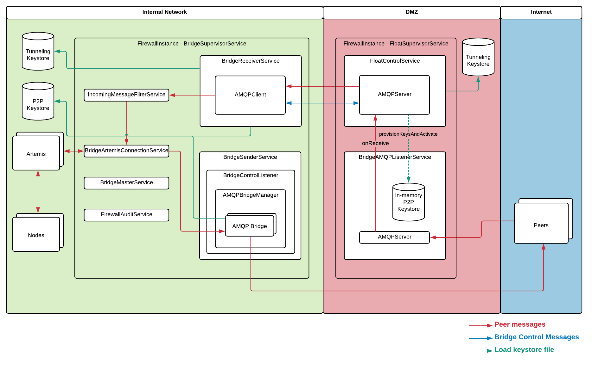
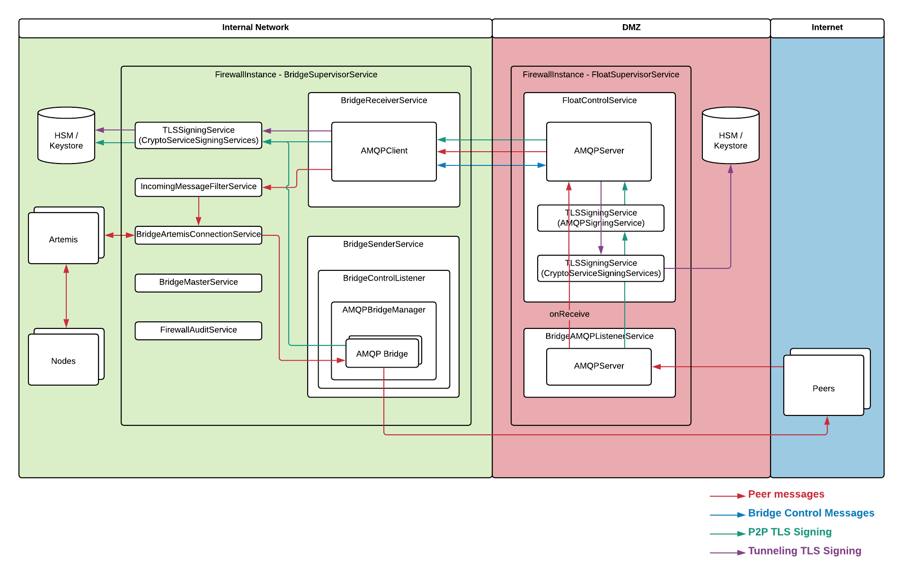

#Corda Firewall TLS HSM integration

## Background

## Requirement

* Support list of HSMs that is supported for legal identities
* Continue to support original file based configuration
* Continue to support DMZ mode of float with no connection initiated to trusted zone components e.g. HSM, however also allow tunnel cert HSM as an option
* Private keys for public ssl not to be available in DMZ float(not even in memory)
* Continue to support SNI multi-node operation 
* Continue to support HA integration 
* Do not change node to bridge protocol (investigate possibility of drop in bridge replacement in ENT 4)
* No change in performance in packets after TLS connection establishment 
* Fully compatible with peer node that does not use HSM
* Minimum changes to bridge and float to bound dev risk
* Must support RSA only HSM
* Full documentation and deployment instruction required for final shipping including consideration of key creation
* Handle silently HSM session timeout
* Handle HSM HA if available for that HSM
* No requirement to ship with HSM jar assume dynamically linked to HSM jars
* No dependency on Corda Node module in float
* Support different HSM for different key classes e.g. SSL Peer vs Tunnel vs artemis?
* Upfront limitation that artemis might not work with HSM to be acceptable 
* Assume HSM keys are read only
* Support possibly arbitrary alias name

## Current Design (ENT v4.0)
###Firewall Components

* **BridgeSupervisorService**  
Holds and initialises all bridge related services

    * **BridgeMasterService**  
    If HA enabled it coordinates Master election once BridgeArtemisConnectionService is up.
    
    * **BridgeArtemisConnectionService**  
    Connects to Artemis and retries if connection lost. Signals connection active to other services and provides access to SessionFactory for services that need to send, or receive over Artemis. 
    
    * **IncomingMessageFilterService**  
    Validates inbound messages coming via BridgeReceiverService and pushes good packets onto Artemis. The delivery Ack from Artemis then triggers return Acks to the original peer sender.
    
    * **BridgeReceiverService**  
    Handles inbound message path from Float. If FloatSupervisorService is in-process it uses direct calls, else it uses an AMQPClient to tunnel actions to the external Float.
    
    * **BridgeSenderService**  
    Responsible for outbound message sending. Creates a BridgeContolListener on activate and stops on deactivate.
    
        * **BridgeControlListener**  
        When started sends request for bridge snapshot from nodes. Then manages connections to peers via AMQPBridgeManager when it receives control messages from nodes.
        
            * **AMQPBridgeManager**  
            Owns AMQPBridge objects that use AMQPClients to manage each outgoing bridge. Once AMQPClient link established the AMQPBridge  subscribes to Artemis and pushes messages to peers via the AMQPClients.
        
    * **FirewallAuditService**  
    Logs information about connection, disconnections, packets, etc
    
    
* **FloatSupervisorService**  

    * **BridgeAMQPListenerService**  
    This service controls the externally accessible P2P listening port. It requires activation calls containing the nodes’ ssl private keys. It then activates its AMQPServer
    
    * **FloatControlService**  
    Acts as communication server for control messages from the Bridge. Contains an AMQPServer to manage the actual communications.

## Target Solution

* **TLSSigningService**  
Handle TLS signing request, delegate signing operation to external process using DelegatedKeystore.

* **CryptoServiceSigningService**  
An implementation of ``TLSSigningService``, delegating signing operation to ``CryptoService``, which supports HSMs and java keystore file.

* **AMQPSigningService**  
An implementation of ``TLSSigningService``, delegating signing operation to the bridge via AMQP messages.

