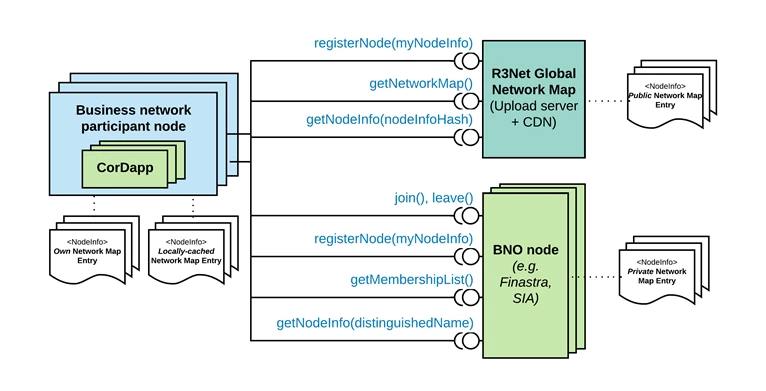

# Business Network design

DOCUMENT MANAGEMENT
---

## Document Control

| Title                |                                          |
| -------------------- | ---------------------------------------- |
| Date                 | 14-Dec-2017                              |
| Authors              | David Lee, Viktor Kolomeyko, Jose Coll, Mike Hearn  |
| Distribution         | Design Review Board, Product Management, Services - Technical (Consulting), Platform Delivery |
| Corda target version | Enterprise |
| JIRA reference       | [Sample Business Network implementation](https://r3-cev.atlassian.net/browse/R3NET-546) |

## Approvals

#### Document Sign-off

| Author            |                                          |
| ----------------- | ---------------------------------------- |
| Reviewer(s)       | David Lee, Viktor Kolomeyko, Mike Hearn, Jose Coll, Dave Hudson  and James Carlyle |
| Final approver(s) | Richard G. Brown |

HIGH LEVEL DESIGN
---

## Overview

Business Networks are introduced in order to segregate Corda Nodes that do not need to transact with each other or indeed
even know of each other existence. 

The key concept of Business Network is **Business Network Operator ('BNO') node** as a mean for BNOs to serve reference data to members 
of their business network(s), as required by CorDapp(s) specific to that business network. This includes allowing BNO 
nodes to vend additional information associated with Business Network participant like roles, transaction limits, etc.

## Background

Multiple prospective clients of Corda Connect expressed concerns about privacy of the nodes and CorDapps they are going to run.
Ability to discover every node in Compatibility Zone through a global network map was not seen as a good design as it 
will allow competing firms to have an insight into on-boarding of the new clients, businesses and flows.

In order to address those privacy concerns Business Networks were introduced as a way to partition nodes into groups 
based on a need-to-know principle. 

This design document reflects on what was previously discussed on this Confluence page
[Business Network Membership](https://r3-cev.atlassian.net/wiki/spaces/CCD/pages/131972363/Business+Network+Membership).

## Scope

### Goals

* Allow Corda Connect participants to create private business networks and allow the owner of the network decide which
parties will be included into it;

* Not to allow parties outside of the Business Network to discover the content of the Business Network;

* Provide a reference implementation for a BNO node which enables the node operator to perform actions stated above. 

### Non-goals

* To mandate Business Networks. Business Networks are offered as on optional extra which some of the CorDapps may chose to use;

* To constrain all BNOs to adopt a single consistent CorDapp, for which the design (flows, persistence etc.) is controlled by R3;

* To define inclusion/exclusion or authorisation criteria for admitting a node into a Business Network.  

## Timeline

This is a long-term solution initially aimed to support Project Agent go-live implementation in Q2 2018. 

## Requirements

See [Identity high-level requirements](https://r3-cev.atlassian.net/wiki/spaces/CCD/pages/131746442/Identity+high-level+requirements)
for the full set of requirements discussed to date.

Given the following roles:

| Role name                   | Definition |
| --------------------------- | ---------- |
| Compatibility Zone Operator | Responsible for administering the overall Compatibility Zone. Usually R3. |
| Business Network Operator   | Responsible for a specific business network within the Corda Connect Compatibility Zone. |
| Node User                   | Uses a Corda node to carry out transactions on their own behalf. In the case of a self-owned deployment, the Node User can also be the Node Operator. |
| Node Operator               | Responsible for management of a particular corda node (deployment, configuration etc.) on behalf of the Node User. |

The following requirements are addressed as follows:

| Role                        | Requirement                                                                                        | How design satisfies requirement |
| --------------------------- | -------------------------------------------------------------------------------------------------- | -------------------------------- |
| Compatibility Zone Operator | To support multiple business networks operating across the CZ.                                     | Current design supports any number of membership lists, each of which defines a business network. |
| Compatibility Zone Operator | To permission a Business Network Operator to provision my services to its members.                 | Individual CordApps will be responsible for checking Business Network membership constrains. |
| Compatibility Zone Operator | To revoke the ability for a specific Business Network Operator to operate within my CZ.            | The membership lists are configurable and business networks can have their membership lists removed when needed. |
| Business Network Operator   | To be able to permission nodes to access my Business Network.                                      | The BNO will ensure that the CorDapp is designed to keep each node's copy of the membership list up-to-date on a timely basis as new members are added to the business network. |
| Business Network Operator   | To revoke access to my business network by any member.                                             | The BNO will ensure that the CorDapp is designed to keep each node's copy of the membership list up-to-date on a timely basis as members are removed from the business network. The BNO will be able to decide, through the timing of the membership list checks in the CorDapp flow design, whether in-flight flows should be exited upon revocation, or simply to avoid starting new flows. |
| Business Network Operator   | To protect knowledge of the membership of my Business Network from parties who don't need to know. | The BNO node upon receiving an enquiry to deliver membership list will first check identity of the caller against membership list. If the identity does not belong to the membership list the content of the membership will not be served. Optionally, Business Network membership list may be made available for discovery by the nodes outside of membership list. |
| Business Network Operator   | To help members of my Business Network to discover each other.                                     | The BNO node will be able to serve the full list of membership participants at a minimum and may also have an API to perform the fuzzy matches. |
| Node User                   | To request the termination of my identity within the CZ / business network.                        | A member may ask a BNO to exclude them from a business network, and it will be in the BNO's commercial interest to do so. They can be obliged to do so reliably under the terms of the R3Net agreement. |
| Node Operator               | To control the IP address on which my node receives messages in relation to a specific CorDapp.    | Nodes may choose to publish different `NodeInfos` to different business networks. Business network-specific CorDapps will ensure that that the `NodeInfo` served by the business network is used for addressing that node. |

## Design Decisions

| Description                              | Recommendation  | Approval               |
| ---------------------------------------- | --------------- | ----------------------- |
| [TLS vs. Membership](decisions/tlsVsMembership.md) | Proceed with Membership | Mike Hearn |
| [BN membership: Node vs. CorDapp](decisions/nodeVsCorDapp.md) | Hybrid approach for options #1 and #2 | Mike Hearn |

* Per [New Network Map](https://r3-cev.atlassian.net/wiki/spaces/AWG/pages/127710793/New+Network+Map):
   * R3 will serve a file containing NetworkParameters to all members of the Corda Connect Compatibility Zone, made publicly available via CDN. 
     *NetworkParameters are only served by the network map and cannot be overwritten by BNOs*.
   * The network map file will continue to serve references to downloadable entries 
   (Signed `NodeInfo` file with the node's certificate chain, IP addresses etc. for a given node) for any nodes which wish to be publicly discoverable by all CZ members.

* BNO nodes expose a range of services to their membership over normal Corda flows (via a custom BNO CorDapp deployed on their BNO node).
The BNO is free to define whatever services apply in the context of their business network; these will typically include:     
   * Managing requests to join/leave the business network;
   * Vending a membership list of distinguished names (DNs) that a given party within the business network is allowed 
   to see / transact with, for use in 'address book' / 'drop-down' type UI functionality. 
   *The structure of the membership list may be tailored according to the needs of the BNO and, according to the needs 
   of the CorDapp, it may either be expressed as a standalone data structure in its own right.*
   * Vending `AdditionalInformation` for a Business Network Participant which may include roles associated with it, trading limits, etc.

* For each **Business Network-specific CorDapp**, the CorDapp developer will include features to restrict such that the
CorDapp cannot be used to transact with non-members. Namely:
   * any 'address-book' features in that CorDapp are filtered according to the membership list;
   * any `InitiatedBy` flow will first check that the initiating party is on the membership list, and throw a `FlowException` if it is not.

## Target Solution

## Complementary solutions

* No requirement to change the Network Map design currently proposed in
[New Network Map](https://r3-cev.atlassian.net/wiki/spaces/AWG/pages/127710793/New+Network+Map).

* [Cash business network requirements](https://r3-cev.atlassian.net/wiki/spaces/CCD/pages/198443424/Cash+business+network+requirements)

## Final recommendation

* Proceed with reference implementation as detailed by [this Jira](https://r3-cev.atlassian.net/browse/R3NET-546).
* Provision of mechanisms to bind accessibility of CorDapp flows to named parties on a membership list.

TECHNICAL DESIGN (this section is WIP)
---

## Interfaces

* No impact on Public APIs
* Internal APIs impacted
* Modules impacted

    * Illustrate with Software Component diagrams

## Functional

* UI requirements

    * Illustrate with UI Mockups and/or Wireframes

* (Subsystem) Components descriptions and interactions)

    Consider and list existing impacted components and services within Corda:

    * Doorman
    * Network Map
    * Public API's (ServiceHub, RPCOps)
    * Vault
    * Notaries
    * Identity services
    * Flow framework
    * Attachments
    * Core data structures, libraries or utilities
    * Testing frameworks
    * Pluggable infrastructure: DBs, Message Brokers, LDAP

* Data model & serialization impact and changes required

    * Illustrate with ERD diagrams

* Infrastructure services: persistence (schemas), messaging

## Non-Functional

* Performance
* Scalability
* High Availability

## Operational

* Deployment

    * Versioning

* Maintenance

    * Upgradability, migration

* Management

    * Audit, alerting, monitoring, backup/recovery, archiving

## Security

* Data privacy
* Authentication
* Access control

## Software Development Tools and Programming Standards to be adopted.

* languages
* frameworks
* 3rd party libraries
* architectural / design patterns
* supporting tools

## Testability

* Unit
* Integration
* Smoke
* Non-functional (performance)

APPENDICES
---
