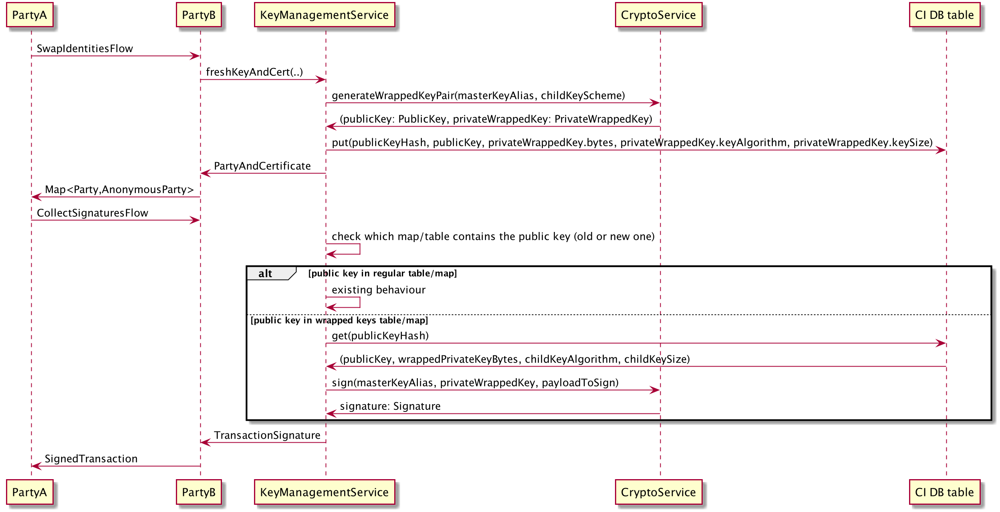

# Confidential identities in HSM

## Background

The current implementation of confidential identities in Corda stores the key material for both public and private keys in the node's database with the following security implications. 
If the database's data is not encrypted at rest, then the private key material is exposed. Even if the database is encrypted at rest, the private key material is temporarily exposed to the application's memory.
This design document investigates the available approaches that will allow a Corda node to make use of confidential identities without being able to access the key material through the use of hardware security modules (HSMs).

## Requirements

* The node is able to generate new public/private key pairs for confidential identities. It's able to share the generated public key and subsequently use the private key to sign transactions.
* The node is not able to get access to the private key material at any time, which should be accessible for signing purposes only by the HSM.
* The node (in cooperation with the HSM) is capable of creating, storing and using for signing a large number of public/private key pairs. 
This number is in the order of tens to hundreds of millions of keys with the potential of a higher upper bound in the future.
* The node is capable of storing any keys associated with the use of confidential identities in a separate HSM device (e.g. not the same used for legal identities or TLS), so that keys of different risk profiles can be segregated.
* The most common use-case will be using the same HSM for both legal and confidential identities. So, this case should require minimal additional configuration.
* Regardless of the approach selected, for any other keys needed excluding the confidential identities keys (i.e. master keys), there should be support for both generating them externally via a standard operational procedure and specifying them to the node by an alias or allowing the node to automatically generate them, if needed, during startup.
* There should be support for file-based key stores for testing purposes and consistency with the other keystore-related functionality (e.g. legal identity keys, TLS keys). This is not expected to be production-ready with regards to security and is allowed to potentially expose temporarily the key material in the application's memory, as long as the key material is not exposed at rest.
* The selected approach should make it as easy as possible to integrate with additional HSM vendors in the future.
* Ensure existing applications can upgrade from the current approach to the new one seamlessly, so that new transactions can leverage the new approach, but transactions using existing confidential identities can still keep using those.
* Nodes that use the new approach can interoperate seamlessly with nodes that use the previous approach.
* Enabling this feature should be configuration-driven. Given there will be multiple HSMs with varying support, a node configured to use this with an HSM that does not yet have support should fail-fast during startup, preventing runtime errors.
* Any library code provided by the HSM vendor (i.e. JCA providers) needs to be linked dynamically.
* For any HSMs that do not provide full support for this feature (i.e. because of missing APIs), the HSM should support a *degraded mode* of the feature. This degraded mode could expose the key material temporarily in the application's memory, but the key material should still not be accessible at rest.
* The node should not fall back to using the degraded mode without explicit consent from the node operator (i.e. via a configuration flag).

## Non-goals

Currently, the various required signatures for a transaction are being collected in sequence. 
The interaction with an HSM will now introduce additional round-trips, increasing the perceived latency, specifically in cases where there are multiple confidential identities in a single transaction.
This could be mitigated by parallelizing the flows involved in this process (`CollectSignaturesFlow`/`SignTransactionFlow`), but this will not be tackled as part of this design.

Also, the node should be able to be upgraded from the previous to the new modes of confidential identities in a seamless way, as described above. However, there is no requirement about migrating existing keys of confidential identities between different modes.

There is no requirement for the node to be able to use multiple HSMs simultaneously for confidential identities. 
Furthermore, there is no requirement that a node should be able to automatically switch from one HSM to a different one seamlessly. The operator will need to migrate out-of-band the master key to the new HSM and update the configuration to point to the new HSM.

A main assumption is that the database will be capable of storing the required number of keys, as specified in the requirements. As a result, whether it's possible and how to archive keys to reclaim space through some recycling process is out of scope for this design.

## Timeline

A first set of HSM vendors are planned to be integrated with the proposed solution in the short-term (next months), where this set will be selected according to the customer needs in the associated timeline. 
The main implication of this is that this will be released most likely as a minor version release, which means no public APIs can be introduced.

The remaining HSM vendors will be integrated at a subsequent phase, which might potentially be at a following major (or minor) release.

As discussed in the requirements section, there is a need for a degraded mode for any HSMs that do not provide full support for this feature. The delivery plan with regards to this aspect is the following:
* The initial release of this feature (under a minor release, as explained) has a tight timeline. For this reason, full support will be added only for the HSMs that are needed by customers. All the other HSMs will not have any support (not even in degraded mode) at this minor release. Customers would only be able to use a file-based keystore as an alternative or the current default of storing in the database unencrypted.
* The subsequent major release will contain full support for any HSMs that provide the required APIs and we support for the node's identity at this point. For any remaining HSMs, the feature will be supported in the degraded mode, while work will be scheduled to get the necessary APIs form the vendors to add full support.
* Going forward, every time support is added for an HSM (for the node's identity), the release will also contain full support for this feature. Only under circumstances when this is not possible, the feature will be supported in a degraded mode for the new HSM and the necessary work will be scheduled to track the delivery of full support.

## Design Decisions


.. toctree::
   :maxdepth: 2

   decisions/api.md
   decisions/database_tables.md
   decisions/crypto_interface.md
   decisions/key_management_service_api.md

## Proposed solution

The overall proposed solution is mostly the aggregation of the documented design decisions.

### Usage (configuration)

From the customer's point of view, the only thing needed to enable confidential identities in an HSM will be adding the appropriate configuration to the node, which will be of the following (indicative) form:
```
freshIdentitiesConfig: {
    mode: "WRAPPED_KEYS",
    cryptoServiceConfiguration: {
        cryptoServiceName: "SECUROSYS",
        cryptoServiceConf: "securosys.conf"
    },
    masterKeyAlias: "fresh-identities-master-key",
    createDuringStartup: "NO"
}
```
where:
* the `cryptoServiceConfiguration` field contains the configuration of the HSM. This will be the same for each HSM regardless of whether it's for legal or confidential identities.
* the `masterKeyAlias` field contains the alias, which is used to store the master/wrapping key.
* the `mode` field contains the mode that is used. Initially, the possible values for this will be:
  * `WRAPPED_KEYS`, which is using the wrapped keys approach, as presented above. This will be supported by all HSMs that provide full support for the feature.
  * `DEGRADED_WRAPPED_KEYS`, where the keys are still encrypted at rest, but they are generated from the application (instead of the HSM) and they are unwrapped inside the application. This mode will be supported by the file-based keystore and any HSMs that do not provide full support for this feature yet.
* The value `createDuringStartup` will determine whether the node should create the master key during startup or the alias has been created externally (or during a previous startup) and the node should be able to find it and use it. The possible values for this will be:
  * `YES`: the node will create the master key during startup.
  * `NO`: the node will not create the master key during startup. It must have been created in advance externally.
  * `ONLY_IF_MISSING`: the node will check whether they key exists and will create it, only if it is missing. This value is supposed to be used mainly for testing to remove the need for complicated setup/cleanup steps.
* Appropriate logic will be added to exit during startup, in case of improper configuration, i.e.:
  * If `createDuringStartup` is `YES` and the key already exists, the node will exit displaying the appropriate error. To proceed, the node operator will have to set `createDuringStartup` to `NO`, essentially acknowledging the key already exists.
  * If `createDuringStartup` is `NO` and the key does not exist, the node will also exit displaying the appropriate error, highlighting that the master key has not been pre-created, as expected. To proceed, the operator will have to either create the key externally or set `createDuringStartup` to `YES`, instructing the node to create the key.

For optimal user experience, the configuration block will be optional, having some reasonable defaults combined with the necessary safety checks. More specifically:
* If `cryptoServiceConfiguration` is missing, the default will be the current behaviour, which is storing the keys in the database without any encryption/wrapping.
* `mode` will be a mandatory configuration value without any defaults.
* The default value of `masterKeyAlias` will be `fresh-identities-master-key`.
* The default value of `createDuringStartup` will be `YES`. The safety checks on this value are described above.

Note that in the default case, a warning will now be emitted during startup informing the operator that there is a more secure mode now with a link to the documentation that demonstrates how to configure it.
A configuration flag will be available, so that the operator can disable the warning, while still maintaining the default behaviour, if needed.

The core principles that led to the behaviour specified above are the following:
* The behaviour of the node should be the same across versions, when the same configuration is used. This means that keys are stored in the same place and in the same form.
* The node operator is always informed when something unexpected occurs and the operator's consent is essentially received via the configuration adjustments.


### Database changes

A new database table will be created that will contain the mappings for the new confidential identities keys.
The table will contain the following columns:
* `public_key_hash`: containing the hash of the public key (primary key)
* `public_key`: containing the public key material
* `private_key_wrapped`: containing the encrypted material of the private key
* `scheme`: containing a label that signals which serialization scheme was used (i.e. algorithm, key size etc.)

### Code changes

The following methods will be added to the `CryptoService` interface:
```kotlin
interface CryptoService {
    fun createWrappingKey(alias: String)
    fun generateWrappedKeyPair(masterKeyAlias: String, childKeyScheme: SignatureScheme): Pair<PublicKey, WrappedPrivateKey>
    fun sign(masterKeyAlias: String, wrappedPrivateKey: WrappedPrivateKey, payloadToSign: ByteArray): Signature
    
    fun getSupportedMode(): Mode
}
```
where:
* the method `createWrappingKey()` will be used during startup to create the master/wrapping key, depending on the configuration value of `createDuringStartup`.
* the methods `generateWrappedKeyPair()`, `sign()` will be used at runtime to generate new keys or sign with existing keys.
* the method `getSupportedMode()` will return the mode supported. For the beginning, this will be either `WRAPPED_KEYS` or `DEGRADED_WRAPPED_KEYS`, as described previously.

The `KeyManagementService` currently depends on a single `CryptoService`, which is used for all purposes. 
With these changes, this component will now depend on two instances of it, one used for operations using legal identity keys and another one used for confidential identities.
Depending on the node's configuration, these 2 instances could correspond to the same HSM or different HSMs.

### Implementation changes

During startup, the node will do the following:
* read the node configuration and set the proper default values for the values not provided, as described above.
* perform a safety check to see if the configured mode is supported by the configured `CryptoService`. If not, exit with the appropriate message, indicating the alternative options, as described above.
* create the master/wrapping key, if required depending on the value of `createDuringStartup`.
* initialise the instance of `CryptoService` used for confidential identities and wire it in the `KeyManagementService`.
* proceed with the remaining startup steps.

The flow during creation of new confidential identities and signing with existing ones will be the following:



There are 2 main changes introduced in the flow inside the `KeyManagementService` component:
* During creation of a confidential identity, the node will now use the new instance of `CryptoService` to generate new keys and will then store them in the new table.
* During a signing operation, the node will determine the type of the key pair associated with the public key and how the signing operation will be performed, depending on where the key is stored.