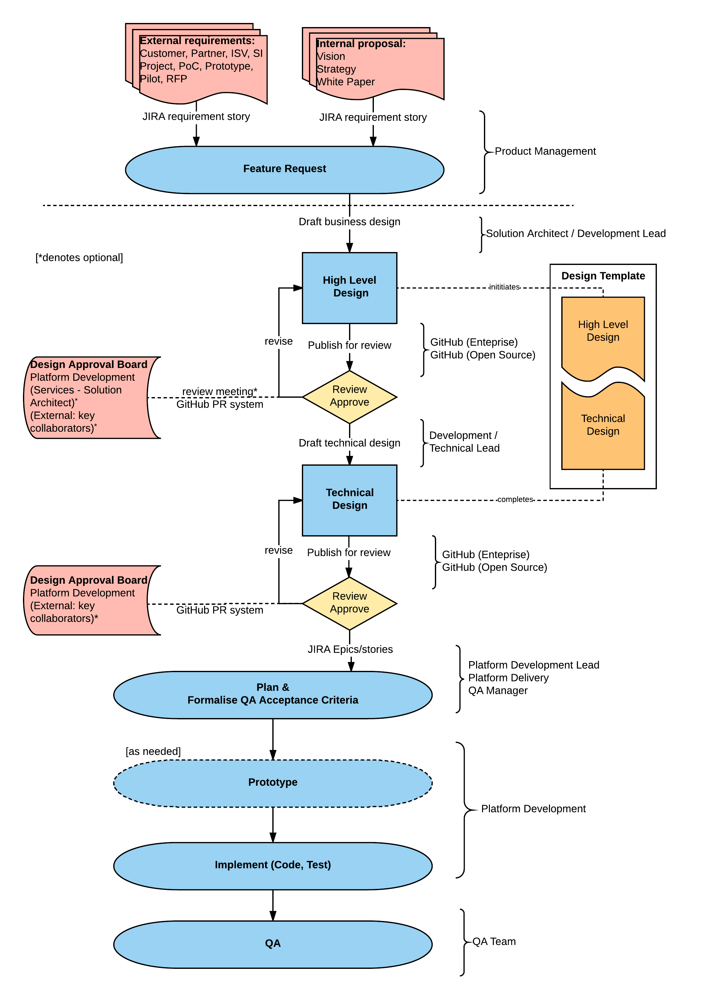

# Design review process

The Corda Design Review process defines a means of editing, storing, collaborating, reviewing and approving Corda documentation in a consistent, structured, easily accessible and open manner.   

## Background

Historically, Corda design documentation has been produced in an ad hoc fashion to include:
* Multiple sources and formats of storage
    * Internal ([Tech/Arch technical discussion](https://r3-cev.atlassian.net/wiki/spaces/AR/pages/2588746/Internal+Technical+Discussion)) and External ([AWG design documents](https://r3-cev.atlassian.net/wiki/spaces/AWG/pages/56623418/Design+Documents)) facing wiki(s)
    * [Public github wiki](https://github.com/corda/corda/wiki)
    * [Discourse posts](https://discourse.corda.net/c/corda-discussion)
* Multiple authored versions of same design with differing coverage
    * Elaboration and/or additions to scope
    * Differing opinions, proposals, suggestions.
* Unstructured prose (no consistency in format and structure)
* Lack of versioning (wiki documents typically evolve without versioned references)
* Lack of traceability (audit) to original requirement(s)
* Undefined review and approval process, leading to misunderstandings and open interpretations at time of implementation by platform development team
* Lack of proposed implementation plan (time, resources, effort).
* Often missing stakeholder collaboration and review in the feedback cycle. 

## Process

This process specifies:

1. Usage of a design template to include:
    * Versioning: design documents can be referenced at a point in time, and evolve from such.
    * Review and approval history: incorporating relevant stakeholders from R3 (Platform, Product Management, Services) and 
      other relevant review groups (community, partners, customers, key collaborators) as deemed appropriate to the request. Ensure design 
      meets the requirements and is realizable within a proposed implementation timeframe.
    * Consistent structure and headings: top level headings should be preserved, second level headings provide guidance on 
      content to include, and may be omitted where not relevant.
    * The design template includes both High Level (conceptual, logical) and Technical (implementation specific) sections.
    * Design decisions are clearly identified with pros/cons of proposed options, and agreed recommendation.  

2. Document review and approval by relevant stakeholders and impacted parties to include R3 organisational units, such as Platform Engineering, Product Management and Services (where relevant), and key stakeholders, to include customers, partners, key collaborators, and community leaders. 
    * Product owner (originator of requirements)
    * Design Approval Board (DAB)
    * Platform Development technical lead (and/or nominated developer(s))
    * Project Technical Lead / Solution Architect (if originating from an R3 Technical Services project)
    * Other identified stakeholders (community leaders, partners, customers, key collaborators)

3. Planning: allocation to Corda (open source) or Enterprise project JIRA epic(s) (and/or set of stories) and prioritisation within Product Backlog for future implementation within a Development Team Sprint.

4. Document repository locations, according to whether the design is related to Open Source or Enterprise (internal only).
  The recommended repository source is GitHub, and documents should be stored in [Markdown](https://en.wikipedia.org/wiki/Markdown).
  The collaboration and review process should follow the standard [GitHub Pull Request](https://confluence.atlassian.com/bitbucket/work-with-pull-requests-223220593.html) mechanism.
    * [Enterprise Github repository](https://github.com/corda/enterprise)
    * [Open Source Github repository](https://github.com/corda/corda) 

The following diagram illustrates the process flow:

## Review Groups

Design documents should include all relevant stakeholders in their distribution (mostly as PR reviewers in github).  This will often vary and depend on the origin of the Feature Request, particularly for high level business requirements. Technical Design Documents will tend to include a small set of stakeholders (Design Approval Board, Platform Development, DevOps). Final approval authority lays with at least one member of the Design Approval Board (DAB) or nominated delegate(s).

Design Approval Board (DAB)	
* Richard G Brown (CTO)
* James Carlyle (Chief Engineer)
* Mike Hearn (Lead Platform Engineer)
* Mark Oldfield (Lead Platform Architect)
* Jonathan Sartin (Information Security manager)
* Select external key contributors (directly involved in design process)

Other review groups inlcude:

* Product Management 

* Developer Relations 

* Platform Development Team Leads

  (may nominate team members as design leads)

* DevOps 

* Services – Project (Incubation & Acceleration)

  * Nominated project leads

  Services – Technical (Consulting)
  * Nominated solution architects

* External

  * AWG (general)
  * Consortium members
  * ISV, SI, Partners
  * Customers
  * Key collaborators

## Applicability and Timing

This process should be applied to any major feature request gathered by the product management team or lead technologists that has been entered in the product backlog as a requirement, and has been prioritized for imminent execution.

Publication and distribution of a design document from initial review to full approval will vary on a case by case basis. 

In general,
 * High Level designs may require a longer approval cycle as they may need to host a formal review meeting with the DAB in attendance, 
   and will typically have larger stakeholder audiences (potentially including external reviewers), thus leading to multiple iterations of revision.
   In either case the High Level design must be raised as a GitHub PR and obtain formal approval by reviewers.  
 * Technical designs are anticipated to go through a shorter cycle, with immediate feedback via the GitHub PR workflow. 
   Once approved, a Technical Design should be decomposed into a set of implementable Epic/Stories for prioritization and 
   scheduling as part of Development team(s) delivery cycle(s).
