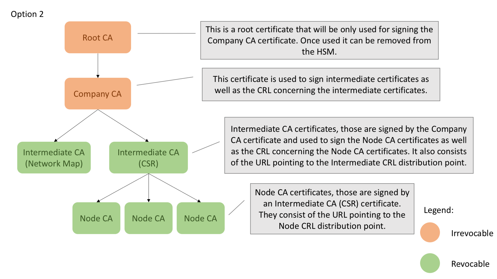

--------------------------------------------
Design Decision: Certificate hierarchy levels
============================================

## Background / Context

The decision of how many levels to include is a key feature of the [proposed certificate hierarchy](../design.md).

## Options Analysis

### Option 1: 2-level hierarchy

Under this option, intermediate CA certificates for key signing services (Doorman, Network Map, CRL) are generated as direct children of the root certificate.

#### Advantages

- Simplest option
- Minimal change to existing structure

#### Disadvantages

- The Root CA certificate is used to sign both intermediate certificates and CRL. This may be considered as a drawback as the Root CA should be used only to issue other certificates.

### Option 2: 3-level hierarchy

Under this option, an additional 'Company CA' cert is generated from the root CA cert, which is then used to generate intermediate certificates.

#### Advantages

- Allows for option to remove the root CA from the network altogether and store in an offline medium - may be preferred by some stakeholders
- Allows (theoretical) revocation and replacement of the company CA cert without needing to replace the trust root.

#### Disadvantages

- Greater complexity

## Recommendation and justification

Proceed with option 1: 2-level hierarchy.

No authoritative argument from a security standpoint has been made which would justify the added complexity of option 2. Given the business impact of revoking the Company CA certificate, this must be considered an extremely unlikely event with comparable implications to the revocation of the root certificate itself; hence no practical justification for the addition of the third level is observed.