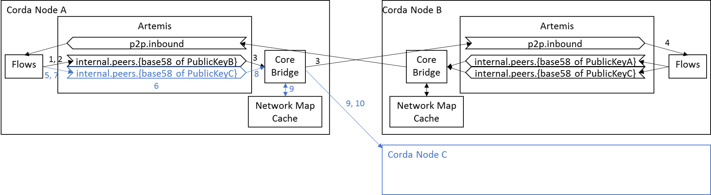
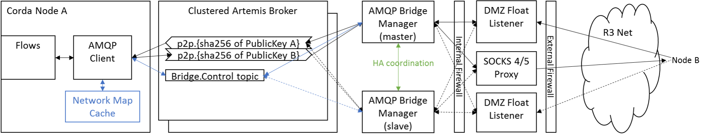
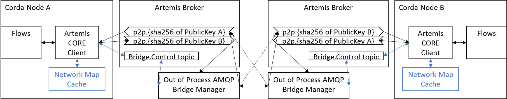

# Float Design

.. important:: This design document describes a feature of Corda Enterprise.

## Overview

The role of the 'float' is to meet the requirements of organisations that will not allow direct incoming connections to
their node, but would rather host a proxy component in a DMZ to achieve this. As such it needs to meet the requirements
of modern DMZ security rules, which essentially assume that the entire machine in the DMZ may become compromised.  At
the same time, we expect that the Float can interoperate with directly connected nodes, possibly even those using open
source Corda.

### Background

#### Current state of peer-to-peer messaging in Corda

The diagram below illustrates the current mechanism for peer-to-peer messaging between Corda nodes.

When a flow running on a Corda node triggers a requirement to send a message to a peer node, it first checks for
pre-existence of an applicable message queue for that peer.

**If the relevant queue exists:** 

1. The node submits the message to the queue and continues after receiving acknowledgement.
2. The Core Bridge picks up the message and transfers it via a TLS socket to the inbox of the destination node.
3. A flow on the recipient receives message from peer and acknowledged consumption on bus when the flow has checkpointed this progress.

**If the queue does not exist (messaging a new peer):**

1. The flow triggers creation of a new queue with a name encoding the identity of the intended recipient.
2. When the queue creation has completed the node sends the message to the queue.
3. The hosted Artemis server within the node has a queue creation hook which is called.
4. The queue name is used to lookup the remote connection details and a new bridge is registered.
5. The client certificate of the peer is compared to the expected legal identity X500 Name. If this is OK, message flow proceeds as for a pre-existing queue (above).

## Scope

* Goals:
  * Allow connection to a Corda node without requiring direct incoming connections from external participants.
  * Allow connections to a Corda node without requiring the node itself to have a public IP address. Separate TLS connection handling from the MQ broker.
* Non-goals (out of scope):
  * Support for MQ brokers other than Apache Artemis

## Timeline
For delivery by end Q1 2018.

## Requirements
Allow connectivity in compliance with DMZ constraints commonly imposed by modern financial institutions; namely: 
1. Firewalls required between the internet and any device in the DMZ, and between the DMZ and the internal network
2. Data passing from the internet and the internal network via the DMZ should pass through a clear protocol break in the DMZ.
3. Only identified IPs and ports are permitted to access devices in the DMZ; this include communications between devices co-located in the DMZ.
4. Only a limited number of ports are opened in the firewall (<5) to make firewall operation manageable. These ports must change slowly.
5. Any DMZ machine is typically multi-homed, with separate network cards handling traffic through the institutional
   firewall vs. to the Internet. (There is usually a further hidden management interface card accessed via a jump box for
   managing the box and shipping audit trail information). This requires that our software can bind listening ports to the
   correct network card not just to 0.0.0.0.
6. No connections to be initiated by DMZ devices towards the internal network. Communications should be initiated from
   the internal network to form a bidirectional channel with the proxy process.
7. No business data should be persisted on the DMZ box.
8. An audit log of all connection events is required to track breaches. Latency information should also be tracked to
   facilitate management of connectivity issues.
9. Processes on DMZ devices run as local accounts with no relationship to internal permission systems, or ability to
   enumerate devices on the internal network.
10. Communications in the DMZ should yse modern TLS, often with local-only certificates/keys that hold no value outside of use in predefined links.
11. Where TLS is required to terminate on the firewall, provide a suitably secure key management mechanism (e.g. an HSM).
12. Any proxy in the DMZ should be subject to the same HA requirements as the devices it is servicing
13. Any business data passing through the proxy should be separately encrypted, so that no data is in the clear of the
    program memory if the DMZ box is compromised.

## Design Decisions

The following design decisions fed into this design:

.. toctree::
   :maxdepth: 2

   decisions/p2p-protocol.md
   decisions/ssl-termination.md
   decisions/e2e-encryption.md
   decisions/pluggable-broker.md

## Target Solution

The proposed solution introduces a reverse proxy component ("**float**") which may be sited in the DMZ, as illustrated
in the diagram below.

The main role of the float is to forward incoming AMQP link packets from authenticated TLS links to the AMQP Bridge
Manager, then echo back final delivery acknowledgements once the Bridge Manager has successfully inserted the messages.
The Bridge Manager is responsible for rejecting inbound packets on queues that are not local inboxes to prevent e.g.
'cheating' messages onto management topics, faking outgoing messages etc.

The float is linked to the internal AMQP Bridge Manager via a single AMQP/TLS connection, which can contain multiple
logical AMQP links. This link is initiated at the socket level by the Bridge Manager towards the float.

The float is a **listener only** and does not enable outgoing bridges (see Design Decisions, above). Outgoing bridge
formation and message sending come directly from the internal Bridge Manager (possibly via a SOCKS 4/5 proxy, which is
easy enough to enable in netty, or directly through the corporate firewall. Initiating from the float gives rise to
security concerns.)

The float is **not mandatory**; interoperability with older nodes, even those using direct AMQP from bridges in the
node, is supported.

**No state will be serialized on the float**, although suitably protected logs will be recorded of all float activities.

**End-to-end encryption** of the payload is not delivered through this design (see Design Decisions, above). For current
purposes, a header field indicating plaintext/encrypted payload is employed as a placeholder.

**HA** is enabled (this should be easy as the bridge manager can choose which float to make active). Only fully
connected DMZ floats should activate their listening port.

Implementation of the float is expected to be based on existing AMQP Bridge Manager code - see Implementation Plan,
below, for expected work stages.

### Bridge control protocol

The bridge control is designed to be as stateless as possible. Thus, nodes and bridges restarting must
re-request/broadcast information to each other. Messages are sent to a 'bridge.control' address in Artemis as
non-persistent messages with a non-durable queue. Each message should contain a duplicate message ID, which is also
re-used as the correlation id in replies. Relevant scenarios are described below:

#### On bridge start-up, or reconnection to Artemis
1. The bridge process should subscribe to the 'bridge.control'.
2. The bridge should start sending QueueQuery messages which will contain a unique message id and an identifier for the bridge sending the message.
3. The bridge should continue to send these until at least one node replies with a matched QueueSnapshot message.
4. The QueueSnapshot message replies from the nodes contains a correlationId field set to the unique id of the QueueQuery query, or the correlation id is null. The message payload is a list of inbox queue info items and a list of outbound queue info items. Each queue info item is a tuple of Legal X500 Name (as expected upon the destination TLS certificates) and the queue name which should have the form of "internal.peers."+hash key of legal identity (using the same algorithm as  we use in the db to make the string). Note this queue name is a change from the current logic, but will be more portable to length constrained topics and allow multiple inboxes on the same broker.
5. The bridge should process the QueueSnapshot, initiating links to the outgoing targets. It should also add expected inboxes to its in-bound permission list.
6. When an outgoing link is successfully formed the remote client certificate should be checked against the expected X500 name. Assuming the link is valid the bridge should subscribe to the related queue and start trying to forward the messages.

#### On node start-up, or reconnection to Artemis
1. The node should subscribe to 'bridge.control'.
2. The node should enumerate the queues and identify which are have well known identities in the network map cache. The appropriate information about its own inboxes and any known outgoing queues should be compiled into an unsolicited QueueSnapshot message with a null correlation id. This should be broadcasted to update any bridges that are running.
3. If any QueueQuery messages arrive these should be responded to with specific QueueSnapshot messages with the correlation id set.

#### On network map updates
1. On receipt of any network map cache updates the information should be evaluated to see if any addition queues can now be mapped to a bridge. At this point a BridgeRequest packet should be sent which will contain the legal X500Name and queue name of the new update.

#### On flow message to Peer
1. If a message is to be sent to a peer the code should (as it does now) check for queue existence in its cache and then on the broker. If it does exist it simply sends the message.
2. If the queue is not listed in its cache it should block until the queue is created (this should be safe versus race conditions with other nodes).
3. Once the queue is created the original message and subsequent messages can now be sent.
4. In parallel a BridgeRequest packet should be sent to activate a new connection outwards. This will contain the contain the legal X500Name and queue name of the new queue.
5. Future QueueSnapshot requests should be responded to with the new queue included in the list.

### Behaviour with a Float portion in the DMZ

1. On initial connection of an inbound bridge, AMQP is configured to run a SASL challenge response to (re-)validate the 
   origin and confirm the client identity. (The most likely SASL mechanism for this is using https://tools.ietf.org/html/rfc3163 
   as this allows reuse of our PKI certificates in the challenge response. Potentially we could forward some bridge control 
   messages to cover the SASL exchange to the internal Bridge Controller. This would allow us to keep the private keys 
   internal to the organisation, so we may also require a SASLAuth message type as part of the bridge control protocol.)
2. The float restricts acceptable AMQP topics to the name space appropriate for inbound messages only. Hence, there 
   should be no way to tunnel messages to bridge control, or RPC topics on the bus.
3. On receipt of a message from the external network, the Float should append a header to link the source channel's X500 
   name, then create a Delivery for forwarding the message inwards.
4. The internal Bridge Control Manager process validates the message further to ensure that it is targeted at a legitimate 
   inbox (i.e. not an outbound queue) and then forwards it to the bus. Once delivered to the broker, the Delivery 
   acknowledgements are cascaded back.
5. On receiving Delivery notification from the internal side, the Float acknowledges back the correlated original Delivery.
6. The Float should protect against excessive inbound messages by AMQP flow control and refusing to accept excessive unacknowledged deliveries.
7. The Float only exposes its inbound server socket when activated by a valid AMQP link from the Bridge Control Manager 
   to allow for a simple HA pool of DMZ Float processes. (Floats cannot run hot-hot as this would invalidate Corda's 
   message ordering guarantees.)

## Implementation plan

### Proposed incremental steps towards a float

1. First, I would like to more explicitly split the RPC and P2P MessagingService instances inside the Node. They can 
   keep the same interface, but this would let us develop P2P and RPC at different rates if required.
   
2. The current in-node design with Artemis Core bridges should first be replaced with an equivalent piece of code that
   initiates send only bridges using an in-house wrapper over the proton-j library. Thus, the current Artemis message
   objects will be picked up from existing queues using the CORE protocol via an abstraction interface to allow later
   pluggable replacement. The specific subscribed queues are controlled as before and bridges started by the existing code
   path. The only difference is the bridges will be the new AMQP client code. The remote Artemis broker should accept
   transferred packets directly onto its own inbox queue and acknowledge receipt via standard AMQP Delivery notifications.
   This in turn will be acknowledged back to the Artemis Subscriber to permanently remove the message from the source
   Artemis queue. The headers for deduplication, address names, etc will need to be mapped to the AMQP messages and we will
   have to take care about the message payload. This should be an envelope that is capable in the future of being
   end-to-end encrypted. Where possible we should stay close to the current Artemis mappings.

3. We need to define a bridge control protocol, so that we can have an out of process float/bridge.  The current process
   is that on message send the node checks the target address to see if the target queue already exists. If the queue
   doesn't exist it creates a new queue which includes an encoding of the PublicKey in its name. This is picked up by a
   wrapper around the Artemis Server which is also hosted inside the node and can ask the network map cache for a
   translation to a target host and port. This in turn allows a new bridge to be provisioned. At node restart the
   re-population of the network map cache is followed to re-create the bridges to any unsent queues/messages.

4. My proposal for a bridge control protocol is partly influenced by the fact that AMQP does not have a built-in
   mechanism for queue creation/deletion/enumeration. Also, the flows cannot progress until they are sure that there is an
   accepting queue. Finally, if one runs a local broker it should be fine to run multiple nodes without any bridge
   processes. Therefore, I will leave the queue creation as the node's responsibility. Initially we can continue to use the
   existing CORE protocol for this. The requirement to initiate a bridge will change from being implicit signalling via
   server queue detection to being an explicit pub-sub message that requests bridge formation. This doesn't need
   durability, or acknowledgements, because when a bridge process starts it should request a refresh of the required bridge
   list. The typical create bridge messages should contain:

   1. The queue name (ideally with the sha256 of the PublicKey, not the whole PublicKey as that may not work on brokers with queue name length constraints).
   2. The expected X500Name for the remote TLS certificate.
   3. The list of host and ports to attempt connection to. See separate section for more info.
    
5. Once we have the bridge protocol in place and a bridge out of process the broker can move out of process too, which
   is a requirement for clustering anyway. We can then start work on floating the bridge and making our broker pluggable.

    1. At this point the bridge connection to the local queues should be upgraded to also be AMQP client, rather than CORE
       protocol, which will give the ability for the P2P bridges to work with other broker products.
    2. An independent task is to look at making the Bridge process HA, probably using a similar hot-warm mastering solution
       as the node, or atomix.io. The inactive node should track the control messages, but obviously doesn't initiate any
       bridges.
    3. Another potentially parallel piece of development is to start to build a float, which is essentially just splitting
       the bridge in two and putting in an intermediate hop AMQP/TLS link. The thin proxy in the DMZ zone should be as
       stateless as possible in this.
    4. Finally, the node should use AMQP to talk to its local broker cluster, but this will have to remain partly tied 
       to Artemis, as queue creation will require sending management messages to the Artemis core, but we should be 
       able to abstract this.

### Float evolution

#### In-Process AMQP Bridging

In this phase of evolution we hook the same bridge creation code as before and use the same in-process data access to
network map cache. However, we now implement AMQP sender clients using proton-j and netty for TLS layer and connection
retry. This will also involve formalising the AMQP packet format of the Corda P2P protocol. Once a bridge makes a
successful link to a remote node's Artemis broker it will subscribe to the associated local queue. The messages will be
picked up from the local broker via an Artemis CORE consumer for simplicity of initial implementation. The queue
consumer should be implemented with a simple generic interface as façade, to allow future replacement. The message will
be sent across the AMQP protocol directly to the remote Artemis broker. Once acknowledgement of receipt is given with an
AMQP Delivery notification the queue consumption will be acknowledged. This will remove the original item from the
source queue. If delivery fails due to link loss the subscriber should be closed until a new link is established to
ensure messages are not consumed. If delivery fails for other reasons there should be some for of periodic retry over
the AMQP link. For authentication checks the client cert returned from the remote server will be checked and the link
dropped if it doesn't match expectations.

#### Out of process Artemis Broker and Bridges

Move the Artemis broker and bridge formation logic out of the node. This requires formalising the bridge creation
requests, but allows clustered brokers, standardised AMQP usage and ultimately pluggable brokers. We should implement a
netty socket server on the bridge and forward authenticated packets to the local Artemis broker inbound queues. An AMQP
server socket is required for the float, although it should be transparent whether a NodeInfo refers to a bridge socket
address, or an Artemis broker. The queue names should use the sha-256 of the PublicKey not the full key. Also, the name
should be used for in and out queues, so that multiple distinct nodes can coexist on the same broker. This will simplify
development as developers just run a background broker and shouldn't need to restart it. To export the network map
information and to initiate bridges a non-durable bridge control protocol will be needed (in blue). Essentially the
messages declare the local queue names and target TLS link information. For in-bound messages only messages for known
inbox targets will be acknowledged. It should not be hard to make the bridges active-passive HA as they contain no
persisted message state and simple RPC can resync the state of the bridge. Queue creation will remain with the node as
this must use non-AMQP mechanisms and because flows should be able to queue sent messages even if the bridge is
temporarily down. In parallel work can start to upgrade the local links to Artemis (i.e. the node-Artemis link and the
Bridge Manager-Artemis link) to be AMQP clients as much as possible.
