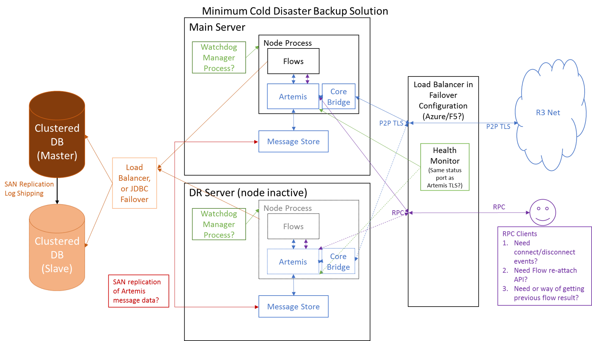

# High availability support

.. important:: This design document describes a feature of Corda Enterprise.

## Overview
### Background

The term high availability (HA) is used in this document to refer to the ability to rapidly handle any single component
failure, whether due to physical issues (e.g. hard drive failure), network connectivity loss, or software faults.

Expectations of HA in modern enterprise systems are for systems to recover normal operation in a few minutes at most,
while ensuring minimal/zero data loss. Whilst overall reliability is the overriding objective, it is desirable for Corda
to offer HA mechanisms which are both highly automated and transparent to node operators. HA mechanism must not involve
any configuration changes that require more than an appropriate admin tool, or a simple start/stop of a process as that
would need an Emergency Change Request.

HA naturally grades into requirements for Disaster Recovery (DR), which requires that there is a tested procedure to
handle large scale multi-component failures e.g. due to data centre flooding, acts of terrorism.  DR processes are
permitted to involve significant manual intervention, although the complications of actually invoking a Business
Continuity Plan (BCP) mean that the less manual intervention, the more competitive Corda will be in the modern vendor
market. For modern financial institutions, maintaining comprehensive and effective BCP procedures are a legal
requirement which is generally tested at least once a year.

However, until Corda is the system of record, or the primary system for transactions we are unlikely to be required to
have any kind of fully automatic DR. In fact, we are likely to be restarted only once BCP has restored the most critical
systems. In contrast, typical financial institutions maintain large, complex technology landscapes in which individual
component failures can occur, such as:

* Small scale software failures
* Mandatory data centre power cycles
* Operating system patching and restarts
* Short lived network outages
* Middleware queue build-up
* Machine failures

Thus, HA is essential for enterprise Corda and providing help to administrators necessary for rapid fault diagnosis.

### Current node topology

The current solution has a single integrated process running in one JVM including Artemis, H2 database, Flow State
Machine, P2P bridging. All storage is on the local file system. There is no HA capability other than manual restart of
the node following failure.

#### Limitations

- All sub-systems must be started and stopped together.
- Unable to handle partial failure e.g. Artemis.
- Artemis cannot use its in-built HA capability (clustered slave mode) as it is embedded.
- Cannot run the node with the flow state machine suspended.
- Cannot use alternative message brokers.
- Cannot run multiple nodes against the same broker.
- Cannot use alternative databases to H2.
- Cannot share the database across Corda nodes.
- RPC clients do have automatic reconnect but there is no clear solution for resynchronising on reconnect.
- The backup strategy is unclear.

## Requirements
### Goals

* A logical Corda node should continue to function in the event of an individual component failure or (e.g.) restart.
* No loss, corruption or duplication of data on the ledger due to component outages
* Ensure continuity of flows throughout any disruption
* Support software upgrades in a live network

### Non-goals (out of scope for this design document)

* Be able to distribute a node over more than two data centers.
* Be able to distribute a node between data centers that are very far apart latency-wise (unless you don't care about performance).
* Be able to tolerate arbitrary byzantine failures within a node cluster.
* DR, specifically in the case of the complete failure of a site/datacentre/cluster or region will require a different 
  solution to that specified here. For now DR is only supported where performant synchronous replication is feasible 
  i.e. sites only a few miles apart.

## Timeline 

This design document outlines a range of topologies which will be enabled through progressive enhancements from the
short to long term.

On the timescales available for the current production pilot deployments we clearly do not have time to reach the ideal
of a highly fault tolerant, horizontally scaled Corda.

Instead, I suggest that we can only achieve the simplest state of a standby Corda installation only by January 5th and
even this is contingent on other enterprise features, such as external database and network map stabilisation being
completed on this timescale, plus any issues raised by testing.

For the Enterprise GA timeline, I hope that we can achieve a more fully automatic node failover state, with the Artemis
broker running as a cluster too. I include a diagram of a fully scaled Corda for completeness and so that I can discuss
what work is re-usable/throw away.

With regards to DR it is unclear how this would work where synchronous replication is not feasible. At this point we can
only investigate approaches as an aside to the main thrust of work for HA support. In the synchronous replication mode
it is assumed that the file and database replication can be used to ensure a cold DR backup.

## Design Decisions

The following design decisions are assumed by this design:

.. toctree::
   :maxdepth: 1
   
   decisions/near-term-target.md
   decisions/medium-term-target.md
   decisions/external-broker.md
   decisions/db-msg-store.md
   decisions/ip-addressing.md
   decisions/crash-shell.md

## Target Solution

### Hot-Cold (minimum requirement)

Small scale software failures on a node are recovered from locally via restarting/re-setting the offending component by
the external (to JVM) "Health Watchdog" (HW) process. The HW process (eg a shell script or similar) would monitor
parameters for java processes by periodically query them (sleep period a few seconds). This may require introduction of
a few monitoring 'hooks' into Corda codebase or a "health" CorDapp the HW script can interface with. There would be a
back-off logic to prevent continues restarts in the case of persistent failure.

We would provide a fully-functional sample HW script for Linux/Unix deployment platforms.

The hot-cold design provides a backup VM and Corda deployment instance that can be manually started if the primary is
stopped. The failed primary must be killed to ensure it is fully stopped.

For single-node deployment scenarios the simplest supported way to recover from failures is to re-start the entire set
of Corda Node processes or reboot the node OS.

For a 2-node HA deployment scenario a load balancer determines which node is active and routes traffic to that node. The
load balancer will need to monitor the health of the primary and secondary nodes and automatically route traffic from
the public IP address to the only active end-point. An external solution is required for the load balancer and health
monitor. In the case of Azure cloud deployments, no custom code needs to be developed to support the health monitor.

An additional component will be written to prevent accidental dual running which is likely to make use of a database
heartbeat table. Code size should be minimal.

#### Advantages

- This approach minimises the need for new code so can be deployed quickly.
- Use of a load balancer in the short term avoids the need for new code and configuration management to support the alternative approach of multiple advertised addresses for a single legal identity.
- Configuration of the inactive mode should be a simple mirror of the primary.
- Assumes external monitoring and management of the nodes e.g. ability to identify node failure and that Corda watchdog code will not be required (customer developed).

#### Limitations

- Slow failover as this is manually controlled.
- Requires external solutions for replication of database and Artemis journal data.
- Replication mechanism on agent banks with real servers not tested.
- Replication mechanism on Azure is under test but may prove to be too slow.
- Compatibility with external load balancers not tested. Only Azure configuration tested.
- Contingent on completion of database support and testing of replication.
- Failure of database (loss of connection) may not be supported or may require additional code.
- RPC clients assumed to make short lived RPC requests e.g. from Rest server so no support for long term clients operating across failover.
- Replication time point of the database and Artemis message data are independent and may not fully synchronise (may work subject to testing) .
- Health reporting and process controls need to be developed by the customer.

### Hot-Warm (Medium-term solution)

Hot-warm aims to automate failover and provide failover of individual major components e.g. Artemis.

It involves Two key changes to the hot-cold design: 
1)	Separation and clustering of the Artemis broker.
2)	Start and stop of flow processing without JVM exit.

The consequences of these changes are that peer to peer bridging is separated from the node and a bridge control
protocol must be developed. A leader election component is a pre-cursor to load balancing – likely to be a combination
of custom code and standard library and, in the short term, is likely to be via the database. Cleaner handling of
disconnects from the external components (Artemis and the database) will also be needed.

#### Advantages

- Faster failover as no manual intervention.
- We can use Artemis replication protocol to replicate the message store.
- The approach is integrated with preliminary steps for the float.
- Able to handle loss of network connectivity to the database from one node.
- Extraction of Artemis server allows a more standard Artemis deployment.
- Provides protection against resource leakage in Artemis or Node from affecting the other component.
- VMs can be tuned to address different work load patterns of broker and node.
- Bridge work allows chance to support multiple IP addresses without a load balancer.

#### Limitations

- This approach will require careful testing of resource management on partial shutdown.
- No horizontal scaling support.
- Deployment of master and slave may not be completely symmetric.
- Care must be taken with upgrades to ensure master/slave election operates across updates.
- Artemis clustering does require a designated master at start-up of its cluster hence any restart involving changing 
  the primary node will require configuration management.
- The development effort is much more significant than the hot-cold configuration.

### Hot-Hot (Long-term strategic solution)

In this configuration, all nodes are actively processing work and share a clustered database. A mechanism for sharding
or distributing the work load will need to be developed.

#### Advantages

- Faster failover as flows are picked up by other active nodes.
- Rapid scaling by adding additional nodes.
- Node deployment is symmetric.
- Any broker that can support AMQP can be used.
- RPC can gracefully handle failover because responsibility for the flow can be migrated across nodes without the client being aware.

#### Limitations

- Very significant work with many edge cases during failure.
- Will require handling of more states than just checkpoints e.g. soft locks and RPC subscriptions.
- Single flows will not be active on multiple nodes without future development work.

## Implementation plan

### Transitioning from Corda 2.0 to Manually Activated HA

The current Corda is built to run as a fully contained single process with the Flow logic, H2 database and Artemis
broker all bundled together. This limits the options for automatic replication, or subsystem failure. Thus, we must use
external mechanisms to replicate the data in the case of failure. We also should ensure that accidental dual start is
not possible in case of mistakes, or slow shutdown of the primary.

Based on this situation, I suggest the following minimum development tasks are required for a tested HA deployment:

1. Complete and merge  JDBC support for an external clustered database. Azure SQL Server has been identified as the most
   likely initial deployment. With this we should be able to point at an HA database instance for Ledger and Checkpoint data.
2. I am suggesting that for the near term we just use the Azure Load Balancer to hide the multiple machine addresses. 
   This does require allowing a health monitoring link to the Artemis broker, but so far testing indicates that this 
   operates without issue. Longer term we need to ensure that the network map and configuration support exists for the 
   system to work with multiple TCP/IP endpoints advertised to external nodes. Ideally this should be rolled into the 
   work for AMQP bridges and Floats.
3. Implement a very simple mutual exclusion feature, so that an enterprise node cannot start if another is running onto 
   the same database. This can be via a simple heartbeat update in the database, or possibly some other library. This 
   feature should be enabled only when specified by configuration.
4. The replication of the Artemis Message Queues will have to be via an external mechanism. On Azure we believe that the 
   only practical solution is the 'Azure Files' approach which maps a virtual Samba drive. This we are testing in-case it 
   is too slow to work. The mounting of separate Data Disks is possible, but they can only be mounted to one VM at a 
   time, so they would not be compatible with the goal of no change requests for HA.
5. Improve health monitoring to better indicate fault failure. Extending the existing JMX and logging support should 
   achieve  this, although we probably need to create watchdog CordApp that verifies that the State Machine and Artemis 
   messaging are able to process new work and to monitor flow latency.
6. Test the checkpointing mechanism and confirm that failures don't corrupt the data by deploying an HA setup on Azure 
   and driving flows through the system as we stop the node randomly and switch to the other node. If this reveals any 
   issues we will have to fix them.
7. Confirm that the behaviour of the RPC Client API is stable through these restarts, from the perspective of a stateless 
   REST server calling through to RPC. The RPC API should provide positive feedback to the application, so that it can 
   respond in a controlled fashion when disconnected.
8. Work on flow hospital tools where needed

### Moving Towards Automatic Failover HA

To move towards more automatic failover handling we need to ensure that the node can be partially active i.e. live
monitoring the health status and perhaps keeping major data structures in sync for faster activation, but not actually
processing flows. This needs to be reversible without leakage, or destabilising the node as it is common to use manually
driven master changes to help with software upgrades and to carry out regular node shutdown and maintenance. Also, to
reduce the risks associated with the uncoupled replication of the Artemis message data and the database I would
recommend that we move the Artemis broker out of the node to allow us to create a failover cluster. This is also in line
with the goal of creating a AMQP bridges and Floats.

To this end I would suggest packages of work that include:

1. Move the broker out of the node, which will require having a protocol that can be used to signal bridge creation and 
   which decouples the network map. This is in line with the Flow work anyway.
2. Create a mastering solution, probably using Atomix.IO although this might require a solution with a minimum of three 
   nodes to avoid split brain issues. Ideally this service should be extensible in the future to lead towards an eventual 
   state with Flow level sharding. Alternatively, we may be able to add a quick enterprise adaptor to ZooKeeper as 
   master selector if time is tight. This will inevitably impact upon configuration and deployment support.
3. Test the leakage when we repeated start-stop the Node class and fix any resource leaks, or deadlocks that occur at shutdown.
4. Switch the Artemis client code to be able to use the HA mode connection type and thus take advantage of the rapid 
   failover code. Also, ensure that we can support multiple public IP addresses reported in the network map.
5. Implement proper detection and handling of disconnect from the external database and/or Artemis broker, which should 
   immediately drop the master status of the node and flush any incomplete flows.
6. We should start looking at how to make RPC proxies recover from disconnect/failover, although this is probably not a 
   top priority. However, it would be good to capture the missed results of completed flows and ensure the API allows 
   clients to unregister/re-register Observables.

## The Future

Hopefully, most of the work from the automatic failover mode can be modified when we move to a full hot-hot sharding of
flows across nodes. The mastering solution will need to be modified to negotiate finer grained claim on individual
flows, rather than stopping the whole of Node. Also, the routing of messages will have to be thought about so that they
go to the correct node for processing, but failover if the node dies. However, most of the other health monitoring and
operational aspects should be reusable.

We also need to look at DR issues and in particular how we might handle asynchronous replication and possibly
alternative recovery/reconciliation mechanisms.
