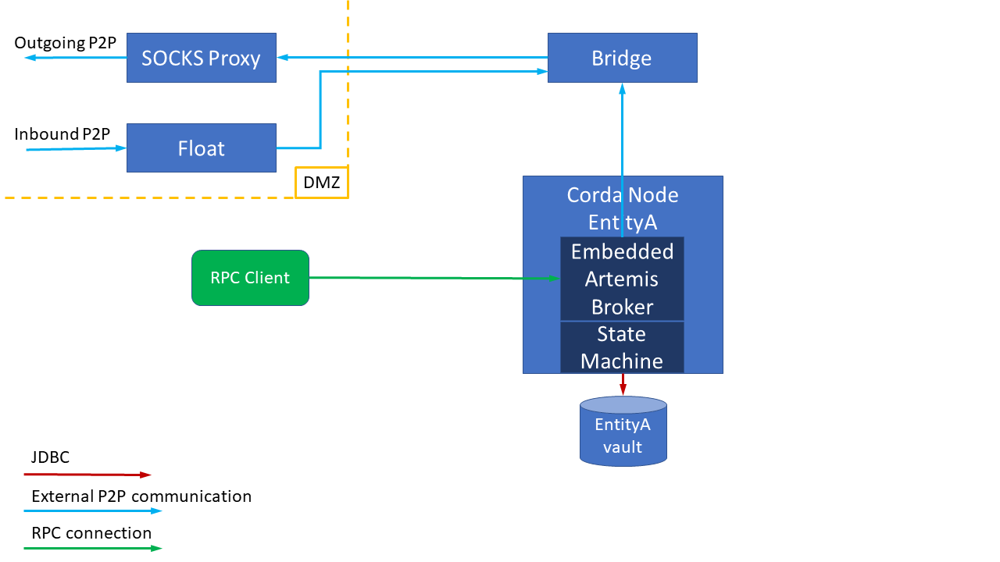
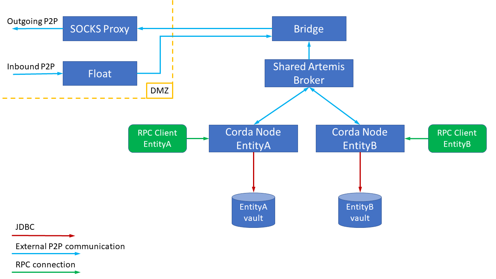
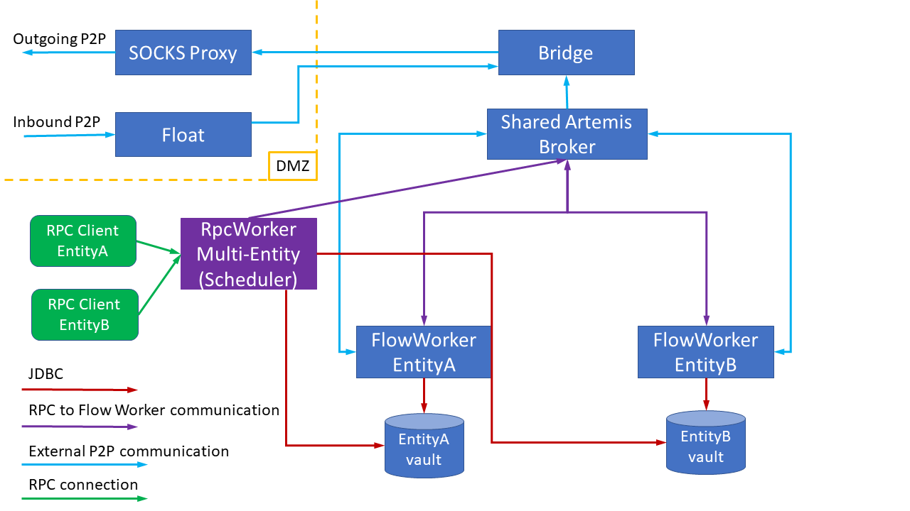
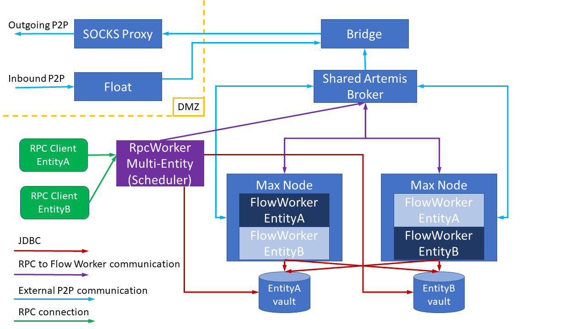
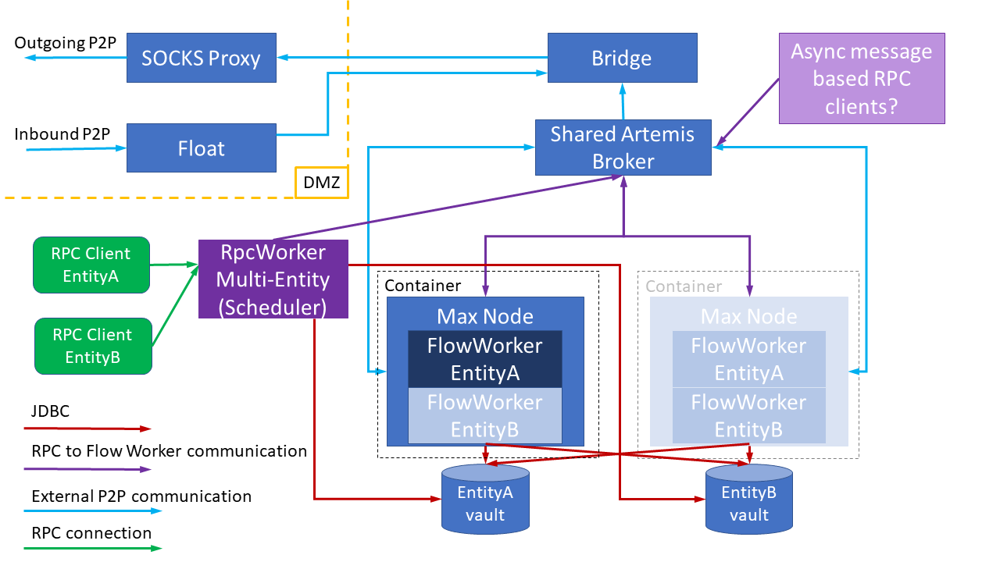

# Validation of Maximus Scope and Future Work Proposal

## Introduction

The intent of this document is to ensure that the Tech Leads and Product Management are comfortable with the proposed
direction of HA team future work. The term Maximus has been used widely across R3 and we wish to ensure that the scope
is clearly understood and in alignment with wider delivery expectations.

I hope to explain the successes and failures of our rapid POC work, so it is clearer what guides our decision making in
this.

Also, it will hopefully inform other teams of changes that may cross into their area.

## What is Maximus?

Mike’s original proposal for Maximus, made at CordaCon Tokyo 2018, was to use some automation to start and stop node
VM’s using some sort of automation to reduce runtime cost. In Mike’s words this would allow ‘huge numbers of
identities’, perhaps ‘thousands’.

The HA team and Andrey Brozhko have tried to stay close to this original definition that Maximus is for managing
100’s-1000’s Enterprise Nodes and that the goal of the project is to better manage costs, especially in cloud
deployments and with low overall flow rates. However, this leads to the following assumptions:

1. The overall rate of flows is low and users will accept some latency. The additional sharing of identities on a
reduced physical footprint will inevitably reduce throughput compared to dedicated nodes, but should not be a problem.

2. At least in the earlier phases it is acceptable to statically manage identity keys/certificates for each individual
identity. This will be scripted but will incur some effort/procedures/checking on the doorman side.

3. Every identity has an associated ‘DB schema’, which might be on a shared database server, but the separation is
managed at that level. This database is a fixed runtime cost per identity and will not be shared in the earlier phases
of Maximus. It might be optionally shareable in future, but this is not a hard requirement for Corda 5 as it needs
significant help from core to change the DB schemas. Also, our understanding is that the isolation is a positive feature
in some deployments.

4. Maximus may share infrastructure and possibly JVM memory between identities without breaking some customer
requirement for isolation. In other words we are virtualizing the ‘node’, but CorDapps and peer nodes will be unaware of
any changes.

## What Maximus is not

1. Maximus is not designed to handle millions of identities. That is firmly Marco Polo and possibly handled completely
differently.

2. Maximus should be not priced such as to undercut our own high-performance Enterprise nodes, or allow customers to run
arbitrary numbers of nodes for free.

3. Maximus is not a ‘wallet’ based solution. The nodes in Maximus are fully equivalent to the current Enterprise
offering and have first class identities. There is also no remoting of the signing operations.

## The POC technologies we have tried

The HA team has looked at several elements of the solution. Some approaches look promising, some do not.

1. We have already started the work to share a common P2P Artemis between multiple nodes and common bridge/float. This
is the ‘SNI header’ work which has been DRB’s recently. This should be functionally complete soon and available in Corda
4.0 This work will reduce platform cost and simplify deployment of multiple nodes. For Maximus the main effect is that it
should make the configuration much more consistent between nodes and it means that where a node runs is immaterial as
the shared broker distributes messages and the Corda firewall handles the public communication.

2. I looked at flattening the flow state machine, so that we could map Corda operations into combining state and
messages in the style of a Map-Reduce pattern. Unfortunately, the work involved is extreme and not compatible with the
Corda API. Therefore a pure ‘flow worker’ approach does not look viable any time soon and in general full hot-hot is
still a way off.

3. Chris looked at reducing the essential service set in the node to those needed to support the public flow API and the
StateMachine. Then we attached a simple start flow messaging interface. This simple ‘FlowRunner’ class allowed
exploration of several options in a gaffer taped state.

   1. We created a simple messaging interface between an RPC runner and a Flow Runner and showed that we can run
   standard flows.

   2. We were able to POC combining two identities running side-by-side in a Flow Runner, which is in fact quite similar
   to many of our integration tests. We must address static variable leakage but should be feasible.

   3. We were able to create an RPC worker that could handle several identities at once and start flows on the
   same/different flow runner harnesses.

4. We then pushed forward looking into flow sharding. Here we made some progress, but the task started to get more and more
    complicated. It also highlighted that we don’t have suitable headers on our messages and that the message header
    whitelist will make this difficult to change whilst maintaining wire compatibility. The conclusion from this is that
    hot-hot flow sharding will have to wait.

8. We have been looking at resource/cost management technologies. The almost immediate conclusion is that whilst cloud
providers do have automated VM/container as service they are not standardized. Instead, the only standardized approach
is Kubernetes+docker, which will charge dynamically according to active use levels.

9. Looking at resource management in Kubernetes we can dynamically scale relatively homogeneous pods, but the metrics
approach cannot easily cope with identity injection. Instead we can scale the number of running pods, but they will have
to self-organize the work balancing amongst themselves.

## Maximus Work Proposal

#### Current State

The current enterprise node solution in GA 3.1 is as above. This has dynamic HA failover available for the bridge/float
using ZooKeeper as leader elector, but the node has to be hot-cold. There is some sharing support for the ZooKeeper
cluster, but otherwise all this infrastructure has to be replicated per identity. In addition, all elements of this have
to have at least one resident instance to ensure that messages are captured and RPC clients have an endpoint to talk to.

#### Corda 4.0 Agreed Target with SNI Shared Corda Firewalls

Here by sharing the P2P Artemis externally and work on the messaging protocol it should be possible to reuse the corda
firewall for multiple nodes. This means that the externally advertised address will be stable for the whole cluster
independent of the deployed identities. Also, the durable messaging is outside nodes, which means that we can
theoretically schedule running the nodes only if a few times a day if they only act in response to external peer
messages. Mostly this is a prelude to greater sharing in the future Maximus state.

#### Intermediate State Explored during POC

During the POC we explore the model above, although none of the components were completed to a production standard. The
key feature here is that the RPC side has been split out of the node and has API support for multiple identities built
in. The flow and P2P elements of the node have been split out too, which means that the ‘FlowWorker’ start-up code can
be simpler than the current AbstractNode as it doesn’t have to support the same testing framework. The actual service
implementations are unchanged in this.

The principal communication between the RPC and FlowWorker is about starting flows and completed work is broadcast as
events. A message protocol will be defined to allow re-attachment and status querying if the RPC client is restarted.
The vault RPC api will continue to the database directly in the RpcWorker and not involve the FlowWorker. The scheduler
service will live in the RPC service as potentially the FlowWorkers will not yet be running when the due time occurs.

#### Proposed Maximus Phase 1 State

The productionised version of the above POC will introduce ‘Max Nodes’ that can load FlowWorkers on demand. We still
require only one runs at once, but for this we will use ZooKeeper to ensure that FlowWorkers with capacity compete to
process the work and only one wins. Based on trials we can safely run a couple of identities at one inside the same Max
Node assuming load is manageable. Idle identities will be dropped trivially, since the Hibernate, Artemis connections
and thread pools will be owned by the Max Node not the flow workers. At this stage there is no dynamic management of the
physical resources, but some sort of scheduler could control how many Max Nodes are running at once.

#### Final State Maximus with Dynamic Resource Management

The final evolution is to add dynamic cost control to the system. As the Max Nodes are homogeneous the RpcWorker can
monitor the load and signal metrics available to Kubernetes. This means that Max Nodes can be added and removed as
required and potentially cost zero. Ideally, separate work would begin in parallel to combine database data into a
single schema, but that is possibly not required.