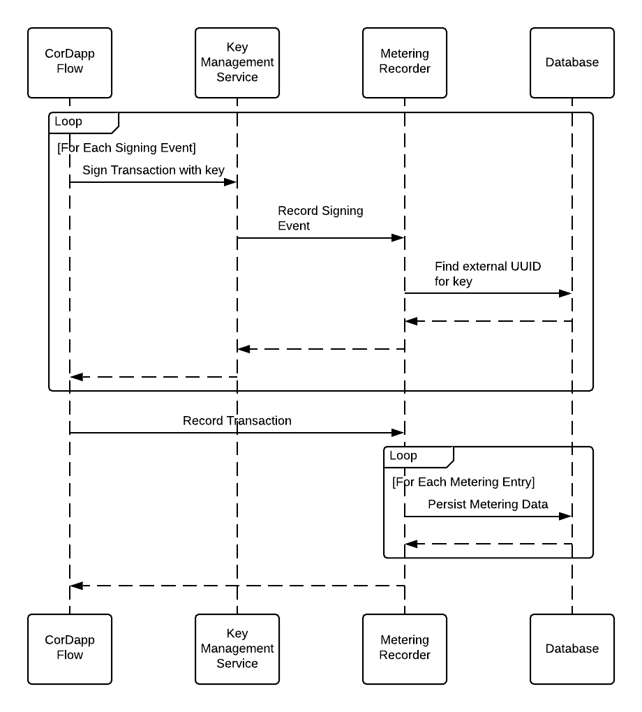
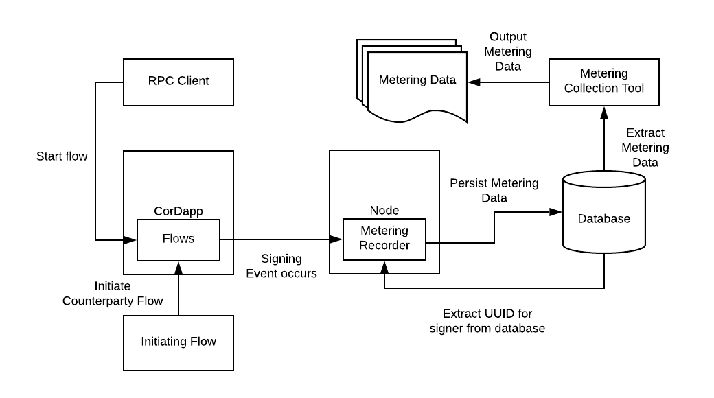

# Metering Design

## Background

Corda Enterprise is currently sold by licensing the software to customers. This model has two main issues: it fails to scale down to smaller
customers with a low volume of transactions, and it is not future proof (customers are likely to challenge this model as outdated). As such,
there is a desire to move towards a consumption-based pricing model, where the price charged for using Corda Enterprise depends on how much
the platform is used.

In order for this model to work, there needs to be some way of measuring platform usage. The metric to be measured here is
the *signing event*. A signing event is defined as the signing of a transaction by a key that maps either to the node identity, or to a
particular UUID. Note that there is a maximum of one signing event per node identity/UUID per transaction. Whenever a signing
event occurs, enough metadata must be collected to identify what set of CorDapps triggered the event and when it occurred. This metadata can
then be periodically collected from each node, and forwarded to the relevant parties for billing.

The aim of this document is to lay out how this metadata is generated, stored and collected within the platform.

## Requirements

 - Corda Enterprise nodes should store metering metadata whenever a transaction is signed using a non-notary identity. There should only be
   one metering metadata entry per signing entity (either the node identity or an external identifier) per transaction.
 - The metering metadata entries should contain the following:
   - An identifier for the entity that signed the transaction
   - A way of identifying the CorDapps involved when a signature is added to a transaction
   - A way of identifying who owns the CorDapps that triggered transaction signing
   - What commands were used in the transaction being signed
   - A timestamp indicating when the transaction was signed
   - An indication of whether the metadata has been collected from the node
 - Corda Enterprise nodes acting as a notary should store a metering metadata entry whenever a transaction is signed using a notary identity.
   This metering metadata entry should contain the node identity that made the notarisation request.
 - For CFT notaries, only a single metadata entry is required for each transaction notarised, and not one per node in the cluster.
 - Metering metadata must be stored forever for audit purposes. It may be archived but not deleted.
 - Metering metadata collection should be transparent to the node operator.

## Goals

 - Establish the format of the metadata to be collected (such as how to identify what CorDapp triggered the signing event)
 - Establish how to detect that a signing event has occurred
 - Provide a mechanism by which this metadata can be collected by the node operator.
    - In Phase 1, this will be a tool that can be run either using the Corda JAR or as a shell command
    - In future phases, a different mechanism may be used
 - Describe how this metadata is stored and archived

## Non-goals

 - Metering for other Corda components (e.g. network services, firewall)
 - Routing of metering data back to the relevant party (non-goal for phase 1 only)
 - Pricing, billing and handling payments (in other words, how the collected metering data is used)
 - Ensuring that the resultant data is tamper-proof
 - Preventing malicious nodes from tampering with metering data
 - Provide a mechanism for rollback of metering data if the transaction is ultimately rejected
 - Zero loss of metering data. Metering data loss should be minimised, but a small amount of loss in exceptional circumstances can be
   tolerated

## Design

This section discusses the main design choices made to support metering. There are three main aspects of the metering design:
 - The detection of signing events
 - The metering metadata that is recorded when a signing event occurs, and how to store it
 - The collection of this metadata from the node
 
### Detection of Signing Events

Whenever a signature is added to a transaction, the `KeyManagementService`'s `sign` method is called, using a `SignableData` that contains
the transaction ID being signed over. This API is used as the definition of a signing event in the first phase. Note that in future phases,
other APIs may define signing events, or signatures may be added to transactions outside the scope of the node. These considerations are
left to a future phase, but the design does not preclude collecting metering data at other points if doing so is deemed appropriate.

To establish what entity has signed a transaction, the key used to sign the transaction data is checked against the `pk_hash_to_ext_id`
database table. If the key has an external ID, then this key maps to some external entity separate
from the node identity, and so is treated separately to the node identity signing the transaction. (At the time of writing, the only
expected entities here are accounts, but in the future this database table could be populated by keys corresponding to other entities.)

For each transaction, a signing event is triggered for each unique entity signing a transaction. To keep track of which entities have
signed a transaction, a set of metering data entries is maintained within a fiber local variable belonging to the fiber running the flow that
is constructing the transaction. Each entry in this set has a unique (transaction ID, signing entity) pair. A signing entity is either an
external UUID, or the node identity. The expected size of this set is quite small, as it is not expected that there will be a large number
of signatures per transaction, and the set is effectively removed once the flow completes. The purpose of maintaining this set is to ensure
that if an entity signs the same transaction with multiple confidential identities, only a single metering metadata entry is generated. The
set is persisted to the database when the transaction is recorded.

An additional benefit of this approach is that it prevents metering entries from being duplicated in the event that a flow is restarted from
a checkpoint. It also means metering data is not lost for in-flight flows across node restarts.

### Metering Metadata

The metering metadata must record the following information:
 - The CorDapp(s) involved in a flow at the point a signing event occurs
 - The command(s) used in the transaction
 - An identifier for the entity that triggered the signing event
 - A timestamp indicating when the transaction was signed by the entity for the first time
 
The first of these requirements is satisfied by recording the CorDapp hashes, names, versions, vendors, and keys used to sign the CorDapp JARs
(referred to as signing keys). These values are stored in a new database table separately from the metering metadata. Metering entries then
reference this table to indicate which CorDapps triggered the signing event. The table is populated on startup from the CorDapps in the
node's `cordapps` folder.

The owner(s), if any, of a CorDapp are recorded by recording the signing key(s) of the CorDapp jar. This has a number of advantages. Firstly,
this allows an entity to prove that it owns a CorDapp when requesting metering metadata for that app, by demonstrating that it can sign some
nonce with the same key. It also means that once a mechanism is established for mapping a particular signing key back to its owner, any new
CorDapp by the same author can be traced back to the owner. (This is not true if the owner were tracked by CorDapp hash, for example, as
every CorDapp would hash to a different value.)

The commands used in a transaction are extracted from the transaction itself. This happens at the point that metering entries are recorded
in the database, as the transaction cannot be supplied to the recording infrastructure without changing the public API.

The entity that triggered a signing event can be identified from the identifier the public key passed to `sign` is assigned to. If it is
assigned to a UUID, then that UUID is recorded, which ties the key back to an external entity. (At the time of writing, this is just an
account, but in principle it could be some other entity.) If the key is not assigned to an external entity, then it belongs to the node, and
so the node identity is recorded. Note that confidential identities associated with the same entity are not counted twice for the same
transaction.

The time at which a transaction was signed is recorded by recording the Java `Instant` at the point that the metadata entry is created, using
the node's clock.

All metadata entries are stored in the database, in a new table (`node_metering_metadata`). Metering data could be archived from this table,
but it must never be erased entirely. To see whether a mechanism for archiving the metering data is required in the first phase, the data
usage of this table should be considered. It is possible to have multiple signing metadata entries per transaction on one node, if there are
multiple accounts (for example) that provide keys that sign the transaction.
However, it is expected that the amount of data stored per metering entry is likely to be smaller than the amount of data stored per transaction,
and so many metering entries per transaction is likely to be required before this usage starts to dominate. As a result, an archiving
mechanism can be postponed for the first phase.

#### Notaries

Metering metadata must also be collected on notaries. In this case, metering metadata is collected per notarisation request, and the required
data is the timestamp at which the request was made, and the party making the notarisation request. In this case, the party making the
notarisation request is the node identity of the node that initiated the request. This data is already collected in the
`node_notary_request_log`, and so can be read directly out of this table.

For CFT notaries, the notarisation request data is replicated across all nodes in the cluster. As a result, it is sufficient to collect metering
data from a single node's database for billing purposes. This is documented in the documentation provided with the metering collection 
commands.

### Collection of Metering Metadata

Metering metadata in the first phase is collected from the node using a new option to the Corda JAR, causing it to perform a metering data
gathering operation. When this is run, the Corda JAR takes some data describing what CorDapps to collect metering data for (described
further in the Implementation section), along with a time window to collect metering records between, and reads all rows matching these
conditions from the database. It then outputs this data in CSV format, grouping the entries by CorDapp signing key. If an entry comes from a
CorDapp signed by multiple keys, then the entry appears under each signing key grouping. If an entry is assigned to a CorDapp with no
signing keys, the group it belongs to is instead defined by the CorDapp name.

The Corda JAR already has options to specify the base directory and configuration file used by the node. These options function as
expected with the new option defined for metering.

The same option used on non-notary nodes can also be used on notaries to collect metering metadata. In this case, only the time window to
collect metering data for is required. The operation extracts all data from the database that falls within this time window, and
then sums the number of requests made by each party. It outputs a CSV file where each row contains a party and the number of notarisation
requests made in the time window by that party. Note that in this case data is not grouped by CorDapp signing key, as the CorDapp making the
notarisation request is not visible to the notary.

## Implementation

This section proposes how the metering feature might be implemented.

### Recording Metering Metadata

Metering metadata is collected and recorded in a two stage process. Firstly, an in-memory record is created when a signing event occurs,
recording data about the entity signing the transaction and the CorDapp that triggered the signing event. In the second stage, the in-memory
records are persisted to the database, using the details of the finalised transaction to populate missing parts of the metering data. This
approach is chosen as signing events can be triggered directly from client code, and so there is no scope for changing the API to provide
all required metering data at the point where a signing event occurs.



This two stage process is managed by a class implementing a new `MeteringRecorder` interface, which is shown below:

```kotlin
interface MeteringRecorder {
    fun recordSigningEvent(txId: SecureHash, signingKey: PublicKey)
    
    fun persistMeteringData(tx: SignedTransaction)
}
```

The first stage happens when the `sign(SignableData, PublicKey)` method is called on a `KeyManagementService` (this defines a signing event).
Classes implementing `KeyManagementServiceInternal` are required to have a `MeteringRecorder` instance available to them. When a signing
event occurs, `recordSigningEvent` is called. `recordSigningEvent` constructs a `MeteringData` entry that is cached within a `FiberLocal` - 
a value that is local to the current fiber (which each flow runs in) and is serialized when the flow is checkpointed.
 
The `MeteringData` class is shown below:

```kotlin
data class MeteringData(val cordappHashes: List<SecureHash>,
                        val txId: SecureHash,
                        val signingId: UUID?,
                        val timestamp: Instant)
```

The required data is collected from the following sources:
 - The `CorDappResolver` is used to extract the current CorDapps currently in use from the call stack. (This requires some changes within
   the `CorDappResolver` code.)
 - The signing key identity can be found by checking the `pk_hash_to_ext_id_map` database table. If no entry is found for the key, then the
   identity is the node's identity. The `MeteringRecorder` maintains a cache of the `pk_hash_to_ext_id_map` table in order to reduce the
   number of database queries required when constructing `MeteringData` instances.
 - The timestamp is recorded by recording the Java `Instant` at which the `MeteringData` entry is created, using the `CordaClock`.
 
A set of `MeteringData` instances is maintained for each flow, via the `FiberLocal`. This set is used for de-duplication purposes, as only one
metering entry should be recorded per signing entity (either an external `UUID` or the node identity) per transaction. If
`recordSigningEvent` is called with a (transaction ID, signing ID) pair that corresponds to an entry already in the set, no new
`MeteringData` is recorded. By storing this data in a `FiberLocal`, the metering data is checkpointed along with the flow. This
prevents duplication due to flows being replayed from a checkpoint, and also allows metering data for in flight flows to persist across node
restarts.

The second stage happens when the transaction is recorded in the database (when `ServiceHub.recordTransactions` is called). When
this happens, each signed transaction is passed to the `MeteringRecorder` using `persistMeteringData`. This function first establishes if
there are any `MeteringData` entries to record for this transaction on the current flow state machine. If so, the function calculates any
transaction specific data required for metering from the `SignedTransaction`. In the first phase, this is just the commands used.Note that
if the transaction is a `NotaryChangeTransaction` or a `ContractUpgradeTransaction`, there are no commands and so a special value is
recorded instead, as described in the next section. Once this is done, the `MeteringRecorder` persists the metering data and removes the
`MeteringData` entries from the set.

Note that the above discussion describes what happens if transactions are signed within flows using the mechanism provided by the node today.
If in the future different code paths in the platform define a signing event on a transaction, then the `MeteringRecorder`'s
`recordSigningEvent` method can be called from these new code paths. This may require detecting that a signature has been added to a
transaction if, for example, a call is made out of the node to trigger out-of-node signing.

A final consideration is that transactions may be signed completely outside of the platform. In this case, the node cannot tell the
difference between a signature added to the transaction by another node but within platform flows, and a signature added outside the scope
of platform flows. As the first of these should be ignored, the platform is also forced to ignore these external signatures.

#### Handling Flow Overrides

Flows can be overridden on both the initiating and receiving side. In these cases, it is possible that the class overriding the flow is
defined in a different CorDapp to that providing the original flow. This brings up the question of what CorDapp should be recorded in the
metering event. There are two possibilities:
 - The flow is overridden by subclassing the original flow definition and replacing some kind of hook function, but leaving the `call`
   function of the base class unchanged. In this case, the call stack on recording the metering event will contain the base class' call
   definition, and so the CorDapp defining the base class will be recorded in the metering event.
 - The flow is overridden in such a way that the `call` definition of the base class is also overridden. This could happen either through
   subclassing or through configuration. In this case, the overriding class is now in control of signing events, and so it is the CorDapp
   defining this class should be recorded. This will happen as it is the overriding `call` method that appears in the call stack.

#### Notaries

The above scheme applies only when collecting metering data for a non-notary node. Signing events corresponding to a notary signing a
transaction as part of a notarisation request are metered differently, and so a mechanism is required for detecting these. This is
complicated by the fact that a notary can also act as a non-notary node and participate in transactions in some circumstances.

To get around this, a new method is added to `KeyManagementServiceInternal`, called `signByNotary`. This behaves exactly as the current
`sign` method does, except that it does not call into the `MeteringRecorder`'s `recordSigningEvent` method. The metering data is instead
recorded in the notary's `node_notary_request_log` table (this requires no code changes). Whenever a transaction is signed as part of a
notarisation request, `signByNotary` is used. As customers should not be writing notary implementations, this can be directly controlled.

### Database Schema

Metering metadata is stored in a new database table. This requires a liquibase changeset to migrate existing database schema. The changeset
creates the new database table, called `node_metering_metadata`. CorDapp metadata is recorded in a new `node_cordapp_metadata` table.

The CorDapp metadata stored in the `node_cordapp_metadata` table is as follows:
 - `cordapp_hash`: The SHA-256 hash of the CorDapp.
 - `name`: A string naming the CorDapp, taken from its MANIFEST file
 - `signing_keys`: The keys used to sign the CorDapp.
 - `vendor`: A string identifying the vendor of the CorDapp.
 - `version`: An integer indicating the version of this CorDapp.
 
This table is populated on startup when the installed CorDapps are read from the `cordapps` directory.

The `node_metering_metadata` table contains the following columns:
 - `cordapps`: A set of indices into the `node_cordapp_metadata` table that indicate what CorDapps were present in the call stack when a
               signing event was triggered.
 - `commands`: A list of strings indicating what commands are present in the transaction. For contract upgrade and notary change transactions,
               this is recorded as "ContractUpgrade" and "NotaryChange" respectively.
 - `signing_id`: An identifier for the entity that triggered the signing event. This is a UUID if the public key used to sign is associated
                 with one, or null if the node identity signed it.
 - `timestamp`: A timestamp indicating when the signing event occurred.
 - `collected`: A boolean flag indicating whether the entry has been collected from the node.
 
This table is only appended to when new entries are created. The collection process may result in the collected column being modified. The
changeset creating this table is run as part of the node core changesets. No migration of existing data is required to populate the new
table.

For notaries, no new database tables are required, as the required metering data is already present in the `node_notary_request_log` table.

### Metering data collection

Metering data can be collected in two ways: using the Corda JAR itself with a set of new commands, or via a shell command. In both cases,
the node reads metering records from the database and outputs a CSV file containing those metering records. The code to do this is factored
into a separate class, which is invoked when either of the two methods are used. In future phases, metering data may be collected via other
mechanisms, and this class may be reused in these cases too.

Metering data must be collected from both non-notary and notary nodes. In the case of non-notary nodes, the metering records are outputted
as is, grouping them by signing key. If a request is made to collect data for multiple CorDapps, metering data appears under every signing
key that has participated in the signing event. When metering data is collected from a non-notary node, the entry is marked as collected.
In the first phase, this flag is ignored when collecting metering records. The reason for this is that records may be collected twice if
there are multiple CorDapps involved in the signing event that generated it. Instead, this flag is set in anticipation of future phases where
metering data that has not been collected is surfaced to the node operator.

For notary nodes, the number of metering records per party are summed, and each row of the outputted CSV file contains a party and the
number of notarisation requests made for that party in the specified time window.

#### Corda JAR Interface

Metering data can be collected by running the Corda JAR with a new set of commands. When invoked in this way, the check to ensure that the
node is not started twice is bypassed. All logging is carried out to a separate log file when these commands are used, in order to prevent
logs from the collection process interfering with the main node's logs.

Two commands are provided:
`collect-metering [--base-directory <directory>} [--from <timestamp> --to <timestamp>] [--duration <duration>] --all
--owners <public key hashes> --app-hashes <app hashes> --app-names <app names>`
This command collects data from a non-notary node. The following flags are provided:
 - `--base-directory <directory>`: Optional. The node's root directory, from which the node config and database drivers are extracted. If not
   specified, the current working directory is used. 
 - `--from <timestamp>`: Optional. Entries in the metering metadata table with earlier timestamps are ignored. One of this or `duration-days` must
   be specified.
 - `--to <timestamp>`: Optional. Entries in the metering metadata table with later timestamps are ignored. This defaults to the current time
   at the point the tool is invoked.
 - `--duration-days <duration>`: Optional. The time window over which data should be collected. Records from the current day to <duration> days in
   the past are collected. One of this or `from` must be specified.
 - `--all`: Collect all metering data from the node within the specified time window.
 - `--owners <public key hashes>`: One of this, `app-hashes` or `app-names` is required if `all` is not set. If set, data for apps with a matching owning public key hash
   is collected.
 - `--app-hashes <app hashes>`: One of this, `owners` or `app-names` is required if `all` is not set. If set, data for apps with a matching hash is collected.
 - `--app-names <app names>`: One of this, `app-hashes` or `owners` is required if `all` is not set. If set, data for apps with a matching name is collected. The CorDapp
   name must match exactly.

For each of the last three options, multiple hashes or names can be specified. If this is the case, then entries matching any of the supplied
hashes or names is collected.
 
Whenever a timestamp is required, the format to use is the ISO-8601 standard. The time portion of this is optional.

`notary-collect-metering [--base-directory <directory>] [--from <timestamp> --to <timestamp>]`
This command collects data from a notary node. The following flags are provided:
 - `--base-directory <directory>`: Optional. The notary's root directory, from which the config and database drivers are extracted. If not
   specified, the current working directory is used.
 - `--from <timestamp>`: Optional. Entries in the notary request log with earlier timestamps are ignored.
 - `--to <timestamp>`: Optional. Entries in the notary request log with later timestamps are ignored. This defaults to the current time.
 - `--duration-days <duration>`: Optional. Entries in the notary request log from the current day back to <duration> days in the past are 
   collected.
   
If this command is run against a node that is not a notary, then an error is printed explaining this and the process exits.
 
#### Shell Interface

The following commands are added to the shell:

`collect-metering duration: <duration>, [owners: <public key hash> | app-hashes: <hashes> | app-names: <names>]`
This command collects metering data from a non-notary node. The arguments are as for the Corda JAR interface in the section above. Note that
only one of `owners`, `app-hashes`, or `app-names` should be specified.

`notary-collect-metering duration: <duration>`
This command collects metering data from a notary node. The arguments are as for the Corda JAR interface in the section above. If the node
is not a notary, then an error is raised when this command is invoked.

### Performance

There are potential concerns with this model around performance. In particular, the following operations may be expensive:
 - Establishing whether a signing key belongs to a particular external ID requires a database lookup. This is partially mitigated by caching
   the database table. However, in the common case that the signing key belongs to the node identity, there will always be a cache miss as
   the key has no UUID. A possible mitigation is to also cache keys that definitely do not have an entry in this table, so that the node
   identity keys never trigger a database lookup (beyond the first).
 - Adding an extra database write per transaction signature. Depending on the number of signatures on the transaction, this could result in
   a large number of extra writes, which is likely to be expensive. In particular, metering entries could be the dominant factor in the
   amount of database activity required to record a transaction. One possible mitigation here is that the metering data does not need to be
   recorded at the same time as the transaction, so this could be done in the background at a time of lower activity. Another possible
   solution would be to change the data that is recorded so that signature data per transaction could be accumulated in some way. The solution
   to this problem is deferred pending performance tests once a solution has been implemented.
   
### Disabling the Feature

For a small number of customers, Corda Enterprise will continue to be licensed. The metering feature unavoidably introduces some performance
overhead, so for customers that make no use of the feature it makes sense to have a mechanism to disable it.

This is done by introducing a config option, `enableMetering`. By default, this option is `true`. If set to `false`, then the
`MeteringRecorder` does nothing when any of its methods are called. (This could be achieved by providing a different implementation where
all methods do nothing, or by making a check at the start of each method.) Note that a customer setting this option to `false` when they're
not supposed to is a problem deemed out of scope, as this falls into the same category as a malicious operator deleting any metadata from the
node's database.

## Threat Model

This section discusses possible attacks and mitigations around the metering feature.



The above diagram shows the components of the metering feature, and how data flows between them. The threat model is based on this diagram.

The threat model described here uses the STRIDE framework to present the possible threats to the metering feature in a structured way. The
possible security threats are split into 6 categories:
 - Spoofing
 - Tampering
 - Repudiation
 - Information Disclosure
 - Denial of Service
 - Elevation of Privilege
 
The table below describes some possible attacks and some mitigations for these.

| Attack | Category | Description | Mitigation |
|--------|----------|-------------|------------|
| CorDapp deletes metadata | T | The CorDapp removes metadata from the database, allowing billing to be avoided | CorDapps are trusted. Database transaction store can be audited to prove records were removed |
| CorDapp modifies metadata | T/R | The CorDapp modifies metadata in the database, possibly including changing the CorDapp a metering record is attributed to | CorDapps are trusted |
| RPC client modifies metering data in the database | T | The RPC client performs either of the attacks described above | The RPC client should not have access to the node's database, avoiding this attack |
| An attacker intercepts metering data from the database | I | An attacker on an internal network accesses the database and reads the metering data | Database access should be correctly permissioned |
| An attacker modifies metering data after collection | T/I | An attacker obtains the output of the metering collection tool and reads or modifies it | No mitigation |

The CorDapp based attacks are all possible as the CorDapp has direct access to the database. These could be eliminated in the future if
CorDapps were prevented from directly accessing the node's database tables.

Extra protections on the files generated by the metering collection tool, such as encrypting the file and providing a checksum, would help
to mitigate the last attack. These were deemed out of scope for this design.

## Alternatives

This section discusses some alternatives to the design choices listed above.

### Metadata Storage

An alternative to storing metadata in the database is to store this data in the filesystem on the node directly. This has a few advantages:
 - The collection tool can be simpler, as there is no need to connect to the database. Instead, this becomes a simple script that filters
   CSV entries by some criteria and outputs a new CSV file with just those entries
 - Archiving data can be carried out by compressing the current file and starting a new one.

However, there are some disadvantages:
 - This approach opens up the possibility of file system corruption causing the metering data to be lost. Corruption could also occur if the
   file is written to from multiple sources simultaneously. The node database already has mechanisms to avoid this.
 - In future phases, metering metadata will be collected via a flow from a node belonging to the CorDapp owner. This becomes more challenging
   to implement if the data the flow requires is not stored in the node's database.

### CorDapp Metadata Location

CorDapp metadata could also be read directly from the `node_attachments` table. This contains some of the data required for metering already:
 - The CorDapp hash, in the form of the attachment ID
 - The file name of the CorDapp
 - The signing keys
 - The version of the CorDapp
 
However, using this has a number of disadvantages from an implementation perspective:
 - The file name of the CorDapp is not guaranteed to name the CorDapp correctly. This name is under the control of the node operator, and so
   the name could differ between nodes. Further, in most cases, the name is not set at all when loading the CorDapp as an attachment. Either
   the use of this name would have to be reduced, or a migration script would be required to calculate a file name for each attachment in
   the database.
 - The vendor field is not currently available. Populating a vendor column would require a complicated migration script, as the CorDapp
   metadata would have to be extracted from the blob in the database for each attachment. Some of these attachments may not be CorDapps, and
   so may not have this set.
   
To try and avoid potential migration complications, a new database table is instead used.

### Identifying CorDapps and CorDapp owners

The problem of identifying a CorDapp and its owner is quite closely linked - once the identity of a CorDapp is established, finding the entity
that owns it can be carried out by looking at some mapping from CorDapp identity to owner. The CorDapp itself could be identified in
a number of ways:
 - CorDapp hash
 - Name of flow in which the signing event occurs
 - Signers over the CorDapp, alongside the name of the app in the CorDapp metadata
 - Full class name or package of initiating flow
 
The main advantage of identifying by hash is that it uniquely identifies both the CorDapp and its version. However, using this to map back to
the CorDapp owner is challenging, as every version of every CorDapp must have a mapping back to its owner. By taking the approach of
recording both the signing keys and the CorDapp hash, a particular CorDapp can be identified if necessary, but a mapping back to the owner
does not need to be updated with every new CorDapp / CorDapp version.

Identifying by flow name has the advantage that all versions of the same CorDapp can be identified in the same way. However, it also means
that a single CorDapp may have multiple identifiers. Further, it is possible for different CorDapps to name their flows the same (or possibly
depend on a library flow), which introduces ambiguity over which app a flow belongs to.

Identifying the CorDapp by the full class name or package of the initiating flow has similar considerations to metering by the name of the
flow that triggered the signing event. All versions of the CorDapp can be identified if they all contain the same flow class name, but there
may be multiple class names or packages that map back to a given CorDapp. In both cases, logic would be required to map the flow name back
to the CorDapp that defined it. The decision was made to identify CorDapps by CorDapp hash to simplify the identification code by removing
this logic.

### Assigning a CorDapp for a Signing Event

In the proposed design, every CorDapp involved in the signing of a transaction is recorded when a metering record is created. This was chosen
to maximise flexibility for the collection of this data (which is not in the scope of this design). This section discusses an alternative
solution where the metering feature decides what CorDapp to assign each event to. In this case, the choice made is the CorDapp that initiated
the stack of flows that results in a transaction signature. This is outlined in more detail below.

The simplest possible case is that a flow is initiated via RPC or via the network, and this flow causes a signing event to occur, with no
calls into any other CorDapps. In this instance, there is only one CorDapp to which the signing event can be assigned, and so that CorDapp
is recorded.

If a flow calls into an inlined subflow in a different CorDapp, and that flow triggers a signing event, then the CorDapp that defines the
triggering flow is assigned the signing event. This means that in the common case of flows being defined in an SDK, metering events are
assigned to the user of that SDK. This rule extends to more complicated hierarchies of flows, so that the highest level CorDapp in a stack
of inlined subflow calls is assigned any signing events.

If a flow calls into a non-inlined subflow, then on the initiating side the situation is the same as the paragraph above. However, on the
responder side, the top-level flow will be the `InitiatedBy` partner of the non-inlined subflow, which may not belong to the CorDapp that
called the subflow. In this instance, there is not enough information on the initiated side to distinguish between this case and the case
that the initiating flow is genuinely top-level, and so the signing event is assigned to the CorDapp containing the `InitiatedBy` partner.

A further complication occurs if a flow is overridden - in this case the signing event is assigned to the CorDapp that defined the flow that
has been overridden.

### Opt-in Metering

A CorDapp developer could also opt in to be liable for metering for certain flows, by programmatically marking them with some sort of flag
that indicates they are willing to be metered whenever the flow triggers a signing event. This removes the complexity of trying to assign
signing events from the platform and instead pushes it onto CorDapp developers. This is appealing as CorDapp developers are best placed to
know whether they are willing to be liable for billing for their apps. This is also the only mechanism considered that can reliably assign
a signing event to a CorDapp somewhere in the middle of a potential CorDapp call stack. The main issue with this is that metering becomes
part of Corda's API, which opens the door for accidental misuse. In particular, if an app developer fails to opt in to metering, they may
accidentally place liability on their customers for billing. It also makes the metering feature harder to adjust in the future, as API
guarantees must be preserved.

