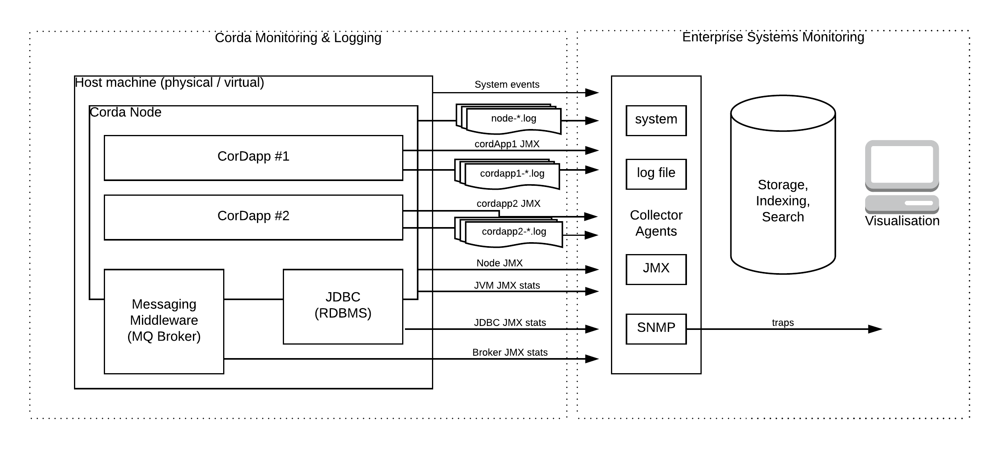

# Monitoring and Logging Design

## Overview

The successful deployment and operation of Corda (and associated CorDapps) in a production environment requires a
supporting monitoring and management capability to ensure that both a Corda node (and its supporting middleware
infrastructure) and deployed CorDapps execute in a functionally correct and consistent manner. A pro-active monitoring
solution will enable the immediate alerting of unexpected behaviours and associated management tooling should enable
swift corrective action.

This design defines the monitoring metrics and logging outputs, and associated implementation approach, required to
enable a proactive enterprise management and monitoring solution of Corda nodes and their associated CorDapps. This also
includes a set of "liveliness" checks to verify and validate correct functioning of a Corda node (and associated
CorDapp).



In the above diagram, the left hand side dotted box represents the components within scope for this design. It is
anticipated that 3rd party enterprise-wide system management solutions will closely follow the architectural component
breakdown in the right hand side box, and thus seamlessly integrate with the proposed Corda event generation and logging
design. The interface between the two is de-coupled and based on textual log file parsing and adoption of industry
standard JMX MBean events.

## Background

Corda currently exposes several forms of monitorable content:

* Application log files using the [SLF4J](https://www.slf4j.org/) (Simple Logging Facade for Java) which provides an
  abstraction over various concrete logging frameworks (several of which are used within other Corda dependent 3rd party
  libraries). Corda itself uses the [Apache Log4j 2](https://logging.apache.org/log4j/2.x/) framework for logging output
  to a set of configured loggers (to include a rolling file appender and the console). Currently the same set of rolling
  log files are used by both the node and CorDapp(s) deployed to the node. The log file policy specifies a 60 day
  rolling period (but preserving the most recent 10Gb) with a maximum of 10 log files per day.

* Industry standard exposed JMX-based metrics, both standard JVM and custom application metrics are exposed directly
  using the [Dropwizard.io](http://metrics.dropwizard.io/3.2.3/) *JmxReporter* facility. In addition Corda also uses the
  [Jolokia](https://jolokia.org/) framework to make these accessible over an HTTP endpoint. Typically, these metrics are
  also collated by 3rd party tools to provide pro-active monitoring, visualisation and re-active management.

  A full list of currently exposed metrics can be found in the appendix A.

The Corda flow framework also has *placeholder* support for recording additional Audit data in application flows using a
simple *AuditService*. Audit event types are currently loosely defined and data is stored in string form (as a
description and contextual map of name-value pairs) together with a timestamp and principal name. This service does not
currently have an implementation of the audit event data to a persistent store.

The `ProgressTracker` component is used to report the progress of a flow throughout its business lifecycle,  and is
typically configured to report the start of a specific business workflow step (often before and after message send and
receipt where other participants form part of a multi-staged business workflow).  The progress tracking framework was
designed to become a vital part of how exceptions, errors, and other faults are surfaced to human operators for
investigation and resolution. It provides a means of exporting progress as a hierarchy of steps in a way that’s both
human readable and machine readable.

In addition, in-house Corda networks at R3 use the following tools:

* Standard [DataDog](https://docs.datadoghq.com/guides/overview/) probes are currently used to provide e-mail based 
  alerting for running Corda nodes. [Telegraf](https://github.com/influxdata/telegraf) is used in conjunction with a 
  [Jolokia agent](https://jolokia.org/agent.html) as a collector to parse emitted metric data and push these to DataDog.
* Investigation is underway to evaluate [ELK](https://logz.io/learn/complete-guide-elk-stack/) as a mechanism for parsing, 
  indexing, storing, searching, and visualising log file data.

## Scope

### Goals

- Add new metrics at the level of a Corda node, individual CorDapps, and other supporting Corda components (float, bridge manager, doorman)
- Support liveness checking of the node, deployed flows and services
- Review logging groups and severities in the node.
- Separate application logging from node logging.
- Implement the audit framework that is currently only a stubbed out API
- Ensure that Corda can be used with third party systems for monitoring, log collection and audit

### Out of scope

- Recommendation of a specific set of monitoring tools.
- Monitoring of network infrastructure like the network map service.
- Monitoring of liveness of peers.

## Requirements

Expanding on the first goal identified above, the following requirements have been identified:

1. Node health
   - Message queues: latency, number of queues/messages, backlog, bridging establishment and connectivity (success / failure)
   - Database: connections (retries, errors), latency, query time
   - RPC metrics, latency, authentication/authorisation checking (eg. number of successful / failed attempts).
   - Signing performance (eg. signatures per sec).
   - Deployed CorDapps
   - Garbage collector and JVM statistics

2. CorDapp health
   - Number of flows broken down by type (including flow status and aging statistics: oldest, latest)
   - Flow durations
   - JDBC connections, latency/histograms

3. Logging
   - RPC logging
   - Shell logging (user/command pairs)
   - Message queue
   - Traces
   - Exception logging (including full stack traces)
   - Crash dumps (full stack traces)
   - Hardware Security Module (HSM) events.
   - per CorDapp logging

4. Auditing  

   - Security: login authentication and authorisation
   - Business Event flow progress tracking
   - System events (particularly failures)

   Audit data should be stored in a secure, storage medium.
   Audit data should include sufficient contextual information to enable optimal off-line analysis.
   Auditing should apply to all Corda node processes (running CorDapps, notaries, oracles).

#### Use Cases

It is envisaged that operational management and support teams will use the metrics and information collated from this
design, either directly or through an integrated enterprise-wide systems management platform, to perform the following:

- Validate liveness and correctness of Corda nodes and deployed CorDapps, and the physical machine or VM they are hosted on.

* Use logging to troubleshoot operational failures (in conjunction with other supporting failure information: eg. GC logs, stack traces)
* Use reported metrics to fine-tune and tweak operational systems parameters (including dynamic setting of logging 
  modules and severity levels to enable detailed logging).

## Design Decisions

The following design decisions are to be confirmed:

1. JMX for metric eventing and SLF4J for logging 
   Both above are widely adopted mechanisms that enable pluggability and seamless interoperability with other 3rd party 
   enterprise-wide system management solutions.
2. Continue or discontinue usage of Jolokia? (TBC - most likely yes, subject to read-only security lock-down)
3. Separation of Corda Node and CorDapp log outputs (TBC)

## Proposed Solution

There are a number of activities and parts to the solution proposal:

1. Extend JMX metric reporting through the Corda Monitoring Service and associated jolokia conversion to REST/JSON) 
   coverage (see implementation details) to include all Corda services (vault, key management, transaction storage, 
   network map, attachment storage, identity, cordapp provision) & sub-sytems components (state machine)

2. Review and extend Corda log4j2 coverage (see implementation details) to ensure

   - consistent use of severities according to situation
   - consistent coverage across all modules and libraries
   - consistent output format with all relevant contextual information (node identity, user/execution identity, flow 
     session identity, version information)
   - separation of Corda Node and CorDapp log outputs (TBC)
     For consistent interleaving reasons, it may be desirable to continue using combined log output.

   Publication of a *code style guide* to define when to use different severity levels.

3. Implement a CorDapp to perform sanity checking of flow framework, fundamental corda services (vault, identity), and 
   dependent middleware infrastructure (message broker, database).

4. Revisit and enhance as necessary the [Audit service API]( https://github.com/corda/corda/pull/620 ), and provide a 
  persistent backed implementation, to include:

   - specification of Business Event Categories (eg. User authentication and authorisation, Flow-based triggering, Corda 
     Service invocations, Oracle invocations, Flow-based send/receive calls, RPC invocations)
   - auto-enabled with Progress Tracker as Business Event generator
   - RDBMS backed persistent store (independent of Corda database), with adequate security controls (authenticated access 
     and read-only permissioning). Captured information should be consistent with standard logging, and it may be desirable
     to define auditable loggers within log4j2 to automatically redirect certain types of log events to the audit service. 

5. Ensure 3rd party middleware drivers (JDBC for database, MQ for messaging) and the JVM are correctly configured to export 
   JMX metrics. Ensure the [JVM Hotspot VM command-line parameters](https://docs.oracle.com/javase/8/docs/technotes/guides/troubleshoot/clopts001.html) 
   are tuned correctly to enable detailed troubleshooting upon failure. Many of these metrics are already automatically 
   exposed to 3rd party profiling tools such as Yourkit. 

   Apache Artemis has a comprehensive [management API](https://activemq.apache.org/artemis/docs/latest/management.html) 
   that allows a user to modify a server configuration, create new resources (e.g. addresses and queues), inspect these 
   resources (e.g. how many messages are currently held in a queue) and interact with it (e.g. to remove messages from a 
   queue), and exposes key metrics using JMX (using role-based authentication using Artemis's JAAS plug-in support to 
   ensure Artemis cannot be controlled via JMX)..

##### Restrictions

As of Corda M11, Java serialisation in the Corda node has been restricted, meaning MBeans access via the JMX port will no longer work.

Usage of Jolokia requires bundling an associated *jolokia-agent-war* file on the classpath, and associated configuration 
to export JMX monitoring statistics and data over the Jolokia REST/JSON interface. An associated *jolokia-access.xml* 
configuration file defines role based permissioning to HTTP operations.

## Complementary solutions 

A number of 3rd party libraries and frameworks have been proposed which solve different parts of the end to end
solution, albeit with most focusing on the Agent Collector (eg. collect metrics from systems then output them to some
backend storage.), Event Storage and Search, and Visualization aspects of Systems Management and Monitoring. These
include:

| Solution                                 | Type (OS/£) | Description                              |
| ---------------------------------------- | ----------- | ---------------------------------------- |
| [Splunk](https://www.splunk.com/en_us/products.html) | £           | General purpose enterprise-wide system management solution which performs collection and indexing of data, searching, correlation and analysis, visualization and reporting, monitoring and alerting. |
| [ELK](https://logz.io/learn/complete-guide-elk-stack/) | OS          | The ELK stack is a collection of 3 open source products from Elastic which provide an end to end enterprise-wide system management solution:<br />Elasticsearch: NoSQL database based on Lucene search engine<br />Logstash:  is a log pipeline tool that accepts inputs from various sources, executes different transformations, and exports the data to various targets. Kibana:  is a visualization layer that works on top of Elasticsearch. |
| [ArcSight](https://software.microfocus.com/en-us/software/siem-security-information-event-management) | £           | Enterprise Security Manager              |
| [Collectd](https://collectd.org/)        | OS          | Collector agent (written in C circa 2005). Data acquisition and storage handled by over 90 plugins. |
| [Telegraf](https://github.com/influxdata/telegraf) | OS          | Collector agent (written in Go, active community) |
| [Graphite](https://graphiteapp.org/)     | OS          | Monitoring tool that stores, retrieves, shares, and visualizes time-series data. |
| [StatsD](https://github.com/etsy/statsd) | OS          | Collector daemon that runs on the [Node.js](http://nodejs.org/) platform and listens for statistics, like counters and timers, sent over [UDP](http://en.wikipedia.org/wiki/User_Datagram_Protocol) or [TCP](http://en.wikipedia.org/wiki/Transmission_Control_Protocol) and sends aggregates to one or more pluggable backend services (e.g., [Graphite](http://graphite.readthedocs.org/)). |
| [fluentd](https://www.fluentd.org/)      | OS          | Collector daemon which collects data directly from logs and databases. Often used to analyze event logs, application logs, and clickstreams (a series of mouse clicks). |
| [Prometheus](https://prometheus.io/)     | OS          | End to end monitoring solution using time-series data (eg. metric name and a set of key-value pairs) and includes collection, storage, query and visualization. |
| [NewRelic](https://newrelic.com/)        | £           | Full stack instrumentation for application monitoring and real-time analytics solution. |

Most of the above solutions are not within the scope of this design proposal, but should be capable of ingesting the outputs (logging and metrics) defined by this design.

## Technical design 

In general, the requirements outlined in this design are cross-cutting concerns which affect the Corda codebase holistically, both for logging and capture/export of JMX metrics.

### Interfaces

* Public APIs impacted
    * No Public API's are impacted.
* Internal APIs impacted
    * No identified internal API's are impacted.
* Services impacted:
    * No change anticipated to following service:
        * *Monitoring*
            This service defines and used the *Codahale* `MetricsRegistry`, which is used by all other Corda services.
    * Changes expected to:
        * *AuditService*
            This service has been specified but not implemented.
            The following event types have been defined (and may need reviewing):
            * `FlowAppAuditEvent`: used in `FlowStateMachine`, exposed on `FlowLogic` (but never called)
            * `FlowPermissionAuditEvent`: (as above)
            * `FlowStartEvent` (unused)
            * `FlowProgressAuditEvent` (unused)
            * `FlowErrorAuditEvent` (unused)
            * `SystemAuditEvent` (unused)
* Modules impacted
    * All modules packaged and shipped as part of a Corda distribution (as published to Artifactory / Maven): *core, node, node-api, node-driver, finance, confidential-identities, test-common, test-utils, verifier, webserver, jackson, jfx, mock, rpc*

### Functional

#### Health Checker

The Health checker is a CorDapp which verifies the health and liveliness of the Corda node it is deployed and running within by performing the following activities: 

1. Corda network and middleware infrastructure connectivity checking:

   - Database connectivity
   - Message broker connectivity

2. Network Map participants summary (count, list)

   - Notary summary (type, [number of cluster members]

3. Flow framework verification

   Implement a simple flow that performs a simple "in-node" (no external messaging to 3rd party processes) round trip, and by doing so, exercises:

   - flow checkpointing (including persistence to relational data store)
   - message subsystem verification (creation of a send-to-self queue for purpose of routing)  
   - custom CordaService invocation (verify and validate behaviour of an installed CordaService)
   - vault querying (verify and validate behaviour of vault query mechanism)

   [this CorDapp could perform a simple Issuance of a fictional Corda token, Spend Corda token to self, Corda token exit, plus a couple of Vault queries in between: one using the VaultQuery API and the other using a Custom Query via a registered @CordaService]

4. RPC triggering
   Autotriggering of above flow using RPC to exercise the following:

   - messaging subsystem verification (RPC queuing) 
   - authenticaton and permissions checking (against underlying configuration)


The Health checker may be deployed as part of a Corda distribution and automatically invoked upon start-up and/or manually triggered via JMX or the nodes associated Crash shell (using the startFlow command)

Please note that the Health checker application is not responsible for determining the healthiness of a Corda Network. This is the responsibility of the network operator, and may include verification checks such as:

- correct functioning of Network Map Service (registration, discovery)
- correct functioning of configured Notary 
- remote messaging sub-sytem (including bridge creation)

#### Metrics augmentation within Corda Subsystems and Components

*Codahale* provides the following types of reportable metrics: 

- Gauge: is an instantaneous measurement of a value.
- Counter: is a gauge for a numeric value (specifically of type `AtomicLong`) which can be incremented or decremented.
- Meter: measures mean throughput (eg. the rate of events over time, e.g., “requests per second”). Also measures one-, five-, and fifteen-minute exponentially-weighted moving average throughputs.
- Histogram: measures the statistical distribution of values in a stream of data (minimum, maximum, mean, median, 75th, 90th, 95th, 98th, 99th, and 99.9th percentiles).
- Timer: measures both the rate that a particular piece of code is called and the distribution of its duration (eg. rate of requests in requests per second).
- Health checks: provides a means of centralizing service (database, message broker health checks).

See Appendix B for summary of current JMX Metrics exported by the Corda codebase.

The following table identifies additional metrics to report for a Corda node: 

| Component / Subsystem                    | Proposed Metric(s)                       |
| ---------------------------------------- | ---------------------------------------- |
| Database                                 | Connectivity (health check)              |
| Corda Persistence                        | Database configuration details: <br />Data source properties: JDBC driver, JDBC driver class name, URL<br />Database properties: isolation level, schema name, init database flag<br />Run-time metrics: total & in flight connection, session, transaction counts; committed / rolled back transaction (counter); transaction durations (metric) |
| Message Broker                           | Connectivity (health check)              |
| Corda Messaging Client                   |                                          |
| State Machine                            | Fiber thread pool queue size (counter), Live fibers (counter) , Fibers waiting for ledger commit (counter)<br />Flow Session Messages (counters): init, confirm, received, reject, normal end, error end, total received messages (for a given flow session, Id and state)<br />(in addition to existing metrics captured)<br />Flow error (count) |
| Flow State Machine                       | Initiated flows (counter)<br />For a given flow session (counters): initiated flows, send, sendAndReceive, receive, receiveAll, retries upon send<br />For flow messaging (timers) to determine round trip latencies between send/receive interactions with counterparties.<br />Flow suspension metrics (count, age, wait reason, cordapp) |
| RPC                                      | For each RPC operation we should export metrics to report: calling user, round trip latency (timer), calling frequency (meter). Metric reporting should include the Corda RPC protocol version (should be the same as the node's Platform Version) in play. <br />Failed requests would be of particular interest for alerting. |
| Vault                                    | round trip latency of Vault Queries (timer)<br />Soft locking counters for reserve, release (counter), elapsed times soft locks are held for per flow id (timer, histogram), list of soft locked flow ids and associated stateRefs.<br />attempt to soft lock fungible states for spending (timer) |
| Transaction Verification<br />(InMemoryTransactionVerifierService) | worker pool size (counter), verify duration (timer), verify throughput (meter), success (counter), failure counter), in flight (counter) |
| Notarisation                             | Notary details (type, members in cluster)<br />Counters for success, failures, failure types (conflict, invalid time window, invalid transaction, wrong notary), elapsed time (timer)<br />Ideally provide breakdown of latency across notarisation steps: state ref notary validation, signature checking, from sending to remote notary to receiving response |
| RAFT Notary Service<br />(awaiting choice of new RAFT implementation) | should include similar metrics to previous RAFT (see appendix). |
| SimpleNotaryService                      | success/failure uniqueness checking<br />success/failure time-window checking |
| ValidatingNotaryService                  | as above plus success/failure of transaction validation |
| RaftNonValidatingNotaryService           | as `SimpleNotaryService`, plus timer for algorithmic execution latency |
| RaftValidatingNotaryService              | as `ValidatingNotaryService`, plus timer for algorithmic execution latency |
| BFTNonValidatingNotaryService            | as `RaftNonValidatingNotaryService`      |
| CorDapps<br />(CordappProviderImpl, CordappImpl) | list of corDapps loaded in node, path used to load corDapp jars<br />Details per CorDapp: name, contract class names, initiated flows, rpc flows, service flows, schedulable flows, services, serialization whitelists, custom schemas, jar path |
| Doorman Server                           | TBC                                      |
| KeyManagementService                     | signing requests (count), fresh key requests (count), fresh key and cert requests (count), number of loaded keys (count) |
| ContractUpgradeServiceImpl               | number of authorisation upgrade requests (counter) |
| DBTransactionStorage                     | number of transactions in storage map (cache) <br />cache size (max. 1024), concurrency level (def. 8) |
| DBTransactionMappingStorage              | as above                                 |
| Network Map                              | TBC (following re-engineering)           |
| Identity Service                         | number or parties, keys, principals (in cache)<br />Identity verification count & latency (count, metric) |
| Attachment Service                       | counters for open, import, checking requests<br />(in addition to exiting attachment count) |
| Schema Service                           | list of registered schemas; schemaOptions per schema; table prefix. |

#### Logging augmentation within Corda Subsystems and Components

Need to ensure that Log4J2 log messages within Corda code are correctly categorized according to defined severities (from most specific to least):

- ERROR: an error in the application, possibly recoverable.
- WARNING: an event that might possible lead to an error.
- INFO: an event for informational purposes.
- DEBUG: a general debugging event.
- TRACE: a fine-grained debug message, typically capturing the flow through the application.

A *logging style guide* will be published to answer questions such as what severity level should be used and why when:

- A connection to a remote peer is unexpectedly terminated.
- A database connection timed out but was successfully re-established.
- A message was sent to a peer. 

It is also important that we capture the correct amount of contextual information to enable rapid identification and resolution of issues using log file output. Specifically, within Corda we should include the following information in logged messages:

- Node identifier
- User name
- Flow id (runId, also referred to as `StateMachineRunId`), if logging within a flow
- Other contextual Flow information (eg. counterparty), if logging within a flow
- `FlowStackSnapshot` information for catastrophic flow failures.
  Note: this information is not currently supposed to be used in production (???). 
- Session id information for RPC calls
- CorDapp name, if logging from within a CorDapp

See Appendix C for summary of current Logging and Progress Tracker Reporting coverage within the Corda codebase.

##### Custom logging for enhanced visibility and troubleshooting:

1. Database SQL logging is controlled via explicit configuration of the Hibernate log4j2 logger as follows:

```
<Logger name="org.hibernate.SQL" level="debug" additivity="false">

    <AppenderRef ref="Console-Appender"/>

</Logger>
```

2. Message broker (Apache Artemis) advanced logging is enabled by configuring log4j2 for each of the 6 available [loggers defined](https://activemq.apache.org/artemis/docs/latest/logging.html). In general, Artemis logging is highly chatty so default logging is actually toned down for one of the defined loggers:

```
<Logger name="org.apache.activemq.artemis.core.server" level="error" additivity="false">

    <AppenderRef ref="RollingFile-Appender"/>

</Logger>
```

3. Corda coin selection advanced logging - including display of prepared statement parameters (which are not displayed for certain database providers when enabling Hibernate debug logging):

```
<Logger name="net.corda.finance.contracts.asset.cash.selection" level="trace" additivity="false">

    <AppenderRef ref="Console-Appender"/>

</Logger>
```

#### Audit Service persistence implementation and enablement

1. Implementation of the existing `AuditService` API to write to a (pluggable) secure destination (database, message queue, other)
2. Identification of Business Events that we should audit, and instrumentation of code to ensure the AuditService is called with the correct Event Type according to Business Event.
   For Corda Flows it would be a good idea to use the `ProgressTracker` component as a means of sending Business audit events. Refer [here](https://docs.corda.net/head/flow-state-machines.html?highlight=progress%20tracker#progress-tracking) for a detailed description of the ProgressTracker API.
3. Identification of System Events that should be automatically audited.
4. Specification of a database schema and associated object relational mapping implementation.
5. Setup and configuration of separate database and user account.

## Software Development Tools and Programming Standards to be adopted.

* Design patterns

  [Michele] proposes the adoption of an [event-based propagation](https://r3-cev.atlassian.net/browse/ENT-1131) solution (and associated event-driven framework) based on separation of concerns (performance improvements through parallelisation, latency minimisation for mainline execution thread): mainstream flow logic, business audit event triggering, JMX metric reporting. This approach would continue to use the same libraries for JMX event triggering and file logging.

* 3rd party libraries

  [Jolokia](https://jolokia.org/) is a JMX-HTTP bridge giving access to the raw data and operations without connecting to the JMX port directly. Jolokia defines the JSON and REST formats for accessing MBeans, and provides client libraries to work with that protocol as well.

  [Dropwizard Metrics](http://metrics.dropwizard.io/3.2.3/) (formerly Codahale) provides a toolkit of ways to measure the behavior of critical components in a production environment.

* supporting tools

  [VisualVM](http://visualvm.github.io/) is a visual tool integrating commandline JDK tools and lightweight profiling capabilities.

## Appendix A - Corda exposed JMX Metrics

The following metrics are exposed directly by a Corda Node at run-time:

| Module                   | Metric                       | Desccription                             |
| ------------------------ | ---------------------------- | ---------------------------------------- |
| Attachment Service       | Attachments                  | Counts number of attachments persisted in database. |
| Verification Service     | VerificationsInFlight        | Gauge of number of in flight verifications handled by the out of process verification service. |
| Verification Service     | Verification.Duration        | Timer                                    |
| Verification Service     | Verification.Success         | Count                                    |
| Verification Service     | Verification.Failure         | Count                                    |
| RAFT Uniqueness Provider | RaftCluster.ThisServerStatus | Gauge                                    |
| RAFT Uniqueness Provider | RaftCluster.MembersCount     | Count                                    |
| RAFT Uniqueness Provider | RaftCluster.Members          | Gauge, containing a list of members (by server address) |
| State Machine Manager    | Flows.InFlight               | Gauge (number of instances of state machine manager) |
| State Machine Manager    | Flows.CheckpointingRate      | Meter                                    |
| State Machine Manager    | Flows.Started                | Count                                    |
| State Machine Manager    | Flows.Finished               | Count                                    |
| Flow State Machine       | FlowDuration                 | Timer                                    |

Additionally, JMX metrics are also generated within the Corda *node-driver* performance testing utilities. Specifically, the `startPublishingFixedRateInjector` defines and exposes `QueueSize` and `WorkDuration` metrics.

## Appendix B - Corda Logging and Reporting coverage

Primary node services exposed publicly via ServiceHub (SH) or internally by ServiceHubInternal (SHI):

| Service                                  | Type | Implementation                     | Logging summary                          |
| ---------------------------------------- | ---- | ---------------------------------- | ---------------------------------------- |
| VaultService                             | SH   | NodeVaultService                   | extensive coverage including Vault Query api calls using `HibernateQueryCriteriaParser` |
| KeyManagementService                     | SH   | PersistentKeyManagementService     | none                                     |
| ContractUpgradeService                   | SH   | ContractUpgradeServiceImpl         | none                                     |
| TransactionStorage                       | SH   | DBTransactionStorage               | none                                     |
| NetworkMapCache                          | SH   | NetworkMapCacheImpl                | some logging (11x info, 1x warning)      |
| TransactionVerifierService               | SH   | InMemoryTransactionVerifierService |                                          |
| IdentityService                          | SH   | PersistentIdentityService          | some logging (error, debug)              |
| AttachmentStorage                        | SH   | NodeAttachmentService              | minimal logging (info)                   |
|                                          |      |                                    |                                          |
| TransactionStorage                       | SHI  | DBTransactionStorage               | see SH                                   |
| StateMachineRecordedTransactionMappingStorage | SHI  | DBTransactionMappingStorage        | none                                     |
| MonitoringService                        | SHI  | MonitoringService                  | none                                     |
| SchemaService                            | SHI  | NodeSchemaService                  | none                                     |
| NetworkMapCacheInternal                  | SHI  | PersistentNetworkMapCache          | see SH                                   |
| AuditService                             | SHI  | <unimplemented>                    |                                          |
| MessagingService                         | SHI  | NodeMessagingClient                | Good coverage (error, warning, info, trace) |
| CordaPersistence                         | SHI  | CordaPersistence                   | INFO coverage within `HibernateConfiguration` |
| CordappProviderInternal                  | SHI  | CordappProviderImpl                | none                                     |
| VaultServiceInternal                     | SHI  | NodeVaultService                   | see SH                                   |
|                                          |      |                                    |                                          |

Corda subsystem components:

| Name                       | Implementation                           | Logging summary                          |
| -------------------------- | ---------------------------------------- | ---------------------------------------- |
| NotaryService              | SimpleNotaryService                      | some logging (warn) via `TrustedAuthorityNotaryService` |
| NotaryService              | ValidatingNotaryService                  | as above                                 |
| NotaryService              | RaftValidatingNotaryService              | some coverage (info, debug) within `RaftUniquenessProvider` |
| NotaryService              | RaftNonValidatingNotaryService           | as above                                 |
| NotaryService              | BFTNonValidatingNotaryService            | Logging coverage (info, debug)           |
| Doorman                    | DoormanServer (Enterprise only)          | Some logging (info, warn, error), and use of `println` |
| TransactionVerifierService | OutOfProcessTransactionVerifierService (Enterprise only) | some logging (info)                      |
|                            |                                          |                                          |

Corda core flows:

| Flow name                               | Logging             | Exception handling                       | Progress Tracking             |
| --------------------------------------- | ------------------- | ---------------------------------------- | ----------------------------- |
| FinalityFlow                            | none                | NotaryException                          | NOTARISING, BROADCASTING      |
| NotaryFlow                              | none                | NotaryException (NotaryError types: TimeWindowInvalid, TransactionInvalid, WrongNotary), IllegalStateException, some via `check` assertions | REQUESTING, VALIDATING        |
| NotaryChangeFlow                        | none                | StateReplacementException                | SIGNING, NOTARY               |
| SendTransactionFlow                     | none                | FetchDataFlow.HashNotFound (FlowException) |                               |
| ReceiveTransactionFlow                  | none                | SignatureException, AttachmentResolutionException, TransactionResolutionException, TransactionVerificationException |                               |
| ResolveTransactionsFlow                 | none                | FetchDataFlow.HashNotFound (FlowException), ExcessivelyLargeTransactionGraph (FlowException) |                               |
| FetchAttachmentsFlow                    | none                | FetchDataFlow.HashNotFound               |                               |
| FetchTransactionsFlow                   | none                | FetchDataFlow.HashNotFound               |                               |
| FetchDataFlow                           | some logging (info) | FetchDataFlow.HashNotFound               |                               |
| AbstractStateReplacementFlow.Instigator | none                | StateReplacementException                | SIGNING, NOTARY               |
| AbstractStateReplacementFlow.Acceptor   | none                | StateReplacementException                | VERIFYING, APPROVING          |
| CollectSignaturesFlow                   | none                | IllegalArgumentException via `require` assertions | COLLECTING, VERIFYING         |
| CollectSignatureFlow                    | none                | as above                                 |                               |
| SignTransactionFlow                     | none                | FlowException, possibly other (general) Exception | RECEIVING, VERIFYING, SIGNING |
| ContractUpgradeFlow                     | none                | FlowException                            |                               |
|                                         |                     |                                          |                               |

Corda finance flows:

| Flow name                  | Logging | Exception handling                       | Progress Tracking                        |
| -------------------------- | ------- | ---------------------------------------- | ---------------------------------------- |
| AbstractCashFlow           | none    | CashException (FlowException)            | GENERATING_ID, GENERATING_TX, SIGNING_TX, FINALISING_TX |
| CashIssueFlow              | none    | CashException (via call to `FinalityFlow`) | GENERATING_TX, SIGNING_TX, FINALISING_TX |
| CashPaymentFlow            | none    | CashException (caused by `InsufficientBalanceException` or thrown by `FinalityFlow`), SwapIdentitiesException | GENERATING_ID, GENERATING_TX, SIGNING_TX, FINALISING_TX |
| CashExitFlow               | none    | CashException (caused by `InsufficientBalanceException` or thrown by `FinalityFlow`), | GENERATING_TX, SIGNING_TX, FINALISING_TX |
| CashIssueAndPaymentFlow    | none    | any thrown by `CashIssueFlow` and `CashPaymentFlow` | as `CashIssueFlow` and `CashPaymentFlow` |
| TwoPartyDealFlow.Primary   | none    |                                          | GENERATING_ID, SENDING_PROPOSAL          |
| TwoPartyDealFlow.Secondary | none    | IllegalArgumentException via `require` assertions | RECEIVING, VERIFYING, SIGNING, COLLECTING_SIGNATURES, RECORDING |
| TwoPartyTradeFlow.Seller   | none    | FlowException, IllegalArgumentException via `require` assertions | AWAITING_PROPOSAL, VERIFYING_AND_SIGNING |
| TwoPartyTradeFlow.Buyer    | none    | IllegalArgumentException via `require` assertions, IllegalStateException | RECEIVING, VERIFYING, SIGNING, COLLECTING_SIGNATURES, RECORDING |

Confidential identities flows:

| Flow name                | Logging | Exception handling                       | Progress Tracking                        |
| ------------------------ | ------- | ---------------------------------------- | ---------------------------------------- |
| SwapIdentitiesFlow       |         |                                          |                                          |
| IdentitySyncFlow.Send    | none    | IllegalArgumentException via `require` assertions, IllegalStateException | SYNCING_IDENTITIES                       |
| IdentitySyncFlow.Receive | none    | CertificateExpiredException, CertificateNotYetValidException, InvalidAlgorithmParameterException | RECEIVING_IDENTITIES, RECEIVING_CERTIFICATES |

## Appendix C - Apache Artemis JMX Event types and Queuing Metrics.

The following table contains a list of Notification Types and associated perceived importance to a Corda node at run-time:

| Name                              | Code | Importance |
| --------------------------------- | :--: | ---------- |
| BINDING_ADDED                     |  0   |            |
| BINDING_REMOVED                   |  1   |            |
| CONSUMER_CREATED                  |  2   | Medium     |
| CONSUMER_CLOSED                   |  3   | Medium     |
| SECURITY_AUTHENTICATION_VIOLATION |  6   | Very high  |
| SECURITY_PERMISSION_VIOLATION     |  7   | Very high  |
| DISCOVERY_GROUP_STARTED           |  8   |            |
| DISCOVERY_GROUP_STOPPED           |  9   |            |
| BROADCAST_GROUP_STARTED           |  10  | N/A        |
| BROADCAST_GROUP_STOPPED           |  11  | N/A        |
| BRIDGE_STARTED                    |  12  | High       |
| BRIDGE_STOPPED                    |  13  | High       |
| CLUSTER_CONNECTION_STARTED        |  14  | Soon       |
| CLUSTER_CONNECTION_STOPPED        |  15  | Soon       |
| ACCEPTOR_STARTED                  |  16  |            |
| ACCEPTOR_STOPPED                  |  17  |            |
| PROPOSAL                          |  18  |            |
| PROPOSAL_RESPONSE                 |  19  |            |
| CONSUMER_SLOW                     |  21  | High       |

The following table summarised the types of metrics associated with Message Queues:

| Metric            | Description                              |
| ----------------- | ---------------------------------------- |
| count             | total number of messages added to a queue since the server started |
| countDelta        | number of messages added to the queue *since the last message counter update* |
| messageCount      | *current* number of messages in the queue |
| messageCountDelta | *overall* number of messages added/removed from the queue *since the last message counter update*. Positive value indicated more messages were added, negative vice versa. |
| lastAddTimestamp  | timestamp of the last time a message was added to the queue |
| updateTimestamp   | timestamp of the last message counter update |

