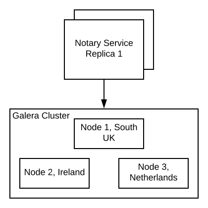
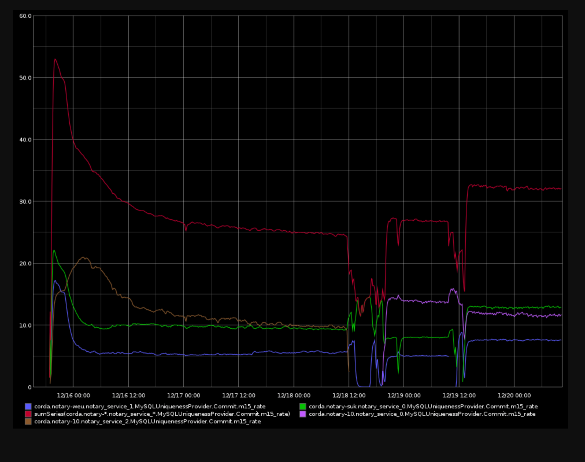
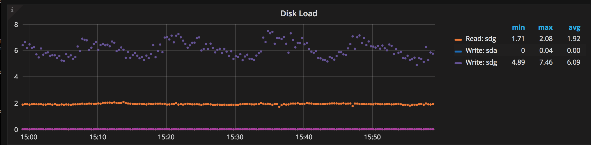

# HA Notary Service

## Overview

The distributed notary service tracks spent contract states and prevents double spending. For high-availability (HA),
the backing data store is replicated across a cluster of machines in different data centers. In this model, the cluster
is meant to be operated by a single party, and only crash faults are tolerated.

## Background

We have an existing HA notary service based on Atomix CopyCat, which an open source state machine replication library
that implemets the Raft consensus algorithm. However, it doesn't scale well with the number of spent input states, since
CopyCat takes periodic snapshots of the state machine and the snapshots have to fit in memory.

As an alternative, we propose using a more traditional MySQL database-based approach, using Galera Cluster, which
provides synchronous multi-master replication. Galera Cluster is based on a MySQL server with Write-Set replication 
(wsrep) API, and the Galera Replication Plugin. Through the wsrep API Galera provides [certification-based replication](http://galeracluster.com/documentation-webpages/certificationbasedreplication.html). It works roughly as
follows:

1. A single database node executes a transaction optimistically until it reaches the commit point.
2. Changes made by the trasaction are collected into a write-set.
3. The write-set broadcasted to the cluster.
4. Every other node determines whether it can apply the write-set without conflicts.
5. In case of conflict, the initial node rolls back the transaction.

There are different Galera Cluster implementations, and we chose the Percona XtraDB cluster, as they were historically
more focused on performance than the competition.

### Decisions

- We are replacing the Atomix CopyCat Raft service.
- We are using a Percona cluster for Corda Connect.
- We keep investigating a more scalable solution, based on Permazen or a custom implementation.
- In the long term, we are interested in providing a BFT solution, perhaps leveraging SGX.

.. toctree::

   decisions/decision.md

#### Advantages of Percona

- Production ready
- Works out of the box
- Backed by a company, enterprise and a community support are available
- Running stable at 30 tx/second (with 10 input states / tx), see figure below, in the section about the long running test

#### Disadvantages of Percona

- Performance deteriorates over time. This happens because Galera only works with the InnoDB storage engine, internally
  backed by a B+ tree. Since we use state references as primary keys, table insterts results in random B+ tree inserts,
  which doesn't scale well.

## Scope

### Goals

* We need a stable notary implementation.
* The implementation has to be easy to operate.
* We know that the switching costs to a more scalable solution are minimal.
* We take periodic backups of the consumed states and we test the recovery.
* We remain flexible and open to future requirements.

### Non-Goals

* For the time being, we don't need a solution that is shardable (for now, all replicas can hold all the state).
* We don't require a solution that can handle throughput beyond 15 tx/second.
* We don't design and implement a custom solution in the short term.
* We don't need rate limiting and fairness.

## Design

The HA notary service relies on the underlying MySQL uniqueness provider on top of a Percona XtraDB Cluster to prevent
double spending of input states. The exact data center locations are to be determined. Our notary service replicas
connect via JDBC to the replicated MySQL service.

Percona XtraDB Cluster is based on Percona Server and the Galera replication library that provides a multi master
cluster based on synchronous replication. The cluster is as good as its slowest node.

## Main Data Structure

The table below details the data base schema.

| Field name            | Type         | Description                              |
| --------------------- | ------------ | ---------------------------------------- |
| issue_tx_id           | Binary(32)   | The ID of the transaction that created the state |
| issue_tx_output_id    | Int unsigned | Where in the transaction the state was created |
| consuming_tx_id       | Binary(32)   | The ID of the transaction that consumes the input state |
| consuming_tx_input_id | Int unsigned | Where in the transaction the state is consumed |
| consuming_party       | Blob         | Who is requesting the notarisation (~1 kByte) |
| commit_time           | Timestamp    | When this row is committed               |

## Functional

The notary service relies on the MySQL uniqueness provider to prevent double spending. The MySQL database holds a single
table as described above. For HA, the data is synchronously replicated to several nodes by the Galera replication
plugin.

During notarisation, the uniqueness provider attempts to commit all input states of the Corda transaction in a single
database transaction. If at least one input state has been previously spent, the entire database transaction fails with
a batch exception. Unspent states can still be spent in a different later transaction. In case of double spend attempts,
the uniqueness provider queries the database for details where the conflicting states have been spent. The consuming
transaction ID, position of the input in the transaction and the requesting party are collected for all conflicting
inputs, wrapped in a uniqueness exception, thrown by the uniqueness provider. This exception is handled by the notary
service and turned into a notary exception.

We are using the Hikari connection pool to connect the notary services to all nodes of our Percona cluster. The
connection pool can be monitored via JMX.

### Deployment

We are planning to run a five node Percona cluster that can tolerate two simultaneous node failures. In case we need to
provide more storage or upgrade to better hardware we can take a single node down for maintenance and still tolerate one
unplanned failure.

#### Monitoring cluster membership changes

We setup a [notification command](http://galeracluster.com/documentation-webpages/notificationcmd.html) that gets called
whenever the node registers a change.

### Management

#### Disaster Recovery

Our disaster recovery strategy covers the following risks:
1. **Host Failure**. For the 5 node cluster we can tolerate 2 host failures without interrupting operation. This includes both machine and disk failures.
2. **DC Failure**. The cluster will be distributed across 3 data centers in a 2+2+1 configuration. A loss of one data center can be tolerated without interrupting service operation.
3. **Data Corruption/Loss**. In cases of data corruption or loss that is replicated across the cluster (for example, accidental data deletion or modification by an administrator) backups will be used to restore the cluster state. In this scenario service downtime will be incurred.

#### Backup and Recovery

Recovery Point Objective: 0

Recovery Time Objective: 1h

Any data loss incurred by the notary service will lead to a compromised ledger, since participants would be able to
double-spend already notarised states. Note that the backup & recovery procedure is only required for mitigating data
loss that gets replicated to the entire cluster.

This can be achieved by combining periodic backups of the entire database state, and the MySQL [binary
log](https://dev.mysql.com/doc/refman/5.7/en/binary-log.html). The binary log contains a log of all executed SQL
statements, which can be replayed onto a backup to restore the most up-to-date state. In case of an accidental statement
that removes data (e.g. DROP TABLE), the binary log can be replayed only up to the offending statement.

Scenarios where data corruption is caused by a malicious administrator selectively modifying or removing table rows are
out of scope.

See [Galera's backup documentation](http://galeracluster.com/documentation-webpages/backingupthecluster.html)

#### Monitoring

See the [Percona Management and Monitoring](https://www.percona.com/doc/percona-monitoring-and-management/index.html) documentation.

* Throughput in Tx / second
* Throughput in Input states / second
* Double spend attempts / time
* High level statistics, e.g. number of double spend attempts in the last 24 hours by two parties
* Double spend attempts per party
* Latency p50, p99
* Number of input states in DB
* Size of DB
* Replication Queues, see [monitoring Galera](http://galeracluster.com/documentation-webpages/monitoringthecluster.html)

#### Alerting

Alerts are triggered based on relevant metrics, like number of active members in the cluster and size of write queues of
individual nodes. We are configuring PMM to forward alerts to PagerDuty, where we do the routing to the operators who
are on call. We configure email alerting and slack integration as additional channels.

## Security

SSL encrypted links between the nodes of the Galera cluster and the notary service and the Galera cluster. See the [SSL
config documentation](http://galeracluster.com/documentation-webpages/sslconfig.html).

The managed disks on Azure [are encrypted](https://azure.microsoft.com/en-gb/blog/azure-managed-disks-sse/) with keys
managed by Microsoft. We have to trust our cloud provider anyways, so we don't do our own disk encryption.

## Testing the throughput of the uniqueness provider

We are using a custom load test flow that includes double spend attempts. The application metrics are forwarded to
Graphite and our Percona cluster is monitored by Percona's metrics and monitoring tool (PMM).

In our tests, the number of input states is Poisson-distributed with an average four input states per transaction. To
increase throughput in terms of notarised input states per second, we could batch transactions in the future. We tested
batching with batch sizes of up to 1000 input states per batch. And reached a throughput of 2k input states / second for
batch sizes 250-1000. When we detect a double spend attempt, we could send through individual transactions to find the
source of the conflict or bisect the batch.

## Long running test

The figure above shows the throughput in transactions per second over four days, while writing to the cluster with up to
three clients. The dips occur while we take nodes off-line to simulate failure and to upgrade the disks. In the last
phase of the test all nodes were equipped with managed 1TB SSDs and and the cluster notarised at more than 300 input
states per second while holding more than 100 M input states in the DB.

Glitches in throughput can occur when the write queue of a node is filling up. I'm assuming this is due to increased
disk latency when the cloud SAN disk is busy with other operations. When the maximum write queue size is reached, the
slow node isn't accepting writes any more and sends out flow control messages to its peers to stop replicating (I'm
assuming this leads to messages being queued in their send queue). The queue sizes are monitored by the PMM tool and we
can setup alerts based on a configured maximum write queue size or when we see "flow control messages".

We found that managed SSDs of 1TB in size performed better than a RAID 10 array of four 128GB SSDs. The latency of the
1TB SSDs was stable around 8ms, while we have observed latency spikes up to 64ms on the smaller SSDs. The disk load on
the slowest node in terms of disk latency was around 6-8 outstanding writes during the last phase of the test. Setting
up a RAID 10 was a mistake, for best performance we should have used a RAID 0 configuration, since the Azure disks are
replicated.

### Recommended Cloud Server Configuration

We recommend `Standard DS13 v2 (8 cores, 56 GB memory)` servers with 1 TB managed SSD disks attached. To make the setup
more cost effective, we can run on more affordable cloud instances, when we have lower demands in terms of throughput.
The optimum is yet to be found. It is possible to upgrade or downgrade the nodes of the cluster, one node at a time.

Be prepared to kill and replace the slowest node of the cluster, especially in the cloud, since the Galera cluster will
not perform better than the slowest node. The same goes for SAN disks. If you are unlucky and your disk has high
latency, try replacing it with a new one. Maybe your get better performance with your new disk.

### Disk upgrade using LVM

We recommend using LVM in production for convenience and flexibility. During our long running test we performed a hot
disk upgrade using LVM.
