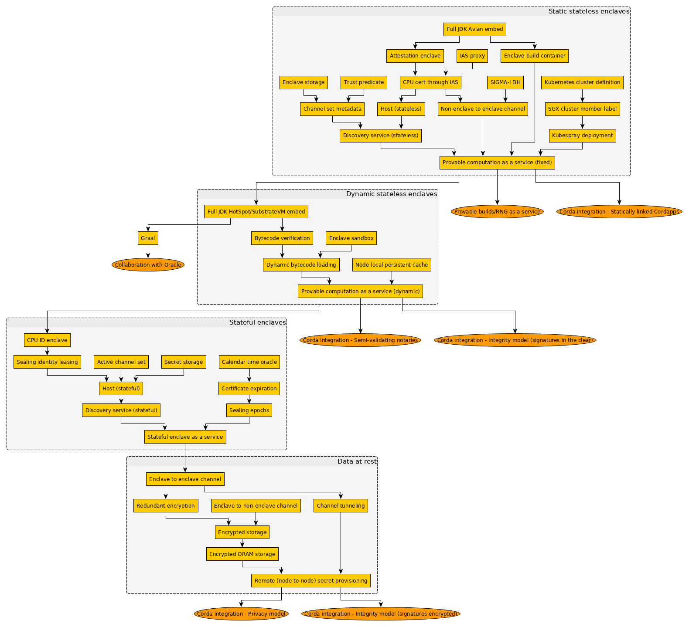

--------------------------------------------
Design Decision: Strategic SGX roadmap
============================================

## Background / Context

The statefulness of the enclave affects the complexity of both the infrastructure and attestation greatly.
The infrastructure needs to take care of tracking enclave state for request routing, and we need extra care if we want 
to make sure that old keys cannot be used to reveal sealed secrets.

As the first step the easiest thing to do would be to provide an infrastructure for hosting *stateless* enclaves that
are only concerned with enclave to non-enclave attestation. This provides a framework to do provable computations,
without the headache of handling sealed state and the various implied upgrade paths.

In the first phase we want to facilitate the ease of rolling out full enclave images (JAR linked into the image)
regardless of what the enclaves are doing internally. The contract of an enclave is the host-enclave API (attestation
protocol) and the exposure of the static set of channels the enclave supports. Furthermore the infrastructure will allow
deployment in a cloud environment and trivial scalability of enclaves through starting them on-demand.

The first phase will allow for a "fixed stateless provable computations as a service" product, e.g. provable builds or
RNG.

The question remains on how we should proceed afterwards. In terms of infrastructure we have a choice of implementing
sealed state or focusing on dynamic loading of bytecode. We also have the option to delay this decision until the end of
the first phase.

## Options Analysis

### A. Implement sealed state

Implementing sealed state involves solving the routing problem, for this we can use the concept of active channel sets.
Furthermore we need to solve various additional security issues around guarding sealed secret provisioning, most notably
expiration checks. This would involve implementing a future-proof calendar time oracle, which may turn out to be
impossible, or not quite good enough. We may decide that we cannot actually provide strong privacy guarantees and need
to enforce epochs as mentioned [here](../details/time.md).

#### Advantages

1. We would solve long term secret persistence early, allowing for a longer time frame for testing upgrades and
   reprovisioning before we integrate Corda
2. Allows "fixed stateful provable computations as a service" product, e.g. HA encryption

#### Disadvantages

1. There are some unsolved issues (Calendar time, sealing epochs)
2. It would delay non-stateful Corda integration

### B. Implement dynamic code loading

Implementing dynamic loading involves sandboxing of the bytecode, providing bytecode verification and perhaps
storage/caching of JARs (although it may be better to develop a more generic caching layer and use channels themselves
to do the upload). Doing bytecode verification is quite involved as Avian does not support verification, so this
would mean switching to a different JVM. This JVM would either be HotSpot or SubstrateVM, we are doing some preliminary
exploratory work to assess their feasibility. If we choose this path it opens up the first true integration point with
Corda by enabling semi-validating notaries - these are non-validating notaries that check an SGX signature over the
transaction. It would also enable an entirely separate generic product for verifiable pure computation.

#### Advantages

1. Early adoption of Graal if we choose to go with it (the alternative is HotSpot)
2. ​Allows first integration with Corda (semi-validating notaries)
3. Allows "generic stateless provable computation as a service" product, i.e. anything expressible as a JAR
4. Holding off on sealed state

#### Disadvantages

1. Too early ​Graal integration may result in maintenance headache later

## Recommendation and justification

Proceed with Option B, dynamic code loading. It would make us very early adopters of Graal (with the implied ups and 
downs), and most importantly kickstart collaboration between R3 and Oracle. We would also move away from Avian which we 
wanted to do anyway. It would also give us more time to think about the issues around sealed state, do exploratory work
on potential solutions, and there may be further development from Intel's side. Furthermore we need dynamic loading for
any fully fledged Corda integration, so we should finish this ASAP.

## Appendix: Proposed roadmap breakdown

