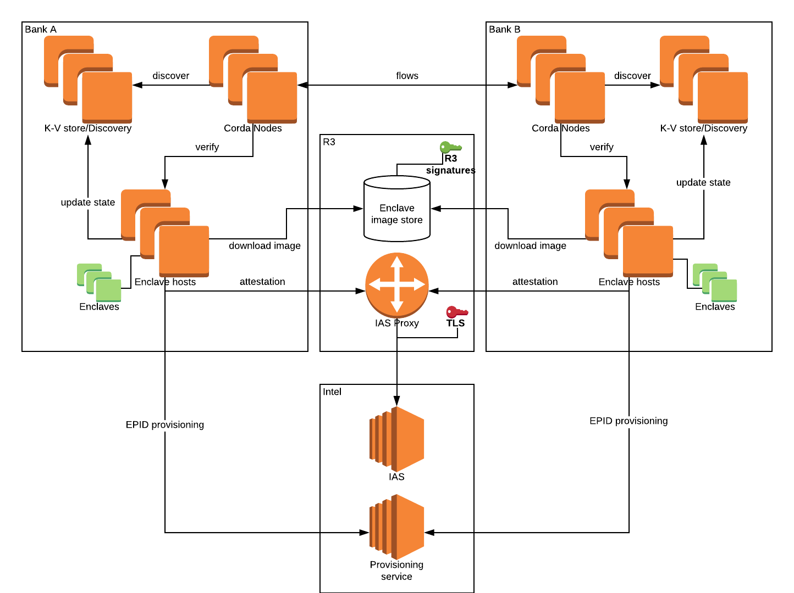

# SGX Infrastructure design

.. important:: This design document describes a feature of Corda Enterprise.

This document is intended as a design description of the infrastructure around the hosting of SGX enclaves, interaction
with enclaves and storage of encrypted data. It assumes basic knowledge of SGX concepts, and some knowledge of
Kubernetes for parts specific to that.

## High level description

The main idea behind the infrastructure is to provide a highly available cluster of enclave services (hosts) which can
serve enclaves on demand. It provides an interface for enclave business logic that's agnostic with regards to the
infrastructure, similar to serverless architectures. The enclaves will use an opaque reference
to other enclaves or services in the form of enclave channels. Channels hides attestation details
and provide a loose coupling between enclave/non-enclave functionality and specific enclave images/services implementing
it. This loose coupling allows easier upgrade of enclaves, relaxed trust (whitelisting), dynamic deployment, and
horizontal scaling as we can spin up enclaves dynamically on demand when a channel is requested.

For more information see:

.. toctree::
   :maxdepth: 1
   
   details/serverless.md
   details/channels.md
   
## Infrastructure components

Here are the major components of the infrastructure. Note that this doesn't include business logic specific
infrastructure pieces (like ORAM blob storage for Corda privacy model integration).

.. toctree::
   :maxdepth: 1
   
   details/kv-store.md
   details/discovery.md
   details/host.md
   details/enclave-storage.md
   details/ias-proxy.md
   
## Infrastructure interactions

* **Enclave deployment**:
  This includes uploading of the enclave image/container to enclave storage and adding of the enclave metadata to the
  key-value store.

* **Enclave usage**:
  This includes using the discovery service to find a specific enclave image and a host to serve it, then connecting to
  the host, authenticating(attestation) and proceeding with the needed functionality.

* **Ops**:
  This includes management of the cluster (Kubernetes/Kubespray) and management of the metadata relating to discovery to
  control enclave deployment (e.g. canary, incremental, rollback).

## Decisions to be made

.. toctree::
   :maxdepth: 1
   
   decisions/roadmap.md
   decisions/certification.md
   decisions/enclave-language.md
   decisions/kv-store.md

## Further details

.. toctree::
   :maxdepth: 1
   
   details/attestation.md
   details/time.md
   details/enclave-deployment.md
   
## Example deployment

This is an example of how two Corda parties may use the above infrastructure. In this example R3 is hosting the IAS 
proxy and the enclave image store and the parties host the rest of the infrastructure, aside from Intel components.

Note that this is flexible, the parties may decide to host their own proxies (as long as they whitelist their keys) or
the enclave image store (although R3 will need to have a repository of the signed enclaves somewhere).
We may also decide to go the other way and have R3 host the enclave hosts and the discovery service, shared between
parties (if e.g. they don't have access to/want to maintain SGX capable boxes).

