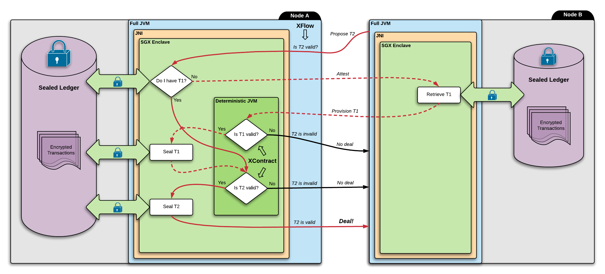

# SGX Integration

This document is intended as a design description of how we can go about integrating SGX with Corda. As the 
infrastructure design of SGX is quite involved (detailed elsewhere) but otherwise flexible we can discuss the possible 
integration points separately, without delving into lower level technical detail.

For the purposes of this document we can think of SGX as a way to provision secrets to a remote node with the 
knowledge that only trusted code(= enclave) will operate on it. Furthermore it provides a way to durably encrypt data 
in a scalable way while also ensuring that the encryption key is never leaked (unless the encrypting enclave is 
compromised).

Broadly speaking there are two dimensions to deciding how we can integrate SGX: *what* we store in the ledger and
*where* we store it.

The first dimension is the what: this relates to what we so far called the "integrity model" vs the "privacy model".

In the **integrity model** we rely on SGX to ensure the integrity of the ledger. Using this assumption we can cut off 
the transaction body and only store an SGX-backed signature over filtered transactions. Namely we would only store 
information required for notarisation of the current and subsequent spending transactions. This seems neat on first 
sight, however note that if we do this naively then if an attacker can impersonate an enclave they'll gain write 
access to the ledger, as the fake enclave can sign transactions as valid without having run verification.

In the **privacy model** we store the full transaction backchain (encrypted) and we keep provisioning it between nodes 
on demand, just like in the current Corda implementation. This means we only rely on SGX for the privacy aspects - if 
an enclave is compromised we only lose privacy, the verification cannot be eluded by providing a fake signature.

The other dimension is the where: currently in non-SGX Corda the full transaction backchain is provisioned between non-
notary nodes, and is also provisioned to notaries in the case they are validating ones. With SGX+BFT notaries we have 
the possibility to offload the storage of the encrypted ledger (or encrypted signatures thereof) to notary nodes (or 
dedicated oracles) and only store bookkeeping information required for further ledger updates in non-notary nodes. The 
storage policy is very important, customers want control over the persistence of even encrypted data, and with the 
introduction of recent regulation (GDPR) unrestricted provisioning of sensitive data will be illegal by law, even when 
encrypted.

We'll explore the different combination of choices below. Note that we don't need to marry to any one of them, we may 
decide to implement several.

## Privacy model + non-notary provisioning

Let's start with the model that's closest to the current Corda implementation as this is an easy segue into the 
possibilities with SGX. We also have a simple example and a corresponding neat diagram (thank you Kostas!!) we showed 
to a member bank Itau to indicate in a semi-handwavy way what the integration will look like.

We have a cordapp X used by node A and B. The cordapp contains a flow XFlow and a (deterministic) contract XContract. 
The two nodes are negotiating a transaction T2. T2 consumes a state that comes from transaction T1.

Let's assume that both A and B are happy with T2, except Node A hasn't established the validity of it yet. Our goal is 
to prove the validity of T2 to A without revealing the details of T1.

The following diagram shows an overview of how this can be achieved. Note that the diagram is highly oversimplified 
and is meant to communicate the high-level data flow relevant to Corda.

* In order to validate T2, A asks its enclave whether T2 is valid.
* The enclave sees that T2 depends on T1, so it consults its sealed ledger whether it contains T1.
* If it does then this means T1 has been verified already, so the enclave moves on to the verification of T2.
* If the ledger doesn't contain T1 then the enclave needs to retrieve it from node B.
* In order to do this A's enclave needs to prove to B's enclave that it is indeed a trusted enclave B can provision T1 
  to. This proof is what the attestation process provides.
* Attestation is done in the clear: (TODO attestation diagram)
  * A's enclave generates a keypair, the public part of which is sent to Node B in a datastructure signed by Intel, 
    this is called the quote(1).
  * Node B's XFlow may do various checks on this datastructure that cannot be performed by B's enclave, for example 
    checking of the timeliness of Intel's signature(2).
  * Node B's XFlow then forwards the quote to B's enclave, which will check Intel's signature and whether it trusts A'
    s enclave. For the sake of simplicity we can assume this to be strict check that A is running the exact same 
    enclave B is.
  * At this point B's enclave has established trust in A's enclave, and has the public part of the key generated by A'
    s enclave.
  * The nodes repeat the above process the other way around so that A's enclave establishes trust in B's and gets hold 
    of B's public key(3).
  * Now they proceed to perform an ephemeral Diffie-Hellman key exchange using the keys in the quotes(4).
  * The ephemeral key is then used to encrypt further communication. Beyond this point the nodes' flows (and anything 
    outside of the enclaves) have no way of seeing what data is being exchanged, all the nodes can do is forward the 
    encrypted messages.
* Once attestation is done B's enclave provisions T1 to A's enclave using the DH key. If there are further 
  dependencies those would be provisioned as well.
* A's enclave then proceeds to verify T1 using the embedded deterministic JVM to run XContract. The verified 
  transaction is then sealed to disk(5). We repeat this for T2.
* If verification or attestation fails at any point the enclave returns to A's XFlow with a failure. Otherwise if all 
  is good the enclave returns with a success. At this point A's XFlow knows that T2 is valid, but hasn't seen T1 in 
  the clear.

(1) This is simplified, the actual protocol is a bit different. Namely the quote is not generated every time A requires provisioning, but is rather generated periodically.

(2) There is a way to do this check inside the enclave, however it requires switching on of the Intel ME which in general isn't available on machines in the cloud and is known to have vulnerabilities.

(3) We need symmetric trust even if the secrets seem to only flow from B to A. Node B may try to fake being an enclave to fish for information from A.

(4) The generated keys in the quotes are used to authenticate the respective parts of the DH key exchange.

(5) Sealing means encryption of data using a key unique to the enclave and CPU. The data may be subsequently unsealed (decrypted) by the enclave, even if the enclave was restarted. Also note that there is another layer of abstraction needed which we don't detail here, needed for redundancy of the encryption key.

To summarise, the journey of T1 is:

1. Initially it's sitting encrypted in B's storage.
2. B's enclave decrypts it using its seal key specific to B's enclave + CPU combination.
3. B's enclave encrypts it using the ephemeral DH key.
4. The encrypted transaction is sent to A. The safety of this (namely that A's enclave doesn't reveal the transaction to node A) hinges on B's enclave's trust in A's enclave, which is expressed as a check of A's enclave measurement during attestation, which in turn requires auditing of A's enclave code and reproducing of the measurement.
5. A's enclave decrypts the transaction using the DH key.
6. A's enclave verifies the transaction using a deterministic JVM.
7. A's enclave encrypts the transaction using A's seal key specific to A's enclave + CPU combination.
8. The encrypted transaction is stored in A's storage.

As we can see in this model each non-notary node runs their own SGX enclave and related storage. Validation of the 
backchain happens by secure provisioning of it between enclaves, plus subsequent verification and storage. However 
there is one important thing missing from the example (actually it has several, but those are mostly technical detail):
the notary!

In reality we cannot establish the full validity of T2 at this point of negotiation, we need to first notarise it. 
This model gives us some flexibility in this regard: we can use a validating notary (also running SGX) or a
non-validating one. This indicates that the enclave API should be split in two, mirroring the signature check choice 
in SignedTransaction.verify. Only when the transaction is fully signed and notarised should it be persisted (sealed).

This model has both advantages and disadvantages. On one hand it is the closest to what we have now - we (and users) 
are familiar with this model, we can fairly easily nest it into the existing codebase and it gives us flexibility with 
regards to notary modes. On the other hand it is a compromising answer to the regulatory problem. If we use non-
validating notaries then the backchain storage is restricted to participants, however consider the following example: 
if we have a transaction X that parties A and B can process legally, but a later transaction Y that has X in its 
backchain is sent for verification to party C, then C will process and store X as well, which may be illegal.

## Privacy model + notary provisioning

This model would work similarly to the previous one, except non-notary nodes wouldn't need to run SGX or care about 
storage of the encrypted ledger, it would all be done in notary nodes. Nodes would connect to SGX capable notary nodes,
and after attestation the nodes can be sure that the notary has run verification before signing.

This fixes the choice of using validating notaries, as notaries would be the only entities capable of verification: 
only they have access to the full backchain inside enclaves.

Note that because we still provision the full backchain between notary members for verification, we don't necessarily 
need a BFT consensus on validity - if an enclave is compromised an invalid transaction will be detected at the next 
backchain provisioning.

This model reduces the number of responsibilities of a non-notary node, in particular it wouldn't need to provide 
storage for the backchain or verification, but could simply trust notary signatures. Also it wouldn't need to host SGX 
enclaves, only partake in the DH exchange with notary enclaves. The node's responsibilities would be reduced to the 
orchestration of ledger updates (flows) and related bookkeeping (vault, network map). This split would also enable us 
to be flexible with regards to the update orchestration: trust in the validity of the ledger would cease to depend on 
the transaction resolution currently embedded into flows - we could provide a from-scratch light-weight implementation 
of a "node" (say a mobile app) that doesn't use flows and related code at all, it just needs to be able to connect to 
notary enclaves to notarise, validity is taken care of by notaries.

Note that although we wouldn't require validation checks from non-notary nodes, in theory it would be safe to allow 
them to do so (if they want a stronger-than-BFT guarantee).

Of course this model has disadvantages too. From the regulatory point of view it is a strictly worse solution than the 
non-notary provisioning model: the backchain would be provisioned between notary nodes not owned by actual 
participants in the backchain. It also disables us from using non-validating notaries.

## Integrity model + non-notary provisioning

In this model we would trust SGX-backed signatures and related attestation datastructures (quote over signature key 
signed by Intel) as proof of validity. When node A and B are negotiating a transaction it's enough to provision SGX 
signatures over the dependency hashes to one another, there's no need to provision the full backchain.

This sounds very simple and efficient, and it's even more private than the privacy model as we're only passing 
signatures around, not transactions. However there are a couple of issues that need addressing: If an SGX enclave is 
compromised a malicious node can provide a signature over an invalid transaction that checks out, and nobody will ever 
know about it, because the original transaction will never be verified. One way we can mitigate this is by requiring a 
BFT consensus signature, or perhaps a threshold signature is enough. We could decouple verification into "verifying 
oracles" which verify in SGX and return signatures over transaction hashes, and require a certain number of them to 
convince the notary to notarise and subsequent nodes to trust validity. Another issue is enclave updates. If we find a 
vulnerability in an enclave and update it, what happens to the already signed backchain? Historical transactions have 
signatures that are rooted in SGX quotes belonging to old untrusted enclave code. One option is to simply have a 
cutoff date before which we accept old signatures. This requires a consensus-backed timestamp on the notary signature. 
Another option would be to keep the old ledger around and re-verify it with the new enclaves. However if we do this we 
lose the benefits of the integrity model - we get back the regulatory issue, and we don't gain the performance benefits.

## Integrity model + notary provisioning

This is similar to the previous model, only once again non-notary nodes wouldn't need to care about verifying or 
collecting proofs of validity before sending the transaction off for notarisation. All of the complexity would be 
hidden by notary nodes, which may use validating oracles or perhaps combine consensus over validity with consensus 
over spending. This model would be a very clean separation of concerns which solves the regulatory problem (almost) 
and is quite efficient as we don't need to keep provisioning the chain. One potential issue with regards to regulation 
is the tip of the ledger (the transaction being notarised) - this is sent to notaries and although it is not stored it 
may still be against the law to receive it and hold it in volatile memory, even inside an enclave. I'm unfamiliar with 
the legal details of whether this is good enough. If this is an issue, one way we could address this would be to scope 
the validity checks required for notarisation within legal boundaries and only require "full" consensus on the 
spentness check. Of course this has the downside that ledger participants outside of the regulatory boundary need to 
trust the BFT-SGX of the scope. I'm not sure whether it's possible to do any better, after all we can't send the 
transaction body outside the scope in any shape or form.

## Threat model

In all models we have the following actors, which may or may not overlap depending on the model:

* Notary quorum members
* Non-notary nodes/entities interacting with the ledger
* Identities owning the verifying enclave hosting infrastructure
* Identities owning the encrypted ledger/signature storage infrastructure
* R3 = enclave whitelisting identity
* Network Map = contract whitelisting identity
* Intel

We have two major ways of compromise:

* compromise of a non-enclave entity (notary, node, R3, Network Map, storage)
* compromise of an enclave.

In the case of **notaries** compromise means malicious signatures, for **nodes** it's malicious transactions, for **R3**
it's signing malicious enclaves, for **Network Map** it's signing malicious contracts, for **storage** it's read-write 
access to encrypted data, and for **Intel** it's forging of quotes or signing over invalid ones.

A compromise of an **enclave** means some form of access to the enclave's temporary identity key. This may happen 
through direct hardware compromise (extracting of fuse values) and subsequent forging of a quote, or leaking of secrets 
through weakness of the enclave-host boundary or other side-channels like Spectre(hacking). In any case it allows an
adversary to impersonate an enclave and therefore to intercept enclave traffic and forge signatures.

The actors relevant to SGX are enclave hosts, storage infrastructure owners, regular nodes and R3.

* **Enclave hosts**: enclave code is specifically written with malicious (compromised) hosts in mind. That said we 
  cannot be 100% secure against yet undiscovered side channel attacks and other vulnerabilities, so we need to be 
  prepared for the scenario where enclaves get compromised. The privacy model effectively solves this problem by 
  always provisioning and re-verifying the backchain. An impersonated enclave may be able to see what's on the ledger, 
  but tampering with it will not check out at the next provisioning. On the other hand if a compromise happens in the 
  integrity model an attacker can forge a signature over validity. We can mitigate this with a BFT guarantee by 
  requiring a consensus over validity. This way we effectively provide the same guarantee for validity as notaries 
  provide with regards to double spend.

* **Storage infrastructure owner**: 
  * A malicious actor would need to crack the encryption key to decrypt transactions 
    or transaction signatures. Although this is highly unlikely, we can mitigate by preparing for and forcing of key 
    updates (i.e. we won't provision new transactions to enclaves using old keys).
  * What an attacker *can* do is simply erase encrypted data (or perhaps re-encrypt as part of ransomware), blocking 
    subsequent resolution and verification. In the non-notary provisioning models we can't really mitigate this as the 
    tip of the ledger (or signature over) may only be stored by a single non-notary entity (assumed to be compromised).
    However if we require consensus over validity between notary or non-notary entities (e.g. validating oracles) then 
    this implicitly provides redundancy of storage.
  * Furthermore storage owners can spy on the enclave's activity by observing access patterns to the encrypted blobs.
    We can mitigate by implementing ORAM storage.

* **Regular nodes**: if a regular node is compromised the attacker may gain access to the node's long term key that 
  allows them to Diffie-Hellman with an enclave, or get the ephemeral DH value calculated during attestation directly. 
  This means they can man-in-the-middle between the node and the enclave. From the ledger's point of view we are 
  prepared for this scenario as we never leak sensitive information to the node from the enclave, however it opens the 
  possibility that the attacker can fake enclave replies (e.g. validity checks) and can sniff on secrets flowing from 
  the node to the enclave. We can mitigate the fake enclave replies by requiring an extra signature on messages. 
  Sniffing cannot really be mitigated, but one could argue that if the transient DH key (that lives temporarily in 
  volatile memory) or long term key (that probably lives in an HSM) was leaked then the attacker has access to node 
  secrets anyway.

* **R3**: the entity that's whitelisting enclaves effectively controls attestation trust, which means they can 
  backdoor the ledger by whitelisting a secret-revealing/signature-forging enclave. One way to mitigate this is by 
  requiring a threshold signature/consensus over new trusted enclave measurements. Another way would be to use "canary" 
  keys controlled by neutral parties. These parties' responsibility would simply be to publish enclave measurements (and
  perhaps the reproducing build) to the public before signing over them. The "publicity" and signature would be checked 
  during attestation, so a quote with a non-public measurement would be rejected. Although this wouldn't prevent 
  backdoors (unless the parties also do auditing), it would make them public.

* **Intel**: There are two ways a compromised Intel can interact with the ledger maliciously, both provide a backdoor.
  * It can sign over invalid quotes. This can be mitigated by implementing our own attestation service. Intel told us 
    we'll be able to do this in the future (by downloading a set of certificates tied to CPU+CPUSVN combos that may be 
    used to check QE signatures).
  * It can produce valid quotes without an enclave. This is due to the fact that they store one half of the SGX-
    specific fuse values in order to validate quotes flexibly. One way to circumvent this would be to only use the 
    other half of the fuse values (the seal values) which they don't store (or so they claim). However this requires 
    our own "enrollment" process of CPUs where we replicate the provisioning process based off of seal values and 
    verify manually that the provisioning public key comes from the CPU. And even if we do this all we did was move 
    the requirement of trust from Intel to R3.
    
  Note however that even if an attacker compromises Intel and decides to backdoor they would need to connect to the
  ledger participants in order to take advantage. The flow framework and the business network concept act as a form of
  ACL on data that would make an Intel backdoor quite useless.

## Summary

As we can see we have a number of options here, all of them have advantages and disadvantages.

#### Privacy + non-notary

**Pros**:
* Closest to our current non-SGX model
* Strong guarantee of validity
* Flexible with respect to notary modes

**Cons**:
* Regulatory problem about provisioning of ledger
* Relies on ledger participants to do validation checks
* No redundancy across ledger participants

#### Privacy + notary

**Pros**:
* Strong guarantee of validity
* Separation of concerns, allows lightweight ledger participants
* Redundancy across notary nodes

**Cons**:
* Regulatory problem about provisioning of ledger

#### Integrity + non-notary

**Pros**:
* Efficient validity checks
* No storage of sensitive transaction body only signatures

**Cons**:
* Enclave impersonation compromises ledger (unless consensus validation)
* Relies on ledger participants to do validation checks
* No redundancy across ledger participants

#### Integrity + notary

**Pros**:
* Efficient validity check
* No storage of sensitive transaction body only signatures
* Separation of concerns, allows lightweight ledger participants
* Redundancy across notary nodes

**Cons**:
* Only BFT guarantee over validity
* Temporary storage of transaction in RAM may be against regulation

Personally I'm strongly leaning towards an integrity model where SGX compromise is mitigated by a BFT consensus over validity (perhaps done by a validating oracle cluster). This would solve the regulatory problem, it would be efficient and the infrastructure would have a very clean separation of concerns between notary and non-notary nodes, allowing lighter-weight interaction with the ledger.
