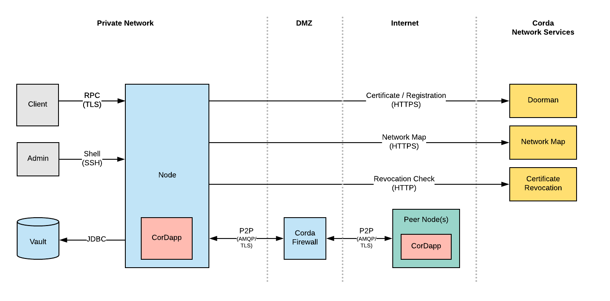

Corda Threat Model
==================

This document describes the security threat model of the Corda Platform. The Corda Threat Model is the result of architectural and threat modelling sessions,
and is designed to provide a high level overview of the security objectives for the Corda Network , and the controls and mitigations used to deliver on those
objectives. It is intended to support subsequent analysis and architecture of systems connecting with the network and the applications which interact with data
across it.

It is incumbent on all ledger network participants to review and assess the security measures described in this document against their specific organisational
requirements and policies, and to implement any additional measures needed.

Scope
-----

Built on the [Corda](http://www.corda.net/) distributed ledger platform designed by R3, the ledger network enables the origination and management of agreements
between business partners. Participants to the network create and maintain Corda *nodes,* each hosting one or more pluggable applications ( *CorDapps* ) which
define the data to be exchanged and its workflow. See the [Corda Technical White Paper](https://docs.corda.net/_static/corda-technical-whitepaper.pdf) for a
detailed description of Corda's design and functionality.

R3 provide and maintain a number of essential services underpinning the ledger network. In the future these services are intended to be operated by a separate
Corda Foundation. The network services currently include:

-   Network Identity service ('Doorman'): Issues signed digital certificates that uniquely identity parties on the network.
-   Network Map service: Provides a way for nodes to advertise their identity, and identify other nodes on the network, their network address and advertised
    services.

Participants to the ledger network include major institutions, financial organisations and regulated bodies, across various global jurisdictions. In a majority
of cases, there are stringent requirements in place for participants to demonstrate that their handling of all data is performed in an appropriately secure
manner, including the exchange of data over the ledger network. This document identifies measures within the Corda platform and supporting infrastructure to
mitigate key security risks in support of these requirements.

The Corda Network
-----------------

The diagram below illustrates the network architecture, protocols and high level data flows that comprise the Corda Network. The threat model has been developed
based upon this architecture.

Threat Model
------------

Threat Modelling is an iterative process that works to identify, describe and mitigate threats to a system. One of the most common models for identifying
threats is the [STRIDE](https://en.wikipedia.org/wiki/STRIDE_(security)) framework. It provides a set of security threats in six categories:

-   Spoofing
-   Tampering
-   Information Disclosure
-   Repudiation
-   Denial of Service
-   Elevation of Privilege

The Corda threat model uses the STRIDE framework to present the threats to the Corda Network in a structured way. It should be stressed that threat modelling is
an iterative process that is never complete. The model described below is part of an on-going process intended to continually refine the security architecture
of the Corda platform.

### Spoofing

Spoofing is pretending to be something or someone other than yourself. It is the actions taken by an attacker to impersonate another party, typically for the
purposes of gaining unauthorised access to privileged data, or perpetrating fraudulent transactions. Spoofing can occur on multiple levels. Machines can be
impersonated at the network level by a variety of methods such as ARP & IP spoofing or DNS compromise.

Spoofing can also occur at an application or user-level. Attacks at this level typically target authentication logic, using compromised passwords and
cryptographic keys, or by subverting cryptography systems.

Corda employs a Public Key Infrastructure (PKI) to validate the identity of nodes, both at the point of registration with the network map service and
subsequently through the cryptographic signing of transactions. An imposter would need to acquire an organisation's private keys in order to meaningfully
impersonate that organisation. R3 provides guidance to all ledger network participants to ensure adequate security is maintained around cryptographic keys.

+-------------+------------------------------------------------------------------------------+----------------------------------------------------------------+
| Element     | Attacks                                                                      | Mitigations                                                    |
+=============+==============================================================================+================================================================+
| RPC Client  | An external attacker impersonates an RPC client and is able to initiate      | The RPC Client is authenticated by the node and must supply    |
|             | flows on their behalf.                                                       | valid credentials (username & password).                       |
|             |                                                                              |                                                                |
|             | A malicious RPC client connects to the node and impersonates another,        | RPC Client permissions are configured by the node              |
|             | higher-privileged client on the same system, and initiates flows on their    | administrator and can be used to restrict the actions and      |
|             | behalf.                                                                      | flows available to the client.                                 |
|             |                                                                              |                                                                |
|             | **Impacts**                                                                  | RPC credentials and permissions can be managed by an Apache    |
|             |                                                                              | Shiro service. The RPC service restricts which actions are     |
|             | If successful, the attacker would be able to perform actions that they are   | available to a client based on what permissions they have been |
|             | not authorised to perform, such initiating flows. The impact of these        | assigned.                                                      |
|             | actions could have financial consequences depending on what flows were       |                                                                |
|             | available to the attacker.                                                   |                                                                |
+-------------+------------------------------------------------------------------------------+----------------------------------------------------------------+
| Node        | An attacker attempts to impersonate a node and issue a transaction using     | Nodes must connect to each other using using                   |
|             | their identity.                                                              | mutually-authenticated TLS connections. Node identity is       |
|             |                                                                              | authenticated using the certificates exchanged as part of the  |
|             | An attacker attempts to impersonate another node on the network by           | TLS protocol. Only the node that owns the corresponding        |
|             | submitting NodeInfo updates with falsified address and/or identity           | private key can assert their true identity.                    |
|             | information.                                                                 |                                                                |
|             |                                                                              | NodeInfo updates contain the node's public identity            |
|             | **Impacts**                                                                  | certificate and must be signed by the corresponding private    |
|             |                                                                              | key. Only the node in possession of this private key can sign  |
|             | If successful, a node able to assume the identity of another party could     | the NodeInfo.                                                  |
|             | conduct fraudulent transactions (e.g. pay cash to its own identity), giving  |                                                                |
|             | a direct financial impact to the compromised identity. Demonstrating that    | Corda employs a Public Key Infrastructure (PKI) to validate    |
|             | the actions were undertaken fraudulently could prove technically challenging | the identity of nodes. An imposter would need to acquire an    |
|             | to any subsequent dispute resolution process.                                | organisation's private keys in order to meaningfully           |
|             |                                                                              | impersonate that organisation. Corda will soon support a range |
|             | In addition, an impersonating node may be able to obtain privileged          | of HSMs (Hardware Security Modules) for storing a node's       |
|             | information from other nodes, including receipt of messages intended for the | private keys, which mitigates this risk.                       |
|             | original party containing information on new and historic transactions.      |                                                                |
+-------------+------------------------------------------------------------------------------+----------------------------------------------------------------+
| Network Map | An attacker with appropriate network access performs a DNS compromise,       | Connections to the Network Map service are secured using the   |
|             | resulting in network traffic to the Doorman & Network Map being routed to    | HTTPS protocol. The connecting node authenticates the          |
|             | their attack server, which attempts to impersonate these machines.           | NetworkMap servers using their public certificates, to ensure  |
|             |                                                                              | the identity of these servers is correct.                      |
|             | **Impact**                                                                   |                                                                |
|             |                                                                              | All data received from the NetworkMap is digitally signed (in  |
|             | Impersonation of the Network Map would enable an attacker to issue           | addition to being protected by TLS) - an attacker attempting   |
|             | unauthorised updates to the map.                                             | to spoof the Network Map would need to acquire both private    |
|             |                                                                              | TLS keys, and the private NetworkMap signing keys.             |
|             |                                                                              |                                                                |
|             |                                                                              | The Doorman and NetworkMap signing keys are stored inside a    |
|             |                                                                              | (Hardware Security Module (HSM) with strict security controls  |
|             |                                                                              | (network separation and physical access controls).             |
+-------------+------------------------------------------------------------------------------+----------------------------------------------------------------+
| Doorman     | An malicious attacker operator attempts to join the Corda Network by         | R3 operate strict validation procedures to ensure that         |
|             | impersonating an existing organisation and issues a fraudulent registration  | requests to join the Corda Network have legitimately           |
|             | request.                                                                     | originated from the organisation in question.                  |
|             |                                                                              |                                                                |
|             | **Impact**                                                                   |                                                                |
|             |                                                                              |                                                                |
|             | The attacker would be able to join and impersonate an organisation.          |                                                                |
|             |                                                                              |                                                                |
|             | The operator could issue an identity cert for any organisation, publish a    |                                                                |
|             | valid NodeInfo and redirect all traffic to themselves in the clear.          |                                                                |
+-------------+------------------------------------------------------------------------------+----------------------------------------------------------------+

  

### Tampering

Tampering refers to the modification of data with malicious intent. This typically involves modification of data at rest (such as a file on disk, or fields in a
database), or modification of data in transit.

To be successful, an attacker would require privileged access to some part of the network infrastructure (either public or internal private networks). They
might also have access to a node's file-system, database or even direct memory access.

+------------+-----------------------------------------------------------------------------+------------------------------------------------------------------+
| Element    | Attacks                                                                     | Mitigations                                                      |
+============+=============================================================================+==================================================================+
| Node       | Unintended, adverse behaviour of a CorDapp running on one or more nodes -   | By design, Corda's notary-based consensus model and contract     |
| (CorDapp)  | either its core code or any supporting third party libraries. A coding bug  | validation mechanisms provide protection against attempts to     |
|            | is assumed to be the default cause, although malicious modification of a    | alter shared data or perform invariant operations. The primary   |
|            | CorDapp could result in similar effects.                                    | risk is therefore to local systems.                              |
|            |                                                                             |                                                                  |
|            |                                                                             | Future versions of Corda will require CorDapps to be executed    |
|            |                                                                             | inside a sandboxed JVM environment, modified to restrict         |
|            |                                                                             | unauthorised access to the local file system and network. This   |
|            |                                                                             | is intended to minimise the potential of a compromised CorDapp   |
|            |                                                                             | to affect systems local to the node.                             |
+------------+-----------------------------------------------------------------------------+------------------------------------------------------------------+
| P2P & RPC  | An attacker performs Man-in-the-Middle (MITM) attack against a node's       | Mutually authenticated TLS connections between nodes ensures     |
| connection | peer-to-peer (P2P) connection                                               | that Man-In-The-Middle (MITM) attacks cannot take place. Corda   |
| s          |                                                                             | Nodes restrict their connections to TLS v1.2 and also restrict   |
|            | **Impact**                                                                  | which cipher suites are accepted.                                |
|            |                                                                             |                                                                  |
|            | An attacker would be able to modify transactions between participating      |                                                                  |
|            | nodes.                                                                      |                                                                  |
+------------+-----------------------------------------------------------------------------+------------------------------------------------------------------+
| Node Vault | An attacker gains access to the node's vault and modifies tables in the     | There are not currently any direct controls to mitigate this     |
|            | database.                                                                   | kind of attack. A node's vault is assumed to be within the same  |
|            |                                                                             | trust boundary of the node JVM. Access to the vault must be      |
|            | **Impact**                                                                  | restricted such that only the node can access it. Both           |
|            |                                                                             | network-level controls (fire-walling) and database permissions   |
|            | Transaction history would become compromised. The impact could range from   | must be employed.                                                |
|            | deletion of data to malicious tampering of financial detail.                |                                                                  |
|            |                                                                             | Note that the tampering of a node's vault only affects that      |
|            |                                                                             | specific node's transaction history. No other node in the        |
|            |                                                                             | network is affected and any tampering attempts are easily        |
|            |                                                                             | detected.                                                        |
|            |                                                                             |                                                                  |
|            |                                                                             |                                                                  |
+------------+-----------------------------------------------------------------------------+------------------------------------------------------------------+
| Network    | An attacker compromises the Network Map service and publishes an            | Individual Node entries in the NetworkMap must be signed by the  |
| Map        | illegitimate update.                                                        | associated node's private key. The signatures are validated by   |
|            |                                                                             | the NetworkMap service, and all other Nodes in the network, to   |
|            | **Impact**                                                                  | ensure they have not been tampered with. An attacker would need  |
|            |                                                                             | to acquire a node's private identity signing key to be able to   |
|            | NodeInfo entries (name & address information) could potentially become      | make modifications to a NodeInfo. This is only possible if the   |
|            | altered if this attack was possible                                         | attacker has control of the node in question.                    |
|            |                                                                             |                                                                  |
|            | The NetworkMap could be deleted and/or unauthorized nodes could be added    | It is not possible for the NetworkMap service (or R3) to modify  |
|            | to, or removed from the map.                                                | entries in the network map (because the node's private keys are  |
|            |                                                                             | not accessible). If the NetworkMap service were compromised, the |
|            |                                                                             | only impact the attacker could have would be to add or remove    |
|            |                                                                             | individual entries in the map.                                   |
+------------+-----------------------------------------------------------------------------+------------------------------------------------------------------+

### Repudiation

Repudiation refers to the ability to claim a malicious action did not take place. Repudiation becomes relevant when it is not possible to verify the identity of
an attacker, or there is a lack of evidence to link their malicious actions with events in a system.

Preventing repudiation does not prevent other forms of attack. Rather, the goal is to ensure that the attacker is identifiable, their actions can be traced, and
there is no way for the attacker to deny having committed those actions.

+-------------+------------------------------------------------------------------------------+-----------------------------------------------------------------+
| Element     | Attacks                                                                      | Mitigations                                                     |
+=============+==============================================================================+=================================================================+
| RPC Client  | Attacker attempts to initiate a flow that they are not entitled to perform   | RPC clients must authenticate to the Node using credentials     |
|             |                                                                              | passed over TLS. It is therefore not possible for an RPC client |
|             | **Impact**                                                                   | to perform actions without first proving their identity.        |
|             |                                                                              |                                                                 |
|             | Flows could be initiated without knowing the identity of the client.         | All interactions with an RPC user are also logged by the node.  |
|             |                                                                              | An attacker's identity and actions will be recorded and cannot  |
|             |                                                                              | be repudiated.                                                  |
+-------------+------------------------------------------------------------------------------+-----------------------------------------------------------------+
| Node        | A malicious CorDapp attempts to spend a state that does not belong to them.  | Corda transactions must be signed with a node's private         |
|             | The node operator then claims that it was not their node that initiated the  | identity key in order to be accepted by the rest of the         |
|             | transaction.                                                                 | network. The signature directly identities the signing party    |
|             |                                                                              | and cannot be made by any other node - therefore the act of     |
|             | **Impact**                                                                   | signing a transaction                                           |
|             |                                                                              |                                                                 |
|             | Financial transactions could be initiated by anonymous parties, leading to   | Corda transactions between nodes utilize the P2P protocol,      |
|             | financial loss, and loss of confidence in the network.                       | which requires a mutually authenticated TLS connection. It is   |
|             |                                                                              | not possible for a node to issue transactions without having    |
|             |                                                                              | it's identity authenticated by other nodes in the network. Node |
|             |                                                                              | identity and TLS certificates are issued via Corda Network      |
|             |                                                                              | services, and use the Corda PKI (Public Key Infrastructure) for |
|             |                                                                              | authentication.                                                 |
|             |                                                                              |                                                                 |
|             |                                                                              | All P2P transactions are logged by the node, meaning that any   |
|             |                                                                              | interactions are recorded                                       |
+-------------+------------------------------------------------------------------------------+-----------------------------------------------------------------+
| Node        | A node attempts to perform a denial-of-state attack.                         | Non-validating Notaries require a signature over every request, |
|             |                                                                              | therefore nobody can deny performing denial-of-state attack     |
|             |                                                                              | because every transaction clearly identities the node that      |
|             |                                                                              | initiated it.                                                   |
+-------------+------------------------------------------------------------------------------+-----------------------------------------------------------------+
| Node        |                                                                              |                                                                 |
+-------------+------------------------------------------------------------------------------+-----------------------------------------------------------------+

  

### Information Disclosure

Information disclosure is about the unauthorised access of data. Attacks of this kind have an impact when confidential data is accessed. Typical examples of
attack include extracting secrets from a running process, and accessing confidential files on a file-system which have not been appropriately secured.
Interception of network communications between trusted parties can also lead to information disclosure.

An attacker capable of intercepting network traffic from a Corda node would, at a minimum, be able to identify which other parties that node was interacting
with, along with relative frequency and volume of data being shared; this could be used to infer additional privileged information without the parties'
consent. All network communication of a Corda is encrypted using the TLS protocol (v1.2), using modern cryptography algorithms.

+------------+------------------------------------------------------------------------------+------------------------------------------------------------------+
| Element    | Attack                                                                       | Mitigations                                                      |
+============+==============================================================================+==================================================================+
| Node       | An attacker attempts to retrieve transaction history from a peer node in the | By design, Corda nodes do not globally broadcast transaction     |
|            | network, for which they have no legitimate right of access.                  | information to all participants in the network.                  |
|            |                                                                              |                                                                  |
|            | Corda nodes will, upon receipt of a request referencing a valid transaction  | A node will not divulge arbitrary transactions to a peer unless  |
|            | hash, respond with the dependency graph of that transaction. One theoretical | that peer has been included in the transaction flow. A node only |
|            | scenario is therefore that a participant is able to guess (or otherwise      | divulges transaction history if the transaction being requested  |
|            | acquire by illicit means) the hash of a valid transaction, thereby being     | is a descendant of a transaction that the node itself has        |
|            | able to acquire its content from another node.                               | previously shared as part of the current flow session.           |
|            |                                                                              |                                                                  |
|            | **Impact**                                                                   | The SGX integration feature currently envisaged for Corda will   |
|            |                                                                              | implement CPU peer-to-peer encryption under which transaction    |
|            | If successful, an exploit of the form above could result in information      | graphs are transmitted in an encrypted state and only decrypted  |
|            | private to specific participants being shared with one or more               | within a secure enclave. Knowledge of a transaction hash will    |
|            | non-privileged parties. This may include market-sensitive information used   | then be further rendered insufficient for a non-privileged party |
|            | to derive competitive advantage.                                             | to view the content of a transaction.                            |
+------------+------------------------------------------------------------------------------+------------------------------------------------------------------+
| Node Vault | An unauthorised user attempts to access the node's vault                     | Access to the Vault uses standard JDBC authentication mechanism. |
| (database) |                                                                              | Any user connecting to the vault must have permission to do so.  |
|            | **Impact**                                                                   |                                                                  |
|            |                                                                              |                                                                  |
|            | Access to the vault would reveal the full transaction history that the node  |                                                                  |
|            | has taken part in. This may include financial information.                   |                                                                  |
+------------+------------------------------------------------------------------------------+------------------------------------------------------------------+
| Node       | An attacker who gains access to the machine running the Node attempts to     | Corda Nodes are designed to be executed using a designated       |
| Process    | read memory from the JVM process.                                            | 'corda' system process, which other users and processes on the   |
| (JVM)      |                                                                              | system do not have permission to access.                         |
|            | An attacker with access the file-system attempts to read the node's          |                                                                  |
|            | cryptographic key-store, containing the private identity keys.               | The node's Java Key Store is encrypted using PKCS\#12             |
|            |                                                                              | encryption. In the future Corda will eventually store its keys   |
|            | **Impact**                                                                   | in a HSM (Hardware Security Module).                             |
|            |                                                                              |                                                                  |
|            | An attacker would be able to read sensitive such as private identity keys.   |                                                                  |
|            | The worst impact would be the ability to extract private keys from the JVM   |                                                                  |
|            | process.                                                                     |                                                                  |
|            |                                                                              |                                                                  |
|            |                                                                              |                                                                  |
+------------+------------------------------------------------------------------------------+------------------------------------------------------------------+
| RPC Client | Interception of RPC traffic between a client system and the node.            | RPC communications are protected by the TLS protocol.            |
|            |                                                                              |                                                                  |
|            | A malicious RPC client authenticates to a Node and attempts to query the     | Permission to query a node's vault must be explicitly granted on |
|            | transaction vault.                                                           | a per-user basis. It is recommended that RPC credentials and     |
|            |                                                                              | permissions are managed in an Apache Shiro database.             |
|            | **Impact**                                                                   |                                                                  |
|            |                                                                              |                                                                  |
|            | An attacker would be able to see details of transactions shared between the  |                                                                  |
|            | connected business systems and any transacting party.                        |                                                                  |
+------------+------------------------------------------------------------------------------+------------------------------------------------------------------+

  

### Denial of Service

Denial-of-service (DoS) attacks target the availability of a resource from its intended users. There are two anticipated targets of a DoS attack - network
participants (Corda Nodes) and network services (Doorman and the Network Map). DoS attacks occur by targeting the node or network services with a high
volume/frequency of requests, or by sending malformed requests. Typical DoS attacks leverage a botnet or other distributed group of systems (Distributed Denial
of Service, DDoS). A successful DoS attack may result in non-availability of targeted ledger network node(s)/service(s), both during the attack and thereafter
until normal service can be resumed.

Communication over the ledger network is primarily peer-to-peer. Therefore the network as a whole is relatively resilient to DoS attacks. Notaries and oracles
will only communicate with peers in the network, so are protected from non-member-on-member application-level attack.

Corda Network Services are protected by enterprise-grade DDoS detection and mitigation services.

+------------+------------------------------------------------------------------------------+------------------------------------------------------------------+
| Element    | Attack                                                                       | Mitigations                                                      |
+============+==============================================================================+==================================================================+
| Node       | An attacker control sends high volume of malformed transactions to a node.   | P2P communcation is authenticated as part of the TLS protocol,   |
|            |                                                                              | meaning that attackers must be part of the Corda network to      |
|            | **Impact**                                                                   | launch an attack.                                                |
|            |                                                                              |                                                                  |
|            | Nodes targeted by this attack could exhaust their processing & memory        | Communication over the ledger network is primarily peer-to-peer, |
|            | resources, or potentially cease responding to transactions.                  | the network as a whole is relatively resilient to DoS attacks,   |
|            |                                                                              | the primary threat being to specific nodes or services.          |
|            |                                                                              |                                                                  |
|            |                                                                              | Note that there is no specific mitigation against DoS attacks at |
|            |                                                                              | the per-node level. DoS attacks by participants on other         |
|            |                                                                              | participants will be expressly forbidden under the terms of the  |
|            |                                                                              | ledger network's network agreement. Measures will be taken       |
|            |                                                                              | against any ledger network participant found to have perpetrated |
|            |                                                                              | a DoS attack, including exclusion from the ledger network        |
|            |                                                                              | network and potential litigation. As a result, the perceived     |
|            |                                                                              | risk of a member-on-member attack is low and technical measures  |
|            |                                                                              | are not considered under this threat model, although they may be |
|            |                                                                              | included in future iterations.                                   |
+------------+------------------------------------------------------------------------------+------------------------------------------------------------------+
| CorDapp    | Unintended termination or other logical sequence (e.g. due to a coding bug   | The network agreement will stipulate a default maximum allowable |
|            | in either Corda or a CorDapp) by which a party is rendered unable to resolve | period time - the 'event horizon' - within which a party is      |
|            | a f low. The most likely results from another party failing to respond when  | required to provide a valid response to any message sent to it   |
|            | required to do so under the terms of the agreed transaction protocol.        | in the course of a flow. If that period is exceeded, the flow    |
|            |                                                                              | will be considered to be cancelled and may be discontinued       |
|            | **Impact**                                                                   | without prejudice by all parties. The event horizon may be       |
|            |                                                                              | superseded by agreements between parties specifying other        |
|            | Depending on the nature of the flow, a party could be financially impacted   | timeout periods, which may be encoded into flows under the Corda |
|            | by failure to resolve a flow on an indefinite basis. For example, a party    | flow framework.                                                  |
|            | may be left in possession of a digital asset without the means to transfer   |                                                                  |
|            | it to another party.                                                         | Additional measures may be taken under the agreement against     |
|            |                                                                              | parties who repeatedly fail to meet their response obligations   |
|            |                                                                              | under the network agreement.                                     |
+------------+------------------------------------------------------------------------------+------------------------------------------------------------------+
| Doorman    | Attacker submits excessive registration requests to the Doorman service      | Doorman is deployed behind a rate-limiting firewall.             |
|            |                                                                              |                                                                  |
|            |                                                                              | Doorman requests are validated and filtered to ensure malformed  |
|            |                                                                              | requests are rejected.                                           |
+------------+------------------------------------------------------------------------------+------------------------------------------------------------------+
| Network    | Attacker causes the network map service to become unavailable                | Updates to the network map must be signed by participant nodes   |
| Map        |                                                                              | and are authenticated before being processed.                    |
|            |                                                                              |                                                                  |
|            |                                                                              | The network map is designed to be distributed by a CDN (Content  |
|            |                                                                              | Delivery Network). This design leverages the architecture and    |
|            |                                                                              | security controls of the CDN and is expected to be resilient to  |
|            |                                                                              | DDoS (Distributed Denial of Service) attack.                     |
|            |                                                                              |                                                                  |
|            |                                                                              | The Network Map is also cached locally by nodes on the network.  |
|            |                                                                              | If the network map online service were temporarily unavailable,  |
|            |                                                                              | the Corda network would not be affected.                         |
|            |                                                                              |                                                                  |
|            |                                                                              | There is no requirement for the network map services to be       |
|            |                                                                              | highly available in order for the ledger network to be           |
|            |                                                                              | operational. Temporary non-availability of the network map       |
|            |                                                                              | service may delay certification of new entrants to the network,  |
|            |                                                                              | but will have no impact on existing participants. Similarly, the |
|            |                                                                              | network map will be cached by individual nodes once downloaded   |
|            |                                                                              | from the network map service; unplanned downtime would prevent   |
|            |                                                                              | broadcast of updates relating to new nodes connecting to /       |
|            |                                                                              | disconnecting from the network, but not affect communication     |
|            |                                                                              | between nodes whose connection state remains unchanged           |
|            |                                                                              | throughout the incident.                                         |
+------------+------------------------------------------------------------------------------+------------------------------------------------------------------+

  

### Elevation of Privilege

Elevation of Privilege is enabling somebody to perform actions they are not permitted to do. Attacks range from a normal user executing actions as a more
privileged administrator, to a remote (external) attacker with no privileges executing arbitrary code.

+------------+------------------------------------------------------------------------------+-----------------------------------------------------------------+
| Element    | Attack                                                                       | Mitigations                                                     |
+============+==============================================================================+=================================================================+
| Node       | Malicious contract attempts to instantiate classes in the JVM that it is not | The AMQP serialiser uses a combination of white and black-lists |
|            | authorised to access.                                                        | to mitigate against de-serialisation vulnerabilities.           |
|            |                                                                              |                                                                 |
|            | Malicious CorDapp sends malformed serialised data to a peer.                 | Corda does not currently provide specific security controls to  |
|            |                                                                              | mitigate all classes of privilege escalation vulnerabilities.   |
|            | **Impact**                                                                   | The design of Corda requires that CorDapps are inherently       |
|            |                                                                              | trusted by the node administrator.                              |
|            | Unauthorised remote code execution would lead to complete system compromise. |                                                                 |
|            |                                                                              | Future security research will introduce stronger controls that  |
|            |                                                                              | can mitigate this class of threat. The Deterministic JVM will   |
|            |                                                                              | provide a sandbox that prevents execution of code & classes     |
|            |                                                                              | outside of the security boundary that contract code is          |
|            |                                                                              | restricted to.                                                  |
|            |                                                                              |                                                                 |
|            |                                                                              |                                                                 |
+------------+------------------------------------------------------------------------------+-----------------------------------------------------------------+
| RPC Client | A malicious RPC client connects to the node and impersonates another,        | Nodes implement an access-control model that restricts what     |
|            | higher-privileged client on the same system, and initiates flows on their    | actions RPC users can perform.                                  |
|            | behalf.                                                                      |                                                                 |
|            |                                                                              | Session replay is mitigated by virtue of the TLS protocol used  |
|            |                                                                              | to protect RPC communications.                                  |
+------------+------------------------------------------------------------------------------+-----------------------------------------------------------------+

  

Conclusion
----------

The threat model presented here describes the main threats to the Corda Network, and the controls that are included to mitigate these threats. It was necessary
to restrict this model to a high-level perspective of the Corda Network. It is hoped that enough information is provided to allow network participants to
understand the security model of Corda.

Threat modelling is an on-going process. There is active research at R3 to continue evolving the Corda Threat Model. In particular, models are being developed
that focus more closely on individual components - such as the Node, Network Map and Doorman.

  

  
