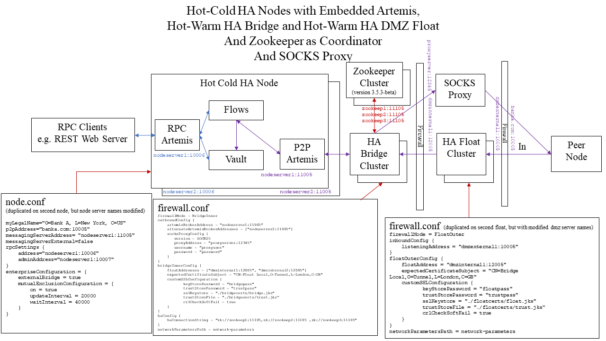

Firewall configuration
====================

.. contents::

File location
-------------
When starting a standalone firewall (in bridge, or float mode), the ``corda-firewall.jar`` file defaults to reading the firewall's configuration from a ``firewall.conf`` file in
the directory from which the command to launch the process is executed. There are two command-line options to override this
behaviour:

* The ``--config-file`` command line option allows you to specify a configuration file with a different name, or at
  different file location. Paths are relative to the current working directory

* The ``--base-directory`` command line option allows you to specify the firewall's workspace location. A ``firewall.conf``
  configuration file is then expected in the root of this workspace

If you specify both command line arguments at the same time, the firewall will fail to start.

Format
------
The firewall configuration file uses the HOCON format which is superset of JSON. Please visit
`<https://github.com/typesafehub/config/blob/master/HOCON.md>`_ for further details.

.. warning::  Please do NOT use double quotes (``"``) in configuration keys.

              Bridge setup will log `Config files should not contain \" in property names. Please fix: [key]` as error
              when it founds double quotes around keys.
              This prevents configuration errors when mixing keys containing ``.`` wrapped with double quotes and without them

Defaults
--------
A set of default configuration options are loaded from the built-in resource file. Any options you do not specify in
your own ``firewall.conf`` file will use these defaults:

.. literalinclude:: ../../bridge/src/main/resources/firewalldefault.conf
    :language: javascript
   
Bridge operating modes
----------------------
.. note:: By default, the Corda node assumes that it will carry out the peer-to-peer functions of the ``bridge`` internally!
          Before running a dedicated firewall process, it is essential to turn off the dev mode component by setting the
          ``enterpriseConfiguration.externalBridge`` property of the ``node.conf`` file to ``true``.
          If the ``externalBridge`` flag is not ``true``, there will be unexpected behaviour as the node will try to send peer-to-peer messages directly!

Assuming that an external firewall is to be used, the ``corda-firewall.jar`` operates in one of three basic operating modes.
The particular mode is selected via the required ``firewallMode`` configuration property inside ``firewall.conf``:

:SenderReceiver: selects a single process firewall solution to isolate the node and Artemis broker from direct Internet contact.
  It is still assumed that the firewall process is behind a firewall, but both the message sending and receiving paths will pass via the ``bridge``.
  In this mode the ``outboundConfig`` and ``inboundConfig`` configuration sections of ``firewall.conf`` must be provided,
  the ``bridgeInnerConfig`` and ``floatOuterConfig`` sections should not be present.

:BridgeInner: mode runs this instance of the ``corda-firewall.jar`` as the trusted portion of the peer-to-peer firewall float.
  Specifically, this process runs the complete outbound message processing. For the inbound path it operates only the filtering and durable storing portions of the message processing.
  The process expects to connect through a firewall to a matched ``FloatOuter`` instance running in the DMZ as the actual ``TLS/AMQP 1.0`` termination point.

:FloatOuter: causes this instance of the ``corda-firewall.jar`` to run as a protocol break proxy for inbound message path. The process
  will initialise a ``TLS`` control port and await connection from the ``BridgeInner``. Once the control connection is successful the ``BridgeInner`` will securely provision
  the ``TLS`` socket server key and certificates into the ``FloatOuter``. The process will then start listening for inbound connection from peer nodes.

Fields
------
The available config fields are listed below. ``baseDirectory`` is available as a substitution value and contains the
absolute path to the firewall's base directory.

:firewallMode: Determines operating mode of the firewall. See above.

:keyStorePassword: The password to unlock the TLS KeyStore file (``<workspace>/certificates/sslkeystore.jks``) containing the
    node certificate and private key. The private key password must be the same due to limitations in the Artemis libraries.

    .. note:: This is the non-secret value for the development certificates automatically generated during the first node run.
        Longer term these keys will be managed in secure hardware devices.

:trustStorePassword: The password to unlock the Trust store file (``<workspace>/certificates/truststore.jks``) containing
    the Corda network root certificate. This is the non-secret value for the development certificates automatically
    generated during the first node run.

    .. note:: Longer term these keys will be managed in secure hardware devices.

:networkParametersPath: This is the file path to a copy of the ``network-parameters`` as copied from a node after it has fetched the latest version from the network-map via http.
   It is used to correctly configure the maximum allowed message size. The maximum message size limit is already enforced by the P2P Artemis inside the ``node``,
   but the ``bridge`` also enforces this before forwarding messages to remote peers and also the ``float`` enforces this on received packets.
   If the size limit is breached these messages will be consumed and discarded, so that they are not replayed forever.

:outboundConfig:  This section is used to configure the processing of outbound messages. It is required for ``SenderReceiver`` and ``BridgeInner`` modes and must be absent for ``FloatOuter`` mode:

   :artemisBrokerAddress: The primary host and port for peer-to-peer Artemis broker. This may be running inside to the node, in which case it will hosted on the port of the ``p2pAddress``,
        or the ``messagingServerAddress`` if that is defined and ``messagingServerExternal`` is ``false``. Otherwise, it could be an independently run Artemis broker.

   :alternateArtemisBrokerAddresses: Optionally if there are multiple Artemis broker address e.g. for hot-cold node deployment, then additional hosts and ports may be included in a list.

   :customSSLConfiguration:  The default behaviour is that the outgoing ``TLS/AMQP 1.0`` connections present certificate details from (``<workspace>/certificates/sslkeystore.jks``)
        and validate against (``<workspace>/certificates/truststore.jks``), using the passwords defined in the root config. However, distinct KeyStores may be configured in this section:

        :keyStorePassword: The password for the TLS KeyStore and private keys within the KeyStore.

        :trustStorePassword: The password for TLS TrustStore.

        :sslKeystore: The path to the KeyStore file to use in outgoing ``TLS/AMQP 1.0`` connections.

        :trustStoreFile: The path to the TrustStore file to use in outgoing ``TLS/AMQP 1.0`` connections.

        :crlCheckSoftFail: If true (recommended setting) allows certificate checks to pass if the CRL(certificate revocation list) provider is unavailable.

   :socksProxyConfig:  This section is optionally present if outgoing peer connections should go via a SOCKS4, or SOCKS5 proxy:

        :version: Either SOCKS4, or SOCKS5 to define the protocol version used in connecting to the SOCKS proxy.

        :proxyAddress: Host and port of the SOCKS proxy.

        :userName: Optionally a user name that will be presented to the SOCKS proxy after connect.

        :password: Optionally, a password to present to the SOCKS5 Proxy. It is not valid for SOCKS4 proxies and it should always be combined with [userName].

:inboundConfig:  This section is used to configure the properties of the listening port. It is required for ``SenderReceiver`` and ``FloatOuter`` modes and must be absent for ``BridgeInner`` mode:

        :listeningAddress: The host and port to bind to as ``TLS/AMQP 1.0`` listener. This may be a specific network interface on multi-homed machines.
            It may also differ from the externally exposed public ``p2pAddress`` of the port if the firewalls, or load balancers transparently reroute the traffic.

   :customSSLConfiguration:  The default behaviour is that the inbound ``TLS/AMQP 1.0`` connections present certificate details from (``<workspace>/certificates/sslkeystore.jks``)
        and validate against (``<workspace>/certificates/truststore.jks``), using the passwords defined in the root config. However, distinct KeyStores may be configured in this section:

        :keyStorePassword: The password for the TLS KeyStore and private keys within the KeyStore.

        :trustStorePassword: The password for TLS TrustStore.

        :sslKeystore: The path to the KeyStore file to use in inbound ``TLS/AMQP 1.0`` connections.

        :trustStoreFile: The path to the TrustStore file to use in inbound ``TLS/AMQP 1.0`` connections.

        :crlCheckSoftFail: If true (recommended setting) allows certificate checks to pass if the CRL(certificate revocation list) provider is unavailable.

:bridgeInnerConfig:  This section is required for ``BridgeInner`` mode and configures the tunnel connection to the ``FloatOuter`` (s) in the DMZ. The section should be absent in ``SenderReceiver`` and ``FloatOuter`` modes:

        :floatAddresses: The list of host and ports to connect the available ``FloatOuter`` instances. At least one must be present.
            The active ``BridgeInner`` will round-robin over available ``FloatOuter`` addresses until it can connect and activate one.

        :expectedCertificateSubject: The X500 Subject name that will be presented in client certificates from the remote ``FloatOuter`` instances.
        
        :customSSLConfiguration:   .. note:: For ease of use the TLS default control tunnel connections present certificate details from (``<workspace>/certificates/sslkeystore.jks``)
                                             and validate against (``<workspace>/certificates/truststore.jks``), using the passwords defined in the root config.
                                             However, it is strongly recommended that distinct KeyStores should be configured in this section to use locally valid certificates only, so that compromise of the DMZ machines does not give access to the node's primary TLS keys.

            :keyStorePassword: The password for the TLS KeyStore and private keys within the KeyStore.

            :trustStorePassword: The password for TLS TrustStore.

            :sslKeystore: The path to the KeyStore file to use in control tunnel connections.

            :trustStoreFile: The path to the TrustStore file to use in control tunnel connections.

            :crlCheckSoftFail: If true (recommended setting) allows certificate checks to pass if the CRL(certificate revocation list) provider is unavailable.
            
        :customFloatOuterSSLConfiguration: The keys and certificates for the ``FloatOuter`` are provisioned dynamically from the ``BridgeInner`` over the control tunnel and are not loaded from disk in the DMZ.
            By default, they are taken from (``<workspace>/certificates/sslkeystore.jks``)
            and validate against (``<workspace>/certificates/truststore.jks``), using the passwords defined in the root config. However, alternate sources may be defined in this section.

            :keyStorePassword: The password for the TLS KeyStore and private keys within the KeyStore.

            :trustStorePassword: The password for TLS TrustStore.

            :sslKeystore: The path to the KeyStore file to use in the ``FloatOuter`` when it activates the peer listening socket.

            :trustStoreFile: The path to the TrustStore file to use in the ``FloatOuter`` when it activates the peer listening socket.

            :crlCheckSoftFail: If true (recommended setting) allows certificate checks to pass if the CRL(certificate revocation list) provider is unavailable.

:floatOuterConfig:   This section is required for ``FloatOuter`` mode and configures the control tunnel listening socket. It should be absent for ``SenderReceiver`` and ``BridgeInner`` modes:

        :floatAddress: The host and port to bind the control tunnel listener socket to. This can be for a specific interface if used on a multi-homed machine.

        :expectedCertificateSubject: The X500 Subject name that will be presented in client certificates from the ``BridgeInner`` when it connects to this ``FloatOuter`` instance.

        :customSSLConfiguration:   .. note:: For ease of use the TLS default control tunnel connection presents certificate details from (``<workspace>/certificates/sslkeystore.jks``)
                                             and validate against (``<workspace>/certificates/truststore.jks``), using the passwords defined in the root config.
                                             However, it is strongly recommended that distinct KeyStores should be configured in this section to use locally valid certificates only, so that compromise of the DMZ machines does not give access to the node's primary TLS keys.

            :keyStorePassword: The password for the TLS KeyStore and private keys within the KeyStore.

            :trustStorePassword: The password for TLS TrustStore.

            :sslKeystore: The path to the KeyStore file to use in control tunnel connections.

            :trustStoreFile: The path to the TrustStore file to use in control tunnel connections.

            :crlCheckSoftFail: If true (recommended setting) allows certificate checks to pass if the CRL(certificate revocation list) provider is unavailable.
            
:haConfig: Optionally the ``SenderReceiver`` and ``BridgeInner`` modes can be run in a hot-warm configuration, which determines the active instance using an external master election service.
    Currently, only Zookeeper can be used as master elector. Eventually other electors may be supported e.g. ``etcd``. This configuration section controls these options:

    :haConnectionString:  A string containing the connection details of the master electors as a comma delimited list of connection string in the format ``zk://<host>:<port>``.
        In future it intended that other schemes such as ``etcd`` are supported.

    :haPriority: The implementation uses a prioritise leader election algorithm, so that a preferred master instance can be set. The highest priority is 0 and larger integers have lower priority.
        At the same level of priority, it is random which instance wins the leader election. If a ``bridge`` instance dies another will have the opportunity to become master in instead.

    :haTopic: Sets the zookeeper topic prefix that the nodes used in resolving the election and must be the same for all ``bridge``
        instances competing for master status. This is available to allow a single zookeeper cluster to be reused with multiple
        sets of ``bridges`` (e.g. in test environments).
        The default value is ``bridge/ha`` and would not normally need to be changed if the cluster is not shared.

:artemisReconnectionIntervalMin: If connection to the local Artemis server fails the initial reconnection attempt will be
    after [artemisReconnectionIntervalMin] ms. The default interval is 5000 ms.
    Subsequent retries will take be exponentially backed off until they reach [artemisReconnectionIntervalMax] ms.

:artemisReconnectionIntervalMax: The worst case Artemis retry period after repeated failure to connect is [artemisReconnectionIntervalMax] ms. The default interval is 60000 ms.

:p2pConfirmationWindowSize: This is a performance tuning detail within the Artemis connection setup, which controls the send acknowledgement behaviour.
    Its value should only be modified from the default if suggested by R3 to resolve issues.

:enableAMQPPacketTrace: Set this developer flag to true if very detailed logs are required for connectivity debugging. Note that the logging volume is substantial, so do not enable in production systems.

Complete example
----------------
As an example to show all features the following is a walk through of the configuration for a pair of HA hot-cold Nodes,
connected to by a HA hot-warm set of ``BridgeInner`` and ``FloatOuter`` that use some simple certificates to secure the
control tunnel and a SOCKS5 proxy for outgoing connectivity (see diagram).
This is also the recommended full enterprise deployment pattern, although there are plenty of alternative deployment options.

In this example it is assumed that the corda nodes are deployed on ``nodeserver1`` and ``nodeserver2`` using Azure SQL Server ``nodeda.database.windows.net/corda`` as clustered storage. The ``BridgeInner`` instances run on ``bridgeserver1`` and ``bridgeserver2``.
The SOCKS5 proxy is at ``socksproxy`` port 1234. The ``FloatOuter`` instances run in the DMZ with dual homed machines with addresses ``dmzinternal1`` and ``dmzinternal2`` as the side exposed to the
internal trusted zone. The externally accessible addresses of the DMZ servers are ``dmzexternal1`` and ``dmzexternal2``, which the Internet facing firewall/load balancer maps to ``banka.com``.
There is also a zookeeper (must be version ``3.5.3-beta``) cluster on ``zookeep1``, ``zookeep2`` and ``zookeep3``.

First, the nodes need to be configured in hot-cold mode, with external bridge mode enabled. The nodes will host the P2P Artemis internally, with the journal folder replicated between hot and cold nodes.
It is essential that the node registration process be followed on one node and the resulting certificates, keys and network-parameters nodeInfo files are synchronised across the setup. In particular the 
``BridgeInner`` setup needs a certificates folder containing the ``sslkeystore.jks`` and ``truststore.jks``. copied from the node and a copied ``network-parameters`` file in the workspace folder.
The ``FloatOuter`` instances needs a copied ``network-parameters`` file only as the public facing SSL is provisioned from the ``BridgeInner``.

In this example the tunnel connection uses local certs which can be generated with Java keytool from the SDK. An example script would be:

..  code-block:: bash

    keytool.exe -genkeypair -keyalg EC -keysize 256 -alias floatroot -validity 1000 -dname "CN=Float Root,O=Local Only,L=London,C=GB" -ext bc:ca:true,pathlen:1 -keystore floatca.jks -storepass capass -keypass cakeypass
    keytool.exe -genkeypair -keyalg EC -keysize 256 -alias bridgecert -validity 1000 -dname "CN=Bridge Local,O=Local Only,L=London,C=GB" -ext bc:ca:false -keystore bridge.jks -storepass bridgepass -keypass bridgepass
    keytool.exe -genkeypair -keyalg EC -keysize 256 -alias floatcert -validity 1000 -dname "CN=Float Local,O=Local Only,L=London,C=GB" -ext bc:ca:false -keystore float.jks -storepass floatpass -keypass floatpass

    keytool.exe -exportcert -rfc -alias floatroot -keystore floatca.jks -storepass capass -keypass cakeypass > root.pem
    keytool.exe -importcert -noprompt -file root.pem -alias root -keystore trust.jks -storepass trustpass

    keytool.exe -certreq -alias bridgecert -keystore bridge.jks -storepass bridgepass -keypass bridgepass |keytool.exe -gencert -ext ku:c=dig,keyEncipherment -ext: eku:true=serverAuth,clientAuth -rfc -keystore floatca.jks -alias floatroot -storepass capass -keypass cakeypass > bridge.pem
    cat root.pem bridge.pem >> bridgechain.pem
    keytool.exe -importcert -noprompt -file bridgechain.pem -alias bridgecert -keystore bridge.jks -storepass bridgepass -keypass bridgepass

    keytool.exe -certreq -alias floatcert -keystore float.jks -storepass floatpass -keypass floatpass |keytool.exe -gencert -ext ku:c=dig,keyEncipherment -ext: eku::true=serverAuth,clientAuth -rfc -keystore floatca.jks -alias floatroot -storepass capass -keypass cakeypass > float.pem
    cat root.pem float.pem >> floatchain.pem
    keytool.exe -importcert -noprompt -file floatchain.pem -alias floatcert -keystore float.jks -storepass floatpass -keypass floatpass

The resulting ``trust.jks`` and ``bridge.jks`` should be copied to a ``<workspace>/bridgecerts`` folder on the ``BridgeInner`` instances. The ``trust.jks`` and ``float.jks`` should be copied to a ``<workspace>/floatcerts`` folder on the ``FloatOuter`` instances.

Typical configuration for ``nodeserver1`` would be a ``node.conf`` files containing:

..  code-block:: javascript

    myLegalName = "O=Bank A,L=London,C=GB"
    p2pAddress = "banka.com:10005" // Host and port exposed by Internet facing firewall/load balancer in front of float servers in DMZ.
    messagingServerAddress = "nodeserver1:11005" // specifying a different port to the advertised port as an example
    messagingServerExternal = false // override default behaviour and ensure that Artemis runs in process.
    rpcSettings {
        address = "nodeserver1:10006"
        adminAddress = "nodeserver1:10026"
    }
    dataSourceProperties { // Point at clustered Azure SQL Server
        dataSourceClassName = "com.microsoft.sqlserver.jdbc.SQLServerDataSource"
        dataSource.url = "jdbc:sqlserver://nodedb.database.windows.net:1433;databaseName=corda;encrypt=true;trustServerCertificate=false;hostNameInCertificate=*.database.windows.net;loginTimeout=30"
        dataSource.user = Corda
        dataSource.password = password
    }
    database {
        transactionIsolationLevel = READ_COMMITTED
        runMigration = false
        schema = dbo
    }
    security {
        authService {
            dataSource {
                type = INMEMORY
                users = [
                    {
                        password = password
                        permissions = [
                            ALL
                        ]
                        username=user
                    }
                ]
        }
        }
    }
    useTestClock = false
    enterpriseConfiguration = {
        externalBridge = true // Ensure node doesn't run P2P AMQP bridge, instead delegate to the BridgeInner.
        mutualExclusionConfiguration = { // Enable the protective heartbeat logic so that only one node instance is ever running.
            on = true
            updateInterval = 20000
            waitInterval = 40000
        }
    }
    compatibilityZoneURL = "http://r3-doorman:10001"
    devMode = false // Turn off things like key autogeneration and require proper doorman registration.

Typical configuration for ``nodeserver2`` would be a ``node.conf`` files containing:

..  code-block:: javascript

    myLegalName = "O=Bank A,L=London,C=GB"
    p2pAddress = "banka.com:10005" // Host and port exposed by Internet facing firewall/load balancer in front of float servers in DMZ.
    messagingServerAddress = "nodeserver2:11005" // specifying a different port to the advertised port as an example
    messagingServerExternal = false // override default behaviour and ensure that Artemis runs in process.
    rpcSettings {
        address = "nodeserver2:10006"
        adminAddress = "nodeserver2:10026"
    }
    dataSourceProperties { // Point at clustered Azure SQL Server
        dataSourceClassName = "com.microsoft.sqlserver.jdbc.SQLServerDataSource"
        dataSource.url = "jdbc:sqlserver://nodedb.database.windows.net:1433;databaseName=corda;encrypt=true;trustServerCertificate=false;hostNameInCertificate=*.database.windows.net;loginTimeout=30"
        dataSource.user = Corda
        dataSource.password = password
    }
    database {
        transactionIsolationLevel = READ_COMMITTED
        runMigration = false
        schema = dbo
    }
    security {
        authService {
            dataSource {
                type = INMEMORY
                users = [
                    {
                        password = password
                        permissions = [
                            ALL
                        ]
                        username=user
                    }
                ]
        }
        }
    }
    useTestClock = false
    enterpriseConfiguration = {
        externalBridge = true // Ensure node doesn't run P2P AMQP bridge, instead delegate to the BridgeInner.
        mutualExclusionConfiguration = { // Enable the protective heartbeat logic so that only one node instance is ever running.
            on = true
            updateInterval = 20000
            waitInterval = 40000
        }
    }
    compatibilityZoneURL = "http://r3-doorman:10001"
    devMode = false // Turn off things like key autogeneration and require proper doorman registration.

Configuration in ``firewall.conf`` for ``bridgeserver1``:

..  code-block:: javascript
    
    firewallMode = BridgeInner // Set the mode the  corda-firewall.jar runs as appropriately.
    outboundConfig { // Required section
        artemisBrokerAddress = "nodeserver1:11005" // point at primary Artemis address in the node
        alternateArtemisBrokerAddresses = [ "nodeserver2:11005" ] // List any other HA Artemis addresses
        socksProxyConfig { // Enable SOCKS proxying by specifying this section
            version = SOCKS5
            proxyAddress = "proxyserver:12345"
            username = "proxyuser"
            password = "password"
        }
    }
    bridgeInnerConfig { // Required section
        floatAddresses = ["dmzinternal1:12005", "dmzinternal2:12005"] // The BridgeInner initiates a connection to one of this pool of FloatOuter and round-robins
        expectedCertificateSubject = "CN=Float Local,O=Tunnel,L=London,C=GB" // This must align with the certificate subject used by the FloatOuter control.
        customSSLConfiguration { // Use a tunnel specific set of certificates distinct from the node's sslkeystore.jks and truststore.jks.
               keyStorePassword = "bridgepass"
               trustStorePassword = "trustpass"
               sslKeystore = "./bridgecerts/bridge.jks"
               trustStoreFile = "./bridgecerts/trust.jks"
               crlCheckSoftFail = true
        }
    }
    haConfig { // Enable HA pointing at Zookeeper cluster for master selection.
        haConnectionString = "zk://zookeep1:11105,zk://zookeep2:11105 ,zk://zookeep3:11105"
    }
    networkParametersPath = network-parameters // The network-parameters file is expected to be copied from the node after registration and here is expected in the workspace folder.

Configuration in ``firewall.conf`` for ``bridgeserver2``:

..  code-block:: javascript  

    firewallMode = BridgeInner // Set the mode the  corda-firewall.jar runs as appropriately.
    outboundConfig { // Required section
        artemisBrokerAddress = "nodeserver2:11005" // point at primary Artemis address in the node
        alternateArtemisBrokerAddresses = [ "nodeserver1:11005" ] // List any other HA Artemis addresses
        socksProxyConfig { // Enable SOCKS proxying by specifying this section
            version = SOCKS5
            proxyAddress = "proxyserver:12345"
            username = "proxyuser"
            password = "password"
        }
    }
    bridgeInnerConfig { // Required section
        floatAddresses = ["dmzinternal2:12005", "dmzinternal1:12005"] // The BridgeInner initiates a connection to one of this pool of FloatOuter and round-robins
        expectedCertificateSubject = "CN=Float Local,O=Tunnel,L=London,C=GB" // This must align with the certificate subject used by the FloatOuter control.
        customSSLConfiguration { // Use a tunnel specific set of certificates distinct from the node's sslkeystore.jks and truststore.jks.
               keyStorePassword = "bridgepass"
               trustStorePassword = "trustpass"
               sslKeystore = "./bridgecerts/bridge.jks"
               trustStoreFile = "./bridgecerts/trust.jks"
               crlCheckSoftFail = true
        }
    }
    haConfig { // Enable HA pointing at Zookeeper cluster for master selection.
        haConnectionString = "zk://zookeep1:11105,zk://zookeep2:11105 ,zk://zookeep3:11105"
    }
    networkParametersPath = network-parameters // The network-parameters file is expected to be copied from the node after registration and here is expected in the workspace folder.

    
Configuration in ``firewall.conf`` for ``floatserver1``:

..  code-block:: javascript  

    firewallMode = FloatOuter // Set the mode the  corda-firewall.jar runs as appropriately.
    inboundConfig { // Required section
        listeningAddress = "dmzexternal1:10005" // expose the listening port on the out NIC
    }
    floatOuterConfig { // Required section
        floatAddress = "dmzinternal1:12005" // await control instructions on inner NIC
        expectedCertificateSubject = "CN=Bridge Local,O=Tunnel,L=London,C=GB" // Must line up with X500 Subject of certificates on BridgeInner
        customSSLConfiguration {
               keyStorePassword = "floatpass"
               trustStorePassword = "trustpass"
               sslKeystore = "./floatcerts/float.jks"
               trustStoreFile = "./floatcerts/trust.jks"
               crlCheckSoftFail = true
        }
    }
    networkParametersPath = network-parameters // The network-parameters file is expected to be copied from the node after registration and here is expected in the workspace folder.
    
Configuration in ``firewall.conf`` for ``floatserver2``:

..  code-block:: javascript  

    firewallMode = FloatOuter // Set the mode the  corda-firewall.jar runs as appropriately.
    inboundConfig { // Required section
        listeningAddress = "dmzexternal2:10005" // expose the listening port on the out NIC
    }
    floatOuterConfig { // Required section
        floatAddress = "dmzinternal2:12005" // await control instructions on inner NIC
        expectedCertificateSubject = "CN=Bridge Local,O=Tunnel,L=London,C=GB" // Must line up with X500 Subject of certificates on BridgeInner
        customSSLConfiguration {
               keyStorePassword = "floatpass"
               trustStorePassword = "trustpass"
               sslKeystore = "./floatcerts/float.jks"
               trustStoreFile = "./floatcerts/trust.jks"
               crlCheckSoftFail = true
        }
    }
    networkParametersPath = network-parameters // The network-parameters file is expected to be copied from the node after registration and here is expected in the workspace folder.

