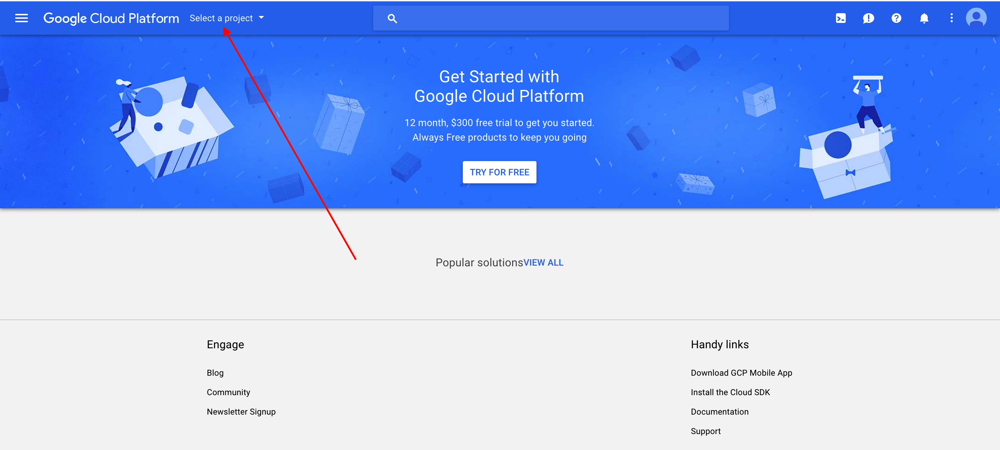
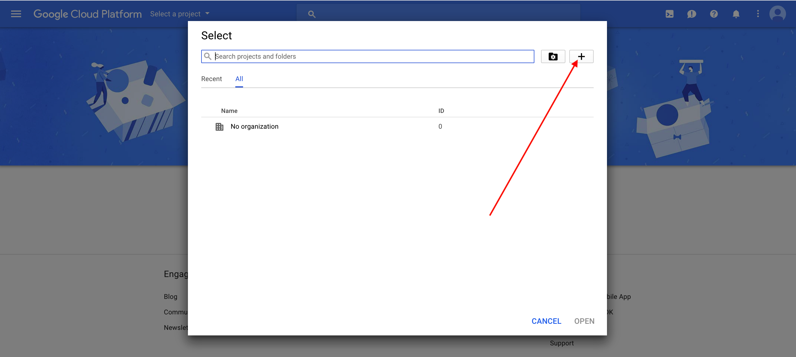
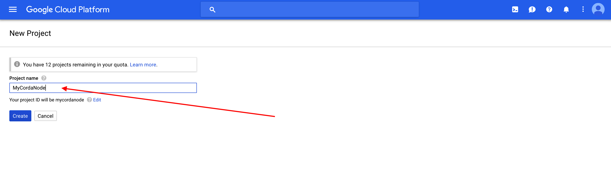
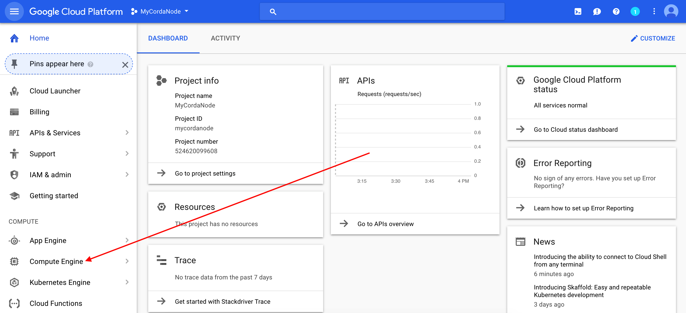
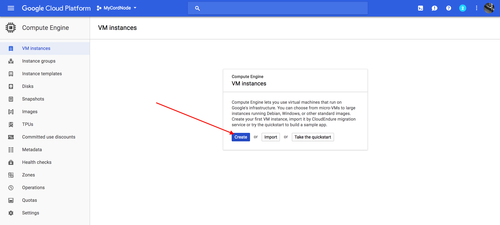
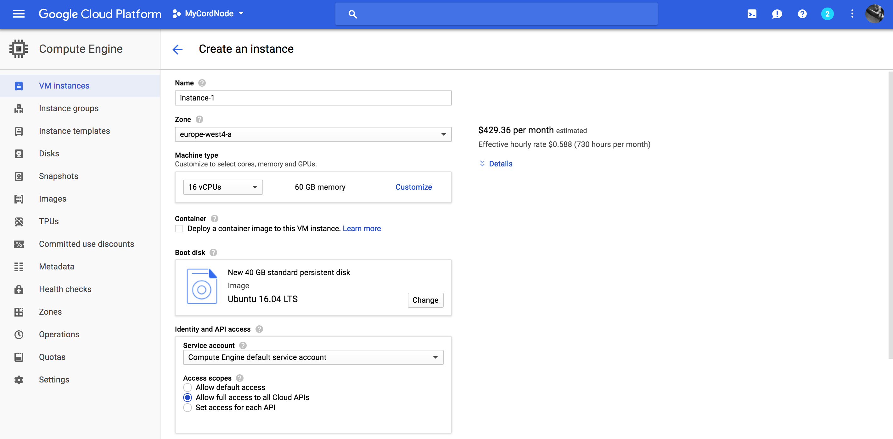

Deploying a Corda Node to a Google Cloud Platform VM
====================================================

.. contents::

Corda Connect Explore will allow you to create a self service download
link with a node preconfigured to join the Explore environment. This
document will describe how to set up a virtual machine on the Google
Cloud Platform to deploy your pre-generated Corda node on.

Pre-requisites
--------------
* Ensure you have a registered Google Cloud Platform account with
  `billing enabled <https://cloud.google.com/billing/docs/how-to/manage-billing-account>` which can create virtual machines under your subscription(s) and you are logged on to the GCP console: `<https://console.cloud.google.com>`.

Deploy Corda node
-----------------

Browse to `<https://console.cloud.google.com>` and log in with your
Google credentials.

**STEP 1: Create a GCP Project**

In the project drop down click on the plus icon to create a new
project to house your Corda resources.

   

Enter a project name and click Create.

**STEP 2: Launch the VM**

In the left hand side nav click on Compute Engine.

Click on Create Instance.

Fill in the form with the desired VM specs:

Recommended minimum 4vCPU with 15GB memory and 40GB Persistent disk.
Ubuntu 16.04 LTS.

Allow full API access.

Dont worry about firewall settings as we will configure those later. 

Click Create and wait a few sections for your instance to provision
and start running.

**STEP 3: Connect to your VM and set up the environment**

Once your instance is running click on the SSH button to launch a
cloud SSH terminal in a new window. 

.. image:: resources/gcpconsolelaunchssh.png
   :scale: 50 %
   
.. image:: resources/gcpshell.png
   :scale: 50 %

We need a few utilities so go ahead and check the following are
installed and if not install with apt-get:

.. code:: bash

    sudo apt-get update
    sudo apt-get install -y unzip  screen wget openjdk-8-jdk

Now run the following to configure the firewall to allow Corda traffic

.. code:: bash

    gcloud compute firewall-rules create nodetonode --allow tcp:10002
    gcloud compute firewall-rules create nodetorpc --allow tcp:10003
    gcloud compute firewall-rules create webserver --allow tcp:8080

Next we promote the ephemeral IP address associated with this
instance to a static IP address.

First check the region and select the one you are using from the list:

.. code:: bash

    gcloud compute regions list

Find your external IP:

.. code:: bash

    gcloud compute addresses list

Then run this command with the ephemeral IP address as the argument to
the --addresses flag and the region:

.. code:: bash

    gcloud compute addresses create corda-node --addresses 35.204.53.61 --region europe-west4

**STEP 4: Download and set up your Corda node**

Now your environment is configured you can switch to the Explore
application and click on the copy to clipboard button to get the installation command.

In your cloud VM terminal run the following command to download the
bundle to your instance:

.. code:: bash

    wget [your-specific-download-link]

Make a directory and unzip the file in this directory:

.. code:: bash

    mkdir corda
    mv node.zip corda
    cd corda
    unzip node.zip

Make sure the run-corda.sh script is executable

.. code:: bash

    chmod +x run-corda.sh

and then run the script to start Corda:

.. code:: bash

    ./run-corda.sh

You can now navigate to the external web address of the instance and
see the cordapps running on port 8080.

