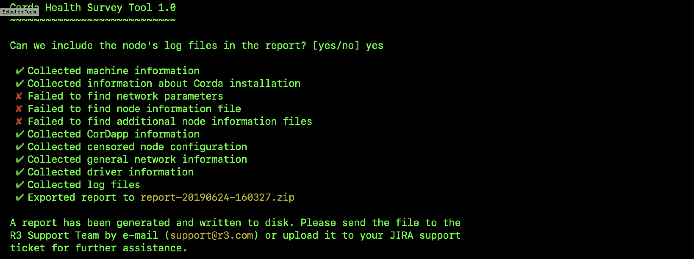

.. highlight:: kotlin
.. raw:: html

   
   

Health Survey Tool
==================

The health survey tool is a command line utility that initialises a prompt based process of collecting information about a node
that can be used by the R3 Support to identify issues regarding support requests. It works by scanning through a provided
node base directory and archiving some of the important files:

* Stripped ``node.conf`` - passwords are removed.
* Version and environment information - Java version, Corda version, OS version.
* Network information - DNS lookup to databases, network map, doorman and external addresses.
* Network parameters file.
* List of installed CorDapps - names, file sizes and checksums.
* List of drivers - jdbc drivers stored in the ``drivers/`` folder.
* Node information files including additional-node-infos
* ``Logs`` based on confirmation prompt - if declined, they are completely skipped.

.. |jar_name| replace:: corda-tools-health-survey-|version|.jar

Running
-------

.. parsed-literal::

    > java -jar |jar_name| -d {BASE_DIRECTORY_OF_THE_NODE} -c {CONFIG_FILE_OF_THE_NODE}
..

Usage:

.. parsed-literal::
     -c,--node-configuration <arg>   Path to the Corda node configuration file, this is optional in the case the config is not in the base directory
     -d,--base-directory <arg>       Path to the Corda node base directory
..

Running the tool with no arguments assumes that the base-directory argument is the current working directory.

Output
------

The tool generates the archive of the collected files in the same directory it is ran in. The names are in the format: ``report-date-time.zip``

