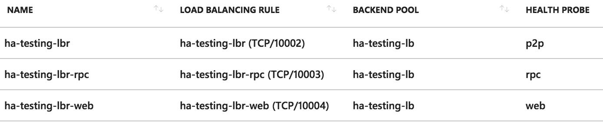
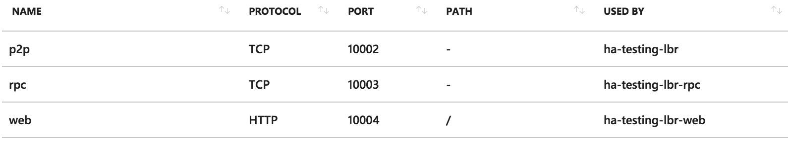
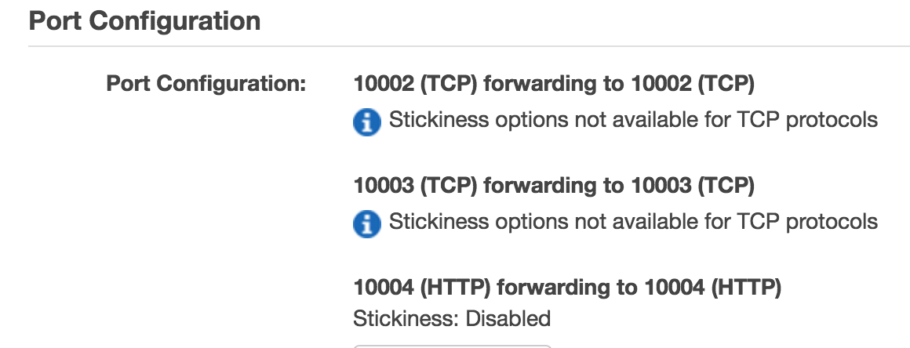
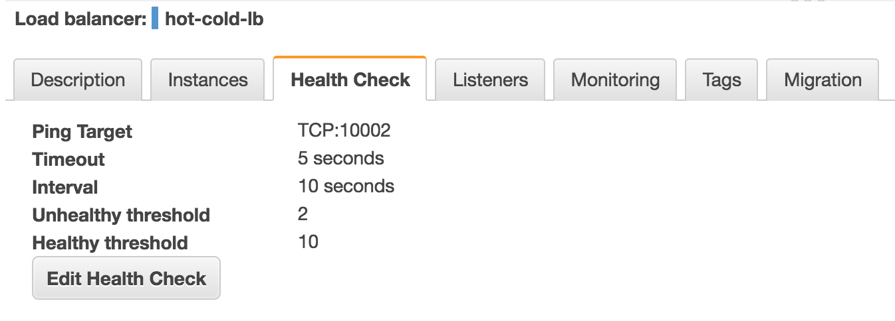

.. highlight:: kotlin
.. raw:: html

Hot-cold deployment
===================

Overview
--------

This section describes hot-cold availability of Corda nodes and their associated configuration setup. In such a set-up,
there would be one back-up instance that can be started if the primary instance stops. Each instance
of Corda would be hosted on a separate server and represent the same entity in the Corda network.

.. note:: It is expected that the users handle the monitoring of the instances and use the appropriate tools to swtich
between the primary and the back-up in case of failure.

In order to achieve this set-up, in addition to the physical nodes, a few other resources are required:

    * 3rd party database which should be running in some sort of replication mode to avoid any data loss
    * a network drive mounted on all nodes (used to store P2P messaging broker files)
    * an internet facing load balancer to to monitor health of the primary and secondary instances and to automatically
    route traffic from the public IP address to the only active end-point — the *hot* instance

This guide will cover all the steps required to configure and deploy the nodes as well as configuring the above mentioned
resources for both Microsoft Azure and Amazon Web Services. The image below illustrates the environment that will result from
following the guide. There will be two Corda nodes, one active and the other inactive. Each node will represent the same
legal identity inside the Corda network. Both will share a database and a network file system.

.. image:: resources/hot-cold.png

Configuring the load balancer
-----------------------------

In a hot-cold environment, the load balancer is used to redirect incoming traffic (P2P, RPC and HTTP) towards the active node.
The internet facing IP address of the load balancer will be advertised by each node as their P2P addresses. The back-end
pool of the load balancer should include both machines hosting the nodes to be able to redirect traffic to them. A load
balancing rule should be created for each port configured in the nodes' configuration files (P2P, RPC and HTTP). Furthermore,
to determine which machine the traffic should be redirected to, a health probe should be created for each port as well.

.. important:: Set TCP as the protocol for P2P and RPC health probes.

Microsoft Azure
~~~~~~~~~~~~~~~

A guide on how to create an internet facing load balancer in Azure can be found `here <https://docs.microsoft.com/en-us/azure/load-balancer/load-balancer-get-started-internet-portal>`_.
The next step is to create rules for every port corresponding to each type of connection. The following table shows the
rules corresponding to all 3 ports of a node.

The corresponding health probes are shown in the next table.

Amazon Web Services
~~~~~~~~~~~~~~~~~~~

A guide on how to create an internet facing load balancer in AWS can be found `here <https://docs.aws.amazon.com/elasticloadbalancing/latest/classic/elb-getting-started.html>`_.
Because the AWS classic load balancer only allows one health check, it is required to create a load balancer per type
of connection (P2P, RPC and HTTP), each with its own health check for its corresponding port. As an example, the following
images show the configuration of a single load balancer with 3 rules and 1 health check for the P2P port.

Configuring the shared network drive
------------------------------------

The network drive is used to store the Artemis files, specifically those concerning P2P messages (the ``artemis`` directory
found in the node's base directory). Therefore, it is recommended that the network drive be in close proximity to the machines
hosting the nodes to avoid performance loss caused by slow I/O to and from the network drive.

After the network drive is mounted on the node machine, it's recommended to create a symbolic link to it in the node's
base directory. For example, ``${BASE_DIR}/artemis`` should be a link to the network drive's mount point.

Microsoft Azure
~~~~~~~~~~~~~~~

When deploying in Azure, a ``File Share`` component can be used. In order to create and use one, several steps must be
followed:

1. Create an Azure Storage Account (guide `here <https://docs.microsoft.com/en-us/azure/storage/common/storage-create-storage-account>`_)
    a. Deployment model should be **Resource manager**

    b. Account kind needs to be **General purpose** as Artemis can't handle **Blobs**

    c. Performance can either be **Standard** (HDD) or **Premium** (SSD). Standard HDDs storage have read/write speeds
    of 14 to 16 MB/s which is sufficient for the P2P messaging component

    d. Replication type should be **Locally-redundant storage** (LRS)

    e. Secure transfer **Enabled**

    f. Location can be chosen based on requirements. Note that some settings options are not available for all locations.

2. Add a file share. Quota can be any size up to 5 TiB
3. Create a persistent mount point for the file share using */etc/fstab/*:
        - required: **storage account name**, **storage account key** (choose one of the 2 found in Your_storage → Settings → Access keys) and the **file share name**
        - persist the mount point by using the following command, replacing the placeholders in angle brackets with the
        appropriate values:
        .. container:: codeset

            .. sourcecode:: groovy

                sudo bash -c 'echo "//<storage-account-name>.file.core.windows.net/<share-name> /mymountpoint cifs vers=2.1,username=<storage-account-name>,password=<storage-account-key>,dir_mode=0700,file_mode=0700,serverino" >> /etc/fstab'

.. note:: From the Azure documentation: *LRS is the lowest cost replication option and offers the least durability compared
          to other options. If a datacenter-level disaster (for example, fire or flooding) occurs, all replicas may be
          lost or unrecoverable. To mitigate this risk, Microsoft recommends using either zone-redundant storage (ZRS) or
          geo-redundant storage (GRS).*

Amazon Web Services
~~~~~~~~~~~~~~~~~~~

When deploying on AWS, an ``Elastic File System`` can be used. Creating one can be easily done by following `this <https://docs.aws.amazon.com/efs/latest/ug/getting-started.html>`_ guide.

During the creation, two performance modes are offered: **General Purpose** and **Max I/O**. For a simple hot-cold
environment consisting of a few nodes, the general purpose mode is sufficient.

To persist the mount point, run the following command:

.. container:: codeset

    .. sourcecode:: groovy

        sudo bash -c 'echo "mount-target-DNS:/ efs-mount-point nfs4 nfsvers=4.1,rsize=1048576,wsize=1048576,hard,timeo=600,retrans=2,_netdev,noresvport 0 0" >> /etc/fstab'

.. note:: EFS cannot be mounted on a Windows machine. Please see EFS limits `here <https://docs.aws.amazon.com/efs/latest/ug/limits.html>`_.

``mount-target-DNS`` is the address of the EFS. Example: fs-123456.efs.eu-west-1.amazonaws.com.
``efs-mount-point`` is the location on the EC2 instance where the EFS will be mounted.

Node deployment
---------------

This section covers the deployment of the back-up Corda instance. It is assumed that the primary has already been deployed.
For instructions on how to do so, please see :doc:`deploying-a-node`.

The following files and directories to be copied from the primary instance to the back-up instance as well as any
cordapps and jars that exist:

    * ./certificates/
    * ./additional-node-infos/
    * network-parameters

Mutual exclusion
----------------
To avoid accidentally running all hot-cold nodes at the same time, a simple mechanism can be used by adding the following
section to the configuration files. The mechanism is called *Mutual Exclusion* and it ensures that only one active node
exists, all others will shut down shortly after starting. A standard configuration example is shown below:

.. sourcecode:: none

    enterpriseConfiguration = {
        mutualExclusionConfiguration = {
            on = true
            machineName = ${UNIQUE_ID}
            updateInterval = 20000
            waitInterval = 40000
        }
    }

:on: Whether hot cold high availability is turned on, default is ``false``.

:machineName: Unique name for node. Used when checking which node is active. Example: *corda-ha-vm1.example.com*

:updateInterval: Period(milliseconds) over which the running node updates the mutual exclusion lease.

:waitInterval: Amount of time(milliseconds) to wait since last mutual exclusion lease update before being able to become
the active node. This has to be greater than updateInterval.

Node configuration
------------------
Both nodes, primary and back-up, should be configured the same way, with a few differences. Below is an example of a ``node.conf``
file that can be used for either node:

.. sourcecode:: none

    p2pAddress : "${LOAD_BALANCER_ADDRESS}:${P2P_PORT}"
    rpcSettings {
    	address : "${NODE_MACHINE_ADDRESS}:${RPC_PORT}"
    	adminAddress : "${NODE_MACHINE_ADDRESS}:${RPC_ADMIN_PORT}"
    }
    myLegalName : "O=Corda HA, L=London, C=GB"
    keyStorePassword : "password"
    trustStorePassword : "password"
    jarDirs = ["plugins", "cordapps"]
    rpcUsers=[
        {
            user=corda
            password=corda_is_awesome
            permissions=[
                ALL
            ]
        }
    ]
    database.runMigration = true
    dataSourceProperties = {
        dataSourceClassName = "com.microsoft.sqlserver.jdbc.SQLServerDataSource"
        dataSource.url = "${DB_JDBC_URL}"
        dataSource.user = ${DB_USER}
        dataSource.password = "${DB_PASSWORD}"
    }
    enterpriseConfiguration = {
        mutualExclusionConfiguration = {
            on = true
            machineName = "${NODE_MACHINE_ID}"
            updateInterval = 20000
            waitInterval = 40000
        }
    }

Both nodes will have the ``LOAD_BALANCER_ADDRESS`` configured as their P2P address and advertise it to the rest of the
network.

Each machine's own address is used for the RPC connection as the node's internal messaging client needs it to
connect to the broker.

The ``machineName`` value should be different for each node as it is used to ensure that only one of them can be active at any time.

