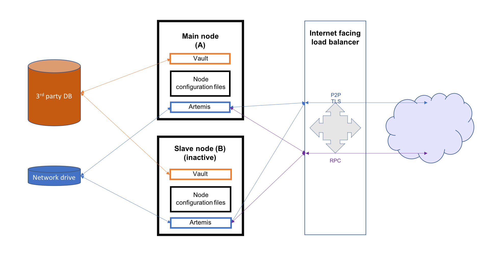

.. highlight:: kotlin
.. raw:: html

Hot-cold high availability deployment
=====================================

Overview
--------

This section describes hot-cold availability of Corda Enterprise nodes and their associated configuration setup. In such a set-up,
there is one back-up instance that can be started if the primary instance stops. Each instance of Corda should be hosted
on a separate server and represent the same entity in the Corda network.

.. note:: It is expected that the users handle the monitoring of the instances and use the appropriate tools to switch
          between the primary and the back-up in case of failure.

In order to achieve this set-up, in addition to the physical nodes, a few other resources are required:

    * 3rd party database which should be running in some sort of replication mode to avoid any data loss
    * a network drive mounted on all nodes (used to store P2P messaging broker files)
    * an internet facing load balancer to monitor the health of the primary and secondary instances and to automatically
      route traffic from the public IP address to the *hot* instance

This guide will cover all the steps required to configure and deploy the nodes as well as configuring the above mentioned
resources for both **Microsoft Azure** and **Amazon Web Services**. The image below illustrates the environment that will
result from following the guide. There will be two Corda Enterprise nodes, one active and the other inactive. Each node will represent
the same legal identity inside the Corda network. Both will share a database and a network file system.

Configuring the load balancer
-----------------------------

In a hot-cold environment, the load balancer is used to redirect incoming traffic (P2P, RPC and HTTP) towards the active
Corda Enterprise node instance. The internet facing IP address of the load balancer will be advertised to the rest of the Corda network
by each node as their P2P addresses. This is done by configuring the load balancer IP as the node's P2P address in its
configuration file. The back-end pool of the load balancer should include both machines hosting the nodes to be able to redirect traffic to
them. A load balancing rule should be created for each port configured in the nodes' configuration files (P2P, RPC and HTTP).
Furthermore, to determine which machine the traffic should be redirected to, a health probe should be created for each port
as well.

.. important:: Set TCP as the protocol for P2P and RPC health probes.

Microsoft Azure
~~~~~~~~~~~~~~~

A guide on how to create an internet facing load balancer in Azure can be found `here <https://docs.microsoft.com/en-us/azure/load-balancer/load-balancer-get-started-internet-portal>`_.
The next step is to create health probes and load balancing rules for every port corresponding to each type of connection.

When creating the health probes, there are several properties that have to be set:

    * name - used to identify the probe when associating it with a rule (e.g. p2p, rpc, web).
    * protocol - determines what kind of packets are used to assess the health of the VMs behind the balancer. Use
      TCP for the P2P and RPC probes, HTTP for the web traffic probes.
    * port - the port being checked.
    * path - in case of the HTTP protocol, it has to be set to "/". Leave empty for the TCP probes.
    * interval - the amount of time in seconds between probe attempts.
    * unhealthy threshold - the number of failed probes before a VM is considered unhealthy. No suggested values. Default
      seems reasonable.

A possible configuration for a hot-cold environment would be:

=====  ========    ====== =====  ==========
Name   Protocol    Port   Path   Used by
-----  --------    ------ -----  ----------
p2p    TCP         10002         ha-lbr-p2p

rpc    TCP         10003         ha-lbr-rpc

web    HTTP        10004    /    ha-lbr-web
=====  ========    ====== =====  ==========

The following properties have to be set when creating a load balancing rule:

    * name - simple identifier.
    * ip version - depending on how the resources have been created and configured, it can be IPv4 or IPv6.
    * frontend ip address - the address used by peers and clients to communicate with the Corda instances.
    * protocol - needs to be set to TCP for every rule.
    * port - used by peers and clients to communicate with the Corda instances.
    * backend port - target port for traffic redirection. Set to the same value as the previous port.
    * backend pool - an Azure specific resource that represents the address pool of the VMs hosting the Corda instances.
    * health probe - the probe name used to determine the target VM for incoming traffic.
    * session persistence - mode in which requests are handled. Set to **None** to specify that successive
      request from the same client can be received by any VM for the duration of the session.

Using the health probe example, a possible load balancer configuration would be:

============  =========    ============  ============
Name          Rule         Backend pool  Health probe
------------  ---------    ------------  ------------
ha-lbr-p2p    TCP/10002    ha-testing    p2p

ha-lbr-rpc    TCP/10003    ha-testing    rpc

ha-lbr-web    TCP/10004    ha-testing    web
============  =========    ============  ============

Amazon Web Services
~~~~~~~~~~~~~~~~~~~

A guide on how to create an internet facing load balancer in AWS can be found `here <https://docs.aws.amazon.com/elasticloadbalancing/latest/classic/elb-getting-started.html>`_.
AWS offers 3 types of load balancers: application, network, and classic. For this guide, only the classic load balancer
configuration is covered.

Because the AWS classic load balancer can be configured with only one health check, it is required to create a load balancer
per type of connection (P2P, RPC and HTTP), each with its own health check. Everything can be configured in one go, not having
to create the rules and checks as separate resources.

When creating an AWS classic load balancer, the following configuration properties need to be set:

    * Load Balancer name - simple identifier.
    * Create LB inside - set it to the network containing the EC2 VMs hosting the Corda instances
    * Create an internal load balancer - not chosen as it has to be external (internet facing)
    * Enable advanced VPC configuration - depends on what option is chosen for **Create LB inside**
    * Listener Configuration:
        - Load Balancer Protocol - protocol for incoming traffic
        - Load Balancer Port - used by peers and clients to communicate with the Corda instances
        - Instance Protocol - protocol for redirected traffic. Set to the same value as the previous protocol.
        - Instance Port - target port for traffic redirection. Set to the same value as the previous port.
    * Security groups - used to control visibility and access of the load balancer in the network and outside.
    * Health check - mechanism used to determine to which EC2 instance the traffic will be directed. Only one health check
      per balancer.
        - Ping Protocol - determines what kind of packets are used to assess the health of the EC2s behind the balancer. Use
          TCP for the P2P and RPC probes, HTTP for the web traffic probes.
        - Ping Port - the port being checked.
        - Ping Path - in case of the HTTP protocol, it has to be set to "/". Leave empty for the TCP checks.
        - Timeout - the amount of time in seconds before a check waits for a response.
        - Interval - the amount of time in seconds between check attempts.
        - Unhealthy threshold - number of failed checks that signal an EC2 instance is unusable
        - Healthy threshold - number of consecutive checks before an EC2 instance is considered usable

After creating a load balancer for each traffic type, the configuration should look like this:

============  =======================================    ============
Name          Port Configuration                         Health Check
------------  ---------------------------------------    ------------
ha-lb-p2p     10002 (TCP) forwarding to 10002 (TCP)      TCP:10002

ha-lb-rpc     10003 (TCP) forwarding to 10003 (TCP)      TCP:10003

ha-lb-web     10004 (HTTP) forwarding to 10004 (HTTP)    HTTP:10004
============  =======================================    ============

Configuring the shared network drive
------------------------------------

The network drive is used to store the Artemis files, specifically those concerning P2P messages (the ``artemis`` directory
found in the node's base directory). Therefore, it is recommended that the network drive be in close proximity to the machines
hosting the nodes to avoid performance loss caused by slow I/O to and from the network drive.

After the network drive is mounted on the node machine, it's recommended to create a symbolic link to it in the node's
base directory. For example, ``${BASE_DIR}/artemis`` should be a link to the network drive's mount point.

Microsoft Azure
~~~~~~~~~~~~~~~

When deploying in Azure, a ``File Share`` component can be used. To create a file share, a ``Storage Account`` is required.
In order to create one, please follow the guide found `here <https://docs.microsoft.com/en-us/azure/storage/common/storage-create-storage-account>`_.

The following are the properties that can be set during creation:

    * Deployment model - set to **Resource manager**.
    * Account kind - set to **General purpose** as Artemis can't work with **Blobs**.
    * Performance - drive access speeds. The **Standard (HDD)** offers speeds around 14-16 MB/s. **Premium (SSD)** is
      superior (no performance values found). Both options are sufficient for the purpose of this storage account.
    * Replication type - can be any of **LRS**, **ZRS** or **GRS**.
    * Secure transfer - disabled or enabled. See note below.
    * Location - chosen based on requirements. Some of the above options are not available for all location.

.. note:: From the Azure documentation: *LRS is the lowest cost replication option and offers the least durability compared
          to other options. If a datacenter-level disaster (for example, fire or flooding) occurs, all replicas may be
          lost or unrecoverable. To mitigate this risk, Microsoft recommends using either zone-redundant storage (ZRS) or
          geo-redundant storage (GRS).*

After creating the storage account, add a **file share** to it. Max quota is 5 TiB which more than enough for the purpose
of this file share. The newly created file share needs to be mounted and linked to the ``artemis`` directory in the Corda
base directory of both primary and back-up VMs. To facilitate operations, a persistent mount point can be created using
**/etc/fstab**:

        - required: **storage account name**, **storage account key** (choose one of the 2 found in Your_storage → Settings → Access keys) and the **file share name**
        - persist the mount point by using the following command, replacing the placeholders in angle brackets with the
          appropriate values:

        .. container:: codeset

            .. sourcecode:: bash

                sudo bash -c 'echo "//<storage-account-name>.file.core.windows.net/<share-name> /mymountpoint cifs vers=2.1,username=<storage-account-name>,password=<storage-account-key>,dir_mode=0700,file_mode=0700,serverino" >> /etc/fstab'

In the above command, **mymountpoint** represents the location on the VM's file system where the mount point will be created.

It is important to set the appropriate **file_mode** value, based on user requirements.

.. important:: If *Secure transfer* is set to enabled, Azure only allows the file share to be mounted using SMB 3.0.
               Depending on what Linux distribution is being used, it may not be possible to mount the file share using
               SMB 3.0 as it requires a newer kernel version. Please ensure you choose the secure transfer type and OS
               based on these considerations.

Amazon Web Services
~~~~~~~~~~~~~~~~~~~

When deploying on AWS, an ``Elastic File System`` can be used. Creating one can be easily done by following `this <https://docs.aws.amazon.com/efs/latest/ug/getting-started.html>`_ guide.

During the creation, two performance modes are offered: **General Purpose** and **Max I/O**. For a simple hot-cold
environment consisting of a few nodes, the general purpose mode is sufficient as the superior mode is best suited for large
clusters of thousands of machines accessing the file system.

The newly created EFS needs to be mounted and linked to the ``artemis`` directory in the Corda base directory of both
primary and back-up VMs. To facilitate operations, a persistent mount point can be created using **/etc/fstab**:

.. container:: codeset

    .. sourcecode:: bash

        sudo bash -c 'echo "mount-target-DNS:/ efs-mount-point nfs4 nfsvers=4.1,rsize=1048576,wsize=1048576,hard,timeo=600,retrans=2,_netdev,noresvport 0 0" >> /etc/fstab'

.. note:: EFS cannot be mounted on a Windows machine. Please see EFS limits `here <https://docs.aws.amazon.com/efs/latest/ug/limits.html>`_.

``mount-target-DNS`` is the address of the EFS. Example: fs-123456.efs.eu-west-1.amazonaws.com.
``efs-mount-point`` is the location on the EC2 instance where the EFS will be mounted.

Node deployment
---------------

This section covers the deployment of the back-up Corda instance. It is assumed that the primary has already been deployed.
For instructions on how to do so, please see :doc:`deploying-a-node`.

The following files and directories need to be copied from the primary instance to the back-up instance as well as any
cordapps and jars that exist:

    * ./certificates/
    * ./additional-node-infos/
    * network-parameters

Mutual exclusion
----------------
To avoid accidentally running all hot-cold nodes at the same time, a simple mechanism can be used by adding the following
section to the configuration files. The mechanism is called *Mutual Exclusion* and it ensures that only one active node
exists, all others will shut down shortly after starting.

The *Mutual Exclusion* mechanism also acts as database connection checker. A running node will acquire and periodically
update a mutual exclusion lease which is stored in the database. The node will exit if the database connection is lost.
A standard configuration example is shown below:

.. sourcecode:: none

    enterpriseConfiguration = {
        mutualExclusionConfiguration = {
            on = true
            machineName = ${UNIQUE_ID} // Optional
            updateInterval = 20000
            waitInterval = 40000
        }
    }

:on: Whether hot cold high availability is turned on, default is ``false``.

:machineName: Unique name for node. It is combined with the node's base directory to create an identifier which is
              used in the mutual exclusion process (signal which corda instance is active and using the database). Default value is the
              machines host name.

:updateInterval: Period(milliseconds) over which the running node updates the mutual exclusion lease. Node will exit if database connection is lost.

:waitInterval: Amount of time(milliseconds) to wait since last mutual exclusion lease update before being able to become
               the active node. This has to be greater than updateInterval.

Node configuration
------------------
Both nodes, primary and back-up, should be configured the same way, with a few differences. Below is an example of a ``node.conf``
file that can be used for either node:

.. sourcecode:: none

    p2pAddress : "${LOAD_BALANCER_ADDRESS}:${P2P_PORT}"
    rpcSettings {
    	address : "${NODE_MACHINE_ADDRESS}:${RPC_PORT}"
    	adminAddress : "${NODE_MACHINE_ADDRESS}:${RPC_ADMIN_PORT}"
    }
    myLegalName : "O=Corda HA, L=London, C=GB"
    keyStorePassword : "password"
    trustStorePassword : "password"
    rpcUsers=[
        {
            user=corda
            password=corda_is_awesome
            permissions=[
                ALL
            ]
        }
    ]
    database.runMigration = true
    dataSourceProperties = {
        dataSourceClassName = "com.microsoft.sqlserver.jdbc.SQLServerDataSource"
        dataSource.url = "${DB_JDBC_URL}"
        dataSource.user = ${DB_USER}
        dataSource.password = "${DB_PASSWORD}"
    }
    enterpriseConfiguration = {
        mutualExclusionConfiguration = {
            on = true
            updateInterval = 20000
            waitInterval = 40000
        }
    }

Both nodes will have the ``LOAD_BALANCER_ADDRESS`` configured as their P2P address and advertise it to the rest of the
network.

Each machine's own address is used for the RPC connection as the node's internal messaging client needs it to
connect to the broker.

