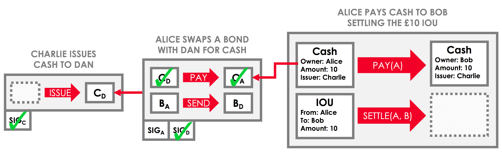
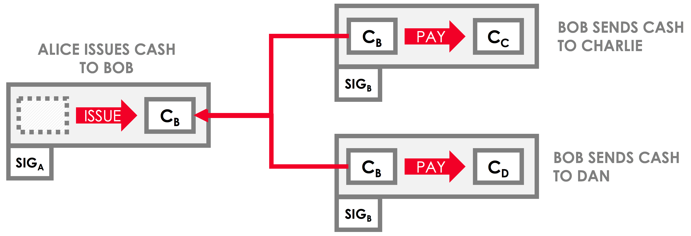

Consensus
=========

.. topic:: Summary

   * *To be committed, transactions must achieve both validity and uniqueness consensus*
   * *Validity consensus requires contractual validity of the transaction and all its dependencies*
   * *Uniqueness consensus prevents double-spends*

.. only:: htmlmode

   Video
   -----
   .. raw:: html
   
       <iframe src="https://player.vimeo.com/video/214138438" width="640" height="360" frameborder="0" webkitallowfullscreen mozallowfullscreen allowfullscreen></iframe>
       

Two types of consensus
----------------------
Determining whether a proposed transaction is a valid ledger update involves reaching two types of consensus:

* *Validity consensus* - this is checked by each required signer before they sign the transaction
* *Uniqueness consensus* - this is only checked by a notary service

Validity consensus
------------------
Validity consensus is the process of checking that the following conditions hold both for the proposed transaction,
and for every transaction in the transaction chain that generated the inputs to the proposed transaction:

* The transaction is accepted by the contracts of every input and output state
* The transaction has all the required signatures

It is not enough to verify the proposed transaction itself. We must also verify every transaction in the chain of
transactions that led up to the creation of the inputs to the proposed transaction.

This is known as *walking the chain*. Suppose, for example, that a party on the network proposes a transaction
transferring us a treasury bond. We can only be sure that the bond transfer is valid if:

* The treasury bond was issued by the central bank in a valid issuance transaction
* Every subsequent transaction in which the bond changed hands was also valid

The only way to be sure of both conditions is to walk the transaction's chain. We can visualize this process as follows:

When verifying a proposed transaction, a given party may not have every transaction in the transaction chain that they
need to verify. In this case, they can request the missing transactions from the transaction proposer(s). The
transaction proposer(s) will always have the full transaction chain, since they would have requested it when
verifying the transaction that created the proposed transaction's input states.

Uniqueness consensus
--------------------
Imagine that Bob holds a valid central-bank-issued cash state of $1,000,000. Bob can now create two transaction
proposals:

* A transaction transferring the $1,000,000 to Charlie in exchange for £800,000
* A transaction transferring the $1,000,000 to Dan in exchange for €900,000

This is a problem because, although both transactions will achieve validity consensus, Bob has managed to
"double-spend" his USD to get double the amount of GBP and EUR. We can visualize this as follows:

To prevent this, a valid transaction proposal must also achieve uniqueness consensus. Uniqueness consensus is the
requirement that none of the inputs to a proposed transaction have already been consumed in another transaction.

If one or more of the inputs have already been consumed in another transaction, this is known as a *double spend*,
and the transaction proposal is considered invalid.

Uniqueness consensus is provided by notaries. See :doc:`key-concepts-notaries` for more details.