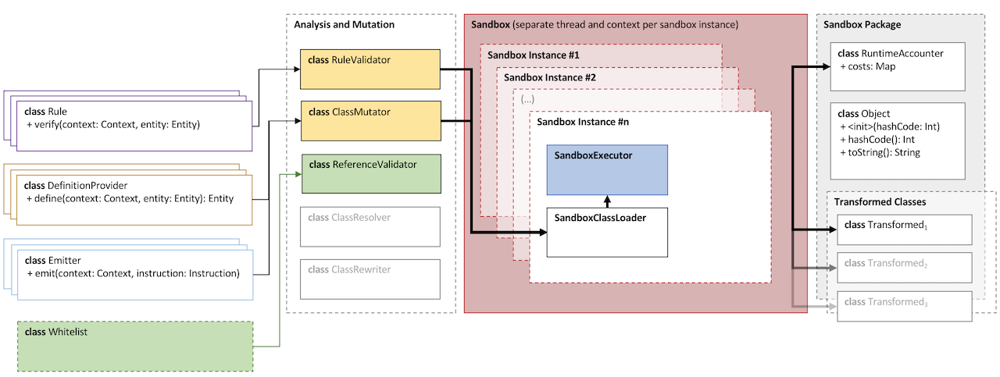

Deterministic JVM
=================

.. contents::
    :depth: 2

Introduction
~~~~~~~~~~~~

The code in the DJVM module has not yet been integrated with the rest of the platform.  It will eventually become a
part of the node and enforce deterministic and secure execution of smart contract code, which is mobile and may
propagate around the network without human intervention.

Currently, it stands alone as an evaluation version. We want to give developers the ability to start trying it out and
get used to developing deterministic code under the set of constraints that we envision will be placed on contract code
in the future.

.. warning::
    The deterministic sandbox is currently a standalone evaluation version of what we, in the future, want to integrate
    with the Corda platform to protect execution of contract code and ensure deterministic behaviour.

Motivation and Overview
~~~~~~~~~~~~~~~~~~~~~~~

It is important that all nodes that process a transaction always agree on whether it is valid or not. Because
transaction types are defined using JVM byte code, this means that the execution of that byte code must be fully
deterministic. Out of the box a standard JVM is not fully deterministic, thus we must make some modifications in order
to satisfy our requirements.

So, what does it mean for a piece of code to be fully deterministic?  Ultimately, it means that the code, when viewed
as a function, is pure. In other words, given the same set of inputs, it will always produce the same set of outputs
without inflicting any side-effects that might later affect the computation.

Non-Determinism
...............

For a program running on the JVM, non-determinism could be introduced by a range of sources, for instance:

  - **External input**, *e.g.*, the file system, network, system properties and clocks.

  - **Random number generators**.

  - **Halting criteria**, *e.g.*, different decisions about when to terminate long running programs.

  - **Hash-codes**, or more specifically ``Object.hashCode()``, which is typically implemented either by returning a pointer address or by assigning the
    object a random number. This could, for instance, surface as different iteration orders over hash maps and hash
    sets, or be used as non-pure input into arbitrary expressions.

  - Differences in hardware **floating point arithmetic**.

  - **Multi-threading** and consequent differences in scheduling strategies, affinity, *etc.*

  - Differences in **API implementations** between nodes.

  - **Garbage collector callbacks**.

To ensure that the contract verification function is fully pure even in the face of infinite loops we want to use a
custom-built JVM sandbox. The sandbox performs static analysis of loaded byte code and a rewriting pass to allow for
necessary instrumentation and constraint hardening.

The byte code rewriting further allows us to patch up and control the default behaviour of things like the hash-code
generation for ``java.lang.Object``. Contract code is rewritten the first time it needs to be executed and then stored
for future use.

Abstraction
...........

The sandbox is abstracted away as an executor which takes as input an implementation of the interface
``SandboxedRunnable<in Input, out Output>``, dereferenced by a ``ClassSource``. This interface has a single method that
needs implementing, namely ``run(Input): Output``.

A ``ClassSource`` object referencing such an implementation can be passed into the ``SandboxExecutor<in Input, out
Output>`` together with an input of type ``Input``. The executor has operations for both execution and static
validation, namely ``run()`` and ``validate()``. These methods both return a summary object.

 * In the case of execution, this summary object has information about:
    * Whether or not the runnable was successfully executed.
    * If successful, the return value of ``SandboxedRunnable.run()``.
    * If failed, the exception that was raised.
    * And in both cases, a summary of all accrued costs during execution.

 * For validation, the summary contains:
    * A type hierarchy of classes and interfaces loaded and touched by the sandbox's class loader during analysis, each
      of which contain information about the respective transformations applied as well as meta-data about the types
      themselves and all references made from said classes.
    * A list of messages generated during the analysis. These can be of different severity, and only messages of
      severity ``ERROR`` will prevent execution.

The sandbox has a configuration that applies to the execution of a specific runnable. This configuration, on a higher
level, contains a set of rules, definition providers, emitters and a whitelist.

The set of rules is what defines the constraints posed on the runtime environment. A rule can act on three different
levels, namely on a type-, member- or instruction-level. The set of rules get processed and validated by the
``RuleValidator`` prior to execution.

Similarly, there is a set of definition providers which can be used to modify the definition of either a type or a
type's members. This is what controls things like ensuring that all methods implement strict floating point arithmetic,
and normalisation of synchronised methods.

Lastly, there is a set of emitters. These are used to instrument the byte code for cost accounting purposes, and also
to inject code for checks that we want to perform at runtime or modifications to out-of-the-box behaviour.

Static Byte Code Analysis
~~~~~~~~~~~~~~~~~~~~~~~~~

In summary, the byte code analysis currently performs the following checks. This is not an exhaustive list as further
work may well introduce additional constraints that we would want to place on the sandbox environment.

.. contents::
    :local:

.. note::
    It is worth noting that not only smart contract code is instrumented by the sandbox, but all code that it can
    transitively reach. In particular this means that the Java runtime classes (that have not been whitelisted) and any
    other library code used in the program are also instrumented and persisted ahead of time.

Disallow Catching ThreadDeath Exception
.......................................

Prevents exception handlers from catching ``ThreadDeath`` exceptions. If the developer attempts to catch an ``Error``
or a ``Throwable`` (both being transitive parent types of ``ThreadDeath``), an explicit check will be injected into the
byte code to verify that exceptions that are trying to kill the current thread are not being silenced. Consequently,
the user will not be able to bypass an exit signal.

Disallow Catching ThresholdViolationException
.............................................

The ``ThresholdViolationException`` is, as the name suggests, used to signal to the sandbox that a cost tracked by the
runtime cost accountant has been breached. For obvious reasons, the sandbox needs to protect against user code that
tries to catch such exceptions, as doing so would allow the user to bypass the thresholds set out in the execution
profile.

Only Allow Explicitly Whitelisted Runtime API
.............................................

Ensures that constant pool references are mapped against a verified subset of the Java runtime libraries. Said subset
excludes functionality that contract code should not have access to, such as file I/O or external entropy. In future
versions, this whitelist will be trimmed down to the bare minimum needed, essentially a subset of ``java.lang``, so
that also the Java runtime libraries themselves will be subjected to the same amount of scrutiny that the rest of the
code is at the moment.

.. warning::
    Currently, the surface of the whitelist is quite broad and is also incorporating the standard libraries for Kotlin.
    This will be stripped down in the future.

Disallow Dynamic Invocation
...........................

Forbids ``invokedynamic`` byte code as the libraries that support this functionality have historically had security
problems and it is primarily needed only by scripting languages. In the future, this constraint will be eased to allow
for dynamic invocation in the specific lambda and string concatenation meta-factories used by Java code itself.

Disallow Native Methods
.......................

Forbids native methods as these provide the user access into operating system functionality such as file handling,
network requests, general hardware interaction, threading, *etc.* These all constitute sources of non-determinism, and
allowing such code to be called arbitrarily from the JVM would require deterministic guarantees on the native machine
code level. This falls out of scope for the DJVM.

Disallow Finalizer Methods
..........................

Forbids finalizers as these can be called at unpredictable times during execution, given that their invocation is
controlled by the garbage collector. As stated in the standard Java documentation:

..

    Called by the garbage collector on an object when garbage collection determines that there are no more references
    to the object.

Disallow Overridden Sandbox Package
...................................

Forbids attempts to override rewritten classes. For instance, loading a class ``com.foo.Bar`` into the sandbox,
analyses it, rewrites it and places it into ``sandbox.com.foo.Bar``. Attempts to place originating classes in the
top-level ``sandbox`` package will therefore fail as this poses a security risk. Doing so would essentially bypass rule
validation and instrumentation.

Disallow Breakpoints
....................

For obvious reasons, the breakpoint operation code is forbidden as this can be exploited to unpredictably suspend code
execution and consequently interfere with any time bounds placed on the execution.

Disallow Reflection
...................

For now, the use of reflection APIs is forbidden as the unmanaged use of these can provide means of breaking out of the
protected sandbox environment.

Disallow Unsupported API Versions
.................................

Ensures that loaded classes are targeting an API version between 1.5 and 1.8 (inclusive). This is merely to limit the
breadth of APIs from the standard runtime that needs auditing.

Runtime Costing
~~~~~~~~~~~~~~~

The runtime accountant inserts calls to an accounting object before expensive byte code. The goal of this rewrite is to
deterministically terminate code that has run for an unacceptably long amount of time or used an unacceptable amount of
memory. Types of expensive byte code include method invocation, memory allocation, branching and exception throwing.

The cost instrumentation strategy used is a simple one: just counting byte code that are known to be expensive to
execute. Method size can be limited and jumps count towards the budget, so such a strategy is guaranteed to eventually
terminate. However it is still possible to construct byte code sequences by hand that take excessive amounts of time to
execute. The cost instrumentation is designed to ensure that infinite loops are terminated and that if the cost of
verifying a transaction becomes unexpectedly large (*e.g.*, contains algorithms with complexity exponential in
transaction size) that all nodes agree precisely on when to quit. It is not intended as a protection against denial of
service attacks. If a node is sending you transactions that appear designed to simply waste your CPU time then simply
blocking that node is sufficient to solve the problem, given the lack of global broadcast.

The budgets are separate per operation code type, so there is no unified cost model. Additionally the instrumentation is
high overhead. A more sophisticated design would be to statically calculate byte code costs as much as possible ahead of
time, by instrumenting only the entry point of 'accounting blocks', *i.e.*, runs of basic blocks that end with either a
method return or a backwards jump. Because only an abstract cost matters (this is not a profiler tool) and because the
limits are expected to bet set relatively high, there is no need to instrument every basic block. Using the max of both
sides of a branch is sufficient when neither branch target contains a backwards jump. This sort of design will be
investigated if the per category budget accounting turns out to be insufficient.

A further complexity comes from the need to constrain memory usage. The sandbox imposes a quota on bytes allocated
rather than bytes retained in order to simplify the implementation. This strategy is unnecessarily harsh on smart
contracts that churn large quantities of garbage yet have relatively small peak heap sizes and, again, it may be that
in practice a more sophisticated strategy that integrates with the garbage collector is required in order to set quotas
to a usefully generic level.

.. note::
    The current thresholds have been set arbitrarily for demonstration purposes and should not be relied upon as
    sensible defaults in a production environment.

Instrumentation and Rewriting
~~~~~~~~~~~~~~~~~~~~~~~~~~~~~

Always Use Strict Floating Point Arithmetic
...........................................

Sets the ``strictfp`` flag on all methods, which requires the JVM to do floating point arithmetic in a hardware
independent fashion. Whilst we anticipate that floating point arithmetic is unlikely to feature in most smart contracts
(big integer and big decimal libraries are available), it is available for those who want to use it.

Always Use Exact Math
.....................

Replaces integer and long addition and multiplication with calls to ``Math.addExact()`` and ``Math.multiplyExact``,
respectively. Further work can be done to implement exact operations for increments, decrements and subtractions as
well. These calls into ``java.lang.Math`` essentially implement checked arithmetic over integers, which will throw an
exception if the operation overflows.

Always Inherit From Sandboxed Object
....................................

As mentioned further up, ``Object.hashCode()`` is typically implemented using either the memory address of the object
or a random number; which are both non-deterministic. The DJVM shields the runtime from this source of non-determinism
by rewriting all classes that inherit from ``java.lang.Object`` to derive from ``sandbox.java.lang.Object`` instead.
This sandboxed ``Object`` implementation takes a hash-code as an input argument to the primary constructor, persists it
and returns the value from the ``hashCode()`` method implementation. It also has an overridden implementation of
``toString()``.

The loaded classes are further rewritten in two ways:

 * All allocations of new objects of type ``java.lang.Object`` get mapped into using the sandboxed object.

 * Calls to the constructor of ``java.lang.Object`` get mapped to the constructor of ``sandbox.java.lang.Object``
   instead, passing in a constant value for now. In the future, we can easily have this passed-in hash-code be a pseudo
   random number seeded with, for instance, the hash of the transaction or some other dynamic value, provided of course
   that it is deterministically derived.

Disable Synchronised Methods and Blocks
.......................................

Since Java's multi-threading API has been excluded from the whitelist, synchronised methods and code blocks have little
use in sandboxed code. Consequently, we log informational messages about occurrences of this in your sandboxed code and
automatically transform them into ordinary methods and code blocks instead.

Future Work
~~~~~~~~~~~

Further work is planned:

 * To enable controlled use of reflection APIs.

 * Strip out the dependency on the extensive whitelist of underlying Java
   runtime classes.

 * Currently, dynamic invocation is disallowed. Allow specific lambda and
   string concatenation meta-factories used by Java code itself.

 * Map more mathematical operations to use their 'exact' counterparts.

 * General tightening of the enforced constraints.

 * Cost accounting of runtime metrics such as memory allocation, branching and
   exception handling. More specifically defining sensible runtime thresholds
   and make further improvements to the instrumentation.

 * More sophisticated runtime accounting as discussed in `Runtime Costing`_.

Command-line Tool
~~~~~~~~~~~~~~~~~

Open your terminal and navigate to the ``djvm`` folder. Then issue the following command:

::

  djvm > ./shell/install

This will build the DJVM tool and install a shortcut on Bash-enabled systems. It will also generate a Bash completion
file and store it in the ``shell`` folder. This file can be sourced from your Bash initialisation script.

::

  djvm > cd ~
  ~ > djvm

Now, you can create a new Java file from a skeleton that ``djvm`` provides, compile the file, and consequently run it
by issuing the following commands:

::

  ~ > djvm new Hello
  ~ > vim tmp/net/corda/sandbox/Hello.java
  ~ > djvm build Hello
  ~ > djvm run Hello

This run will produce some output similar to this:

::

  Running class net.corda.sandbox.Hello...
  Execution successful
  - result = null
  
  Runtime Cost Summary:
  - allocations = 0
  - invocations = 1
  - jumps = 0
  - throws = 0

The output should be pretty self-explanatory, but just to summarise:

 * It prints out the return value from the ``SandboxedRunnable<Object, Object>.run()`` method implemented in
   ``net.corda.sandbox.Hello``.

 * It also prints out the aggregated costs for allocations, invocations, jumps and throws.

Other commands to be aware of are:

 * ``djvm check`` which allows you to perform the up-front static analysis without running the code.

 * ``djvm inspect`` which allows you to inspect what byte code modifications will be applied to a class.

 * ``djvm show`` which displays the transformed byte code of a class, *i.e.*, the end result and not the difference.

 * ``djvm whitelist`` which displays the content of the whitelist in use.
