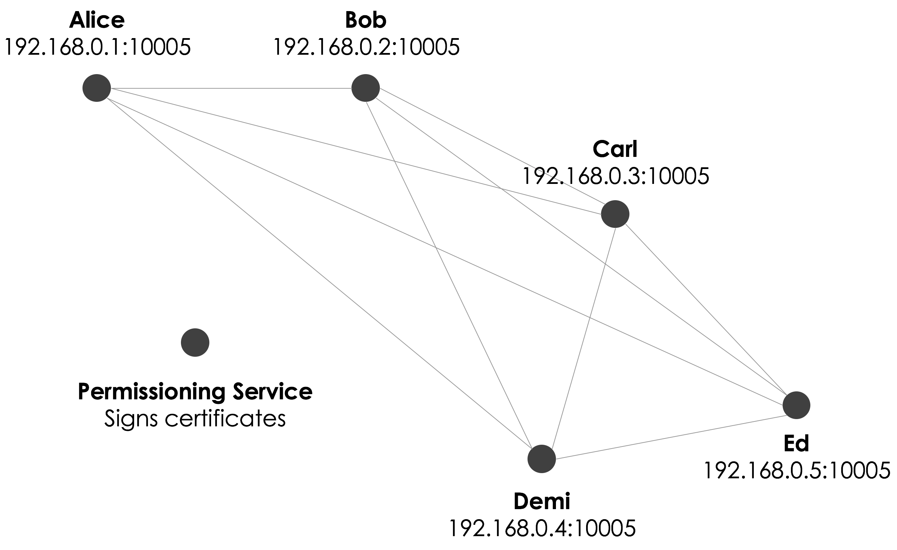

The network
===========

.. topic:: Summary

   * *A Corda network is made up of nodes running Corda and CorDapps*
   * *Communication between nodes is point-to-point, instead of relying on global broadcasts*
   * *Each node has a certificate mapping their network identity to a real-world legal identity*
   * *The network is permissioned, with access controlled by a doorman*

Network structure
-----------------
A Corda network is a peer-to-peer network of **nodes**. Each node runs the Corda software as well as Corda applications
known as **CorDapps**.

All communication between nodes is point-to-point and encrypted using transport-layer security. This means that data is
shared only on a need-to-know basis. There are **no global broadcasts**.

Identity
--------
Each node has a single well-known identity. The node's identity is used to represent the node in transactions, such as
when purchasing an asset.

.. note:: These identities are distinct from the RPC user logins that are able to connect to the node via RPC.

Each network has a **network map service** that maps each well-known node identity to an IP address. These IP
addresses are used for messaging between nodes.

Nodes can also generate confidential identities for individual transactions. The certificate chain linking a
confidential identity to a well-known node identity or real-world legal identity is only distributed on a need-to-know
basis. This ensures that even if an attacker gets access to an unencrypted transaction, they cannot identify the
transaction's participants without additional information if confidential identities are being used.

Admission to the network
------------------------
Corda networks are semi-private. To join a network, a node must obtain a certificate from the network operator. This
certificate maps a well-known node identity to:

* A real-world legal identity
* A public key

The network operator enforces rules regarding the information that nodes must provide and the know-your-customer
processes they must undergo before being granted this certificate.