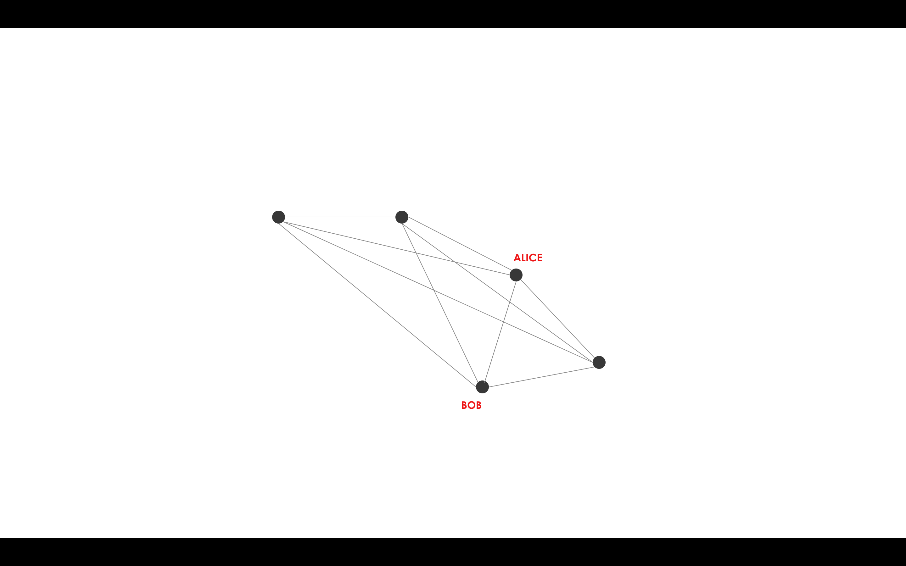

Flows
=====

.. topic:: Summary

   * *Flows automate the process of agreeing ledger updates*
   * *Communication between nodes only occurs in the context of these flows, and is point-to-point*
   * *Built-in flows are provided to automate common tasks*

Corda networks use point-to-point messaging instead of a global broadcast. This means that coordinating a ledger update
requires network participants to specify exactly what information needs to be sent, to which counterparties, and in
what order.

Rather than having to specify these steps manually, Corda automates the process using *flows*. A flow is a sequence
of actions that tells a node how to achieve a specific ledger update, such as issuing an asset or settling a trade.

Once a given business process has been encapsulated in a flow and installed on the node as part of a CorDapp, the node's
owner can instruct the node to kick off this business process at any time with a simple RPC call. All activity on the
node, and all inter-node communication, occurs in the context of these flows.

A flow's steps may include:

* Identifying counterparties on the network
* Extracting information from the vault or local storage
* Building a transaction
* Sending messages
* Notarising and recording a transaction
* Reporting progress to observers
* Requesting human interaction...

A node can have millions of flows active at once and they may last days, across node restarts and even upgrades.

An example flow
---------------
Here is a visualisation of an example flow, showing Alice and Bob agreeing on a ledger update:

The flow library
----------------
Corda provides a library of flows to handle common tasks, meaning that developers do not have to redefine the
logic behind common processes such as:

* Notarising and recording a transaction
* Gathering signatures from counterparty nodes
* Verifying a chain of transactions

Further information on the available built-in flows can be found in :doc:`flow-library`.