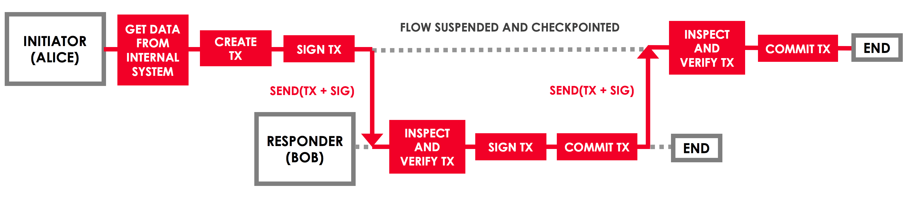

Flows
=====

.. topic:: Summary

   * *Flows automate the process of agreeing ledger updates*
   * *Communication between nodes only occurs in the context of these flows, and is point-to-point*
   * *Built-in flows are provided to automate common tasks*

Video
-----
.. raw:: html

    <iframe src="https://player.vimeo.com/video/214046145" width="640" height="360" frameborder="0" webkitallowfullscreen mozallowfullscreen allowfullscreen></iframe>
    

Motivation
----------
Corda networks use point-to-point messaging instead of a global broadcast. This means that coordinating a ledger update
requires network participants to specify exactly what information needs to be sent, to which counterparties, and in
what order.

Here is a visualisation of the process of agreeing a simple ledger update between Alice and Bob:

.. only:: htmlmode

   .. image:: resources/flow.gif
      :scale: 25%
      :align: center

.. only:: pdfmode

   .. image:: resources/flow.png
      :scale: 25%
      :align: center

The flow framework
------------------
Rather than having to specify these steps manually, Corda automates the process using *flows*. A flow is a sequence
of steps that tells a node how to achieve a specific ledger update, such as issuing an asset or settling a trade.

Here is the sequence of flow steps involved in the simple ledger update above:

Running flows
-------------
Once a given business process has been encapsulated in a flow and installed on the node as part of a CorDapp, the node's
owner can instruct the node to kick off this business process at any time using an RPC call. The flow abstracts all
the networking, I/O and concurrency issues away from the node owner.

All activity on the node occurs in the context of these flows. Unlike contracts, flows do not execute in a sandbox,
meaning that nodes can perform actions such as networking, I/O and use sources of randomness within the execution of a
flow.

Inter-node communication
^^^^^^^^^^^^^^^^^^^^^^^^
Nodes communicate by passing messages between flows. Each node has zero or more flow classes that are registered to
respond to messages from a single other flow.

Suppose Alice is a node on the network and wishes to agree a ledger update with Bob, another network node. To
communicate with Bob, Alice must:

* Start a flow that Bob is registered to respond to
* Send Bob a message within the context of that flow
* Bob will start its registered counterparty flow

Now that a connection is established, Alice and Bob can communicate to agree a ledger update by passing a series of
messages back and forth, as prescribed by the flow steps.

Subflows
^^^^^^^^
Flows can be composed by starting a flow as a subprocess in the context of another flow. The flow that is started as
a subprocess is known as a *subflow*. The parent flow will wait until the subflow returns.

The flow library
~~~~~~~~~~~~~~~~
Corda provides a library of flows to handle common tasks, meaning that developers do not have to redefine the
logic behind common processes such as:

* Notarising and recording a transaction
* Gathering signatures from counterparty nodes
* Verifying a chain of transactions

Further information on the available built-in flows can be found in :doc:`api-flows`.

Concurrency
-----------
The flow framework allows nodes to have many flows active at once. These flows may last days, across node restarts and even upgrades.

This is achieved by serializing flows to disk whenever they enter a blocking state (e.g. when they're waiting on I/O
or a networking call). Instead of waiting for the flow to become unblocked, the node immediately starts work on any
other scheduled flows, only returning to the original flow at a later date.
