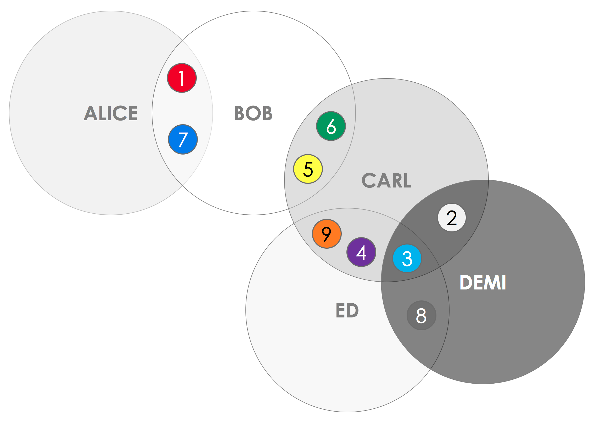
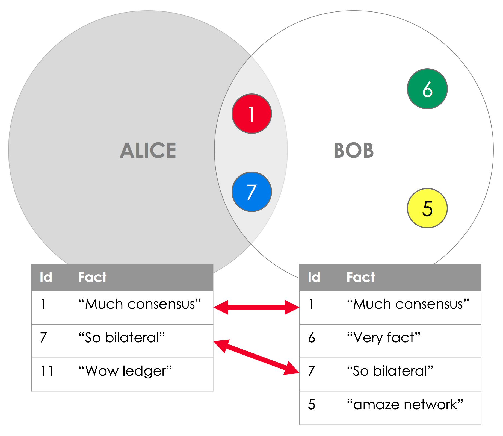

The ledger
==========

.. topic:: Summary

   * *The ledger is subjective from each peer's perspective*
   * *Two peers are always guaranteed to see the exact same version of any on-ledger facts they share*

.. only:: htmlmode

   Video
   -----
   .. raw:: html
   
       <iframe src="https://player.vimeo.com/video/213812040" width="640" height="360" frameborder="0" webkitallowfullscreen mozallowfullscreen allowfullscreen></iframe>
       

Overview
--------
In Corda, there is **no single central store of data**. Instead, each node maintains a separate database of known
facts. As a result, each peer only sees a subset of facts on the ledger, and no peer is aware of the ledger in its
entirety.

For example, imagine a network with five nodes, where each coloured circle represents a shared fact:

We can see that although Carl, Demi and Ed are aware of shared fact 3, **Alice and Bob are not**.

Equally importantly, Corda guarantees that whenever one of these facts is shared by multiple nodes on the network, it evolves
in lockstep in the database of every node that is aware of it:

For example, Alice and Bob will both see the **exact same version** of shared facts 1 and 7.