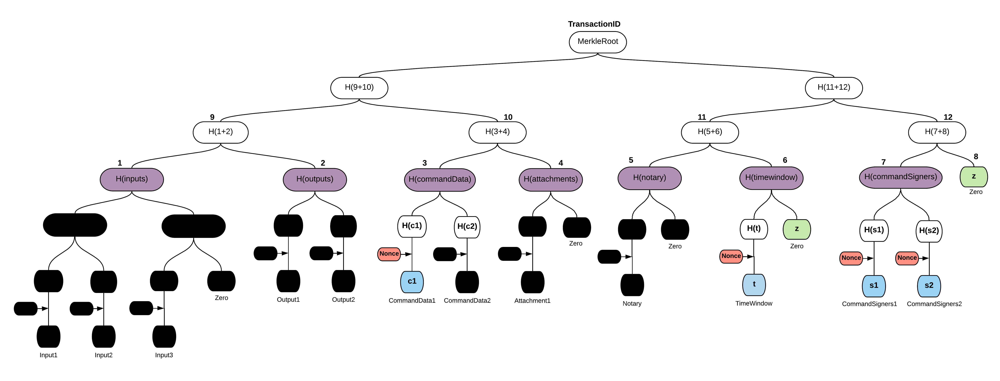

Oracles
=======

.. topic:: Summary

   * *A fact can be included in a transaction as part of a command*
   * *An oracle is a service that will only sign the transaction if the included fact is true*

.. only:: htmlmode

    Video
    -----
    .. raw:: html
    
        <iframe src="https://player.vimeo.com/video/214157956" width="640" height="360" frameborder="0" webkitallowfullscreen mozallowfullscreen allowfullscreen></iframe>
        

Overview
--------
In many cases, a transaction's contractual validity depends on some external piece of data, such as the current
exchange rate. However, if we were to let each participant evaluate the transaction's validity based on their own
view of the current exchange rate, the contract's execution would be non-deterministic: some signers would consider the
transaction valid, while others would consider it invalid. As a result, disagreements would arise over the true state
of the ledger.

Corda addresses this issue using *oracles*. Oracles are network services that, upon request, provide commands
that encapsulate a specific fact (e.g. the exchange rate at time x) and list the oracle as a required signer.

If a node wishes to use a given fact in a transaction, they request a command asserting this fact from the oracle. If
the oracle considers the fact to be true, they send back the required command. The node then includes the command in
their transaction, and the oracle will sign the transaction to assert that the fact is true.

If they wish to monetize their services, oracles can choose to only sign a transaction and attest to the validity of
the fact it contains for a fee.

Transaction tear-offs
---------------------
To sign a transaction, the only information the oracle needs to see is their embedded, related to this oracle, command(s).
We should also provide guarantees that all of the commands requiring a signature from this oracle should be visible to
the oracle entity, but not the rest.
Providing any additional transaction data to the oracle would constitute a privacy leak. Similarly, a non-validating
notary only needs to see a transaction's input states.

To combat this, the transaction proposer(s) uses a nested Merkle tree approach to "tear off" any parts of the transaction
that the oracle/notary doesn't need to see before presenting it to them for signing. A Merkle tree is a well-known
cryptographic scheme that is commonly used to provide proofs of inclusion and data integrity. Merkle trees are widely used in
peer-to-peer networks, blockchain systems and git.

The advantage of a Merkle tree is that the parts of the transaction that were torn off when presenting the transaction
to the oracle cannot later be changed without also invalidating the oracle's digital signature.

Transaction Merkle trees
^^^^^^^^^^^^^^^^^^^^^^^^
A Merkle tree is constructed from a transaction by splitting the transaction into leaves, where each leaf contains
either an input, an output, a command data, or an attachment. The final nested tree structure also contains the
other fields of the ``WireTransaction``, such as the time-window the notary and the command signers.

As noticed, the only component type that is requiring two trees instead of one is the command, which is split into
command data and command signers for visibility purposes. It is also highlighted that the privacy salt
(see :doc:`key-concepts-transactions` for more) is not having its own sub-tree, but it is indirectly involved in the
Merkle tree construction via the nonces as described below.

Corda is using a patent-pending approach using nested Merkle trees per component type. Briefly, a component sub-tree
is generated for each component type (i.e., inputs, outputs, attachments). Then, the roots of these sub-trees
form the leaves of the top Merkle tree and finally the root of this tree represents the transaction id.

Another important feature is that a nonce is deterministically generated for each component (using the privacy salt) in
a way that each nonce is independent. Then, we use the nonces along with their corresponding components to calculate
the component hash, which is the actual Merkle tree leaf. Nonces are required to protect against brute force attacks that
otherwise would reveal the content of low-entropy hashed values (i.e., a single-word text attachment).

After computing the leaves, each Merkle tree is built in the normal way by hashing the concatenation of nodes’ hashes
below the current one together. It’s visible on the example image below, where ``H`` denotes sha256 function, "+" - concatenation.

.. image:: resources/merkleTreeFull.png
   :scale: 35%
   :align: center

The transaction has three input states, two output states, two commands, one attachment, a notary and a time-window.
Notice that if a tree is not a full binary tree, leaves are padded to the nearest
power of 2 with zero hash (since finding a pre-image of sha256(x) == 0 is hard computational task) - marked light
green above. Finally, the hash of the root is the identifier of the transaction, it's also used for signing and
verification of data integrity. Every change in transaction on a leaf level will change its identifier.

Hiding data
^^^^^^^^^^^
Hiding data and providing the proof that it formed a part of a transaction is done by constructing Partial Merkle Trees
(or Merkle branches). A Merkle branch is a set of hashes, that given the leaves’ data, is used to calculate the
root’s hash. Then, that hash is compared with the hash of a whole transaction and if they match it means that data we
obtained belongs to that particular transaction.

In the example above, we are assuming that only the first command and the time-window should be visible to the Oracle.
Blue nodes and ``H(c2)`` are provided to the Oracle service, while the black ones are omitted. ``H(c2)`` is required, so
that the Oracle can compute ``H(commandData)`` without being to able to see the second command, but at the same time
ensuring ``CommandData1`` is part of the transaction. It is highlighted that all signers visible, so as to have a proof that
no related command (that the Oracle should see) is maliciously filtered out. Additionally, hashes of sub-trees
(violet nodes) are also provided in the current Corda protocol. The latter is required for special cases, i.e., when
required to know if a component group is empty or not.

Having all of the aforementioned data, one can calculate the root of the top tree and compare it with original
transaction identifier - we have a proof that this command and time-window belong to this transaction.