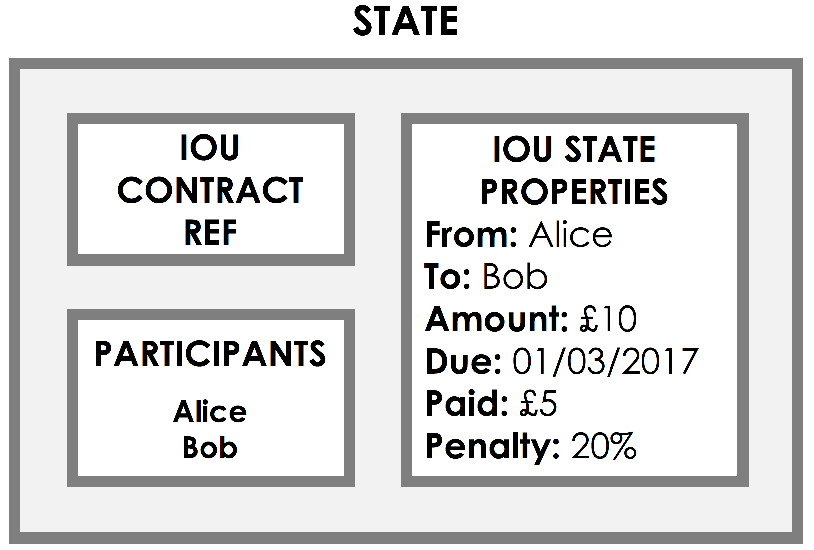
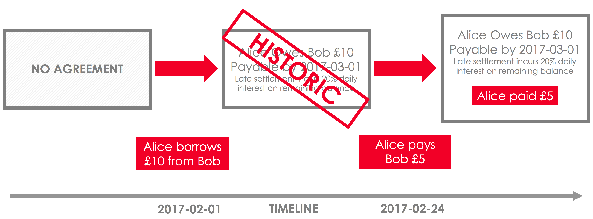
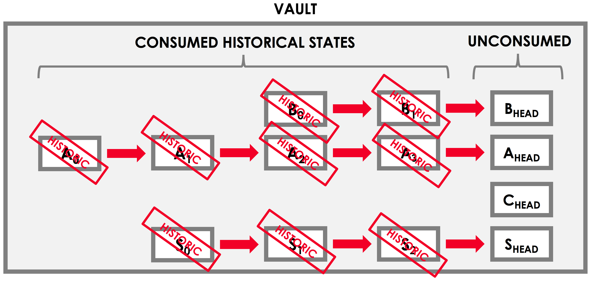

States
======

.. topic:: Summary

   * *States represent on-ledger facts*
   * *States are evolved by marking the current state as historic and creating an updated state*
   * *Each node has a vault where it stores any relevant states to itself*

.. only:: htmlmode

   Video
   -----
   .. raw:: html
   
       <iframe src="https://player.vimeo.com/video/213812054" width="640" height="360" frameborder="0" webkitallowfullscreen mozallowfullscreen allowfullscreen></iframe>
       

Overview
--------
A *state* is an immutable object representing a fact known by one or more Corda nodes at a specific point in time.
States can contain arbitrary data, allowing them to represent facts of any kind (e.g. stocks, bonds, loans, KYC data,
identity information...).

For example, the following state represents an IOU - an agreement that Alice owes Bob an amount X:

Specifically, this state represents an IOU of £10 from Alice to Bob.

As well as any information about the fact itself, the state also contains a reference to the *contract* that governs
the evolution of the state over time. We discuss contracts in :doc:`key-concepts-contracts`.

State sequences
---------------
As states are immutable, they cannot be modified directly to reflect a change in the state of the world.

Instead, the lifecycle of a shared fact over time is represented by a **state sequence**. When a state needs to be
updated, we create a new version of the state representing the new state of the world, and mark the existing state as
historic.

This sequence of state replacements gives us a full view of the evolution of the shared fact over time. We can
picture this situation as follows:

The vault
---------
Each node on the network maintains a *vault* - a database where it tracks all the current and historic states that it
is aware of, and which it considers to be relevant to itself:

We can think of the ledger from each node's point of view as the set of all the current (i.e. non-historic) states that
it is aware of.