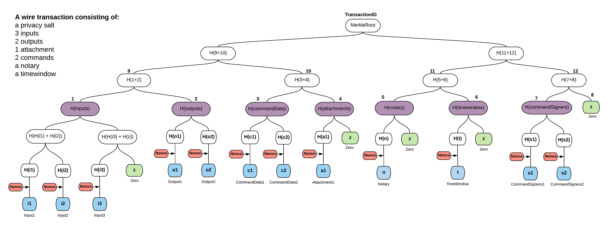

Transaction tear-offs
=====================

.. topic:: Summary

   * *Hide transaction components for privacy purposes*
   * *Oracles and non-validating notaries can only see their "related" transaction components, but not the full transaction details*

Overview
--------
There are cases where some of the entities involved on the transaction could only have partial visibility on the
transaction parts. For instance, when an oracle should sign a transaction, the only information it needs to see is their
embedded, related to this oracle, command(s). Similarly, a non-validating notary only needs to see a transaction's input
states. Providing any additional transaction data to the oracle would constitute a privacy leak.

To combat this, we use the concept of filtered transactions, in which the transaction proposer(s) uses a nested Merkle
tree approach to "tear off" any parts of the transaction that the oracle/notary doesn't need to see before presenting it
to them for signing. A Merkle tree is a well-known cryptographic scheme that is commonly used to provide proofs of
inclusion and data integrity. Merkle trees are widely used in peer-to-peer networks, blockchain systems and git.

The advantage of a Merkle tree is that the parts of the transaction that were torn off when presenting the transaction
to the oracle cannot later be changed without also invalidating the oracle's digital signature.

Transaction Merkle trees
^^^^^^^^^^^^^^^^^^^^^^^^
A Merkle tree is constructed from a transaction by splitting the transaction into leaves, where each leaf contains
either an input, an output, a command data, or an attachment. The final nested tree structure also contains the
other fields of the ``WireTransaction``, such as the time-window the notary and the command signers.

As noticed, the only component type that is requiring two trees instead of one is the command, which is split into
command data and command signers for visibility purposes. It is also highlighted that the privacy salt
(see :doc:`key-concepts-transactions` for more) is not having its own sub-tree, but it is indirectly involved in the
Merkle tree construction via the nonces as described below.

Corda is using a patent-pending approach using nested Merkle trees per component type. Briefly, a component sub-tree
is generated for each component type (i.e., inputs, outputs, attachments). Then, the roots of these sub-trees
form the leaves of the top Merkle tree and finally the root of this tree represents the transaction id.

Another important feature is that a nonce is deterministically generated for each component in a way that each nonce
is independent. Then, we use the nonces along with their corresponding components to calculate the component hash,
which is the actual Merkle tree leaf. Nonces are required to protect against brute force attacks that otherwise would
reveal the content of low-entropy hashed values (i.e., a single-word text attachment).

After computing the leaves, each Merkle tree is built in the normal way by hashing the concatenation of nodes’ hashes
below the current one together. It’s visible on the example image below, where ``H`` denotes sha256 function, "+" - concatenation.

The transaction has three input states, two output states, two commands, one attachment, a notary and a time-window.
Notice that if a tree is not a full binary tree, leaves are padded to the nearest
power of 2 with zero hash (since finding a pre-image of sha256(x) == 0 is hard computational task) - marked light
green above. Finally, the hash of the root is the identifier of the transaction, it's also used for signing and
verification of data integrity. Every change in transaction on a leaf level will change its identifier.

Hiding data
^^^^^^^^^^^
Hiding data and providing the proof that it formed a part of a transaction is done by constructing partial Merkle trees
(or Merkle branches). A Merkle branch is a set of hashes, that given the leaves’ data, is used to calculate the
root’s hash. Then, that hash is compared with the hash of a whole transaction and if they match it means that data we
obtained belongs to that particular transaction. In the following we provide concrete examples on the data visible to a
an oracle and a non-validating notary, respectively.

Let's assume that only the first command should be visible to an Oracle. We should also provide guarantees that all of
the commands requiring a signature from this oracle should be visible to the oracle entity, but not the rest. Here is how
this filtered transaction will be represented in the Merkle tree structure.

.. image:: resources/merkleTreePartial_Oracle.png
   :scale: 35%
   :align: center

Blue nodes and ``H(c2)`` are provided to the Oracle service, while the black ones are omitted. ``H(c2)`` is required, so
that the Oracle can compute ``H(commandData)`` without being to able to see the second command, but at the same time
ensuring ``CommandData1`` is part of the transaction. It is highlighted that all signers are visible, so as to have a
proof that no related command (that the Oracle should see) has been maliciously filtered out. Additionally, hashes of
sub-trees (violet nodes) are also provided in the current Corda protocol. The latter is required for special cases, i.e.,
when required to know if a component group is empty or not.

Having all of the aforementioned data, one can calculate the root of the top tree and compare it with original
transaction identifier - we have a proof that this command and time-window belong to this transaction.

Along the same lines, if we want to send the same transaction to a non-validating notary we should hide all components
apart from input states, time-window and the notary information. This data is enough for the notary to know which
input states should be checked for double-spending, if the time-window is valid and if this transaction should be
notarised by this notary.

.. image:: resources/merkleTreePartial_Notary.png
   :scale: 35%
   :align: center