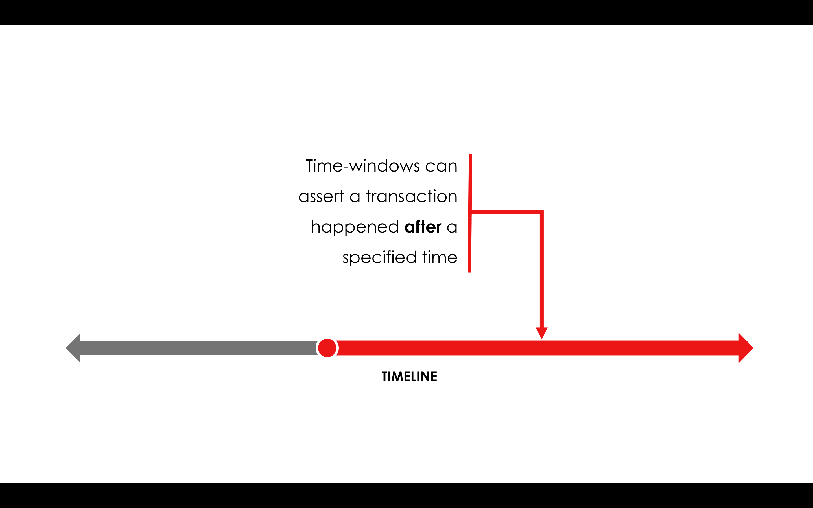

Time-windows
============

.. topic:: Summary

   * *If a transaction includes a time-window, it can only be committed during that window*
   * *The notary is the timestamping authority, refusing to commit transactions outside of that window*
   * *Time-windows can have a start and end time, or be open at either end*

Video
-----
.. raw:: html

    <iframe src="https://player.vimeo.com/video/213879314" width="640" height="360" frameborder="0" webkitallowfullscreen mozallowfullscreen allowfullscreen></iframe>
    

Time in a distributed system
----------------------------
A notary also act as the *timestamping authority*, verifying that a transaction occurred during a specific time-window
before notarising it.

For a time-window to be meaningful, its implications must be binding on the party requesting it. A party can obtain a
time-window signature in order to prove that some event happened *before*, *on*, or *after* a particular point in time.
However, if the party is not also compelled to commit to the associated transaction, it has a choice of whether or not
to reveal this fact until some point in the future. As a result, we need to ensure that the notary either has to also
sign the transaction within some time tolerance, or perform timestamping *and* notarisation at the same time. The
latter is the chosen behaviour for this model.

There will never be exact clock synchronisation between the party creating the transaction and the notary.
This is not only due to issues of physics and network latency, but also because between inserting the command and
getting the notary to sign there may be many other steps (e.g. sending the transaction to other parties involved in the
trade, requesting human sign-off...). Thus the time at which the transaction is sent for notarisation may be quite
different to the time at which the transaction was created.

Time-windows
------------
For this reason, times in transactions are specified as time *windows*, not absolute times. In a distributed system
there can never be "true time", only an approximation of it. Time windows can be open-ended (i.e. specify only one of
"before" and "after") or they can be fully bounded.

In this way, we express the idea that the *true value* of the fact "the current time" is actually unknowable. Even when
both a before and an after time are included, the transaction could have occurred at any point within that time-window.

By creating a range that can be either closed or open at one end, we allow all of the following situations to be
modelled:

* A transaction occurring at some point after the given time (e.g. after a maturity event)
* A transaction occurring at any time before the given time (e.g. before a bankruptcy event)
* A transaction occurring at some point roughly around the given time (e.g. on a specific day)

If a time window needs to be converted to an absolute time (e.g. for display purposes), there is a utility method to
calculate the mid point.

.. note:: It is assumed that the time feed for a notary is GPS/NaviStar time as defined by the atomic
   clocks at the US Naval Observatory. This time feed is extremely accurate and available globally for free.
