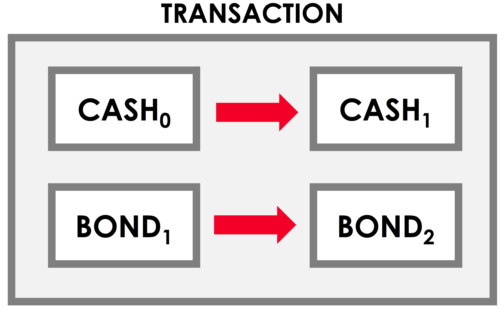
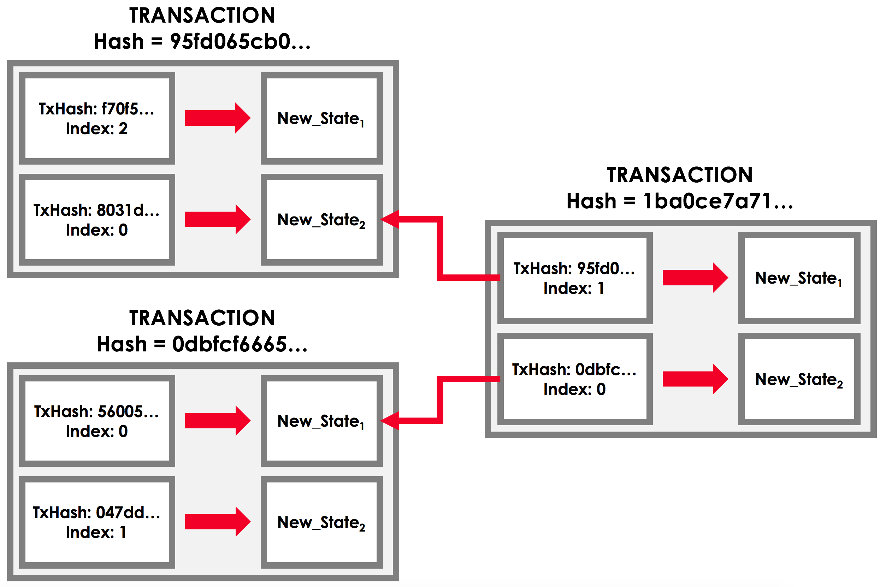
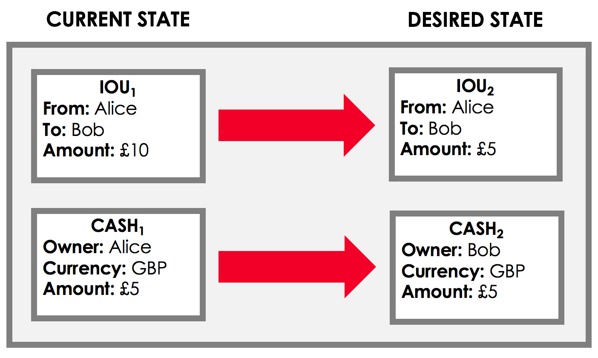
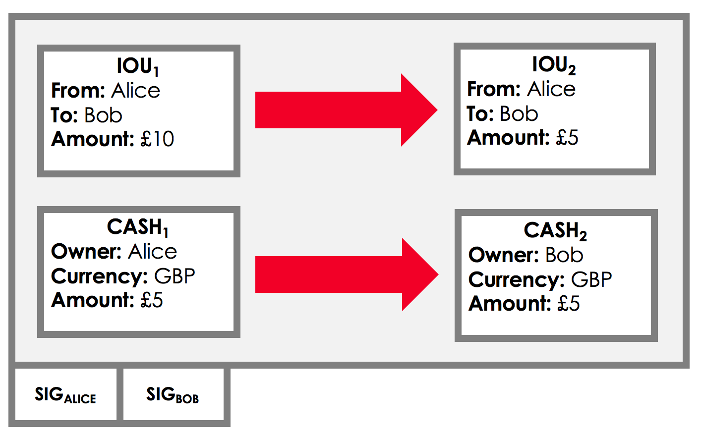
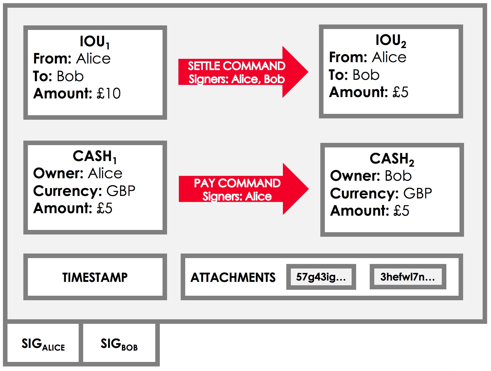
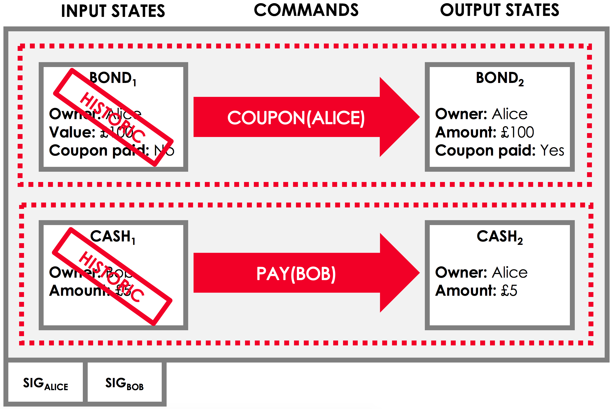

Transactions
============

.. topic:: Summary

   * *Transactions are proposals to update the ledger*
   * *A transaction proposal will only be committed if:*

     * *It doesn't contain double-spends*
     * *It is contractually valid*
     * *It is signed by the required parties*

.. only:: htmlmode

   Video
   -----
   .. raw:: html
   
       <iframe src="https://player.vimeo.com/video/213879807" width="640" height="360" frameborder="0" webkitallowfullscreen mozallowfullscreen allowfullscreen></iframe>
       

Overview
--------
Corda uses a *UTXO* (unspent transaction output) model where every state on the ledger is immutable. The ledger
evolves over time by applying *transactions*, which update the ledger by marking zero or more existing ledger states
as historic (the *inputs*) and producing zero or more new ledger states (the *outputs*). Transactions represent a
single link in the state sequences seen in :doc:`key-concepts-states`.

Here is an example of an update transaction, with two inputs and two outputs:

A transaction can contain any number of inputs and outputs of any type:

* They can include many different state types (e.g. both cash and bonds)
* They can be issuances (have zero inputs) or exits (have zero outputs)
* They can merge or split fungible assets (e.g. combining a $2 state and a $5 state into a $7 cash state)

Transactions are *atomic*: either all the transaction's proposed changes are accepted, or none are.

There are two basic types of transactions:

* Notary-change transactions (used to change a state's notary - see :doc:`key-concepts-notaries`)
* General transactions (used for everything else)

Transaction chains
------------------
When creating a new transaction, the output states that the transaction will propose do not exist yet, and must
therefore be created by the proposer(s) of the transaction. However, the input states already exist as the outputs of
previous transactions. We therefore include them in the proposed transaction by reference.

These input states references are a combination of:

* The hash of the transaction that created the input
* The input's index in the outputs of the previous transaction

This situation can be illustrated as follows:

These input state references link together transactions over time, forming what is known as a *transaction chain*.

Committing transactions
-----------------------
Initially, a transaction is just a **proposal** to update the ledger. It represents the future state of the ledger
that is desired by the transaction builder(s):

To become reality, the transaction must receive signatures from all of the *required signers* (see **Commands**, below). Each
required signer appends their signature to the transaction to indicate that they approve the proposal:

If all of the required signatures are gathered, the transaction becomes committed:

.. image:: resources/committed_tx.png
   :scale: 25%
   :align: center

This means that:

* The transaction's inputs are marked as historic, and cannot be used in any future transactions
* The transaction's outputs become part of the current state of the ledger

Transaction validity
--------------------
Each required signers should only sign the transaction if the following two conditions hold:

   * **Transaction validity**: For both the proposed transaction, and every transaction in the chain of transactions
     that created the current proposed transaction's inputs:

       * The transaction is digitally signed by all the required parties
       * The transaction is *contractually valid* (see :doc:`key-concepts-contracts`)

   * **Transaction uniqueness**: There exists no other committed transaction that has consumed any of the inputs to
     our proposed transaction (see :doc:`key-concepts-consensus`)

If the transaction gathers all the required signatures but these conditions do not hold, the transaction's outputs
will not be valid, and will not be accepted as inputs to subsequent transactions.

Other transaction components
----------------------------
As well as input states and output states, transactions contain:

* Commands
* Attachments
* Time-Window
* Notary

For example, suppose we have a transaction where Alice uses a £5 cash payment to pay off £5 of an IOU with Bob.
This transaction has two supporting attachments and will only be notarised by NotaryClusterA if the notary pool
receives it within the specified time-window. This transaction would look as follows:

We explore the role played by the remaining transaction components below.

Commands
^^^^^^^^
.. raw:: html

    <iframe src="https://player.vimeo.com/video/213881538" width="640" height="360" frameborder="0" webkitallowfullscreen mozallowfullscreen allowfullscreen></iframe>
    

Suppose we have a transaction with a cash state and a bond state as inputs, and a cash state and a bond state as
outputs. This transaction could represent two different scenarios:

* A bond purchase
* A coupon payment on a bond

We can imagine that we'd want to impose different rules on what constitutes a valid transaction depending on whether
this is a purchase or a coupon payment. For example, in the case of a purchase, we would require a change in the bond's
current owner, whereas in the case of a coupon payment, we would require that the ownership of the bond does not
change.

For this, we have *commands*. Including a command in a transaction allows us to indicate the transaction's intent,
affecting how we check the validity of the transaction.

Each command is also associated with a list of one or more *signers*. By taking the union of all the public keys
listed in the commands, we get the list of the transaction's required signers. In our example, we might imagine that:

* In a coupon payment on a bond, only the owner of the bond is required to sign
* In a cash payment, only the owner of the cash is required to sign

We can visualize this situation as follows:

Attachments
^^^^^^^^^^^
.. raw:: html

    <iframe src="https://player.vimeo.com/video/213879328" width="640" height="360" frameborder="0" webkitallowfullscreen mozallowfullscreen allowfullscreen></iframe>
    

Sometimes, we have a large piece of data that can be reused across many different transactions. Some examples:

* A calendar of public holidays
* Supporting legal documentation
* A table of currency codes

For this use case, we have *attachments*. Each transaction can refer to zero or more attachments by hash. These
attachments are ZIP/JAR files containing arbitrary content. The information in these files can then be
used when checking the transaction's validity.

Time-window
^^^^^^^^^^^
In some cases, we want a transaction proposed to only be approved during a certain time-window. For example:

* An option can only be exercised after a certain date
* A bond may only be redeemed before its expiry date

In such cases, we can add a *time-window* to the transaction. Time-windows specify the time window during which the
transaction can be committed. We discuss time-windows in the section on :doc:`key-concepts-time-windows`.

Notary
^^^^^^
A notary pool is a network service that provides uniqueness consensus by attesting that, for a given transaction,
it has not already signed other transactions that consume any of the proposed transaction’s input states.
The notary pool provides the point of finality in the system.

Note that if the notary entity is absent then the transaction is not notarised at all. This is intended for
issuance/genesis transactions that don't consume any other states and thus can't double spend anything.
For more information on the notary services, see :doc:`key-concepts-notaries`.